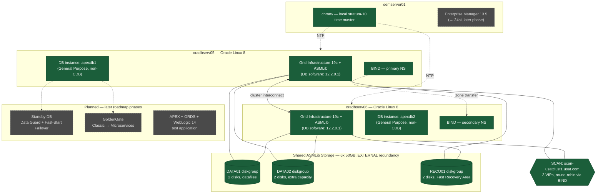

<div align="center">

# Road to OracleOCM

### A hands-on Oracle Maximum Availability Architecture (MAA) home lab — built, broken, fixed, and documented in public.

*2-Node RAC → Data Guard → GoldenGate at 12c, upgraded live through 19c to 26ai, alongside an OEM 13.5 → 24ai upgrade — all on a single VirtualBox host, all scripted, all showcased.*

</div>

---

## What this is

I'm building a full Oracle Maximum Availability Architecture stack from the ground up, on my own hardware, to demonstrate OCM-level DBA skills end to end rather than in isolated demos. That means a real 2-node RAC cluster on ASM, Data Guard with Fast-Start Failover, GoldenGate replication (Classic, later migrated to Microservices), and two live upgrade cycles — 12c → 19c → 26ai — plus upgrading the Enterprise Manager stack watching all of it from 13.5 to 24ai. Everything is provisioned with code (Ansible, silent installs, response files), not click-through installers, so the whole lab is rebuildable from this repository.

This repo is both the infrastructure-as-code for the lab and the write-up of what happened building it — including the parts that didn't work the first time. If you're a hiring manager or a fellow DBA, the folders below are organized so you can jump straight to the skill area you care about.

**Status:** actively in progress. See [Project Status](#project-status) for what's built vs. planned.

---

## Architecture



🟩 **Solid green** = built and working today. ⬜ **Dashed gray** = planned, not built yet — see the roadmap before assuming otherwise.

Single VirtualBox host (32 vCPU / 128GB RAM), Oracle Linux 8 throughout — chosen deliberately because it's the one OS certified for both 12.2.0.1 today *and* 26ai at the end of this roadmap, so the project never needs a mid-build OS migration. Node 1 is built and verified by hand, then cloned via Ansible to produce node 2, rather than each node being configured independently — see [`phase-01-foundation-2node-rac-12cR2/docs/golden-image-and-cloning.md`](phase-01-foundation-2node-rac-12cR2/docs/golden-image-and-cloning.md). Full network/DNS/time-sync design (including the addressing already reserved for Phase 2's second RAC cluster, `usatclust2`) lives in [`phase-01-foundation-2node-rac-12cR2/docs/network-and-hosts.md`](phase-01-foundation-2node-rac-12cR2/docs/network-and-hosts.md).

---

## How this repo is organized

Two different audiences read this repo, so it's split two ways on purpose:

- **Topic folders** (`installation/`, `maintenance/`, `monitoring/`, `high-availability/`, `backup-recovery/`, `performance-tuning/`) — the showcase side. Each one is a self-contained write-up: a detailed, SOP-style runbook plus a `screenshots/` folder of evidence. This is organized by **DBA skill area**, the way a hiring manager or another DBA would browse a portfolio — not by build order.
- **`phase-NN-*/` folders** (e.g. `phase-01-foundation-2node-rac-12cR2/`) — the actual infrastructure-as-code (Ansible roles, silent-install response files, patch scripts) that builds the lab, one per roadmap phase. Kept separate from the topic folders because the code has real sequencing/dependency constraints a skill-area view doesn't need to expose.

A single build phase can touch more than one topic — Phase 1, for example, is entirely about installation, but its ASM layout choices get referenced again later from `performance-tuning/`. Rather than duplicate content, the topic-folder SOPs link into the specific `phase-NN-*/` folder where the real commands and response files live.

`planning/` holds the project-level docs: gap analysis, the full phase roadmap, and the showcase-post template used to draft each phase's write-up.

```
Oracle-DBA-POC/
├── README.md                                  ← you are here
├── 01-gap-analysis-and-questions.md            planning: blueprint gap analysis
├── 02-roadmap-skeleton.md                      planning: full phased roadmap
├── 03-showcase-post-template.md                planning: post template
├── 04-skill-content-draft.md                   planning: supporting notes
├── installation/                               🟩 built — SOP + screenshots
│   ├── README.md
│   └── screenshots/
├── high-availability/                          ⬜ planned — Data Guard, RAC failover, Application Continuity
│   ├── README.md
│   └── screenshots/
├── backup-recovery/                            ⬜ planned — RMAN, Data Pump
│   ├── README.md
│   └── screenshots/
├── performance-tuning/                         ⬜ planned — AWR/ADDM/SQL Tuning Advisor
│   ├── README.md
│   └── screenshots/
├── monitoring/                                 ⬜ planned — OEM 13.5→24ai, AHF/orachk
│   ├── README.md
│   └── screenshots/
├── maintenance/                                ⬜ planned — patching, AutoUpgrade, Fleet Maintenance
│   ├── README.md
│   └── screenshots/
└── phase-01-foundation-2node-rac-12cR2/        the actual Ansible/scripts for Phase 1
    ├── README.md
    ├── docs/
    ├── ansible/
    ├── response-files/
    └── scripts/
```

Later phases get their own `phase-NN-*/` sibling folder as they're built (`phase-02-data-guard-goldengate/`, and so on) rather than everything piling into one folder.

---

## Project status

| Phase | Focus | Topic folder(s) | Status |
|---|---|---|---|
| 0/1 | Foundation, IaC, 2-node RAC + ASM, non-CDB database | [`installation/`](installation/) | 🟩 Built |
| 2 | Data Guard (Broker + FSFO) + GoldenGate Classic | `high-availability/` | ⬜ Planned |
| 3 | Security (TDE, Unified Audit, Data Redaction) + performance baseline | `performance-tuning/` | ⬜ Planned |
| 4 | Upgrade 12c → 19c (AutoUpgrade) | `maintenance/` | ⬜ Planned |
| 5 | OEM 13.5 → 24ai + Fleet Maintenance | `monitoring/` | ⬜ Planned |
| 6 | GoldenGate Classic → Microservices | `high-availability/` | ⬜ Planned |
| 7 | Upgrade 19c → 26ai | `maintenance/` | ⬜ Planned |
| 8 | Cross-database integration (MongoDB, SQL Server) | — | ⬜ Planned |
| 9 | APEX + ORDS + WebLogic test app | — | ⬜ Planned |
| 10 | Automation & CI/CD wrap-up | — (spans all `phase-NN-*/` folders) | ⬜ Planned |
| 11 | Capstone | — | ⬜ Planned |

Full detail on every phase: `02-roadmap-skeleton.md`.

**Note on this first push:** only Phase 0/1's actual build content is live —
`installation/` (the SOP + screenshots) and `phase-01-foundation-2node-rac-12cR2/`
(the Ansible/IaC that builds it). The other topic folders (`high-availability/`,
`backup-recovery/`, `performance-tuning/`, `monitoring/`, `maintenance/`) are included
too, but each is still just its "Status: Planned — not built yet" placeholder README —
included now so the roadmap structure above is browsable end to end, not to imply
they're built. They fill in with real SOPs and screenshots as each phase actually
happens. The roadmap docs (`01`–`03-*.md`) are included as well; `04-skill-content-draft.md`
is held back — it's working notes for this project's Claude skill configuration, not
part of the lab itself.

---

## Standing toolkit

A few tools show up across every phase rather than belonging to just one:

- **Swingbench** — load generation, so HA/DR claims ("failover barely interrupted the app") have an actual throughput chart behind them, not just a log line.
- **Oracle Autonomous Health Framework (AHF)** — compliance checks (the modern home of `orachk`) run before and after every patch/upgrade, diffed as evidence.
- **SQL Developer** — everyday query/schema work across the estate.

Two things shape the design without being tools themselves: this build follows Oracle's **Maximum Availability Architecture (MAA)** reference design, and its filesystem layout follows **Optimal Flexible Architecture (OFA)** conventions from Phase 0 onward.

---

## About

Built and documented by James as a public, hands-on demonstration of Oracle DBA skills at OCM depth — installation, high availability, backup/recovery, performance, monitoring, and maintenance, all exercised on real infrastructure rather than described in the abstract.
