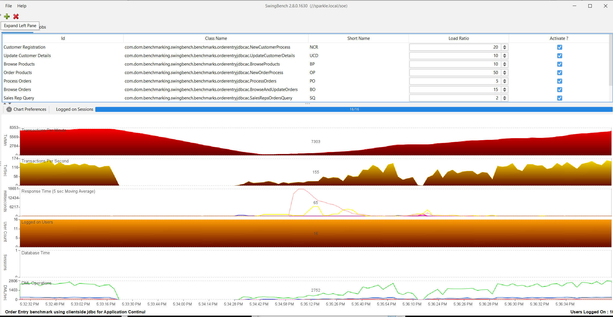

# High Availability — Part 2: Data Guard Broker, Fast-Start Failover, and Observer

**SOP: Data Guard Standby (`usatclust2`) — 2-Node Physical Standby for `apexdb`, on Oracle Linux 7**

Part 2 of 3 in this Data Guard series. [Part 1](part1-active-data-guard.md) covers the host
build through role-based services — read that first if you're starting fresh; this page
assumes `apexdb_stby` is already a confirmed, working Active Data Guard standby (Part 1,
Sections 1-13). **Part 2 (this page)** covers the Data Guard Broker, a real switchover
test, and Fast-Start Failover with the Observer. [Part 3](part3-post-checks.md) covers
post-standby validation.

Status: 🟩 Confirmed — both sections below ran clean end to end against the live lab.

| # | Section | Status |
|---|---|---|
| 14 | Data Guard Broker configuration | 🟩 Confirmed |
| 15 | Fast-Start Failover and Observer | 🟩 Confirmed |

**Section 14 is confirmed (🟩)** — Data Guard Broker configuration
(`CREATE CONFIGURATION`/`ADD DATABASE`/`ENABLE CONFIGURATION`,
MaxAvailability protection mode, `LogXptMode='SYNC'`) ran clean end to end
against the live lab after three real-run rounds of fixes, and the
standalone `dataguard_switchover_test` role subsequently confirmed a real
`SWITCHOVER TO apexdb_stby` correctly flips both the database roles and
[Part 1](part1-active-data-guard.md) Section 13's `apexdb_rw`/`apexdb_ro` services with no manual `srvctl`
intervention — see
[`known-risks.md`](../phase-01-foundation-2node-rac-12cR2/docs/known-risks.md)
#137 for the full debugging journey (a wrong DGMGRL invocation mechanism, two real
Oracle errors on the standby's broker startup, a dropped 18c-only `VALIDATE` command,
and the switchover test's own confirmed run). **Section 15 is confirmed too (🟩)** —
Fast-Start Failover enabled, Observer running on `oemserver01` under wallet auth,
confirmed against the live lab (three real-run rounds of fixes of its own — see
`known-risks.md` #138).

Before starting here, read
[`known-risks.md`](../phase-01-foundation-2node-rac-12cR2/docs/known-risks.md) — the
same reasoning doc referenced throughout [Part 1](part1-active-data-guard.md).

Screenshots referenced below go in [`screenshots/`](screenshots/) once captured — same
naming convention as `installation/`'s Section 15, numbered to match this page's own
section numbers (14, 15).

---

## Contents

14. [🟩 Confirmed — Data Guard Broker configuration](#14-confirmed--data-guard-broker-configuration)
15. [🟩 Confirmed — Fast-Start Failover and Observer](#15-confirmed--fast-start-failover-and-observer)

Back to **[Part 1 — Setting Up Active Data Guard](part1-active-data-guard.md)**. Continue to
**[Part 3 — Post checks](part3-post-checks.md)**.

---

## 14. 🟩 Confirmed — Data Guard Broker configuration
See `known-risks.md` #137 for the full debugging journey.

**What it does, in order:**

1. Checks and creates the ASM `/DG` subdirectory under both diskgroups on
   BOTH clusters (`+DATA01/apexdb/DG`, `+RECO01/apexdb/DG` on the primary;
   the equivalent pair under `apexdb_stby` on the standby) — closes the gap
   `known-risks.md` #98/#99 left open. ASM has no `mkdir -p`; the parent
   `{{ db_unique_name }}/` directory already existed (DBCA created it), so
   this is one check-then-create step per diskgroup, not a multi-level walk.
   ```
   # -- On the Primary
   $ asmcmd ls -l +DATA01/apexdb/DG
   $ asmcmd ls -l +RECO01/apexdb/DG# -- On the Standby
   $ asmcmd ls -l +DATA01/apexdb_stby/DG
   $ asmcmd ls -l +RECO01/apexdb_stby/DG
   ```
2. Relocates the **primary's** `dg_broker_config_file1/2` onto the new
   `/DG` path via the disable → set → enable dance (`known-risks.md` #81).
   Restarts the **standby's** broker the same way (disable → RE-SET
   `dg_broker_config_file1/2`.
	```
	SQL> alter system set dg_broker_start=true scope=both sid='*';
	```
	📸 *Screenshot: Show_primary_broker_config_file.png
	
3. PAUSE, then clears `log_archive_dest_2` on both databases
   (check-then-clear, idempotent) — Broker manages it from here.
	```
	SQL> alter system set log_archive_dest_2='' scope=both sid='*';
	
	```
   
4. `CREATE CONFIGURATION`, `ADD DATABASE`, and `ENABLE CONFIGURATION` as
   three **independently gated** steps (not one all-or-nothing block —
   `ADD DATABASE` gates on whether the standby specifically is already a
   member, so a partially-built configuration from an earlier failed run
   still gets completed correctly on the next one). Uses the renamed
   `apexdb_DGMGRL`/`apexdb_stby_DGMGRL` TNS aliases (`UR=A`, any-state
   connectivity) as the connect identifiers, not the plain app-facing
   aliases — matters most during an actual switchover/failover. Invoked via
   shell input redirection (`dgmgrl < script`), not a `@script` argument —
   the latter is RMAN/SQL\*Plus convention, not valid DGMGRL syntax (#137).
   
   ```
   DGMGRL> create configuration apexdb_dg as primary database is apexdb connect identifier is apexdb_DGMGRL;
   DGMGRL> add database apexdb_stby as connect identifier is apexdb_stby_DGMGRL maintained as physical;
   DGMGRL> enable configuration;
   ```
   📸 *Screenshot: Show_create_configuration.png.*
   
5. Sets MAA properties: `LogXptMode='SYNC'` on both databases (required for
   MaxAvailability — NOT `'ASYNC'`, `StandbyFileManagement='AUTO'` on the standby,
   `FastStartFailoverTarget` on both.
   ```
   DGMGRL> edit database apexdb  set property logxptmode='sync';
   DGMGRL> edit database apexdb_stby set property logxptmode='sync';
   DGMGRL> edit database apexdb_stby set property standbyfilemanagement='auto';
   DGMGRL> edit configuration set protection mode as maxperformance;   -- or maxavailability if latency allows sync
   DGMGRL> edit database apexdb  set property faststartfailovertarget='apexdb_stby';
   DGMGRL> edit database apexdb_stby set property faststartfailovertarget='apexdb';
   DGMGRL> show configuration verbose;
   ```
6. Sets protection mode to **MaxAvailability** `LogXptMode` Must be `sync`, which is why step 5
   runs first.
   ```
   DGMGRL> edit configuration set protection mode as maxavailability;
   ```
   📸 *Screenshot: Show_current_protection_mode.png.*
   
7. Final health check: `SHOW CONFIGURATION VERBOSE` + `SHOW DATABASE
   VERBOSE` for both databases. (`VALIDATE STATIC CONNECT IDENTIFIER` was
   dropped — real DGMGRL syntax, but introduced in Oracle 18c; this lab's
   DGMGRL is 12.2.0.1.0. `dataguard_net_config`'s existing `tnsping` + real
   `sqlplus` login against the `_DGMGRL` aliases already covers the same
   practical ground on this version.)
   ```
   DGMGRL> show configuration;
   DGMGRL> show database verbose apexdb;
   DGMGRL> show database verbose apexdb_stby;
   ```
   
   📸 *Screenshot: Show_enabled_configuration.png.*
   
8. The switchover test lives in its own standalone role/play.
   
   ```
   $ ansible-playbook -i inventory/hosts.ini site.yml --tags dataguard_switchover_test -e sys_password='<redacted>'
   ```
**What it does, in order:**
	 —
   `roles/dataguard_switchover_test`, `--tags dataguard_switchover_test` —
   not a flag on this role. Direction-agnostic: it queries `SHOW
   CONFIGURATION` first to determine which database is currently primary,
   issues `SWITCHOVER TO <currently-standby>`, then verifies both the real
   `database_role` via SQL and whether Section 13's role-based services
   flipped automatically via `srvctl status service` on both clusters.
   Re-running the same role/tag switches back.
   
   ```
   DGMGRL> switchover to apexdb_stby;
   Switchover succeeded, new primary is "apexdb_stby"
   ```

   ```
   DGMGRL> show configuration;
   DGMGRL> show database verbose apexdb;
   DGMGRL> show database verbose apexdb_stby;
   ```
   
   📸 *Screenshot: Switchover_confirmed_role_flip.png.*

   ```
   # --- New Primary (Old Standby)
   SQL> col host_name for a20
   SELECT d.NAME,
   i.INSTANCE_NAME,
   i.HOST_NAME,
   i.STATUS,
   d.OPEN_MODE,
   d.SWITCHOVER_STATUS,
   i.DATABASE_STATUS
   FROM   gv$instance i
   JOIN   gv$database d ON i.INST_ID = d.INST_ID;
   
   NAME      INSTANCE_NAME    HOST_NAME            STATUS  OPEN_MODE    SWITCHOVER_STATUS    DATABASE_STATUS
   --------- ---------------- -------------------- ------- -----------  -------------------- -----------------
   APEXDB    apexdb2          oradbserv10.usat.com OPEN    READ WRITE   TO STANDBY           ACTIVE
   APEXDB    apexdb1          oradbserv09.usat.com OPEN    READ WRITE   TO STANDBY           ACTIVE
   
   ```
📸 *Screenshot: Show_switchover_output.png

   ``` 
   # --- New Standby (Old Primary)
   SQL> col host_name for a20
   SELECT d.NAME,
   i.INSTANCE_NAME,
   i.HOST_NAME,
   i.STATUS,
   d.OPEN_MODE,
   d.SWITCHOVER_STATUS,
   i.DATABASE_STATUS
   FROM   gv$instance i
   JOIN   gv$database d ON i.INST_ID = d.INST_ID;

   NAME      INSTANCE_NAME    HOST_NAME            STATUS       OPEN_MODE            SWITCHOVER_STATUS    DATABASE_STATUS
   --------- ---------------- -------------------- ------------ -------------------- -------------------- -----------------
   APEXDB    apexdb1          oradbserv05.usat.com OPEN         READ ONLY WITH APPLY NOT ALLOWED          ACTIVE
   APEXDB    apexdb2          oradbserv06.usat.com OPEN         READ ONLY WITH APPLY NOT ALLOWED          ACTIVE
   
   SQL>
   ```


📸 *Screenshot: Show_configuration_pre_switchover.png.*


---

## 15. 🟩 Confirmed — Fast-Start Failover and Observer

```
$ ansible-playbook -i inventory/hosts.ini site.yml --tags dataguard_fsfo -e sys_password='<redacted>' -e dg_observer_wallet_password='<redacted>'
```

**What it does, in order:**

1. Closes a real gap found while scoping this (not guessed — confirmed by reading
   `dataguard_standby_prep`): Flashback Database was enabled on the primary back in
   Phase 1, but never on `apexdb_stby`. Without it on both sides, a failed-over old
   primary can't auto-reinstate as the new standby. Fixed via the Broker-driven
   sequence (`EDIT DATABASE apexdb_stby SET STATE='APPLY-OFF'` → `ALTER DATABASE
   FLASHBACK ON` → `SET STATE='APPLY-ON'`), not a raw open/mount dance.
2. Bootstraps `oemserver01` under Ansible for the first time — new `[observer_nodes]`
   inventory group, the same manual one-time `ansible` OS-user + SSH-key trust dance
   documented in `docs/ansible-on-windows.md` #4, then the same missing-`python3`
   bootstrap play every other node needed the first time (`known-risks.md` #17).

   ```
   # --- On oemserver01 (as oracle)
   sudo useradd -m -s /bin/bash ansible
   sudo passwd ansible
   echo "ansible ALL=(ALL) NOPASSWD:ALL" | sudo tee /etc/sudoers.d/ansible
   sudo chmod 0440 /etc/sudoers.d/ansible
   ```
   
   📸 *Screenshot: creating_observer_directory.png
   ```
   Then from WSL2 (control node — reuses the same ansible-control key you already generated for 
   the other 4 nodes, no need to regenerate):
   
   $ ssh-copy-id ansible@192.168.56.65
   
   Then confirm:
   
   $ ansible -i inventory/hosts.ini oemserver01 -m ping
   ```
3. Idempotent directory checks (`/opt/oracle/fsfo`, `/opt/oracle/wallets`), appends
   (never overwrites — `oemserver01` already had its own `tnsnames.ora`/`sqlnet.ora`
   entries) the `apexdb_DGMGRL`/`apexdb_stby_DGMGRL` TNS aliases and`SQLNET.WALLET_OVERRIDE` config.
   
   ```
   # --- Create directories
   $ sudo mkidr -p /opt/oracle/fsfo
   $ sudo mkdir -p /opt/oracle/wallets
   $ sudo chown -R oracle:oinstall /opt/oracle
   
   # --- Updataes sqlnet.ora file
   
   $ cat >> $TNS_ADMIN/sqlnet.ora <<EOF
   WALLET_LOCATION =
     (SOURCE =
       (METHOD = FILE)
       (METHOD_DATA =
         (DIRECTORY = /opt/oracle/wallet)
       )
     )
   SQLNET.WALLET_OVERRIDE = TRUE
   SSL_CLIENT_AUTHENTICATION = FALSE
   EOF
   ```
4. Creates an Oracle Wallet and credentials for both aliases via `mkstore`, every
   prompt answered over stdin (never a command-line argument), then actually tests
   `/@apexdb_DGMGRL` and `/@apexdb_stby_DGMGRL` connect with no password before
   trusting the wallet for anything else.
   ```
   $ $ORACLE_HOME/mkstore -wrl /opt/oracle/wallets -create
   `# enter a wallet password when prompted`
   
   $ $ORACLE_HOME/mkstore -wrl /opt/oracle/wallets -listCredential
   $ $ORACLE_HOME/mkstore -wrl /opt/oracle/wallets -createCredential apexdb_DGMGRL SYS <SYS_password>
   $ $ORACLE_HOME/mkstore -wrl /opt/oracle/wallets -createCredential apexdb_stby_DGMGRL SYS <SYS_password>
   
   DGMGRL> connect /@apexdb_DGMGRL as sysdba
   Connected to "apexdb"
   Connected as SYSDBA.
   ```
5. Sets `FastStartFailoverThreshold` (30s, Oracle's own default) and
   `ENABLE FAST_START FAILOVER` from the primary:

   📸 *Screenshot: Show_current_FSFO_status.png
   
      ```
   DGMGRL> edit configuration set property FastStartFailoverThreshold=30;
   DGMGRL> enable fast_start failover;
   DGMGRL> show fast_start failover;
   Fast-Start Failover: Enabled in Zero Data Loss Mode
     Threshold:          30 seconds
     Target:             apexdb_stby
   ```
   📸 *Screenshot: Show_FSFO_enabled_status.png.*
   
6. Starts the Observer itself, wallet-authenticated (no embedded password, unlike
   every other one-shot DGMGRL script in this project — this one runs indefinitely
   in the background and has to reconnect on its own):
   ```
   DGMGRL> start observer oemserver01_observer in background file is
     '/opt/oracle/fsfo/oemserver01_observer.dat' logfile is
     '/opt/oracle/fsfo/oemserver01_observer.log' connect identifier is apexdb_DGMGRL;
   Submitted command "START OBSERVER" using connect identifier "apexdb_DGMGRL"
   ```
7. Verifies via `SHOW FAST_START FAILOVER` + `SHOW OBSERVERS` — not just trusting
   that the start command returned successfully (DGMGRL has no `whenever sqlerror`
   equivalent; see `known-risks.md` #138 for the debugging journey behind exactly why
   that distinction mattered here):


   ```
   DGMGRL> show observers;
   Observer "oemserver01_observer"(19.48.0.0.0) - Master
     Host Name:              oemserver01.usat.com
     Last Ping to Primary:   3 seconds ago
     Last Ping to Target:    3 seconds ago
   ``` 
   📸 *Screenshot: show_observer.png
   
      ```
   DGMGRL> show fast_start failover;
   ```

   📸 *Screenshot: show_fast_start_fail_over.png

**Real induced-failover drill — confirmed manually, not yet Ansible-automated.**
Everything above proves FSFO *armed*. This proves it *exercised*: a real primary
outage — not a graceful switchover — with the Observer detecting it and promoting
the standby with no human triggering the failover itself. Run by hand, following
the same separation-of-concerns reasoning as `dataguard_switchover_test`. A
dedicated `roles/dataguard_fsfo_test` role that automates this drill the way
`dataguard_switchover_test` automates a planned switchover **is explicitly on
hold — James's call**, not an oversight: the mechanism itself is now proven
end to end by hand, and automating the drill is deliberately deferred rather
than treated as an immediate next step.

Baseline confirmed healthy first, via the standing monitoring scripts
([`scripts/monitor_dataguard.sh`](scripts/monitor_dataguard.sh) on both clusters,
[`scripts/montor_manage_observer.sh status`](scripts/montor_manage_observer.sh)
here) — `apexdb` PRIMARY on both `usatclust1` instances, `apexdb_stby` PHYSICAL
STANDBY READ ONLY WITH APPLY on both `usatclust2` instances, Observer `HEALTHY`
(PID confirmed running, `Last Ping to Primary: 2 seconds ago`).

**17:32:29 — the outage, induced for real.** An aborted instance, not a graceful
shutdown — closer to an actual crash than any planned switchover:

```bash
srvctl stop database -d apexdb -o abort
```

Swingbench (`SOE_Client_Side_AC`, same as Section 16) was running against the
primary through this outage, Application Continuity engaged:



Real numbers off that chart, correlated against the Observer log and SQL
evidence below, not just eyeballed: throughput held strong (TPS in the
100-150+ range, TX/Min around 7,000-8,000) until roughly **5:33:16 PM**, then
Transactions Per Second and DML Operations both dropped to near zero — a
real, visible stall, not a graceful slowdown — bottoming out around
**5:34:28-5:34:42 PM** before climbing back to pre-outage levels by
**5:35:00 PM** and holding there through the end of the run. That's roughly
an **86-second measurable impact window**, closely matching the ~89-second
RTO computed independently from the Observer log below (`17:32:29` abort to
`17:33:58` failover succeeded) — two different measurements of the same
real event landing within a few seconds of each other, not contradicting
one another. `Logged on Users` never dropped from 16 — Application
Continuity kept sessions intact through the outage rather than dropping and
recreating them.

**Worth being honest about, compared to Section 16's planned switchover:**
the response-time spike here is far more severe — the 5-second moving
average shoots up toward the top of an 18,651ms-scale axis during the worst
of the stall, versus a few hundred milliseconds for the planned switchover.
That's expected, not a regression in how well this is handled: a graceful
switchover coordinates the handoff in advance, while a real crash has to be
*detected*, wait out the Observer's confirmation window, and only then fail
over — the cost of that detection delay shows up directly in client-side
response time, even though both scenarios end in a full, unassisted
recovery.

**The Observer's own log, real-time** — the actual FSFO decision sequence, not a
summary of it:

```
Unable to connect to database using apexdb_dgmgrl
[W000 2026-08-19T17:33:41.463-04:00] Fast-Start Failover is not possible because primary last contacted the standby within FastStartFailoverThreshold seconds.
[W000 2026-08-19T17:33:44.489-04:00] Check if the standby is ready for failover.
[P025 2026-08-19T17:33:44.493-04:00] Failed to attach to apexdb_dgmgrl.
ORA-12514: TNS:listener does not currently know of service requested in connect descriptor
[S026 2026-08-19T17:33:44.507-04:00] Fast-Start Failover started...
Initiating Fast-Start Failover to database "apexdb_stby"...
Performing failover NOW, please wait...
Failover succeeded, new primary is "apexdb_stby"
[S026 2026-08-19T17:33:58.948-04:00] Fast-Start Failover finished...
[W000 2026-08-19T17:33:58.948-04:00] Failover succeeded. Restart pinging.
[W000 2026-08-19T17:33:58.980-04:00] Primary database has changed to apexdb_stby.
[W000 2026-08-19T17:34:07.346-04:00] The standby apexdb needs to be reinstated
[S030 2026-08-19T17:34:07.353-04:00] Failed to attach to apexdb_dgmgrl.
ORA-12514: TNS:listener does not currently know of service requested in connect descriptor
```

The early `"not possible ... within FastStartFailoverThreshold seconds"` warning
is the Observer's own safety check doing its job — refusing to fail over until it
can confirm the outage has genuinely persisted, not reacting to a single missed
ping. Once that confirmed, the whole sequence — detect, verify, fail over — ran in
about 17 seconds (`17:33:41` to `17:33:58`). The `ORA-12514` after `"needs to be
reinstated"` is expected, not a new problem: the old primary's instances were still
down from the abort, so an automatic reinstate attempt had nothing to attach to yet.

**In RPO/RTO terms, same framing as Section 16, now for an actual unplanned
failover instead of a planned switchover:**

- **RPO: zero.** `LAST_FAILOVER_REASON` in `gv$fs_failover_stats` (checked
  afterward, both instances agree) reads `Primary Disconnected` — not a lag-based
  reason — and `Lag Limit: 30 seconds (not in use)` in the Broker's own
  configuration confirms this failover happened in genuine Zero Data Loss Mode, not
  a lag-limited fallback. No committed transaction was lost.
- **RTO: about a minute and a half**, end to end — `17:32:29` (abort issued) to
  `17:33:58` (`"Failover succeeded"`, independently confirmed by
  `gv$fs_failover_stats.LAST_FAILOVER_TIME = 08/19/2026 17:33:53`, a few seconds'
  offset between the dictionary's own timestamp and the log line, expected). Close
  to Section 16's planned-switchover RTO (~1 minute) despite this being a genuine
  crash, not a coordinated role swap — the Observer's own 30-second confirmation
  window is most of the difference.

**Real SQL, after the failover, before reinstating** — connected to the new
primary (`apexdb_stby`) directly, not trusting the Observer log alone:

```
DGMGRL> show configuration verbose
Configuration - apexdb_dg
  Protection Mode: MaxAvailability
  Members:
  apexdb_stby - Primary database
    Warning: ORA-16824: multiple warnings, including fast-start failover-related warnings, detected for the database
    apexdb      - (*) Physical standby database (disabled)
      ORA-16661: the standby database needs to be reinstated
  FastStartFailoverAutoReinstate  = 'TRUE'
Fast-Start Failover: Enabled in Zero Data Loss Mode
  Active Target:      apexdb
  Observer:           oemserver01_observer
  Auto-reinstate:     TRUE
Configuration Status:
WARNING
```

`Configuration Status: WARNING`, not `ERROR` — the configuration itself is
functioning correctly; it's honestly reporting that one member needs attention,
which is exactly the state a real failover with `AutoReinstate` still pending
should show. `SHOW DATABASE apexdb StatusReport` returned `ORA-16548: Message
16548 not found` — a genuine minor rough edge (an empty message-catalog lookup
against the disabled old primary), left as-is rather than guessed at further;
`SHOW DATABASE apexdb_stby StatusReport` was the more useful one, returning
`ORA-16817: unsynchronized fast-start failover configuration` and `ORA-16869:
fast-start failover target not initialized` — both expected while the old primary
is still down and unreinstated, not new problems.

Confirmed independently via the data dictionary, not just DGMGRL's own report:

```sql
set linesize 200
col LAST_FAILOVER_REASON for a22SELECT * FROM gv$fs_failover_stats;
-- LAST_FAILOVER_REASON: Primary Disconnected (both instances agree)

set linesize 200
col fs_failover_observer_host for a28
SELECT fs_failover_status, fs_failover_current_target, fs_failover_threshold,
       fs_failover_observer_present, fs_failover_observer_host FROM gv$database;
	   
-- FS_FAILOVER_STATUS: REINSTATE REQUIRED, target apexdb, threshold 30,
-- observer present, host oemserver01.usat.com

col force_logging for a3 heading "FL"
col flashback_on for a10 heading "FLASHB ON"
col open_mode for a11
col db_unique_name for a16
set linesize 200
SELECT db_unique_name, database_role, open_mode, protection_mode,
       protection_level, switchover_status, force_logging, flashback_on FROM gv$database;
	   
-- apexdb_stby: PRIMARY, READ WRITE, MAXIMUM AVAILABILITY, level RESYNCHRONIZATION
-- (not yet MaxAvailability-level — can't be, with no synced standby), SWITCHOVER_STATUS
-- NOT ALLOWED (correct — nothing to switch over to yet), FORCE_LOGGING/FLASHBACK_ON both YES
```

**The missing step, confirmed:** `REINSTATE DATABASE` does not start a down
instance on its own — Broker's reinstate workflow can resync a mounted
instance via Flashback Database, but it has nothing to attach to if the
instance isn't even mounted yet. `oradbserv05`/`oradbserv06` needed an
explicit manual start, in `MOUNT` (not `OPEN` — reinstating a still-disabled
standby member isn't a normal startup), before reinstate would succeed:

```bash
# On oradbserv06, at 18:31:32 — about 57 minutes after the failover, once
# the old primary's instances were confirmed still down and diagnosed:
srvctl start database -d apexdb -o mount
```

**Reinstating the old primary as the new standby**, connected to the current
primary (`apexdb_stby`), now that `apexdb`'s instances are actually mounted
and reachable:

```
DGMGRL> reinstate database apexdb;
Reinstating database "apexdb", please wait...
Reinstatement of database "apexdb" succeeded
```

📸 *Screenshots: `reinstate_database_apexdb_dgmgrl.png`,
`reinstate_database_apexdb_alertlog.png`,
`Show_configuration_after_reinstate.png`.*

**Worth carrying forward, even with the automated test on hold:** a real
FSFO failover leaves the old primary needing a manual `srvctl start ... -o
mount` before it can be reinstated — `FastStartFailoverAutoReinstate=TRUE`
covers the *resync*, not the *restart*. Anyone running this drill for real
should expect to do that step by hand.

**Ongoing Observer monitoring.** Once the Observer is running, it needs its own
health check — an Observer process dying quietly defeats the entire point of FSFO,
since a primary outage with no live Observer just becomes an outage, not an
automatic failover.
[`scripts/montor_manage_observer.sh`](scripts/montor_manage_observer.sh) (filename
as committed — its own header comment calls itself `manage_observer.sh`, worth
knowing if you go looking for it by the "correct" spelling) covers `start`/`stop`/
`status` against this same Observer, wallet-authenticated via the same
`/@apexdb_dgmgrl` connection built above:

```bash
./montor_manage_observer.sh start    # START OBSERVER, same as step 6 above
./montor_manage_observer.sh stop     # DISABLE FAST-START FAILOVER, then STOP OBSERVER
./montor_manage_observer.sh status   # OS process check + SHOW OBSERVER; emails MAIL_TO on failure
```

`status` is the one worth scheduling — it checks both the OS process
(`pgrep -f "dgmgrl.*oemserver01_observer"`) and the Broker's own view
(`SHOW OBSERVER`), and only alerts if either says the Observer is actually gone,
not just quiet. Update `MAIL_TO` (currently the script's own placeholder,
`dba@yourcompany.com`) before relying on the email alert.

---

Back to **[Part 1 — Setting Up Active Data Guard](part1-active-data-guard.md)**. Continue to
**[Part 3 — Post checks](part3-post-checks.md)**.
