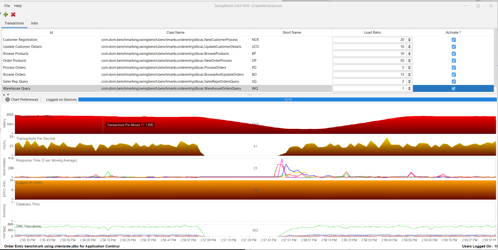

# High Availability — Part 3: Post Checks

**SOP: Data Guard Standby (`usatclust2`) — 2-Node Physical Standby for `apexdb`, on Oracle Linux 7**

Part 3 of 3 in this Data Guard series. [Part 1](part1-active-data-guard.md) covers the host
build through role-based services. [Part 2](part2-broker-fsfo-observer.md) covers the Data
Guard Broker, a real switchover test, and Fast-Start Failover with the Observer. **Part 3
(this page)** covers post-standby validation — the real remaining work in this series.

Status: 🟩 Confirmed — a real Swingbench-driven switchover ran against the live lab, with
a genuine throughput dip and a genuine, unassisted recovery.

| # | Section | Status |
|---|---|---|
| 16 | Post-standby validation | 🟩 Confirmed |

Before starting here, read
[`known-risks.md`](../phase-01-foundation-2node-rac-12cR2/docs/known-risks.md) — the
same reasoning doc referenced throughout [Part 1](part1-active-data-guard.md) and
[Part 2](part2-broker-fsfo-observer.md).

---

## Contents

16. [🟩 Confirmed — Post-standby validation](#16-confirmed--post-standby-validation)
17. [Screenshot checklist and naming convention](#17-screenshot-checklist-and-naming-convention)

Back to **[Part 2 — Broker, Fast-Start Failover, and Observer](part2-broker-fsfo-observer.md)**.

---

## 16. 🟩 Confirmed — Post-standby validation

Proves Data Guard's switchover protection under real application load, not just an
idle SQL/DGMGRL check — a real Swingbench throughput chart that dips and recovers
across a live switchover, per this project's standing toolkit (Swingbench 2.8.0.1630,
driven from a Windows client). This is the difference between "failover completed"
as a log line and "the application barely noticed" as something you can actually
show someone.

**What it does, in order:**

1. Load the SOE (Simple Order Entry) benchmark schema onto `apexdb` via Swingbench's
   `oewizard`, connecting through the role-based service (`apexdb_rw`), sized small
   for a home lab.
2. Configure and run Swingbench's `SOE_Client_Side_AC` benchmark — the Order Entry
   workload built specifically to exercise Application Continuity's replay/reconnect
   behavior, not a generic workload with no recovery logic of its own.
3. Connect via a client-side connect string that lists **both** clusters' SCAN
   listeners under one descriptor — see the debugging note below for why a
   single-cluster connect string doesn't survive a real switchover here.
4. Establish a stable baseline (16 concurrent users), confirm steady TPS/DML
   ops/response time before touching anything.
5. Trigger a real switchover mid-load via the confirmed `dataguard_switchover_test`
   role (Part 2, Section 14).
6. Watch and capture the throughput chart through the switchover — the real, honest
   dip, not a described one.
7. Verify the switchover at the database level via that same role's own real-SQL +
   `srvctl status service` checks — not just DGMGRL's own report.
8. Confirm Swingbench's own recovery — TPS/DML ops/response time return to baseline
   without any manual client-side intervention.

**Debugging journey — this changed the actual test setup, worth documenting
honestly.** The first real attempt used a connect string pointing at a single
cluster's SCAN only (`//scan-usatclust1.usat.com:1521/apexdb_rw`). That worked fine
for the baseline load, but the moment a real switchover moved `apexdb_rw` onto
`usatclust2` (this lab's standby cluster, with its own separate SCAN listener),
every reconnect attempt kept hitting `usatclust1`'s listener — which no longer had
the service registered — forever. An endless `SQLRecoverableException` loop, no
natural recovery no matter how long it ran. That was never an Application Continuity
problem; it was a client pointed at the wrong cluster, because this Data Guard setup
spans two genuinely separate clusters (not one shared SCAN the way a lot of
single-cluster Data Guard examples work).

Root-caused and fixed with a proper two-address connect descriptor listing both
clusters' SCAN listeners under one `DESCRIPTION` —
[`tnsnames-application.ora`](tnsnames-application.ora), the same pattern any real
application client (including the future NestWise app) will need for this
two-cluster topology:

```
apexdb_rw =
  (DESCRIPTION =
    (ADDRESS = (PROTOCOL = TCP)(HOST = scan-usatclust1.usat.com)(PORT = 1521))
    (ADDRESS = (PROTOCOL = TCP)(HOST = scan-usatclust2.usat.com)(PORT = 1521))
    (CONNECT_DATA =
      (SERVER = DEDICATED)
      (SERVICE_NAME = apexdb_rw)
    )
  )
```

Also switched the Swingbench benchmark config from a generic Order Entry workload to
`SOE_Client_Side_AC` — the config actually built to demonstrate replay/reconnect
behavior through an outage, rather than a plain connection pool with no recovery
logic of its own.

**Real run — database/Ansible level.** `dataguard_switchover_test` (Part 2's
confirmed, direction-agnostic role), switching back from `apexdb_stby` to `apexdb`
as primary while the Swingbench load above kept running:

```bash
ansible-playbook -i inventory/hosts.ini site.yml --tags dataguard_switchover_test -e sys_password='...'
```

Direction detected fresh, as always:

```
Currently PRIMARY: apexdb_stby. Currently STANDBY: apexdb. This run will SWITCHOVER
TO apexdb — it becomes the new PRIMARY, apexdb_stby becomes the new STANDBY.
```

Switchover output — DGMGRL reports success, but note the immediate `SHOW
CONFIGURATION` right after still shows transient errors (`ORA-16825`, `ORA-12514`)
while Clusterware finishes restarting the demoted primary into its new standby role.
This is expected and momentary, not a failure — the role doesn't trust this message
alone:

```
DGMGRL> Performing switchover NOW, please wait...
Operation requires a connection to database "apexdb"
Connecting ...
Connected to "apexdb"
Connected as SYSDBA.
New primary database "apexdb" is opening...
Oracle Clusterware is restarting database "apexdb_stby" ...
Connected to "apexdb_stby"
Switchover succeeded, new primary is "apexdb"
DGMGRL>
Configuration - apexdb_dg

  Protection Mode: MaxAvailability
  Members:
  apexdb      - Primary database
    Error: ORA-16825: multiple errors or warnings, including fast-start failover-related errors or warnings, detected for the database

    apexdb_stby - (*) Physical standby database
      Error: ORA-12514: TNS:listener does not currently know of service requested in connect descriptor

Fast-Start Failover: ENABLED

Configuration Status:
ERROR   (status updated 61 seconds ago)
```

Real SQL, independent of DGMGRL's own report:

```
apexdb: PRIMARY|READ WRITE
apexdb_stby: PHYSICAL STANDBY|READ ONLY
```

Role-based service verification, both clusters, via real `srvctl status service` —
this is the part that actually matters for this section, confirming Section 13's
services relocate automatically on a real switchover, not just in theory:

```
apexdb / apexdb_rw: Service apexdb_rw is running on instance(s) apexdb1,apexdb2
apexdb / apexdb_ro: Service apexdb_ro is not running.
apexdb_stby / apexdb_rw: Service apexdb_rw is not running.
apexdb_stby / apexdb_ro: Service apexdb_ro is running on instance(s) apexdb1,apexdb2
```

Final role summary and a clean recap — `failed=0` this run:

```
Switchover to apexdb complete. apexdb is now PRIMARY, apexdb_stby is now STANDBY
(confirmed via real SQL, not just DGMGRL's own report). Automatic role-based
service flip: apexdb_rw running on the new primary = True; apexdb_ro running on
the new standby = True. CONFIRMED — Section 13's automatic role-flip claim holds
against a real switchover.

PLAY RECAP
localhost    : ok=23  changed=6  unreachable=0  failed=0  skipped=3  rescued=0  ignored=0
oradbserv05  : ok=3   changed=0  unreachable=0  failed=0  skipped=1  rescued=0  ignored=0
oradbserv06  : ok=3   changed=0  unreachable=0  failed=0  skipped=1  rescued=0  ignored=0
oradbserv09  : ok=3   changed=0  unreachable=0  failed=0  skipped=1  rescued=0  ignored=0
oradbserv10  : ok=3   changed=0  unreachable=0  failed=0  skipped=1  rescued=0  ignored=0
```

Independently confirmed a few minutes later via the standing
[`scripts/monitor_dataguard.sh`](scripts/monitor_dataguard.sh) script — role-aware
(detects PRIMARY vs. PHYSICAL STANDBY locally and skips standby-only checks like
MRP status when run against a primary), so the same script runs unmodified on
either side of a switchover, unlike a script that assumes a fixed role. Run against
the new standby here — both instances open, applying, no gaps:

```
>>> 1. Standby Database Role & Open Mode (GV$)
INSTANCE_NUMBER INSTANCE_NAME  Hostname              DB Name  Database Role      Open Mode             LOG_MODE    Status
              1 apexdb1        oradbserv09.usat.com  APEXDB   PHYSICAL STANDBY   READ ONLY WITH APPLY  ARCHIVELOG  OPEN
              2 apexdb2        oradbserv10.usat.com  APEXDB   PHYSICAL STANDBY   READ ONLY WITH APPLY  ARCHIVELOG  OPEN
>>> 3. Managed Recovery Process (MRP) Status across Cluster
Inst Process  Status         Thd Sequence#  Block#
   1 MRP0     APPLYING_LOG     2       328  118541
>>> 4. Archive Gap Check (GV$)
No archive gaps found - OK
```

**Real run — application level.** Swingbench's `SOE_Client_Side_AC` workload, 16
users, connected via the corrected two-cluster connect string above. Switchover was
triggered at approximately 14:57; TPS, DML operations, and the 5-second moving
response time all show a real dip right around 14:57-14:58 — response time spiking
briefly, throughput dropping to near zero — then recovering on their own, no manual
reconnect, back to baseline levels by roughly 14:59. `Logged on Users` never dropped
from 16 throughout.



*Swingbench throughput through the switchover. The baseline chart is
[`16a-swingbench-baseline.png`](screenshots/16a-swingbench-baseline.png), and the
client-side Application Continuity view is
[`show_swingbench_failover_app_con.png`](screenshots/show_swingbench_failover_app_con.png).*

**What this confirms, stated in RPO/RTO terms.** This was a planned switchover, not
an unplanned failover, and the two numbers that actually matter for a Data Guard SLA
claim are Recovery Point Objective (RPO — how much data is lost) and Recovery Time
Objective (RTO — how long the outage lasts).

RPO here is genuinely zero. `MaxAvailability` protection mode with `LogXptMode=SYNC`
means the standby cannot fall behind the primary by design, and DGMGRL will not even
begin a switchover unless the standby is fully caught up — Part 2, Section 15's own
`SHOW FAST_START FAILOVER` output already confirmed this configuration as "Enabled
in Zero Data Loss Mode." No committed transaction was lost. That claim isn't new
here; this test didn't have to prove it, only not contradict it.

RTO is the honest, harder number, and it's the one this test actually measured. Not
DGMGRL's own "switchover succeeded" timestamp — the real, client-observed recovery
time from the Swingbench chart: roughly a minute of measurable application impact
(throughput dropping to near zero, response time spiking) between the switchover
being triggered and the application fully recovering on its own, with no manual
reconnect. That is the RTO this evidence supports — not zero, but bounded and
self-healing. What the corrected two-cluster connect string plus an Application
Continuity-aware client actually bought here wasn't a smaller RTO number by itself;
it was the difference between an RTO of about a minute and an RTO of *never* — the
permanent stall the single-cluster connect string produced on the first attempt.

Worth being precise about scope: this measured RTO applies to a **planned
switchover**. An **unplanned failover** is governed by a different mechanism
(`FastStartFailoverThreshold`, set to Oracle's own default of 30 seconds — Part 2,
Section 15) and hasn't been measured under load yet — that's the still-open
`dataguard_fsfo_test` work. "The app barely noticed" is honest as "recovered on its
own within about a minute, confirmed under a real planned switchover," not as
"didn't notice at all," and not yet as a claim about an actual outage.


---


Back to **[Part 2 — Broker, Fast-Start Failover, and Observer](part2-broker-fsfo-observer.md)**,
or **[Part 1 — Setting Up Active Data Guard](part1-active-data-guard.md)**.
