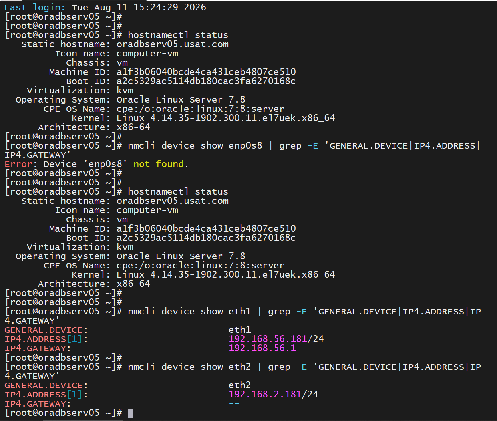
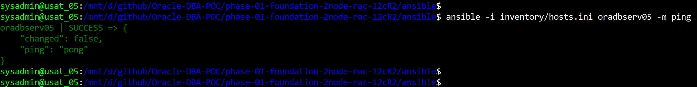
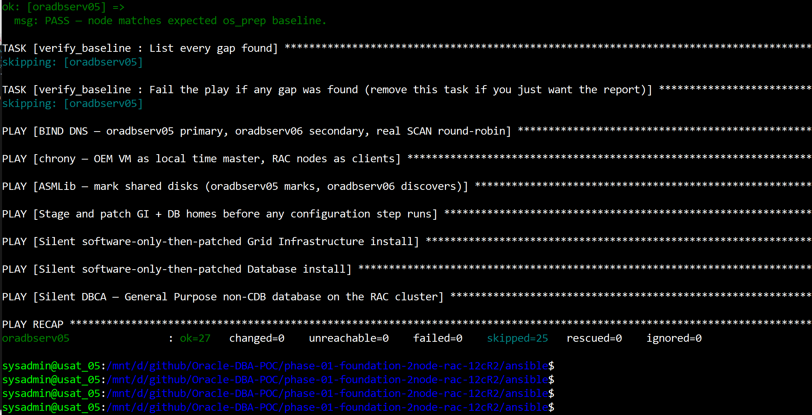
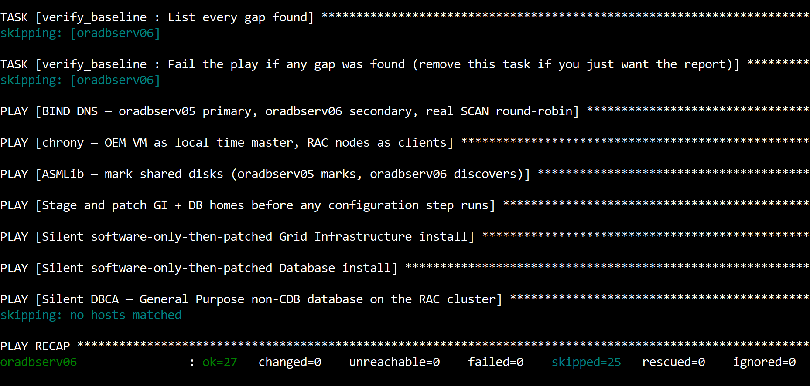
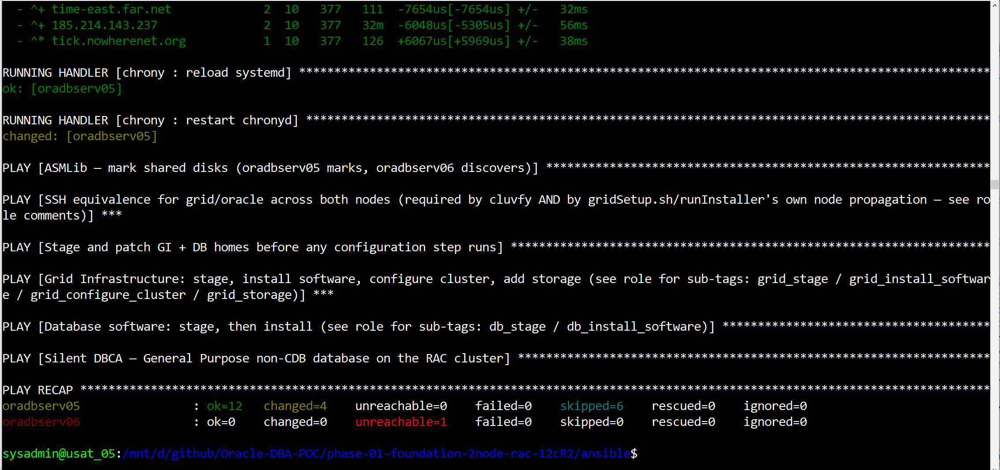
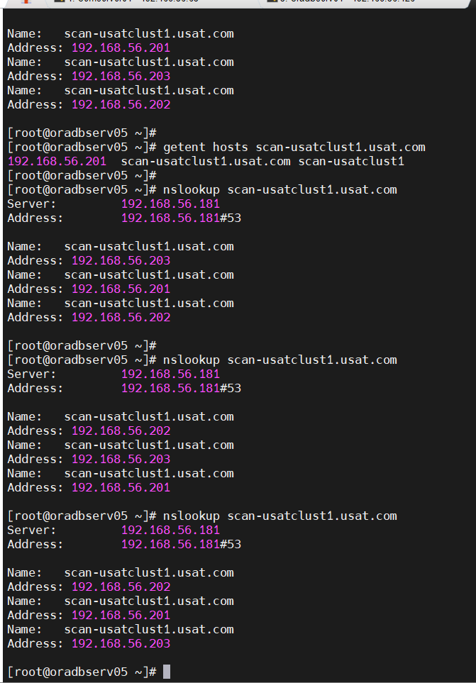
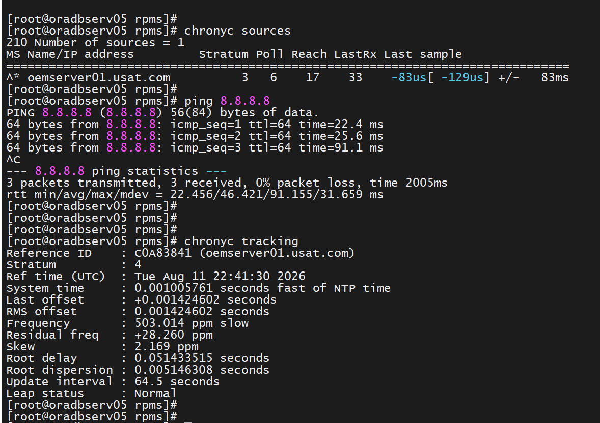
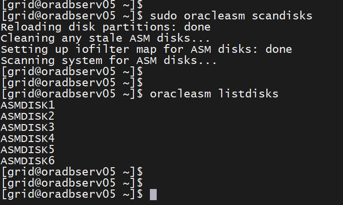
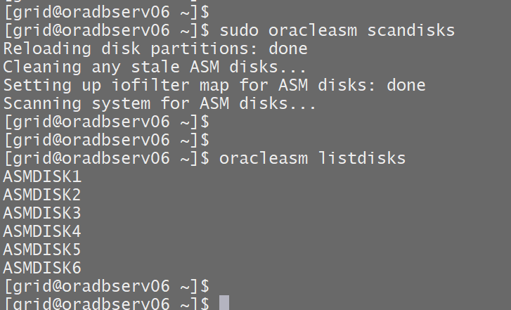
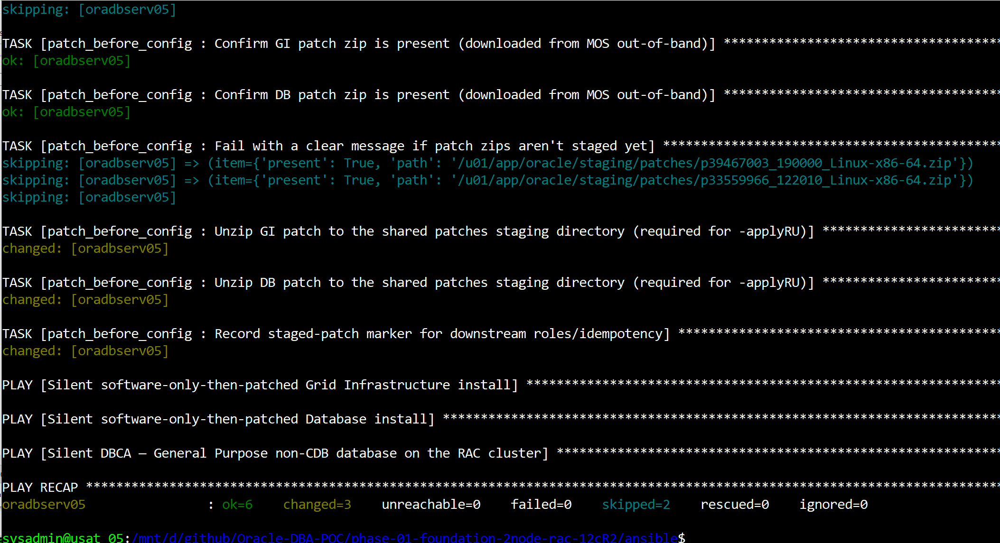

# Installation

**SOP: 2-Node Oracle RAC (Grid Infrastructure + Database 12.2.0.1) on Oracle Linux 7**

Status: 🟩 Built. This is the human-readable
runbook version of the automation in
[`../phase-01-foundation-2node-rac-12cR2/`](../phase-01-foundation-2node-rac-12cR2/).
Every command below is either exactly what the Ansible roles run, or the manual
equivalent if you are not using Ansible. Read the linked docs for the *why* behind each
decision; this page is the *how*, step by step.

Screenshots referenced below go in [`screenshots/`](screenshots/). The naming
convention is at the bottom of this page.

For what a given `ansible-playbook` command is doing under the hood, or to dig into
why a task failed beyond what scrolled past in the terminal, see
[`ansible-architecture-and-debugging.md`](../phase-01-foundation-2node-rac-12cR2/docs/ansible-architecture-and-debugging.md).
It covers the role and play structure, and every debugging and logging tool
available, including Ansible's own verbosity flags and run log, plus where Oracle's
installer logs land on the managed node.

---

## Contents

1. [Prerequisites and decisions](#1-prerequisites-and-decisions)
2. [Build strategy: build oradbserv05 by hand, verify, clone for oradbserv06](#2-build-strategy-build-oradbserv05-by-hand-verify-clone-for-oradbserv06)
3. [Host-side VM tuning and storage](#3-host-side-vm-tuning-and-storage)
4. [Build oradbserv05: OS install (manual)](#4-build-oradbserv05-os-install-manual)
5. [Configure Ansible](#5-configure-ansible)
6. [Run the OS baseline, verify, clone to oradbserv06, personalize, verify again](#6-run-the-os-baseline-verify-clone-to-oradbserv06-personalize-verify-again)
7. [DNS — BIND for SCAN](#7-dns--bind-for-scan)
8. [Time sync — chrony](#8-time-sync--chrony)
9. [ASMLib — mark the shared disks](#9-asmlib--mark-the-shared-disks)
9a. [SSH equivalence for grid/oracle](#9a-ssh-equivalence-for-gridoracle)
10. [Stage and patch the GI/DB software](#10-stage-and-patch-the-gidb-software)
11. [Silent Grid Infrastructure install](#11-silent-grid-infrastructure-install)
12. [Silent Database software install](#12-silent-database-software-install)
13. [Silent DBCA — General Purpose, non-CDB, 2-node RAC](#13-silent-dbca--general-purpose-non-cdb-2-node-rac)
14. [Post-install validation](#14-post-install-validation)
15. [Screenshot checklist and naming convention](#15-screenshot-checklist-and-naming-convention)
16. [Appendix: manual BIND setup (no Ansible)](#appendix-manual-bind-setup-no-ansible)
17. [Appendix: manual chrony setup (no Ansible)](#appendix-manual-chrony-setup-no-ansible)

---

## 1. Prerequisites and decisions

| Item | Value |
|---|---|
| Target | Grid Infrastructure **19c** (19.3 base plus RU 19.32.0.0.260721, patch 39467003) and Database **12.2.0.1**, 2-node RAC, admin-managed. A deliberate independent-version design, since GI and DB homes are fully independent, which is a normal supported Oracle pattern. See [`known-risks.md`](../phase-01-foundation-2node-rac-12cR2/docs/known-risks.md) #2 |
| OS | Oracle Linux **7**, correct for this phase and Phase 2 (Data Guard, GoldenGate). Not certified for the later 26ai upgrade, so an OS migration is planned before that phase. See [`known-risks.md`](../phase-01-foundation-2node-rac-12cR2/docs/known-risks.md) #1 |
| Nodes | `oradbserv05.usat.com` (node 1), `oradbserv06.usat.com` (node 2) |
| Network | 3 NICs per node: NAT (admin), Host-Only (public cluster), Internal (private interconnect). See [`network-and-hosts.md`](../phase-01-foundation-2node-rac-12cR2/docs/network-and-hosts.md) |
| Storage | Classic ASMLib v2, with six 50GB shared disks (`ASMDISK01` to `06`), exposed via `/dev/disk/by-label/`. `DATA01`: 3 disks, `NORMAL`. `DATA02` and `RECO01`: one or two disks each, `EXTERNAL` |
| Name resolution | BIND, with `oradbserv05` as primary NS and `oradbserv06` as secondary |
| Time sync | chrony, with `oemserver01` as local stratum-10 master |
| OFA paths | `ORACLE_BASE=/u01/app/oracle`, shared by both `oracle` and `grid` (`GRID_BASE=/u01/app/oracle` too), `ORACLE_HOME=/u01/app/oracle/product/12.2.0/db_1`, `GRID_HOME=/u01/app/grid/19.3.0` (a separate top-level path, not nested under the shared base), staging at `/u01/app/oracle/staging` (dual-owned, oracle+grid); `/u01` itself is partitioned/formatted/mounted by `os_prep` on its own dedicated disk, not the root filesystem |
| Target database | General Purpose template, **non-CDB**, `AL32UTF8` |
| Build strategy | `oradbserv05` built by hand and Ansible-verified, then cloned via Ansible to produce `oradbserv06`, rather than two independently built VMs |
| Patch policy | GI and DB homes patched **before** any configuration step (root scripts / DBCA) |
| Ansible control | Managed nodes are reached over SSH as a dedicated `ansible` account (passwordless sudo), created manually on each node right after OS install, before Ansible ever connects |

Before starting, read (in this order):
[`known-risks.md`](../phase-01-foundation-2node-rac-12cR2/docs/known-risks.md),
[`network-and-hosts.md`](../phase-01-foundation-2node-rac-12cR2/docs/network-and-hosts.md),
[`golden-image-and-cloning.md`](../phase-01-foundation-2node-rac-12cR2/docs/golden-image-and-cloning.md),
[`patching-strategy.md`](../phase-01-foundation-2node-rac-12cR2/docs/patching-strategy.md).
Fill in the placeholder values in
[`ansible/group_vars/all.yml`](../phase-01-foundation-2node-rac-12cR2/ansible/group_vars/all.yml)
(patch IDs, real ASM disk device paths, vaulted passwords) before running anything.

---

## 2. Build strategy: build oradbserv05 by hand, verify, clone for oradbserv06

`oradbserv05` is built by hand first, covering the OS install, network identity and
the `os_prep` baseline, with **no** Oracle binaries staged yet. Once Ansible's
`verify_baseline` role confirms it is correct rather than assumed correct, it is
cloned via an Ansible-driven `VBoxManage clonevm` to produce `oradbserv06`. That
clone is then personalized with its hostname, static IPs, machine-id and SSH host
keys, over the VirtualBox console rather than SSH, because the fresh clone is a
network-identical duplicate of node 1 until that is fixed. It is verified again
before either node touches Oracle software. There is no separate throwaway template
VM. Node 1 is the clone source. Full walkthrough with exact commands:
[`golden-image-and-cloning.md`](../phase-01-foundation-2node-rac-12cR2/docs/golden-image-and-cloning.md).
Step 7 onward below assume both real nodes exist, are personalized, and are reachable
over SSH with their final hostnames.

📸 *Screenshot: `VBoxManage list vms` showing both nodes registered, plus the `verify_baseline` PASS output for each.*

---

## 3. Host-side VM tuning and storage

Run on the VirtualBox **host**, split across the build strategy above. Compute and
network settings go on `oradbserv05` before its OS install. Shared storage only
makes sense once `oradbserv06` exists too:

```powershell
# Compute + network, against oradbserv05, BEFORE its OS install:
.\phase-01-foundation-2node-rac-12cR2\scripts\vm-tuning-vboxmanage.ps1 -VMS oradbserv05

# After oradbserv06 has been cloned and personalized: shared ASM storage plus the per-node /u01 disk
.\phase-01-foundation-2node-rac-12cR2\scripts\vm-tuning-vboxmanage.ps1 -VMS oradbserv05,oradbserv06 -AttachSharedAsmDisks
```

This provisions a 50GB dynamic root disk (set at VM creation), a 75GB dynamic `/u01`
disk per node, and six 50GB **fixed, shareable** disks named `ASMDISK01` to `06` on a
SAS controller attached to both nodes identically. Full detail:
[`scripts/vm-tuning-vboxmanage.sh`](../phase-01-foundation-2node-rac-12cR2/scripts/vm-tuning-vboxmanage.sh).

**This only attaches the `/u01` disk at the host and VirtualBox level. It does not
partition, format or mount it inside the guest.** That is `os_prep`'s job in Section 6
below. It discovers the disk (`u01_device` in `group_vars/all.yml`, `/dev/sdc` in this
build; confirm with `lsblk` inside the guest, because attach order can shift it),
partitions it GPT, formats XFS labeled `ora_soft`, and mounts it at `/u01` before
creating any OFA directories under it. Skipping straight to `os_prep` without this
host-side step first means `/dev/sdc` does not exist yet and the partition task has
nothing to act on.

---

## 4. Build oradbserv05: OS install (manual)

Install Oracle Linux 7 (minimal) on `oradbserv05` directly, by ISO boot and manual
install, with no Ansible involved yet. Set its **final, real identity** during the
install itself, not a placeholder:

- Hostname: `oradbserv05.usat.com`
- 3 NICs per [`network-and-hosts.md`](../phase-01-foundation-2node-rac-12cR2/docs/network-and-hosts.md#adapters-per-node--3-nics-not-2):
  NAT (DHCP), Host-Only Adapter static `192.168.56.181/24` (gateway `192.168.56.1`, DNS
  search `usat.com`), Internal Network `intnet` static `192.168.2.181/24` (no gateway).
  Confirm this internal network NAME is the identical string on both VMs before going
  further. VirtualBox will not warn if it is not. See `docs/known-risks.md` #11
- Enable `sshd` and confirm it starts on boot (`systemctl enable --now sshd`)

At this point the VM exists, is reachable on its final IPs, and has SSH up, but
nothing Oracle-specific or Ansible-specific has touched it yet. That is deliberate.
The next section creates the account Ansible connects as, before Ansible is used for
anything.

Confirm the hostname and static network config landed as expected:

```bash
hostnamectl status
nmcli device show eth1 | grep -E 'GENERAL.DEVICE|IP4.ADDRESS|IP4.GATEWAY'
nmcli device show eth2 | grep -E 'GENERAL.DEVICE|IP4.ADDRESS'
```



---

## 5. Configure Ansible

Ansible-related setup happens **after** the OS exists, in two parts: a small manual
step on the node itself, because Ansible cannot SSH in to automate it while the
account it would connect as does not exist yet, then the control-node setup on your
Windows machine.

### 5a. Create the `ansible` managed-node user

Run this directly on `oradbserv05`, logged in at the console or over SSH as whatever
account you created during the OS install:

**Step 1: Create the Ansible user and set a password**
```bash
sudo useradd -m -s /bin/bash ansible
sudo passwd ansible
```

**Step 2: Grant passwordless `sudo` privileges**

Ansible needs `sudo` access to perform administrative tasks (package installs, sysctl,
user management, and so on). Create a dedicated sudoers file for the `ansible` user so
it can do this without a password prompt on every task:

```bash
echo "ansible ALL=(ALL) NOPASSWD:ALL" | sudo tee /etc/sudoers.d/ansible
sudo chmod 0440 /etc/sudoers.d/ansible
```

This is the same lab-only tradeoff as the `oracle`/`grid` passwordless sudo granted
later by the `os_prep` role (`/etc/sudoers.d/11-oracle-grid`). It is fine for a home
lab and not a pattern to carry into a real environment. Repeat both steps on
`oradbserv06` once it exists. Section 6 covers cloning it from `oradbserv05`, which
carries this account over automatically, so there is no need to redo it there.

### 5b. Set up the Ansible control node (Windows via WSL2)

The full walkthrough, covering the WSL2 install, installing Ansible inside it,
generating SSH keys, and WSL2 to VirtualBox Host-Only networking, is in
[`ansible-on-windows.md`](../phase-01-foundation-2node-rac-12cR2/docs/ansible-on-windows.md).
Short version, once WSL2 and Ansible are installed:

```bash
ssh-keygen -t ed25519 -C "ansible-control"
ssh-copy-id ansible@192.168.56.181   # oradbserv05
```

`ansible.cfg` already sets `remote_user = ansible` to match the account created in 5a.

### 5c. Verify connectivity before running any playbook

`inventory/hosts.ini` points `rac_nodes` at `/usr/bin/python3`, which a fresh OL7
install does not have yet (see
[`known-risks.md`](../phase-01-foundation-2node-rac-12cR2/docs/known-risks.md) #17).
The ad-hoc `ping` module therefore fails on `oradbserv05` right now with
`/usr/bin/python3: No such file or directory`. That is expected at this point and
does not mean SSH or sudo is broken. Use `raw` for this first check instead, since
it needs no Python on the target at all:

```bash
ansible -i inventory/hosts.ini oradbserv05 -m raw -a "echo pong"
```

Expect the raw SSH output ending in `pong`. If this fails, fix it here. Every
`ansible-playbook` command for the rest of this SOP depends on SSH and sudo working.
Once this passes, Section 6's first playbook run installs `python3` automatically
through `site.yml`'s bootstrap play, tagged `always`, before `os_prep` itself runs. A
plain `-m ping` works normally from that point on.

**If you see `Permission denied (publickey...)` alongside a `"world writable
directory... ignoring it as an ansible.cfg source"` warning:** that warning is the
actual cause. WSL2 exposes `/mnt/d/...` as world-writable, so Ansible refuses to load
`ansible.cfg` and silently drops `remote_user = ansible`, connecting as your shell user
instead. Fix and workarounds:
[`ansible-on-windows.md` Section 3](../phase-01-foundation-2node-rac-12cR2/docs/ansible-on-windows.md#3-reach-this-repo-from-wsl2).



### 5d. Set real database and ASM passwords before Sections 11 to 13

`group_vars/all.yml`'s `sys_password` and `system_password` are placeholders
(`CHANGE_ME_...`) on purpose. They cover SYS, SYSASM and the ASM monitor account for
GI, and SYS, SYSTEM and DBSNMP for DBCA. Leaving them as they are fails those steps
loudly rather than silently installing with a value nobody chose.

Set real ones without editing this file, so nothing real ends up committed. Either
pass `-e sys_password=... -e system_password=...` on the `ansible-playbook` command
line for Sections 11 to 13, or create a gitignored `group_vars/all_local.yml`
holding just those two keys. See `docs/known-risks.md` #45.

---

## 6. Run the OS baseline, verify, clone to oradbserv06, personalize, verify again

```bash
ansible-playbook -i inventory/hosts.ini site.yml --tags os_prep --limit oradbserv05
```


What this does (role: [`os_prep`](../phase-01-foundation-2node-rac-12cR2/ansible/roles/os_prep/tasks/main.yml)):

1. Installs the **Oracle Database 19c Preinstallation RPM**
   (`oracle-database-preinstall-19c`, Oracle's post-18c flat naming convention rather
   than the older "server" plus "RxCy" shape). This is the primary OS-baseline
   mechanism, matching GI's actual version of 19c rather than 12.2.0.1, which is the
   deliberate independent-version design in
   [`known-risks.md`](../phase-01-foundation-2node-rac-12cR2/docs/known-risks.md) #2.
   It handles the `oracle` user's package, group, sysctl and limits baseline
   automatically, and its kernel and limits values have been confirmed to match 12.2's
   exactly, so it covers the 12.2.0.1 database layer too. Oracle's official 12.2
   package table is still installed explicitly afterward as a cross-check and
   reconciliation layer for the handful of packages the 19c RPM does not pull in as
   dependencies. The
   12.2-specific preinstall RPM (`oracle-database-server-12cR2-preinstall`) is also
   natively available via yum on OL7 and installed alongside it, for the DB layer's
   own native baseline.
2. Creates the OS groups with specific GIDs. These are **not arbitrary**. The
   preinstall RPM above already creates `oinstall` (54321), `dba` (54322) and `oper`
   (54323), plus its own `backupdba` (54324), `dgdba` (54325), `kmdba` (54326) and
   `racdba` (54330). The ASM-specific groups this project also needs (`asmadmin`,
   `asmdba`, `asmoper`) are therefore placed at the next free block, `54327` to
   `54329`, and `oper` is left pointed at the RPM's own `54323` rather than
   reassigned. Confirm on any node with `id oracle` right after the preinstall RPM
   installs if you ever see `groupadd` or `groupmod: GID already exists` on a run.
3. Ensures the `vboxsf` group exists for host shared folder access. It is normally
   created by VirtualBox Guest Additions, so this confirms it and attaches to it.
4. Creates the **`grid`** user explicitly, because the preinstall RPM only handles
   `oracle`. **The primary group must be `oinstall`**, not a private per-user group.
   This caught us once, since `useradd` defaults to a private primary group unless
   `group:` is set explicitly. `verify_baseline` now checks `id -gn` for both `grid`
   and `oracle` against `oinstall` so it cannot regress unnoticed. Supplementary
   groups are `asmadmin`, `asmdba` and `asmoper` for ASM role separation, plus `dba`,
   `racdba` and `vboxsf`. `oracle`'s supplementary groups are topped up the same way
   with `oinstall`, `dba`, `asmdba`, `oper`, `racdba` and `vboxsf`.
5. Grants `oracle` and `grid` **passwordless sudo** (`/etc/sudoers.d/11-oracle-grid`).
   This is a deliberate lab convenience rather than a production pattern, and is
   flagged explicitly in the role's comments. It is separate from the `ansible`
   account's own passwordless sudo set up manually in Section 5a: `oracle` and `grid`
   are software owners, `ansible` is the control and connection account.
6. Deploys an Ansible-managed `.bash_profile` for both `oracle` and `grid`
   (`ORACLE_SID`/`GRID_HOME`/etc. computed per node from `group_vars/all.yml`'s `nodes`
   list, so it's correct on both `oradbserv05` and `oradbserv06` without hand-editing).
   Includes `su2grid`/`su2oracle` aliases (`sudo -iu grid`/`sudo -iu oracle`) for
   switching between the two software-owner identities. Prefer that over sourcing one
   user's env vars into the other's session, since `crsctl` and `srvctl` against OCR
   and voting disks need the real OS identity, not borrowed env vars.
7. Partitions, formats (XFS, label `ora_soft`) and mounts `/u01` on its own dedicated
   disk (`u01_device` in `group_vars/all.yml`), **not** the root filesystem. Each step
   is guarded with `blkid` checks first, so re-running against an already-provisioned
   disk is a no-op. `df -h /u01` should show the dedicated `u01_device` partition, not
   the root disk.
8. Creates the OFA directory tree. `/u01/app/oracle` is the shared `ORACLE_BASE` used
   by **both** `oracle` and `grid`, at mode `2775`, owned by `oracle:oinstall`, setgid
   so that `grid`, a member of `oinstall`, can write into it too. `/u01/app/grid/19.3.0`
   is `GRID_HOME` itself, owned by `grid:oinstall`, on a completely separate top-level
   path rather than nested under the shared `ORACLE_BASE`. `/u01/app/oraInventory` is
   owned `grid:oinstall` at mode `2775`; see
   [`known-risks.md`](../phase-01-foundation-2node-rac-12cR2/docs/known-risks.md) #3 for
   why `grid` rather than `oracle`. `/u01/app/oracle/staging` is mode `2775` with group
   `oinstall`, so both `oracle` and `grid` can write to it, and the setgid bit keeps
   new files group-writable regardless of which user created them.
9. Layers this project's own kernel tuning on top of the preinstall RPM's baseline,
   deployed as `/etc/sysctl.d/zz90-oracle-override.conf`: the standard GI/DB minimums
   (`fs.aio-max-nr`, `kernel.shmmax`, `kernel.sem`, RAC interconnect `rp_filter`) plus
   memory-pressure tuning (`vm.swappiness=5`, `vm.dirty_background_ratio=3`,
   `vm.dirty_ratio=40`, `vm.dirty_expire_centisecs=1500`,
   `vm.dirty_writeback_centisecs=250`, `vm.vfs_cache_pressure=120`). On this project's
   nodes, `fs.aio-max-nr` and `kernel.shmmax` run higher than this file's values,
   because `oracle-database-preinstall-19c`'s own baseline (`4194304` and roughly 4TB)
   wins over this file regardless of `sysctl.d` file naming. That is correct. Both are
   Oracle-documented **minimums** rather than exact targets, and a higher ceiling does
   not reserve memory it is not using, so `verify_baseline` checks these two as "at
   least this much" rather than as an exact match.
10. Deploys and activates a custom **tuned** profile (`oracle-db-vm`, at
    `/etc/tuned/oracle-db-vm/tuned.conf`) that inherits `virtual-guest` (`tuned-adm
    recommend`'s default pick on a VirtualBox VM) but overrides `vm.swappiness`/
    `vm.dirty_ratio`/etc. to this project's values. Needed because `virtual-guest`
    itself sets `vm.swappiness=30` and (via its `throughput-performance` parent)
    `vm.dirty_ratio=30`, and `tuned` actively re-applies its active profile's own
    sysctl values. The previous item's plain `sysctl.d` file alone is not enough to
    make `5` and `40` stick. See
    [`known-risks.md`](../phase-01-foundation-2node-rac-12cR2/docs/known-risks.md) #23.
11. Sets the **deadline** I/O scheduler, which is 12c's recommendation, via a GRUB
    kernel command-line parameter (`elevator=deadline`, appended to
    `GRUB_CMDLINE_LINUX` in `/etc/default/grub`, then `grub2-mkconfig`). OL7's 3.10
    kernel has no multi-queue block layer, so this is the traditional single-queue
    scheduler mechanism rather than a udev rule. **It requires a reboot to take
    effect.** Confirm afterwards with `cat /sys/block/sd*/queue/scheduler`.
12. Writes corrected resource limits to `/etc/security/limits.d/99-oracle.conf` for both
    `grid` and `oracle` (`nproc`, `nofile`, `stack`, `memlock`, and `data unlimited`).
13. Sets SELinux fully to `disabled`, persisted in `/etc/selinux/config`, with
    `setenforce 0` for immediate effect. True `Disabled` only takes hold after a
    reboot; see
    [`known-risks.md`](../phase-01-foundation-2node-rac-12cR2/docs/known-risks.md) #26.
    Disables `firewalld` **entirely** (`systemctl disable --now firewalld`) **if
    firewalld is actually running**. Both are deliberate lab conveniences, in the same
    category as `oracle` and `grid`'s passwordless sudo. A previous version of this
    role only trusted the private interconnect interface (`eth2`) and kept SELinux
    permissive, which left the public interface (`eth1`) filtered by firewalld's
    default zone. That silently blocked `gridSetup.sh`'s own ephemeral-port remote
    file-transfer mechanism at Section 11 with `PRCF-2087` and `PRCF-2001`
    "Connection ... refused" errors. See known-risks.md #25 for firewalld and #26 for
    SELinux. If firewalld is not running at all, that step is skipped with an
    informational message rather than a failure.
14. Enables `chronyd` (configured properly in Section 8 below).
15. Installs the ASMLib packages (`kmod-oracleasm`, `oracleasm-support`,
    `oracleasmlib`) on the golden image, rather than deferring them to Section 9's
    `asmlib_disks` role, since only disk marking and service config genuinely need
    both real nodes to exist. `oracleasmlib` is not reliably on OL7's public yum
    channels. Stage it at `/root/rpms/oracleasmlib-2.0.15-1.el7.x86_64.rpm` on this
    node **before** running this section, or this task fails with `No package
    matching 'oracleasmlib' found`. See
    [`known-risks.md`](../phase-01-foundation-2node-rac-12cR2/docs/known-risks.md) #21.


<details>
<summary>Expected output, trimmed to a healthy run rather than every task line</summary>

```
PLAY [OS baseline, packages, kernel/VM tuning, OFA layout (oradbserv05 first, closes gaps; safe to re-run on oradbserv06 post-clone)] ***

TASK [Gathering Facts] ***
ok: [oradbserv05]

TASK [os_prep : Install the Oracle Database 19c preinstallation RPM (primary OS baseline mechanism)] ***
ok: [oradbserv05]

TASK [os_prep : Install only the missing required packages (fails loud if any is genuinely unavailable)] ***
ok: [oradbserv05]

TASK [os_prep : Report optional package status (informational — never blocks the play)] ***
ok: [oradbserv05] => (item=ipmiutil)
ok: [oradbserv05] => (item=libvirt-libs)
...

PLAY RECAP ***
oradbserv05                : ok=14   changed=3    unreachable=0    failed=0    skipped=2    rescued=0    ignored=0
```

`failed=0` is the only number that matters here. `ok`, `changed` and `skipped` vary run to run
depending on what was already present. A `failed` count above 0 means stop and check the task
name before moving on.

</details>

**Manual spot-check.** Optional, since `verify_baseline` below covers the same ground
programmatically:
```bash
id grid; id oracle
id -gn grid; id -gn oracle   # both must print "oinstall". A private per-user primary group is a bug
sudo -l -U oracle   # confirm passwordless sudo took
df -h /u01           # must show the dedicated u01_device partition, NOT the root disk
sysctl vm.swappiness fs.aio-max-nr kernel.shmmax
cat /sys/block/sda/queue/scheduler   # deadline selected, in [brackets]. Needs a reboot after os_prep
cat /sys/kernel/mm/transparent_hugepage/enabled   # must NOT show [always]
grep 'Managed by Ansible' /home/oracle/.bash_profile /home/grid/.bash_profile
```

**Verify with Ansible before trusting this node as a clone source:**
```bash
ansible-playbook -i inventory/hosts.ini site.yml --tags verify_baseline --limit oradbserv05
```
[`verify_baseline`](../phase-01-foundation-2node-rac-12cR2/ansible/roles/verify_baseline/tasks/main.yml)
asserts every item in the list above in one pass, plus users and groups including the
**primary** group rather than only supplementary membership, OFA directory ownership,
the `/u01` mount source and `.bash_profile` presence. It fails with a full gap list if
anything is off. Do not clone a node that has not passed this. ASMLib **packages** are
checked as a real, unconditional gap too, because they install as part of `os_prep`
now (see Section 9) rather than later. The ASMLib **service**, enabled and started,
stays reported-only
unless you pass `-e verify_asmlib_disks=true`, since service config and disk marking
still happen later via `asmlib_disks`, after both real nodes exist.



**Clone, via Ansible, once verified:**
```bash
# Power off oradbserv05 first. clonevm needs a non-running source here
VBoxManage.exe controlvm oradbserv05 acpipowerbutton

ansible-playbook clone-node.yml -e source_vm=oradbserv05 -e target_vm=oradbserv06
```
[`clone-node.yml`](../phase-01-foundation-2node-rac-12cR2/ansible/clone-node.yml) runs
against the control node itself and shells out to `VBoxManage.exe clonevm ... --mode all`
(a full clone). It checks VBoxManage is reachable and the source is powered off first.
The clone carries over the `ansible` user and its SSH access from Section 5
automatically, so there is nothing to redo there.

**Personalize the clone over the console, not SSH.** `oradbserv06` boots as a
network-identical duplicate of `oradbserv05`, with the same hostname and the same IPs
on every NIC, so powering both on at once before this step causes an IP conflict. The
full command sequence covering hostname, static IPs, machine-id and SSH host keys is in
[`golden-image-and-cloning.md`](../phase-01-foundation-2node-rac-12cR2/docs/golden-image-and-cloning.md#step-4--personalize-the-clone--console-only-not-ssh).
Do it entirely over the VirtualBox console while `oradbserv05` stays powered off, then
bring `oradbserv05` back on once `oradbserv06` has its own distinct identity.

**Verify the clone too:**
```bash
ansible-playbook -i inventory/hosts.ini site.yml --tags verify_baseline --limit oradbserv06
```



(`VBoxManage.exe list vms` confirming both nodes registered and running simultaneously
wasn't captured separately.)

---

## 7. DNS — BIND for SCAN

Run against both real nodes, after cloning + personalizing:

```bash
ansible-playbook -i inventory/hosts.ini site.yml --tags dns_bind
```

Role: [`dns_bind`](../phase-01-foundation-2node-rac-12cR2/ansible/roles/dns_bind/tasks/main.yml).
`oradbserv05` becomes the primary nameserver for `usat.com`, `oradbserv06` a secondary
pulling zones via AXFR. BIND is preferred over a lighter option such as `dnsmasq`
here. It is already proven in this project's own reference notes, and it is the more
realistic, enterprise-relevant skill to showcase, covering full zone and reverse-zone
authoring rather than a convenience shortcut. If you only need name resolution with
the least setup and do not care about the BIND experience specifically, `dnsmasq` is
simpler for a single-subnet lab, but that is not what this repo builds.



Manual equivalent without Ansible: [Appendix: manual BIND setup](#appendix-manual-bind-setup-no-ansible).


**Verify:**
```bash
nslookup scan-usatclust1.usat.com
# run it 4 or 5 times in a row. The order of the 3 returned IPs should rotate
```


**Also verify via `getent hosts`, not just `nslookup`.** `nslookup` bypasses
`/etc/hosts` and NSS entirely and always talks straight to BIND, so it is not proof
that GI's own resolution during install will see all 3 IPs. `getent hosts` goes through the
same NSS path (`/etc/nsswitch.conf`) that most other software, including the GI
installer, actually uses:
```bash
getent hosts scan-usatclust1.usat.com
```
If this returns only the single bootstrap IP from `/etc/hosts` (see
[`known-risks.md`](../phase-01-foundation-2node-rac-12cR2/docs/known-risks.md) #2 for
why that entry exists at all), remove the SCAN line from `/etc/hosts` on both nodes now
that BIND is confirmed live, so DNS is the sole source before Section 11's GI install:
```bash
sed -i '/scan-usatclust1/d' /etc/hosts
getent hosts scan-usatclust1.usat.com   # should now show all 3
```


---

## 8. Time sync — chrony

```bash
ansible-playbook -i inventory/hosts.ini site.yml --tags chrony
```

Role: [`chrony`](../phase-01-foundation-2node-rac-12cR2/ansible/roles/chrony/tasks/main.yml).
`oemserver01` (192.168.56.65) is a `local stratum 10` source; both RAC nodes point at it.

Manual equivalent without Ansible: [Appendix: manual chrony setup](#appendix-manual-chrony-setup-no-ansible).

**Verify:**
```bash
chronyc sources     # expect ^* oemserver01.usat.com ...
chronyc tracking
```



---

## 9. ASMLib — configure, then mark the shared disks (packages already on the node from Section 6)

Role: [`asmlib_disks`](../phase-01-foundation-2node-rac-12cR2/ansible/roles/asmlib_disks/tasks/main.yml).
`kmod-oracleasm`, `oracleasm-support` and `oracleasmlib`, which together are classic
ASMLib v2, are already installed at this point as part of `os_prep` in Section 6
rather than by this role.
Only disk MARKING and service config genuinely have to wait for both real nodes and
the shared disks to exist, so that's all this role still does: configures the
`oracleasm` service for the `grid` user, then marks all 6 disks **from `oradbserv05`
only** (`oracleasm createdisk ASMDISK01 <device>`, etc.) before both nodes run
`oracleasm scandisks`/`listdisks` to confirm they see all 6. `oracleasm-support` is
natively on OL7's public yum channels. `oracleasmlib` is not. See
[`known-risks.md`](../phase-01-foundation-2node-rac-12cR2/docs/known-risks.md) #21 for
why `os_prep` installs it from a locally-staged RPM by default instead, and #4 for the
`kmod-oracleasm` vs `kmod-redhat-oracleasm` gotcha (this project runs UEK, so
`kmod-oracleasm` is correct).

**Before running any of it: confirm `asmlib_disks` in `group_vars/all.yml` against real
`lsblk` output, don't trust the placeholder paths.** `oracleasm createdisk` writes a
label directly onto the raw block device. The wrong device means data loss, not just a
failed task. The placeholder list (`ASMDISK01=/dev/sdb` through
`ASMDISK06=/dev/sdg`) predates `/u01` getting its own dedicated disk in Section 6,
step 7. `/dev/sdb` is now the **root disk** and `/dev/sdc` is now **`/u01`**, both
real, in-use devices that happen to satisfy a naive "does this path exist" check. See
[`known-risks.md`](../phase-01-foundation-2node-rac-12cR2/docs/known-risks.md) #5.

```bash
lsblk   # confirm the real 6 shared-disk device paths. Almost certainly shifted to
        # /dev/sdd through /dev/sdi, because root and /u01 already hold sdb and sdc.
        # Confirm rather than assume. VirtualBox controller port order decides the letters
```

**Two tags left, safest to most destructive. Run only as much as you are ready for:**

```bash
# Service config only (/etc/sysconfig/oracleasm, oracleasm init, enable the service).
# No disk touched:
ansible-playbook -i inventory/hosts.ini site.yml --tags asmlib_service_config

# Plus disk marking. Destructive, and requires the asmlib_disks device paths confirmed above:
ansible-playbook -i inventory/hosts.ini site.yml --tags asmlib_disk_marking

# Both at once, once you're ready:
ansible-playbook -i inventory/hosts.ini site.yml --tags asmlib_disks
```

The disk-marking tier also runs its own `lsblk`-based guard immediately before
`createdisk` (fails loudly if a configured device already has a partition table,
filesystem, or mountpoint), as a second check independent of getting the device list
right in `group_vars/all.yml`. Do not rely on the guard instead of confirming the
paths. Confirm both.

**Verify:**
```bash
/usr/sbin/oracleasm listdisks   # expect ASMDISK01 through ASMDISK06, on both nodes (once asmlib_disk_marking has run)
ansible-playbook -i inventory/hosts.ini site.yml --tags verify_baseline --limit oradbserv05 -e verify_asmlib_disks=true
```
Packages are checked unconditionally by `verify_baseline` now (Section 6's verify
step already covers them). The `verify_asmlib_disks=true` flag only changes whether
the **service** check is a real failure or only reported. Pass it once
`asmlib_service_config` and `asmlib_disk_marking` have run on this node.




---

## 9a. SSH equivalence for grid/oracle

**Do this before Sections 10 and 11.** Skipping it is why the Grid Infrastructure
cluvfy step (`--tags grid_infrastructure`) hangs with zero output. Grid
Infrastructure needs passwordless SSH between the `grid` OS user on both nodes, and
the `oracle` user for Section 12. This is a genuine OUI prerequisite, since
`gridSetup.sh` and `runInstaller` copy the software to the peer node over this exact
equivalence, rather than something `cluvfy` checks for its own sake. Nothing earlier
in this SOP sets it up. The `ansible` user's own SSH access, used by Ansible to reach
the nodes, is a completely separate credential from `grid`'s or `oracle`'s.

```bash
ansible-playbook -i inventory/hosts.ini site.yml --tags ssh_equivalence
```

Generates an RSA keypair in legacy PEM format (see
[`known-risks.md`](../phase-01-foundation-2node-rac-12cR2/docs/known-risks.md) #16 for
why not ed25519) for `grid` and `oracle` on each node, if one does not already exist.
It distributes every node's public key to every node's `authorized_keys`, including
the node itself, because GI's tooling SSHes to its own hostname too. It then
pre-populates `known_hosts` from an `ssh-keyscan` of every node, writing both a
system-wide copy at `/etc/ssh/ssh_known_hosts` and per-user copies for `grid` and
`oracle`, so `ssh grid@peer` and `ssh oracle@peer` connect with **zero prompts**, no
password and no host-key confirmation.

The `known_hosts` pre-population is the whole fix. An earlier version of this role also
wrote each user's `~/.ssh/config` with `StrictHostKeyChecking no` and
`UserKnownHostsFile /dev/null` as a "belt-and-suspenders" measure; that turned out to be
actively harmful rather than merely redundant. `/dev/null` meant nothing was ever
persisted, so every connection looked like the first one and the role was silently
nullifying its own primary fix. That task is gone, and the role now explicitly *removes*
the file on hosts where a prior run left one behind
([`known-risks.md`](../phase-01-foundation-2node-rac-12cR2/docs/known-risks.md) #63).
`StrictHostKeyChecking` stays on; only OpenSSH's secondary `CheckHostIP` cross-check is
disabled, and for a specific reason (#64).

Finishes with a verification task that opens each connection and prints the result.
Check for `OK` on every `grid ->` and `oracle ->` line before moving on to Section 10.
The play fails if any pair could not connect, rather than letting a broken trust reach
`grid_infrastructure` and hang there.

**Which hosts does this configure?** Not the tag. The tag only selects which *play* in
`site.yml` runs. The hosts come from that play's `hosts:` line:

| Command | Play targets | Configures |
|---|---|---|
| `--tags ssh_equivalence` | `rac_nodes` | `oradbserv05` ↔ `oradbserv06` (primary cluster, `usatclust1`) |
| `--tags standby_ssh_equivalence` | `standby_nodes` | `oradbserv09` ↔ `oradbserv10` (standby cluster, `usatclust2`) |

Two separate plays with two separate tags, deliberately. Running one must never
silently re-run the other, and the two clusters are independent by design
([`known-risks.md`](../phase-01-foundation-2node-rac-12cR2/docs/known-risks.md) #47,
and #61 for the cross-cluster key leak that a shared tag would have caused).

Inside the role, the node list comes from the cluster-agnostic `nodes` variable, not a
hardcoded `groups['rac_nodes']`. `nodes` is defined in `group_vars/all.yml` (the primary
pair) and redirected to `standby_nodes` in `group_vars/standby_nodes.yml`, the same
pattern `dns_bind` and `asmlib_disks` use. That is what makes one role serve both
clusters. If you ever need a trust the plays above don't cover, pass the hosts
explicitly rather than adding a third play. The role takes `ssh_equiv_sources`,
`ssh_equiv_targets`, `ssh_equiv_users` and `ssh_equiv_bidirectional`, which is how
[`monitoring/phase-7a-repository-db-ru32.md`](../monitoring/phase-7a-repository-db-ru32.md)
sets up the one-directional trust from `oradbserv05` to `oemserver01` for its RU copy.

**If you are already stuck at a hung cluvfy task:** press `Ctrl+C`, run the command
above, then re-run `--tags grid_infrastructure`. The earlier tasks in that role,
software extraction and the OPatch update, are `creates:`-guarded and will not redo
the 2.5GB unzip.

---

## 10. Stage and patch the GI/DB software

**Mixed-version media, not a single 12.2.0.1 pair.** GI here is 19.3 base plus RU
19.32.0.0.260721 (patch 39467003), not 12.2.0.1. Only the **database** software stays
at 12.2.0.1, patched with patch 33559966 (12.2.0.1.220118). GI and DB homes are fully
independent, so running 19c clusterware under a 12.2.0.1 database is a normal,
supported combination and a deliberate design choice for this project rather than a
workaround. See
[`known-risks.md`](../phase-01-foundation-2node-rac-12cR2/docs/known-risks.md) #2 for
why. Download the 19.3 GI base media and the GI RU, plus the 12.2.0.1 DB media and
the DB RU, from My Oracle Support. That is a manual, licensed step. Confirm exact
patch numbers against MOS first, since neither is treated as permanently current
here. See
[`patching-strategy.md`](../phase-01-foundation-2node-rac-12cR2/docs/patching-strategy.md).
Place the zips at the paths below, using Oracle's **own** MOS download filenames as
they come. Do not rename them to `<patch_id>.zip`, because `patch_before_config`
checks for the real filenames via `gi_ru_zip` and `db_ru_zip` in
`group_vars/all.yml`:

```
/u01/app/oracle/staging/software/LINUX.X64_193000_grid_home.zip
/u01/app/oracle/staging/software/linuxx64_12201_database.zip
/u01/app/oracle/staging/patches/p39467003_190000_Linux-x86-64.zip
/u01/app/oracle/staging/patches/p33559966_122010_Linux-x86-64.zip
```

**Both RUs are combo or bundle patches, not flat zips.** See `patching-strategy.md`'s
"Which patch number" section for the full breakdown. In short, `39467003` unzips into
five component sub-patches, and GI's `-applyRU` is pointed at that top-level directory
directly, where it auto-discovers all five. `33559966` unzips into exactly two
components, the RU or PSU (`33583921`) and OJVM (`33561275`). Neither DB component
uses `-applyRU` or `-applyOneOffs`, because the 12.2.0.1 Database installer does not
support patch-during-install flags. Both DB components are applied after install,
directly against the real `db_home`, via `opatchauto`. See Section 12's PAUSE step.
`patch_before_config`
extracts both zips into the shared `patches/` directory directly (not a
patch-ID-named subfolder) since the zips already contain their own top-level
patch-number folder.

**OPatch itself (MOS patch 6880880) is a separate download, not part of either RU.**
GI's `-applyRU` often needs a newer OPatch than what ships inside the base install
media, so it has to be unzipped directly into `grid_home` before `-applyRU` runs.
That is handled automatically by `grid_silent_install` in Section 11. The DB side
needs a current OPatch too, for the same reason `opatchauto` needs it, unzipped into
`db_home` on **both** nodes and handled automatically by `db_silent_install` in
Section 12 under tag `db_patch`. Neither is handled by this section's
`patch_before_config` role, which only stages the zips. Download OPatch twice from
MOS, once filtered to the GI 19.0.0.0.0 release and once to the DB 12.2.0.1.0
release, since they are different zips despite sharing the same patch number. Place
both at:

```
/u01/app/oracle/staging/patches/p6880880_230000_LINUX.zip
/u01/app/oracle/staging/patches/p6880880_122010_Linux-x86-64v12.2.0.1.40.zip
```

The GI OPatch filename above is labeled for the 23.0.0.0.0 release line rather than
19.0.0.0.0. Confirm with `opatch version` after unzipping into `grid_home` before
trusting it, and see the `group_vars/all.yml` comment on `gi_opatch_zip` for why that
is expected rather than a typo. The DB OPatch filename's `v12.2.0.1.40` suffix is
unusual formatting too, so check it matches what MOS actually served before relying
on it.

`gi_ru_zip`, `db_ru_zip`, `gi_opatch_zip` and `db_opatch_zip` in `group_vars/all.yml`
already point at the paths above by default. `gi_ru_patch_id` and `db_ru_patch_id` are
the bare patch numbers, used for the extracted directory paths rather than the zip
filenames. There is nothing to set here unless your actual patch numbers or MOS
filenames differ, in which case:

```bash
ansible-playbook -i inventory/hosts.ini site.yml --tags patch_before_config
```



The MOS "Patches and Updates" search itself was not captured. This screenshot shows
the staging task's result rather than an MOS search page.

---

## 11. Silent Grid Infrastructure install

**GI is 19c here, at 19.3 base plus RU 19.32.0.0.260721, not 12.2.0.1.** This is a
deliberate independent-version design. GI and DB homes are fully independent, so
running 19c clusterware with a 12.2.0.1 database software layer (Section 12) is a
normal, fully supported Oracle pattern. See
[`known-risks.md`](../phase-01-foundation-2node-rac-12cR2/docs/known-risks.md) #2 for
the full reasoning. Download the **19.3 GI base media**, not 12.2 media, plus the
**GI RU, patch 39467003** (19.32.0.0.260721) for this step. See Section 10's staging
paths, which follow the same pattern with 19c files instead of 12.2 files.

```bash
ansible-playbook -i inventory/hosts.ini site.yml --tags grid_infrastructure
```

The `grid_infrastructure` tag covers the whole role: staging, the Phase A install,
the Phase B configure, and storage below. Each stage also carries its own sub-tag
(`grid_stage`, `grid_install_software`, `grid_configure_cluster`, `grid_storage`)
if you ever want to target one specifically. The commands in this section all use the
umbrella tag, which is the normal workflow.

**Two phases, by design.** Phase A does a software-only install (`gridSetup.sh`,
patched via `-applyRU`), then root scripts, then Phase B configures the cluster
(`config.sh`), then root scripts again. See
[`known-risks.md`](../phase-01-foundation-2node-rac-12cR2/docs/known-risks.md) #9 for
why voting and GIMR placement make this the right sequence. `os_prep` handles the
prerequisites this whole section depends on, namely `oraInventory` ownership, the
`PRVF-7532 compat-libcap1` package and `NOZEROCONF=yes` in
`/etc/sysconfig/network`, automatically and ahead of this step. See
[`known-risks.md`](../phase-01-foundation-2node-rac-12cR2/docs/known-risks.md) #7.

This stage extracts GI into `GRID_HOME=/u01/app/grid/19.3.0`, a separate top-level
path rather than one nested under the shared `GRID_BASE` and `ORACLE_BASE` of
`/u01/app/oracle`; see
[`known-risks.md`](../phase-01-foundation-2node-rac-12cR2/docs/known-risks.md) #3. It
then installs `cvuqdisk`, cluvfy's own ASM-discovery helper RPM, which only exists
inside the media just extracted and is genuinely a per-node package unlike everything
else in this stage; see
[`known-risks.md`](../phase-01-foundation-2node-rac-12cR2/docs/known-risks.md) #7. It
finishes with a `cluvfy stage -pre crsinst` sanity check.

That check is non-fatal. It commonly reports warnings about swap size and RPM guidance
that do not block the install, so `failed_when: false` lets those through. The play
**always pauses** right after showing the cluvfy output, pass or fail, and waits for
you to press ENTER before continuing to `-applyRU` and `gridSetup.sh`, or `Ctrl+C` to
abort and investigate first. This is unconditional on purpose rather than only on a
FAIL. `-applyRU` and `gridSetup.sh` are expensive and not trivially reversible, so
review the output every time rather than trusting an exit code alone. See
[`known-risks.md`](../phase-01-foundation-2node-rac-12cR2/docs/known-risks.md) #8.
Then:

**Phase A: software-only install, patched via `-applyRU`.** Ansible runs this step
for you as part of the `--tags grid_infrastructure` invocation above. The block below
is shown for reference, so you can see what is executing and why, rather than as a
command to type yourself. The only genuinely manual steps in this whole section are
the `orainstRoot.sh` and `root.sh` root scripts, called out explicitly where they
occur.
```bash
$GRID_HOME/gridSetup.sh -silent \
  -applyRU /u01/app/oracle/staging/patches/<gi_ru_patch_id> \
  -responseFile /u01/app/oracle/staging/response-files/grid_install_swonly.rsp
```

**Manual step required. Phase A root scripts, software registration only. This does
NOT form the cluster yet:**
```bash
# On oradbserv05:
$GRID_HOME/root.sh
# Only after oradbserv05 finishes, on oradbserv06:
$GRID_HOME/root.sh
```
Do not run both concurrently. Then re-run the **exact same command** from above:

```bash
ansible-playbook -i inventory/hosts.ini site.yml --tags grid_infrastructure
```

**What "re-run the same command" actually does.** It is not resuming from a saved
position. Ansible has no memory of a previous run, and every invocation re-executes
the entire tagged task list from the top. What makes this work is that each stage has
its own idempotency guard (see
[`known-risks.md`](../phase-01-foundation-2node-rac-12cR2/docs/known-risks.md) #14):
the staging tasks (`creates:`-guarded extraction, checksum-diffed OPatch update) are
instant no-ops since nothing changed, the Phase A guard sees `grid_home` already
registered in the central inventory and skips `gridSetup.sh` entirely, and execution
reaches Phase B's guard, `crsctl check crs`, which on a fresh cluster has not
succeeded yet. That makes it the first thing that actually *does* something on this
second invocation, and it runs `config.sh`. That is the "fall through": every
already-completed stage becomes a fast no-op, so in practice the run appears to
continue from where the previous one stopped, even though it technically re-checked
everything from the beginning.

**Phase B: configure the cluster.** This is Oracle's documented software-only-install
follow-up step, run via `config.sh` rather than `gridSetup.sh` because the software is
already staged. See
[`patching-strategy.md`](../phase-01-foundation-2node-rac-12cR2/docs/patching-strategy.md)
for how this differs from that doc's Mechanism 2. Ansible runs it automatically as the
`grid_configure_cluster` sub-stage, so the block below is for reference rather than
something to type by hand:
```bash
$GRID_HOME/crs/config/config.sh -silent \
  -responseFile /u01/app/oracle/staging/response-files/grid_install.rsp
```

This response file is Ansible-templated rather than a hand-placed, OUI-saved copy,
because the standby cluster reuses this same role through `standby_nodes`,
`standby_cluster_name` and `standby_scan_name` in `group_vars/all.yml`, which a
per-node hand-edited file cannot support cleanly.

The file uses the 19c schema. ASM diskgroup `DATA01` sits on `ASMDISK01`, `02` and
`03` with `NORMAL` redundancy across 3 failure groups, and hosts OCR plus 3 voting
files at configure time. `DATA02` and `RECO01` are created afterwards via `asmca`,
per Section 9, both `EXTERNAL`. GIMR is disabled as a lab-scale resource tradeoff. The
network interface list uses type `5` (ASM and PRIVATE) for the private interconnect
NIC rather than type `2`, because there is no dedicated ASM network. See
[`known-risks.md`](../phase-01-foundation-2node-rac-12cR2/docs/known-risks.md) #9 for
why voting-disk redundancy is a single-diskgroup property, and #10 for the
`networkInterfaceList` type-5 requirement and the other response-file fields worth
getting right.

**Manual step required. Phase B root scripts. This is what actually forms the
cluster, covering CRS, ASM, OCR and voting:**
```bash
# On oradbserv05:
$GRID_HOME/root.sh
# Only after oradbserv05 finishes, on oradbserv06:
$GRID_HOME/root.sh
```
Do not run both concurrently. Re-run the same command once more. Same mechanic as
above: Phase A and Phase B's guards both find their work already done and skip
straight through to the storage stage, creating the `DATA02` and `RECO01` diskgroups
via `asmca` and multiplexing OCR into `DATA02` with `ocrconfig -add +DATA02`. All of
it is idempotent and skips whatever is already done:

```bash
ansible-playbook -i inventory/hosts.ini site.yml --tags grid_infrastructure
```

**Verify:**
```bash
crsctl stat res -t
asmcmd lsdg               # expect DATA01, DATA02, and RECO01, all MOUNTED
ocrcheck                  # expect BOTH +DATA01 and +DATA02 listed as Device/File Name
crsctl query css votedisk # expect 3 voting files, all in DATA01. See known-risks.md #9

oradbserv05-grid-+ASM1$ srvctl config asm -detail
ASM home: <CRS home>
Password file: +DATA01/orapwASM
Backup of Password file: +DATA01/orapwASM_backup
ASM listener: LISTENER
ASM is enabled.
ASM is individually enabled on nodes:
ASM is individually disabled on nodes:
ASM instance count: 2
Cluster ASM listener: ASMNET1LSNR_ASM
oradbserv05-grid-+ASM1$

oradbserv05-grid-+ASM1$ asmcmd lsdg
State    Type    Rebal  Sector  Logical_Sector  Block        AU  Total_MB  Free_MB  Req_mir_free_MB  Usable_file_MB  Offline_disks  Voting_files  Name
MOUNTED  NORMAL  N         512             512   4096  16777216    149952   148304            49984           49160              0             Y  DATA01/
oradbserv05-grid-+ASM1$

oradbserv05-grid-+ASM1$ ocrcheck
Status of Oracle Cluster Registry is as follows :
         Version                  :          4
         Total space (kbytes)     :     901284
         Used space (kbytes)      :      84332
         Available space (kbytes) :     816952
         ID                       : 1098270226
         Device/File Name         :    +DATA01
                                    Device/File integrity check succeeded

                                    Device/File not configured

                                    Device/File not configured

                                    Device/File not configured

                                    Device/File not configured

         Cluster registry integrity check succeeded

         Logical corruption check bypassed due to non-privileged user

oradbserv05-grid-+ASM1$

oradbserv05-grid-+ASM1$ crsctl query css votedisk
##  STATE    File Universal Id                File Name Disk group
--  -----    -----------------                --------- ---------
 1. ONLINE   a7f2abc340714f09bf55cc27dc46dd2d (/dev/oracleasm/disks/PASMDISK1) [DATA01]
 2. ONLINE   9d921c4e76044fd4bfd02060dfde9344 (/dev/oracleasm/disks/PASMDISK2) [DATA01]
 3. ONLINE   87fabf19ea7b4f36bfa517caa8c2ff2e (/dev/oracleasm/disks/PASMDISK3) [DATA01]
Located 3 voting disk(s).
oradbserv05-grid-+ASM1$

oradbserv05-grid-+ASM1$ crsctl stat res -t
--------------------------------------------------------------------------------
Name           Target  State        Server                   State details
--------------------------------------------------------------------------------
Local Resources
--------------------------------------------------------------------------------
ora.LISTENER.lsnr
               ONLINE  ONLINE       oradbserv05              STABLE
               ONLINE  ONLINE       oradbserv06              STABLE
ora.chad
               ONLINE  ONLINE       oradbserv05              STABLE
               ONLINE  ONLINE       oradbserv06              STABLE
ora.net1.network
               ONLINE  ONLINE       oradbserv05              STABLE
               ONLINE  ONLINE       oradbserv06              STABLE
ora.ons
               ONLINE  ONLINE       oradbserv05              STABLE
               ONLINE  ONLINE       oradbserv06              STABLE
ora.proxy_advm
               OFFLINE OFFLINE      oradbserv05              STABLE
               OFFLINE OFFLINE      oradbserv06              STABLE
--------------------------------------------------------------------------------
Cluster Resources
--------------------------------------------------------------------------------
ora.ASMNET1LSNR_ASM.lsnr(ora.asmgroup)
      1        ONLINE  ONLINE       oradbserv05              STABLE
      2        ONLINE  ONLINE       oradbserv06              STABLE
ora.DATA01.dg(ora.asmgroup)
      1        ONLINE  ONLINE       oradbserv05              STABLE
      2        ONLINE  ONLINE       oradbserv06              STABLE
ora.LISTENER_SCAN1.lsnr
      1        ONLINE  ONLINE       oradbserv06              STABLE
ora.LISTENER_SCAN2.lsnr
      1        ONLINE  ONLINE       oradbserv05              STABLE
ora.LISTENER_SCAN3.lsnr
      1        ONLINE  ONLINE       oradbserv05              STABLE
ora.asm(ora.asmgroup)
      1        ONLINE  ONLINE       oradbserv05              Started,STABLE
      2        ONLINE  ONLINE       oradbserv06              Started,STABLE
ora.asmnet1.asmnetwork(ora.asmgroup)
      1        ONLINE  ONLINE       oradbserv05              STABLE
      2        ONLINE  ONLINE       oradbserv06              STABLE
ora.cvu
      1        ONLINE  ONLINE       oradbserv05              STABLE
ora.oradbserv05.vip
      1        ONLINE  ONLINE       oradbserv05              STABLE
ora.oradbserv06.vip
      1        ONLINE  ONLINE       oradbserv06              STABLE
ora.scan1.vip
      1        ONLINE  ONLINE       oradbserv06              STABLE
ora.scan2.vip
      1        ONLINE  ONLINE       oradbserv05              STABLE
ora.scan3.vip
      1        ONLINE  ONLINE       oradbserv05              STABLE
--------------------------------------------------------------------------------
oradbserv05-grid-+ASM1$


```

*The full `crsctl stat res -t` output is captured above, showing every resource ONLINE
on both nodes. That is the single most important confirmation in this SOP. There is no
separate screenshot for this step.*

---

## 12. Silent Database software install

```bash
ansible-playbook -i inventory/hosts.ini site.yml --tags db_software
```

Sub-tags `db_stage`, `db_install_software`, and `db_patch` are available for targeted
re-runs. `db_patch` covers just the OPatch upgrade and apply portion below.

Install and patching are fully separate steps for the DB layer, unlike GI's
during-install `-applyRU` in Section 11, because the 12.2.0.1 Database installer does
not support patch-during-install flags at all.

**Stage** (`db_stage`): renders `db_install.rsp` from `db_install.rsp.j2` into
`/u01/app/oracle/staging/response-files/db_install.rsp`, and extracts the DB software
zip into `/u01/app/oracle/staging/software`, which is a staging directory rather than
`db_home`. The zip's own packaging nests everything under a `database/` subfolder
regardless of extraction target, so `db_home` stays empty until `runInstaller`
populates it.

**Install** (`db_install_software`): runs the following automatically. It is shown for
reference rather than as a manual step. `root.sh` for the DB home also runs
automatically here, per node and idempotently. There is no cluster formation at this
layer, so nothing about it needs a human watching:

```bash
/u01/app/oracle/staging/software/database/runInstaller -silent -waitforcompletion \
  -responseFile /u01/app/oracle/staging/response-files/db_install.rsp \
  -ignorePrereq -ignoreSysPrereqs
$ORACLE_HOME/root.sh   # both nodes, no ordering constraint
```

- `-waitforcompletion` makes `runInstaller` block until the install genuinely
  finishes, rather than returning control to the shell early.
- `-ignorePrereq -ignoreSysPrereqs` bypasses the installer's bundled CVU "CRS
  Integrity" check, which relies on a legacy `crs_stat` binary that doesn't exist in a
  19c `GRID_HOME`. That is a version-mismatch false positive rather than a real
  cluster problem. Verify with `crsctl check cluster -all` or `crsctl stat res -t` to
  confirm independently.

**OPatch upgrade, automatic, on both nodes** (also part of `db_install_software`, tag
`db_patch`): moves the OUI-bundled `OPatch/` aside to `OPatch.bundled` and unzips the
current one (MOS patch 6880880, filtered to 12.2.0.1.0) in its place.

**PAUSE for patch application.** The play stops here, prints the commands below, and
waits for you to run them by hand. Both the RU and the OJVM one-off are System
Patches, applied via `opatchauto` rather than `opatch apply`, and `opatchauto` patches
one node per invocation. Run every step below on **both** `oradbserv05` and
`oradbserv06`, RU before OJVM on each.

`opatchauto` must be invoked from the OPatch of the home actually being patched. This
is a DB-only RU with no GI component, so that is `db_home` rather than `grid_home`:

```bash
export ORACLE_HOME=/u01/app/oracle/product/12.2.0/db_1
export PATH=$PATH:$ORACLE_HOME/OPatch
cd $ORACLE_HOME/OPatch

# STEP 1: RU, via sudo, on EACH node
sudo ./opatchauto apply /u01/app/oracle/staging/patches/33559966/33583921 -oh $ORACLE_HOME

# STEP 2: OJVM one-off, via sudo, on EACH node.
# Use -nonrolling, because this patch type does not support a rolling apply
sudo ./opatchauto apply /u01/app/oracle/staging/patches/33559966/33561275 \
  -oh $ORACLE_HOME -nonrolling

# Confirm, on both nodes:
$ORACLE_HOME/OPatch/opatch lsinventory
```

`opatchauto` requires root. Run it with `sudo` directly from the oracle user's shell
rather than `su - root` first. There is no manual `datapatch` step here, because no
database exists yet (`dbca_noncdb` has not run) and DBCA registers the SQL-level half
automatically for databases it creates. See Section 13.

*No screenshot was captured for `runInstaller`'s completion or the OPatch and
`opatchauto` steps in this section. This build hit real, since-fixed issues at almost
every one of these steps (`docs/known-risks.md` #36 to #38), so a single clean success
screenshot was never practical to capture in the moment. The commands above are
exactly what ran.*

**Final PAUSE.** Once both patches are confirmed applied on both nodes and you press
ENTER, the play stops again and asks you to confirm before going any further. At this
point `ORACLE_HOME` is fully installed, patched and root.sh'd, which is a genuinely
safe stopping point. Press Ctrl+C here and you are done with this section. Nothing
about Section 13's DBCA has to follow. This matters specifically if you are creating
the database yourself instead of via `dbca_noncdb`, whether through interactive
`dbca`, a different template, or your own silent response file. Section 13's DBCA runs
`datapatch` automatically as part of database creation, so a manual database creation
needs to confirm it separately. See Section 13's verification query.

---

## 13. Silent DBCA — General Purpose, non-CDB, 2-node RAC

Run from `oradbserv05` only:

```bash
ansible-playbook -i inventory/hosts.ini site.yml --tags dbca_noncdb
```

Confirms `crsctl stat res -t` shows everything online first, then creates `apexdb`
using the General Purpose template, with `createAsContainerDatabase=false`, `AL32UTF8`,
`+DATA01` and `+RECO01`, and both nodes in `nodelist`. DATA02 exists as extra ASM
capacity and is not referenced by DBCA.

### Verify OJVM (patch 33559966/33561275) took, with no manual `datapatch` needed

DBCA itself already ran `datapatch -verbose` automatically as the last step of creating
`apexdb` above. That is documented Oracle behaviour since Database 12.2.0.1 for
databases created *through DBCA*, which is what `dbca_noncdb` does. Section 12's manual
`opatchauto apply ... -nonrolling` pause already patched `db_home`'s binaries with the
OJVM component on both nodes before this step ever ran, so there is nothing left to
apply by hand. This is also a **non-CDB** database, with
`createAsContainerDatabase=false`, so there is no PDB to open either way. `datapatch`
only needs the database itself open, which is how DBCA leaves it.

What is still worth doing manually is **verifying** that DBCA's automatic run landed
cleanly rather than assuming it did. `db_template: General_Purpose.dbc` is a
seed-based DBCA template (copies a pre-built seed database's datafiles, unlike DBCA's
"Custom Database" option), and seed-based templates have a documented history (Oracle's
Mike Dietrich, writing up the January 2020 RU on 19c) of incomplete post-patch object
validity that "Custom Database" creation doesn't exhibit. `dbca_noncdb`'s Ansible tasks
already run this check automatically; the SQL below is the same thing by hand:

```bash
sqlplus / as sysdba <<'EOF'
select patch_id, version, status, action_time from dba_registry_sqlpatch order by action_time;
select count(*) from dba_objects where status = 'INVALID';
exit
EOF
```

**Note:** `dba_registry_sqlpatch` has no `patch_type` column on 12.2.0.1.
`select patch_type ...` fails with `ORA-00904: "PATCH_TYPE": invalid identifier`
(confirmed against a real run; `version` is the correct column here). Real output
from this build's own `apexdb`, no screenshot captured for this step:

```
  PATCH_ID VERSION    STATUS
---------- ---------- -------------------------
ACTION_TIME
---------------------------------------------------------------------------
  33561275 12.2.0.1   SUCCESS
12-AUG-26 08.34.12.260576 PM

  33587128 12.2.0.1   SUCCESS
12-AUG-26 08.34.14.064706 PM

  COUNT(*)
----------
         0
```

`33561275` is the OJVM one-off applied by hand in Section 12, confirmed `SUCCESS`.
The RU shows as `33587128` here rather than `33583921`, which is the patch directory
name used to *apply* it in Section 12. `dba_registry_sqlpatch` sometimes registers a
bundle or SQL patch ID distinct from the OS-level patch-directory number for the same
RU. That was not run to ground here, but both patches show `SUCCESS` and 0 invalid
objects, which is what this check is verifying. A genuinely different picture, such as
a patch missing entirely or a `STATUS` other than `SUCCESS`, is worth chasing before
trusting the database. This ID-naming difference is not.

Confirm both patches show `SUCCESS`, and that the invalid-object count is
unremarkable. A handful after any DBCA run is normal. Hundreds, especially
`MDSYS`-owned, matches the seed-template and OJVM gap cited above. If it does not look
right, remediate. `datapatch -verbose` is idempotent and safe to re-run:

```bash
cd $ORACLE_HOME/OPatch
./datapatch -verbose

sqlplus / as sysdba <<'EOF'
@$ORACLE_HOME/rdbms/admin/utlrp.sql
EOF
```

See [`patching-strategy.md`](../phase-01-foundation-2node-rac-12cR2/docs/patching-strategy.md)
Mechanism 3 for the full explanation and citations.

*Real `dba_registry_sqlpatch` and invalid-object output is captured above. DBCA's own
run hit enough real errors along the way (see `docs/known-risks.md` #37, and #39 to
#42) that a clean single "DBCA success" screenshot was never practical. There is no
separate screenshot for this step.*

---

## 14. Post-install validation

```bash
# Run as the oracle user, where ORACLE_HOME on PATH already points at db_home.
# srvctl must be the DATABASE home's binary here, not grid_home's, because GI (19c)
# and this database (12.2.0.1) are different versions. grid_home's srvctl fails
# PRCD-1229 against a database at a different version. See known-risks.md #44.
srvctl status database -d apexdb

sqlplus -s / as sysdba <<'EOF'
set heading off feedback off
select 'CDB=' || cdb from v$database;
select instance_name, host_name, status from gv$instance;
EOF

Example Output:

oradbserv05-grid-+ASM1$ srvctl config all

Oracle Clusterware configuration details
========================================

Oracle Clusterware basic information
------------------------------------
  Operating         Linux
  system
  Name              usatclust1
  Class             STANDALONE
  Cluster nodes     oradbserv05, oradbserv06
  Version           19.0.0.0.0
  Groups            SYSOPER:asmoper SYSASM:asmadmin SYSRAC:asmadmin SYSDBA:asmdba
  OCR locations     +DATA01
  Voting disk       DATA01, DATA01, DATA01
  locations
  Voting disk       /dev/oracleasm/disks/PASMDISK1,
  file paths        /dev/oracleasm/disks/PASMDISK2, /dev/oracleasm/disks/PASMDISK3

Cluster network configuration details
-------------------------------------
  Interface name  Type  Subnet           Classification
  eth1            IPV4  192.168.56.0/24  PUBLIC
  eth2            IPV4  192.168.2.0/24   PRIVATE, ASM

SCAN configuration details
--------------------------

SCAN "scan-usatclust1" details
++++++++++++++++++++++++++++++
  Name                scan-usatclust1
  IPv4 subnet         192.168.56.0/24
  DHCP server type    static
  End points          TCP:1521

  SCAN listeners
  --------------
  Name              VIP address
  LISTENER_SCAN1    192.168.56.201
  LISTENER_SCAN2    192.168.56.202
  LISTENER_SCAN3    192.168.56.203


ASM configuration details
-------------------------
  Mode             remote
  Password file    +DATA01
  SPFILE           +DATA01

  ASM disk group details
  ++++++++++++++++++++++
  Name    Redundancy
  DATA01  NORMAL
  RECO01  NORMAL

Database configuration details
==============================

Database "ora.apexdb.db" details
--------------------------------
  Name                ora.apexdb.db
  Type                RAC
  Version             12.2.0.1.0
  Role                PRIMARY
  Management          AUTOMATIC
  policy
  SPFILE              +DATA01
  Password file       +DATA01
  Groups              OSDBA:dba OSOPER:oper OSBACKUP:dba OSDG:dba OSKM:dba OSRAC:dba
  Oracle home         /u01/app/oracle/product/12.2.0/db_1
oradbserv05-grid-+ASM1$

```

Expected: both instances (`apexdb1`, `apexdb2`) `OPEN`, `CDB=NO`, `DATA01`/`RECO01` `MOUNTED`.

*The full output is captured above: `srvctl config all` and `gv$instance` showing both
instances OPEN with `CDB=NO`. There is no separate screenshot for this step.*

**Ongoing monitoring, after this one-time validation.** A cluster this size needs
routine log and incident hygiene rather than a single health check.
[`cluster_log_monitor.sh`](../high-availability/scripts/cluster_log_monitor.sh)
covers that with ADRCI purging on a 15-day retention, OS-level trace, cdump and
incident cleanup at `-mtime +2`, weekly alert-log rotation and compression, and a
pattern scan (`ORA-[0-9]{5}|FATAL|CORRUPTION`) across the database, CRS, ASM and
listener alert logs, emailing on anything found. It is built for cron, and its own
header documents `*/15 * * * *` as a starting interval. It lives under
`high-availability/scripts/` rather than here because it was written alongside this
project's Data Guard monitoring scripts, but its job is RAC and Grid Infrastructure
log housekeeping, which starts as soon as the cluster in this section is up. Nothing
about it is Data Guard specific.

---

## 15. Screenshot checklist and naming convention

```
screenshots/
├── 04-ol7-network-summary-oradbserv05.png
├── 05-ansible-ping-pong-oradbserv05.png
├── 06a-verify-baseline-pass-oradbserv05.png
├── 06c-verify-baseline-pass-oradbserv06.png
├── 07a-dns_bind.png
├── 07b-nslookup-scan-roundrobin.png
├── 08-chronyc-sources.png
├── 09a-oracleasm-listdisks-both-nodes.png
├── 09b-oracleasm-listdisks-both-nodes.png
└── 10-mos-patch-search.png
```

This is what was captured for this run. A few steps that would normally get their own
screenshot do not have one here. In some cases the section text carries real pasted
terminal output instead, covering Sections 11, 13, 13a and 14. In others the step
failed enough times during this build that a clean single screenshot was never
practical to capture in the moment, covering Sections 3, 6b, 6d, 9c and Section 12's
`runInstaller` and OPatch steps. See each section's own notes. These are worth filling
in on a future, cleaner re-run rather than treating their absence as a gap in what
actually happened. Nothing in this phase is unverified. It is verified in text rather
than a screenshot in those spots.

Minimum checklist before calling this phase "showcase-ready": both `verify_baseline`
passes (#06a/#06c), SCAN round-robin (#07b), full cluster ONLINE (captured as text in
Section 11), OJVM/RU patch registration (captured as text in Section 13), and the
non-CDB validation query (captured as text in Section 14).

---

## Appendix: manual BIND setup (no Ansible)

These are the exact files the `dns_bind` Ansible role renders from
`ansible/roles/dns_bind/templates/*.j2` and `group_vars/all.yml`, written out here with
the project's real hostnames and IPs already substituted. Copy and paste these directly
rather than reconstructing them from the template syntax.

### On `oradbserv05` (primary)

```bash
yum install -y bind bind-utils bind-libs
systemctl enable named
cp /etc/named.conf /etc/named.conf.orig   # keep the distro default to diff against
```

Replace `/etc/named.conf` with:

```bash
cat > /etc/named.conf <<'EOF'
// Primary NS for usat.com, oradbserv05
options {
        listen-on port 53 { 192.168.56.181; 127.0.0.1; };
        listen-on-v6 port 53 { ::1; };
        directory       "/var/named";
        dump-file       "/var/named/data/cache_dump.db";
        statistics-file "/var/named/data/named_stats.txt";
        memstatistics-file "/var/named/data/named_mem_stats.txt";
        allow-query     { 192.168.56.0/24; localhost; };
        allow-transfer  { 192.168.56.0/24; };
        recursion yes;

        dnssec-validation yes;

        managed-keys-directory "/var/named/dynamic";
};

logging {
        channel default_debug {
                file "data/named.run";
                severity dynamic;
        };
};

zone "." IN {
        type hint;
        file "named.ca";
};

include "/etc/named.rfc1912.zones";
include "/etc/named.root.key";

zone "usat.com" {
        type master;
        file "usat.com";
        allow-transfer { 192.168.56.182; };  // secondary NS (oradbserv06)
};

zone "56.168.192.in-addr.arpa" {
        type master;
        file "usat.com.rev";
        allow-transfer { 192.168.56.182; };
};
EOF
```

Create the forward zone file, `/var/named/usat.com`:

```bash
cat > /var/named/usat.com <<'EOF'
$TTL 3H
@       IN SOA  oradbserv05.usat.com.        hostmaster.usat.com. (
                                101   ; serial. Bump on every edit or clients cache stale data
                                1D    ; refresh
                                1H    ; retry
                                1W    ; expire
                                3H )  ; minimum
        NS      oradbserv05.usat.com.
        NS      oradbserv06.usat.com.

localhost               A       127.0.0.1
oradbserv05             A       192.168.56.181
oradbserv05-vip         A       192.168.56.191
oradbserv05-priv        A       192.168.2.181
oradbserv06             A       192.168.56.182
oradbserv06-vip         A       192.168.56.192
oradbserv06-priv        A       192.168.2.182
scan-usatclust1         A       192.168.56.201
scan-usatclust1         A       192.168.56.202
scan-usatclust1         A       192.168.56.203
oemserver01             A       192.168.56.65
EOF
```

The three identical `scan-usatclust1 A` lines are not a mistake. They are what makes
SCAN round-robin work (see
[`network-and-hosts.md`](../phase-01-foundation-2node-rac-12cR2/docs/network-and-hosts.md#bind-zone--scan-as-3-real-a-records)
for why). Create the reverse zone file, `/var/named/usat.com.rev`:

```bash
cat > /var/named/usat.com.rev <<'EOF'
$TTL 3H
@       IN SOA  oradbserv05.usat.com.        hostmaster.usat.com. (
                                101   ; serial
                                1D      ; refresh
                                1H      ; retry
                                1W      ; expire
                                3H )    ; minimum
        NS      oradbserv05.usat.com.
        NS      oradbserv06.usat.com.

181   PTR     oradbserv05.usat.com.
191   PTR     oradbserv05-vip.usat.com.
182   PTR     oradbserv06.usat.com.
192   PTR     oradbserv06-vip.usat.com.
201   PTR     scan-usatclust1.usat.com.
202   PTR     scan-usatclust1.usat.com.
203   PTR     scan-usatclust1.usat.com.
65    PTR     oemserver01.usat.com.
EOF
```

Private-network `192.168.2.0/24` reverse records are intentionally omitted. The
interconnect is non-routed and does not need public reverse resolution.

Set ownership and permissions, validate the config and zone files **before** restarting
(catches typos without taking DNS down), open the firewall, then restart:

```bash
chgrp named /var/named/usat.com /var/named/usat.com.rev
chmod 664 /var/named/usat.com /var/named/usat.com.rev
restorecon -Rv /var/named   # harmless whether SELinux is enforcing, permissive, or disabled

named-checkconf
named-checkzone usat.com /var/named/usat.com
named-checkzone 56.168.192.in-addr.arpa /var/named/usat.com.rev

firewall-cmd --zone=public --add-service=dns --permanent
firewall-cmd --reload
systemctl restart named
```

### On `oradbserv06` (secondary)

**`oradbserv05` must already be up and running `named` before starting here.** The
secondary pulls the zone via AXFR from the primary on first start. With the primary
down or unreachable, `named` on `oradbserv06` starts fine but has no zone data to serve
and returns `SERVFAIL` on every query until it can reach `oradbserv05` and complete
that initial transfer. Even with the primary up, the first AXFR is not always instant.
Give it a few minutes rather than assuming a `SERVFAIL` right after
`systemctl restart named` means something is broken, and check
`journalctl -u named | grep -i transfer` for a "Transfer completed" line before
troubleshooting further. Note also that `/var/named/slaves/*` is stored in BIND's raw
binary format rather than text, so `cat` on it looks like garbage even when the
transfer succeeded. Use `named-checkzone` to verify it.

```bash
yum install -y bind bind-utils bind-libs
systemctl enable named
```

Replace `/etc/named.conf` with:

```bash
cat > /etc/named.conf <<'EOF'
// Secondary NS for usat.com, oradbserv06
// Pulls zones from the primary via AXFR. No local zone files to maintain here.
options {
        listen-on port 53 { 192.168.56.182; 127.0.0.1; };
        listen-on-v6 port 53 { ::1; };
        directory       "/var/named";
        allow-query     { 192.168.56.0/24; localhost; };
        recursion yes;
        dnssec-validation yes;
};

logging {
        channel default_debug {
                file "data/named.run";
                severity dynamic;
        };
};

zone "." IN {
        type hint;
        file "named.ca";
};

include "/etc/named.rfc1912.zones";
include "/etc/named.root.key";

zone "usat.com" {
        type slave;
        masters { 192.168.56.181; };
        file "slaves/usat.com";
};

zone "56.168.192.in-addr.arpa" {
        type slave;
        masters { 192.168.56.181; };
        file "slaves/usat.com.rev";
};
EOF
```

No zone files to create here. `named` writes `/var/named/slaves/usat.com` and
`/var/named/slaves/usat.com.rev` itself on the first successful AXFR from the primary.

```bash
firewall-cmd --zone=public --add-service=dns --permanent
firewall-cmd --reload
systemctl restart named

# confirm the transfer actually happened:
ls -l /var/named/slaves/
journalctl -u named --since "5 minutes ago" | grep -i transfer
```

### Point both nodes' `/etc/resolv.conf` at each other
```bash
cat > /etc/resolv.conf <<'EOF'
search usat.com
nameserver 192.168.56.181
nameserver 192.168.56.182
EOF
```
and stop NetworkManager from overwriting it:
```bash
cat > /etc/NetworkManager/conf.d/90-dns-none.conf <<'EOF'
[main]
dns=none
EOF
systemctl restart NetworkManager
```

Verify with `nslookup scan-usatclust1.usat.com` from either node, run a few times. The
3 IPs should rotate.

## Appendix: manual chrony setup (no Ansible)

On `oemserver01` (the master):
```bash
yum install -y chrony
sed -i '/^server/s/^/#/' /etc/chrony.conf     # comment out the public pool servers
cat >> /etc/chrony.conf <<'EOF'
allow 192.168.56.0/24
local stratum 10
EOF
firewall-cmd --zone=public --add-service=ntp --permanent
firewall-cmd --reload
systemctl enable --now chronyd
chronyc tracking     # Reference ID should show local mode (127.127.1.1) until a client syncs
```

On each RAC node:
```bash
yum install -y chrony
cat >> /etc/chrony.conf <<'EOF'
server oemserver01.usat.com iburst
EOF
systemctl enable --now chronyd
chronyc sources      # expect ^* oemserver01.usat.com ...
```

If chrony fails to resolve `oemserver01` at boot, which is a known VirtualBox
parallel-boot race (see
[`network-and-hosts.md`](../phase-01-foundation-2node-rac-12cR2/docs/network-and-hosts.md#chrony--oem-vm-as-local-time-master)),
add a systemd override:
```bash
mkdir -p /etc/systemd/system/chronyd.service.d
cat > /etc/systemd/system/chronyd.service.d/override.conf <<'EOF'
[Unit]
After=network-online.target
Wants=network-online.target
EOF
systemctl daemon-reload
systemctl restart chronyd
```
