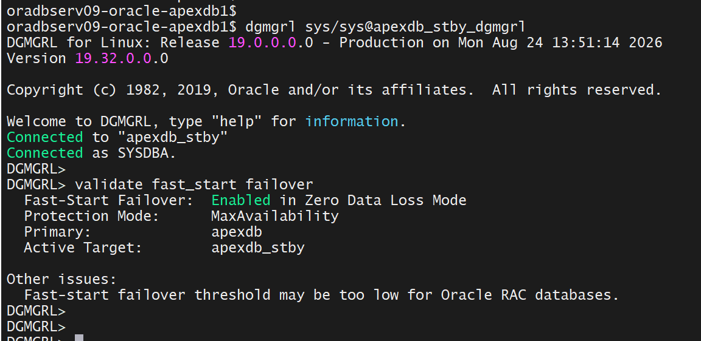

# Maintenance — Part 2: FINISH_PLAN, Troubleshooting, and the Pre-Flight Checklist

**SOP: 12.2.0.1 → 19c rolling upgrade of `apexdb`/`apexdb_stby` (2-node RAC + Data Guard, both clusters), on Oracle Linux 7**

Part 2 of 2. [Part 1](part1-dbms-rolling-plan-to-switchover.md) covers `INIT_PLAN` through `SWITCHOVER` — read that first if you're starting fresh; this page assumes `apexdb_stby` is already confirmed primary and `apexdb` is a logical standby, still on 12.2.0.1. This page covers the last step, `FINISH_PLAN`, and the real troubleshooting behind getting there — most of which a 60-second pre-flight check (§7 below) would have avoided.

Status: 🟩 Confirmed — `FINISH_PLAN` completed successfully; `apexdb` is now a physical standby of `apexdb_stby`, both on 19c. See §13 for a real gap found afterward: the plan's own tracked state outlived `FINISH_PLAN` and blocked unrelated work days later.

| # | Section | Status |
|---|---|---|
| 6 | The FINISH_PLAN prerequisite: remounting the former primary | 🟩 Confirmed (3 real failures fixed) |
| 7 | **Pre-flight checklist — run this before FINISH_PLAN** | reference — do this every time |
| 8 | FINISH_PLAN itself, and the ORA-45414 root cause | 🟩 Confirmed (2-part root cause) |
| 9 | Final confirmation and cleanup | 🟩 Confirmed |
| 10 | **Post-upgrade procedure — restoring normal operations** | 🟩 Confirmed (researched, real state shown) |
| 11 | Final validations manual | 🟩 Confirmed |
| 12 | Why this matters for an OCM-level DBA | reference |
| 13 | **Addendum — `DESTROY_PLAN` wasn't actually optional** | 🟩 Confirmed (manual fix verified live; Ansible step 0 not yet re-run end-to-end) |

---

## 6. 🟩 Confirmed — The FINISH_PLAN prerequisite: remounting the former primary

Oracle's own documentation (*Using DBMS_ROLLING to Perform a Rolling Upgrade*, 19c Data Guard Concepts and Administration, Table 14-2) is explicit that this is two separate steps, in order:

| Step | Description | PHASE |
|---|---|---|
| Step 4 | Manually restart the former primary and remaining standby databases on the higher version of Oracle Database. | FINISH PENDING |
| Step 5 | Call `DBMS_ROLLING.FINISH_PLAN` to convert the former primary to a physical standby. | FINISH |

> "You must manually restart and mount the former primary and remaining standby databases on the higher version of Oracle Database. Mounting the standby databases is especially important because the `DBMS_ROLLING` package needs to communicate with the standby database to continue the rolling upgrade."

In plain terms: `apexdb`'s 19.3.0 software was already installed on disk (a separate, earlier groundwork phase), but its CRS registration still pointed at the 12.2.0.1 home. Step 4 is stop → move the CRS registration → restart mounted on 19c. `FINISH_PLAN` itself can't do this remotely; it needs `apexdb` already reachable on the higher version first.

**Failure 1 — PRCT-1402 / PRKC-1137.** First attempt ran the CRS-home move with the *old* (12.2.0.1) `srvctl` binary:

```bash
srvctl modify database -db apexdb -oraclehome /u01/app/oracle/product/19.3.0/db_1
# PRCT-1402 : Attempt to retrieve version of SRVCTL from Oracle Home .../19.3.0/db_1/bin failed.
# PRKC-1137 : Unable to find Version object with string value 19.0.0.0.0
```
The old binary can't parse the new home's version-reporting format.

**Failure 2 — PRCD-1229.** Second attempt switched to the *new* home's `srvctl`, by analogy with an earlier, working CRS-home move done for `apexdb_stby`:

```bash
/u01/app/oracle/product/19.3.0/db_1/bin/srvctl modify database -db apexdb -oraclehome /u01/app/oracle/product/19.3.0/db_1
# PRCD-1229 : An attempt to access configuration of database apexdb was rejected because its
# version 12.2.0.1.0 differs from the program version 19.0.0.0.0. Instead run the program
# from /u01/app/oracle/product/12.2.0/db_1.
```
Root cause: `srvctl modify database -oraclehome` enforces that the *calling* program's version match the database's *currently registered* version — a check that can never pass when the entire point of the call is to change that registered version. No choice of binary fixes it; `modify` is the wrong subcommand for a cross-major-version move. The correct one, confirmed against Oracle's own SRVCTL reference and a real, independently-documented case of this exact error:

```bash
/u01/app/oracle/product/19.3.0/db_1/bin/srvctl upgrade database -db apexdb -oraclehome /u01/app/oracle/product/19.3.0/db_1
```
`srvctl upgrade database` exists specifically to move a database's CRS registration across a major version, and is invoked from the *target* home — this succeeded.

```bash
/u01/app/oracle/product/19.3.0/db_1/bin/srvctl config database -d apexdb
# Success -> already on 19c. PRCD-1229 -> still on the old home (message names it).
```

---

## 7. Pre-flight checklist — run this before FINISH_PLAN

**This is the part worth bookmarking.** Both real failures in §8 below trace back to configuration that's easy to check up front and easy to miss until `FINISH_PLAN` fails on it. Run all three, on the current primary (`apexdb_stby`) and on the former primary's new Oracle Home, *before* calling `FINISH_PLAN` — not after it fails.

**1. Is the standby-facing archive destination deferred?** On the current primary, after any switchover, whichever `LOG_ARCHIVE_DEST_n` targets the former primary can be left `DEFERRED`. `FINISH_PLAN` needs a live two-way connection between the two databases, not just one-way reachability — a deferred destination blocks its own return leg.

```sql
SELECT dest_id, destination, status, target FROM v$archive_dest WHERE target = 'STANDBY';
-- STATUS should be VALID/ENABLE, not DEFERRED
```
If it's deferred:
```sql
ALTER SYSTEM SET LOG_ARCHIVE_DEST_STATE_<n>=ENABLE SCOPE=BOTH;
```

**2. Does `LOG_ARCHIVE_DEST_n` actually point at the right place?**

```sql
SHOW PARAMETER log_archive_dest_2
SHOW PARAMETER log_archive_config
-- log_archive_config should list BOTH db_unique_names, e.g. dg_config=(apexdb,apexdb_stby)
```

**3. Does the target Oracle Home's `network/admin` actually have the TNS entries it needs?** If the former primary is starting under a freshly-installed Oracle Home for the first time (true here — the 19c home was installed well before this upgrade, but `apexdb`'s instance never actually ran under it until this step), its `network/admin` may simply be empty. A fresh software install does not carry over another home's `tnsnames.ora`/`listener.ora`.

```bash
cat $NEW_ORACLE_HOME/network/admin/tnsnames.ora
```

**A trap worth knowing about while checking #3:** manually exporting `ORACLE_HOME` in an existing shell does **not** move `TNS_ADMIN` with it. Every interactive connectivity test run during this troubleshooting (`tnsping`, `sqlplus sys@alias`) kept resolving through the *old* home's `sqlnet.ora` regardless of which `ORACLE_HOME` had been exported, because `TNS_ADMIN` was inherited from the login shell and never independently reset — every one of those tests looked reassuring and was actually validating the wrong file. The only reliable check is reading the target home's `network/admin` directly, as above — not a connection test run from an ordinary shell.

---

## 8. 🟩 Confirmed — FINISH_PLAN itself, and the ORA-45414 root cause

```bash
ansible-playbook dbms-rolling-execute.yml --tags rolling_finish
```

First real attempt, after `apexdb` was confirmed mounted on 19c:

```sql
EXECUTE DBMS_ROLLING.FINISH_PLAN();
-- ERROR at line 1:
-- ORA-45414: could not connect to a remote database
-- ORA-06512: at "SYS.DBMS_ROLLING", line 36
```

`DBA_ROLLING_EVENTS` on `apexdb_stby` (queryable there, not on `apexdb`, which is intentionally mounted-only at this point) told the real story in order:

```
opened outbound connection to apexdb          -- 0, success
initialized outbound agent for apexdb         -- 0, success
failed to open inbound connection from apexdb -- 45414, the actual failure
DBMS_ROLLING.FINISH_PLAN halted due to error  -- 45414
```

`apexdb_stby`'s outbound leg to `apexdb` worked. `apexdb`'s own return leg back failed — exactly the two-part root cause the checklist above exists to catch:

1. `v$archive_dest` on `apexdb_stby` showed the standby-facing destination (`apexdb_dgmgrl`, `TARGET=STANDBY`) as `STATUS=DEFERRED`.
2. `apexdb`'s new Oracle Home had no `tnsnames.ora` at all:

```
$ cat /u01/app/oracle/product/19.3.0/db_1/network/admin/tnsnames.ora
cat: /u01/app/oracle/product/19.3.0/db_1/network/admin/tnsnames.ora: No such file or directory
```
(confirmed on both `oradbserv05` and `oradbserv06` — not a one-node fluke)

**Fixes:**
- Enabling the deferred destination was automated: a task that self-discovers any `STANDBY`-target destination left `DEFERRED` (not hardcoded to a specific `dest_id`, since that number isn't guaranteed stable) and re-enables it via dynamic PL/SQL, followed by a verification query that fails loudly if anything's still deferred.
- The missing `tnsnames.ora` was copied over from the old home's `network/admin` into the new home's, on both `apexdb` nodes.

**Retry — succeeded:**

```
2026-08-22 23:29:27,313 p=5165 u=sysadmin n=ansible | TASK [dbms_rolling_upgrade : Show apexdb MOUNTED/version check output] *********************************************************************
2026-08-22 23:29:27,347 p=5165 u=sysadmin n=ansible | ok: [oradbserv05] => 
  rolling_finish_check_mounted_result.stdout_lines:
  - ''
  - '   INST_ID INSTANCE_NAME   STATUS       VERSION'
  - '---------- --------------- ------------ ---------------'
  - '         1 apexdb1         MOUNTED      19.0.0.0.0'
  - '         2 apexdb2         MOUNTED      19.0.0.0.0'
2026-08-22 23:29:27,350 p=5165 u=sysadmin n=ansible | TASK [dbms_rolling_upgrade : Fail loudly if apexdb isn't showing MOUNTED and 19c — FINISH_PLAN needs it mounted on the higher version first] ***
```

```sql
EXECUTE DBMS_ROLLING.FINISH_PLAN();
-- PL/SQL procedure successfully completed.
-- Elapsed: 00:02:19.66
```

```
2026-08-22 23:29:33,808 p=5165 u=sysadmin n=ansible | TASK [dbms_rolling_upgrade : Write SQL script: DBMS_ROLLING.FINISH_PLAN] *******************************************************************
2026-08-22 23:29:34,523 p=5165 u=sysadmin n=ansible | ok: [oradbserv05 -> oradbserv09(192.168.56.184)]
2026-08-22 23:29:34,526 p=5165 u=sysadmin n=ansible | TASK [dbms_rolling_upgrade : Run: DBMS_ROLLING.FINISH_PLAN — finalizes the rolling upgrade] ************************************************
2026-08-22 23:32:08,840 p=5165 u=sysadmin n=ansible | changed: [oradbserv05 -> oradbserv09(192.168.56.184)]
2026-08-22 23:32:08,844 p=5165 u=sysadmin n=ansible | TASK [dbms_rolling_upgrade : Show DBMS_ROLLING.FINISH_PLAN output] *************************************************************************
2026-08-22 23:32:08,882 p=5165 u=sysadmin n=ansible | ok: [oradbserv05] => 
  rolling_finish_result.stdout_lines:
  - ''
  - 'SQL*Plus: Release 19.0.0.0.0 - Production on Sat Aug 22 23:29:35 2026'
  - Version 19.32.0.0.0
  - ''
  - Copyright (c) 1982, 2026, Oracle.  All rights reserved.
  - ''
  - ''
  - 'Connected to:'
  - Oracle Database 19c Enterprise Edition Release 19.0.0.0.0 - Production
  - Version 19.32.0.0.0
  - ''
  - SQL> set heading on
  - SQL> set feedback on
  - SQL> set tab off
  - SQL> set timing on
  - SQL> EXECUTE DBMS_ROLLING.FINISH_PLAN();
  - ''
  - PL/SQL procedure successfully completed.
  - ''
  - 'Elapsed: 00:02:19.66'
  - SQL> exit;
  - Disconnected from Oracle Database 19c Enterprise Edition Release 19.0.0.0.0 - Production
  - Version 19.32.0.0.0
2026-08-22 23:32:08,885 p=5165 u=sysadmin n=ansible | TASK [dbms_rolling_upgrade : Fail loudly if DBMS_ROLLING.FINISH_PLAN looks like it failed (rc != 0 or ORA- in output) — verify against the real output above regardless] ***

```

## 9. 🟩 Confirmed — Final confirmation and cleanup

Not trusting the "successfully completed" message alone — the actual roles, checked directly:

```
2026-08-22 23:32:08,917 p=5165 u=sysadmin n=ansible | skipping: [oradbserv05]
2026-08-22 23:32:08,920 p=5165 u=sysadmin n=ansible | TASK [dbms_rolling_upgrade : Write SQL script: confirm apexdb is now a PHYSICAL STANDBY after FINISH_PLAN (GV$INSTANCE + GV$DATABASE)] *****
2026-08-22 23:32:09,943 p=5165 u=sysadmin n=ansible | changed: [oradbserv05]
2026-08-22 23:32:09,946 p=5165 u=sysadmin n=ansible | TASK [dbms_rolling_upgrade : Check apexdb's role after FINISH_PLAN] ************************************************************************
2026-08-22 23:32:10,404 p=5165 u=sysadmin n=ansible | ok: [oradbserv05]
2026-08-22 23:32:10,406 p=5165 u=sysadmin n=ansible | TASK [dbms_rolling_upgrade : Show apexdb's role after FINISH_PLAN (expect PHYSICAL STANDBY)] ***********************************************
2026-08-22 23:32:10,442 p=5165 u=sysadmin n=ansible | ok: [oradbserv05] => 
  rolling_finish_post_check_apexdb.stdout_lines:
  - ''
  - '   INST_ID INSTANCE_NAME   HOST_NAME            STATUS       DATABASE_ROLE      OPEN_MODE'
  - '---------- --------------- -------------------- ------------ ------------------ ------------------'
  - '         1 apexdb1         oradbserv05.usat.com MOUNTED      PHYSICAL STANDBY   MOUNTED'
  - '         2 apexdb2         oradbserv06.usat.com MOUNTED      PHYSICAL STANDBY   MOUNTED'
2026-08-22 23:32:10,445 p=5165 u=sysadmin n=ansible | TASK [dbms_rolling_upgrade : Fail loudly if apexdb is not reporting PHYSICAL STANDBY after FINISH_PLAN] ************************************
2026-08-22 23:32:10,473 p=5165 u=sysadmin n=ansible | skipping: [oradbserv05]
2026-08-22 23:32:10,476 p=5165 u=sysadmin n=ansible | TASK [dbms_rolling_upgrade : Write SQL script: confirm apexdb_stby is still PRIMARY after FINISH_PLAN (sanity check)] **********************
2026-08-22 23:32:11,320 p=5165 u=sysadmin n=ansible | changed: [oradbserv05 -> oradbserv09(192.168.56.184)]
2026-08-22 23:32:11,323 p=5165 u=sysadmin n=ansible | TASK [dbms_rolling_upgrade : Check apexdb_stby's role after FINISH_PLAN] *******************************************************************
2026-08-22 23:32:11,927 p=5165 u=sysadmin n=ansible | ok: [oradbserv05 -> oradbserv09(192.168.56.184)]
2026-08-22 23:32:11,930 p=5165 u=sysadmin n=ansible | TASK [dbms_rolling_upgrade : Show apexdb_stby's role after FINISH_PLAN (expect still PRIMARY)] *********************************************
2026-08-22 23:32:12,005 p=5165 u=sysadmin n=ansible | ok: [oradbserv05] => 
  rolling_finish_post_check_stby.stdout_lines:
  - ''
  - '   INST_ID OPEN_MODE          DATABASE_ROLE'
  - '---------- ------------------ ------------------'
  - '         1 READ WRITE         PRIMARY'
  - '         2 READ WRITE         PRIMARY'
2026-08-22 23:32:12,008 p=5165 u=sysadmin n=ansible | TASK [dbms_rolling_upgrade : Fail loudly if apexdb_stby is not reporting PRIMARY after FINISH_PLAN — something changed roles unexpectedly] ***
2026-08-22 23:32:12,037 p=5165 u=sysadmin n=ansible | skipping: [oradbserv05]
```

The 12.2.0.1 → 19c rolling upgrade is complete: `apexdb_stby` is primary, `apexdb` is a physical standby, both on 19.32.0.0.0 — confirmed with zero required downtime for anything reading/writing against the pair throughout (the only unavailability was `apexdb` itself while it was down for its own CRS-home move, and it was never serving as primary during that window).

`oracle`'s `.bash_profile` `DB_HOME` was then updated to the 19c home on all four nodes (`oradbserv05/06/09/10`), with a backup of each original file kept alongside it. Already-open shells need `. ~/.bash_profile` or a fresh login to pick it up.

**Originally left undone on purpose, revised in §13:** `DBMS_ROLLING.DESTROY_PLAN` (purges this plan's tracked state) was treated here as a manual, human-triggered cleanup step with no real deadline — reasonable-sounding at the time, since `FINISH_PLAN` completing doesn't itself require it. That assessment turned out to be wrong: see §13 for the real evidence that something else genuinely needed it, and why it's now step 0 of `roles/rolling_postupgrade`, run automatically before the switchback rather than left to a human's discretion. The AutoUpgrade-created guaranteed restore point on `apexdb_stby` (`DROP RESTORE POINT ...`) remains a deliberate manual decision — nothing has surfaced a similar forcing function for it.

## 10. Post-upgrade procedure — restoring normal operations

`FINISH_PLAN` finishes the *rolling upgrade*; it doesn't restore this pair to how this project normally runs it. Confirmed live, right after `FINISH_PLAN` completed:

```
SQL> select name,open_mode,database_role from v$database;
NAME      OPEN_MODE            DATABASE_ROLE
--------- -------------------- ----------------
APEXDB    MOUNTED              PHYSICAL STANDBY

$ srvctl config database -d apexdb -verbose
...
Start options: mount
Management policy: MANUAL
...
```
```
$ srvctl config database -d apexdb -verbose
Database unique name: apexdb
Database name: apexdb
Oracle home: /u01/app/oracle/product/19.3.0/db_1
Oracle user: oracle
Spfile: +DATA01/APEXDB/PARAMETERFILE/spfile.273.1241123699
Password file: +DATA01/APEXDB/PASSWORD/pwdapexdb.261.1241123369
Domain:
Start options: mount
Stop options: immediate
Database role: PHYSICAL_STANDBY
Management policy: MANUAL
Server pools:
Disk Groups: RECO01,DATA01
Mount point paths:
Services: apexdb_ro,apexdb_rw
Type: RAC
Start concurrency:
Stop concurrency:
OSDBA group: dba
OSOPER group: oper
Database instances: apexdb1,apexdb2
Configured nodes: oradbserv05,oradbserv06
CSS critical: no
CPU count: 0
Memory target: 0
Maximum memory: 0
Default network number for database services:
Database is administrator managed
oradbserv05-oracle-apexdb1$
```

`apexdb` sitting `MOUNTED` with `Management policy: MANUAL` is expected, not a problem — that's exactly the state the `rolling_finish` remount work (§6) deliberately put it in, and it matches Oracle's own whitepaper on this procedure (*Automated Database Upgrades using Oracle Active Data Guard and DBMS_ROLLING*, Dec 2017), whose own walkthrough ends its last numbered step the same way:


11. Primary is mounted with apply running

```
SQL> col host_name for a24
SQL> set linesize 150
SQL> SELECT d.NAME,
       i.INSTANCE_NAME,
       i.HOST_NAME,
       i.STATUS,
       d.OPEN_MODE,
       i.DATABASE_STATUS
FROM   gv$instance i
JOIN   gv$database d ON i.INST_ID = d.INST_ID; 

NAME      INSTANCE_NAME    HOST_NAME                STATUS       OPEN_MODE            DATABASE_STATUS
--------- ---------------- ------------------------ ------------ -------------------- -----------------
APEXDB    apexdb1          oradbserv05.usat.com     MOUNTED      MOUNTED              ACTIVE
APEXDB    apexdb2          oradbserv06.usat.com     MOUNTED      MOUNTED              ACTIVE

SQL>


SQL> set linesize 200
SQL> col open_mode for a10
SQL> col database_status for a6
SQL> SELECT d.NAME,
     i.INSTANCE_NAME,
     i.HOST_NAME,
     i.STATUS,
     d.OPEN_MODE,
     i.DATABASE_STATUS,
     m.THREAD#,
     m.PROCESS,
     m.STATUS AS PROCESS_STATUS,
     m.SEQUENCE#,
     m.BLOCK#
     FROM   gv$instance i
     JOIN   gv$database d ON i.INST_ID = d.INST_ID
     LEFT JOIN gv$managed_standby m
     ON i.INST_ID = m.INST_ID
     AND m.PROCESS LIKE 'MRP%'
      ORDER BY m.THREAD#;

NAME      INSTANCE_NAME    HOST_NAME                STATUS       OPEN_MODE  DATABA    THREAD# PROCESS   PROCESS_STAT  SEQUENCE#     BLOCK#
--------- ---------------- ------------------------ ------------ ---------- ------ ---------- --------- ------------ ---------- ----------
APEXDB    apexdb1          oradbserv05.usat.com     MOUNTED      MOUNTED    ACTIVE          2 MRP0      APPLYING_LOG         37      47991
APEXDB    apexdb2          oradbserv06.usat.com     MOUNTED      MOUNTED    ACTIVE

SQL>

```

**Worth being precise about:** Oracle's own DBMS_ROLLING documentation and whitepaper stop exactly there — `MOUNTED` with apply running is a complete, correct end state as far as `DBMS_ROLLING` itself is concerned. Everything below this point is *this project's own* operational standard (this pair has always run Active Data Guard, role-based services, and Fast-Start Failover — see [high-availability](../high-availability/README.md)), not something `FINISH_PLAN` or Oracle's docs require. Seven real steps (an eventual step 0 included — see §13), verified against Oracle's own documentation and this project's established conventions rather than assumed:

**0. Destroy the completed `DBMS_ROLLING` plan, if one is still registered.** Added after the fact — this wasn't part of the original post-upgrade procedure; §13 explains why it had to become one:

```sql
EXEC DBMS_ROLLING.DESTROY_PLAN;
```

**1. Disable supplemental logging.** The one genuinely required cleanup step Oracle's own whitepaper documents by name — `DBMS_ROLLING` enables supplemental logging for the logical-standby phase and leaves it on; it doesn't turn itself off:

```sql
ALTER DATABASE ADD SUPPLEMENTAL LOG DATA (PRIMARY KEY) COLUMNS;
ALTER DATABASE ADD SUPPLEMENTAL LOG DATA (UNIQUE) COLUMNS;
ALTER DATABASE DROP SUPPLEMENTAL LOG DATA (PRIMARY KEY) COLUMNS;
ALTER DATABASE DROP SUPPLEMENTAL LOG DATA (UNIQUE) COLUMNS;
ALTER DATABASE DROP SUPPLEMENTAL LOG DATA;
```
(The ADD-then-DROP pairing is the whitepaper's own idiom — it guarantees something is actually enabled to drop, rather than risking an error dropping a logging level that was never on.)

**2. Reset the CRS management policy back to AUTOMATIC**, on `apexdb` (undoing `rolling_finish`'s own deliberate `MOUNT`/`MANUAL` override — needed during `FINISH_PLAN`'s multi-hour wait, not needed anymore) and confirmed on `apexdb_stby` too:

```bash
srvctl modify database -db apexdb -policy automatic
srvctl modify database -db apexdb_stby -policy automatic
```

**3. Open `apexdb` read-only with Redo Apply running** — Active Data Guard, matching how `apexdb_stby` has run since [high-availability Part 1](../high-availability/part1-active-data-guard.md), not a `DBMS_ROLLING` requirement:

```sql
ALTER DATABASE OPEN READ ONLY;
ALTER DATABASE RECOVER MANAGED STANDBY DATABASE USING CURRENT LOGFILE DISCONNECT;
```

**4. Test it — a few log switches, confirm applied**, exactly as asked:

```sql
-- On apexdb_stby (primary)
ALTER SYSTEM SWITCH LOGFILE;

-- On apexdb (standby), repeat a couple of times, confirm sequence# advancing and APPLIED=YES
SELECT sequence#, applied FROM v$archived_log ORDER BY sequence# DESC FETCH FIRST 5 ROWS ONLY;
```

**5. Check role-based services.** `apexdb_rw` belongs on the current primary (`apexdb_stby`), `apexdb_ro` on the current standby (`apexdb`) — same convention as [high-availability Part 1 §13](../high-availability/part1-active-data-guard.md):

```bash
srvctl status service -d apexdb_stby
srvctl status service -d apexdb
```

**6. Re-enable Fast-Start Failover.** This project's own convention (`group_vars/all.yml`) states plainly that FSFO had to be fully disabled before `DBMS_ROLLING.BUILD_PLAN` — "the broker rejects any attempt to even ENABLE fast-start failover while a rolling upgrade is in progress." Now that the upgrade is done, re-enable it the same way [high-availability Part 2](../high-availability/part2-broker-fsfo-observer.md) originally did:

```
DGMGRL> enable fast_start failover;
DGMGRL> show fast_start failover;
DGMGRL> show observers;
```

**Automated as of this writing.** The six steps above are now real Ansible — `roles/rolling_postupgrade`, run via a new top-level playbook:

```bash
ansible-playbook rolling-postupgrade.yml --tags rolling_postupgrade -e sys_password='...'
```

Only one `-e` override is required — `sys_password`, which gates the switchback's DGMGRL `CONNECT` in play 1. Play 2 (FSFO re-enable) and play 3 (RMAN backup) need no password at all: play 2 is wallet-based throughout (`/@apexdb_DGMGRL`), matching `manage_observer.sh`'s own design — see below — and play 3's RMAN connects OS-authenticated (`target /`).

Three plays, in this order, deliberately:

1. **`rac_node1` (`roles/rolling_postupgrade`)** — steps 0-5 against `rac_node1` (delegate_to per database, same pattern as `dbms_rolling_upgrade` itself): destroy any still-registered `DBMS_ROLLING` plan (§13), disable supplemental logging, reset management policy, open `apexdb` read-only with apply, log-switch test, then the actual role flip back to `apexdb`=PRIMARY (reuses `dataguard_switchover_test` unmodified), then re-normalizes `apexdb_stby` the same way once it's standby again.
2. **`observer_nodes` (`roles/rolling_postupgrade_fsfo`)** — re-enables FSFO and the observer against `oemserver01`.
3. **`rac_node1` again (`roles/rolling_postupgrade_backup`)** — the RMAN Level 0 backup of `apexdb_stby`, taken from the standby to keep the I/O off the primary, to `/media/sf_rman_backups/apexdb1` — compressed backupset, controlfile autobackup on, backup optimization on, `PLUS ARCHIVELOG` without deleting input (a physical standby's archivelogs aren't this job's call to purge), and a `CROSSCHECK` + `RESTORE DATABASE VALIDATE` pass so the backup is verified, not just taken.

The backup runs **last, after FSFO re-enable**, not as the tail end of play 1 — deliberately, so the baseline backup is taken once the whole HA configuration (role switchback *and* Fast-Start Failover *and* the observer) is confirmed back to normal, not mid-sequence while FSFO is still down. That's also why it's a separate role/play rather than just reordered within `rolling_postupgrade`: a single Ansible play's `hosts:` target can't change mid-play, so getting `rac_node1` work to run, then `observer_nodes` work, then more `rac_node1` work, in that order, needs three plays, not two. Narrower tags (`rolling_postupgrade_normalize`, `rolling_postupgrade_switchback`, `rolling_postupgrade_renormalize`, `rolling_postupgrade_fsfo`, `rolling_postupgrade_backup`) are available if only part of this needs to run.

**Real issues hit on the first live run, all fixed:**

- **The switchback silently ran zero tasks.** `dataguard_switchover_test` was originally reused via `include_role` with `tags:` on the include — which, for a *dynamic* include, only governs whether the include itself is entered, not whether its own (untagged) child tasks match `--tags rolling_postupgrade`. No error, no warning: the include was entered, matched nothing inside it, and the play moved straight to re-normalizing `apexdb_stby` as if the switchback had already happened. It hadn't — `apexdb_stby` was still PRIMARY, which surfaced as `ORA-01665: control file is not a standby control file` when the next step tried to start managed recovery against it. Fixed with Ansible's own documented mechanism for this: an `apply:` block on the include, forwarding the tags into the child role for real.
- **Added a `database_role` guard** to both the pre- and post-switchback state checks (steps 3 and 6) — they previously only checked `open_mode` and apply status, never role, so nothing would have stopped either step from attempting standby recovery against a database that was still a primary. Now fails with a clear message naming the actual role found, instead of surfacing as a bare ORA- error.
- **FSFO re-enable rebuilt to call `manage_observer.sh` directly**, rather than reusing `dataguard_fsfo` wholesale. `manage_observer.sh start` is tested, trusted operational knowledge — confirmed by hand that it does the whole job on its own, both re-enabling Fast-Start Failover and starting the observer; `roles/rolling_postupgrade_fsfo` does not issue any separate `enable fast_start failover;` call, deliberately, to avoid redundant/racing DGMGRL calls against what the script already does internally. (This repo's own checked-in copy of the script, `high-availability/scripts/montor_manage_observer.sh`, shows `start_observer()` with only a bare `START OBSERVER` call and no enable step — evidently stale relative to what's actually deployed and tested on oemserver01; the real, live script is the source of truth here, not the repo copy.) The role's own job is read-only preflight before the script runs, then read-only verification strictly after it — `SHOW CONFIGURATION`, `SHOW FAST_START FAILOVER`, and `SHOW OBSERVERS` via DGMGRL, confirming the real end state rather than trusting the script's exit code.
- **The preflight guard before normalization was too strict.** It required `apexdb` to read back exactly `PHYSICAL STANDBY|MOUNTED` before proceeding — but on the actual first real run, `apexdb` was already `PHYSICAL STANDBY|READ ONLY WITH APPLY` (a perfectly valid starting point; step 3's own open/apply tasks are already idempotent and handle that state fine). The guard only needed to check `database_role`, not `open_mode` — fixed to do just that.
- **RMAN-05021 on `CONFIGURE RETENTION POLICY`.** Oracle does not allow that `CONFIGURE` (or `CONFIGURE EXCLUDE` / `ENCRYPTION` / `DB_UNIQUE_NAME`) to be changed except when connected to the PRIMARY with a CURRENT/CREATED controlfile — never a standby. Since this backup deliberately connects to `apexdb_stby`, that line always failed and stopped the whole RMAN script before the actual backup ran. Removed it from the standby-side script; retention now defaults to Oracle's own REDUNDANCY 1 for backups taken this way. To get REDUNDANCY 2 for real, it has to be set once by hand against `apexdb` (the primary) — a controlfile-wide setting Data Guard keeps in sync, so it'd apply to standby-side backups too. Not automated — documented as a deliberate gap in `group_vars/all.yml` and the role's own header instead.
- **A blanket `search('RMAN-0')` false-failed the backup task on a benign warning.** `RMAN-06820: warning: failed to archive current log at primary database` fires routinely on `BACKUP ... PLUS ARCHIVELOG` from the standby side (RMAN tries to reach back to the primary to force-archive its current online log; when it can't, it just warns and backs up what it already has) — the backup itself completed for real (both L0 datafile sets, all archivelog sets, controlfile autobackup, `CROSSCHECK`, `LIST BACKUP SUMMARY`, and `RESTORE DATABASE VALIDATE` all finished with `Finished restore at` present), yet the task still failed on that one warning line. Fixed to check for RMAN's own real error-stack banner (`ERROR MESSAGE STACK FOLLOWS`) instead of a bare substring — genuine errors are always wrapped in it, benign warnings never are.
- **`rman_backup_base_dir` pointed at the wrong mount path.** It was `/media/sf_hrman/rman_backups`, assuming an intermediate `sf_hrman` shared folder — the real VirtualBox shared folder is named `rman_backups` and automounts directly as `/media/sf_rman_backups`. Corrected in `group_vars/all.yml`.

**Run for real against the lab, evidence confirmed in each case:** the switchback (play 1) completed and re-normalized both databases as expected; FSFO re-enable (play 2) confirmed `Fast-Start Failover: Enabled in Zero Data Loss Mode` and the observer registered, via `manage_observer.sh start` alone; the RMAN Level 0 backup (play 3) completed and validated after the three fixes above. Real terminal output for each was reviewed in the moment rather than archived into this file verbatim — `logs/ansible.log` on the control node has the full record of every run if it's needed again.


**On AutoUpgrade `-mode postfixups`:** checked against Oracle's own AutoUpgrade documentation before recommending it either way — `postfixups` mode exists to run post-upgrade fixups *separately*, specifically when AutoUpgrade was **not** run in `deploy` mode, or when Replay Upgrade was used. Neither applies here: `rolling_autoupgrade` (Part 1 §5) already ran a full `-mode deploy`, confirmed `rc: 0` in the real captured output. Fixups are part of what `deploy` mode already does. Running `postfixups` again isn't expected to be necessary — worth confirming against the AutoUpgrade job's own summary/log before spending time on it, rather than running it defensively on the assumption it's required.

`DBMS_ROLLING.DESTROY_PLAN` is no longer in that "separate, deliberate, human-triggered" category — see §9's revision and §13 below for why. Dropping the AutoUpgrade guaranteed restore point remains one.

## 11. Final validations manual

Validate the Fast_Start.

```
oradbserv09-oracle-apexdb1$ dgmgrl sys@apexdb_stby_dgmgrl
DGMGRL for Linux: Release 19.0.0.0.0 - Production on Mon Aug 24 13:51:14 2026
Version 19.32.0.0.0

Copyright (c) 1982, 2019, Oracle and/or its affiliates.  All rights reserved.

Welcome to DGMGRL, type "help" for information.
Connected to "apexdb_stby"
Connected as SYSDBA.
DGMGRL>
DGMGRL> validate fast_start failover
  Fast-Start Failover:  Enabled in Zero Data Loss Mode
  Protection Mode:      MaxAvailability
  Primary:              apexdb
  Active Target:        apexdb_stby

Other issues:
  Fast-start failover threshold may be too low for Oracle RAC databases.
DGMGRL>
DGMGRL>
DGMGRL> VALIDATE DATABASE verbose apexdb
DGMGRL> VALIDATE DATABASE verbose apexdb_stby
DGMGRL> VALIDATE NETWORK CONFIGURATION FOR ALL
```



Standby Apply Status:

```
SQL> col host_name for a22
SQL> set linesize 200
SQL> col open_mode for a10
SQL> col database_status for a6
SQL> SELECT d.NAME,
     i.INSTANCE_NAME,
     i.HOST_NAME,
     i.STATUS,
     d.OPEN_MODE,
     i.DATABASE_STATUS,
     m.THREAD#,
     m.PROCESS,
     m.STATUS AS PROCESS_STATUS,
     m.SEQUENCE#,
     m.BLOCK#
     FROM   gv$instance i
	JOIN   gv$database d ON i.INST_ID = d.INST_ID
	LEFT JOIN gv$managed_standby m
	ON i.INST_ID = m.INST_ID
	AND m.PROCESS LIKE 'MRP%'
	ORDER BY m.THREAD#;

  NAME      INSTANCE_NAME    HOST_NAME              STATUS       OPEN_MODE  DATABA    THREAD# PROCESS   PROCESS_STAT  SEQUENCE#     BLOCK#
  --------- ---------------- ---------------------- ------------ ---------- ------ ---------- --------- ------------ ---------- ----------
  APEXDB    apexdb1          oradbserv09.usat.com   OPEN         READ ONLY  ACTIVE          2 MRP0      APPLYING_LOG         58       7184
                                                                 WITH APPLY
  
  APEXDB    apexdb2          oradbserv10.usat.com   OPEN         READ ONLY  ACTIVE
                                                               WITH APPLY
```													

```
oradbserv05-oracle-apexdb1$ srvctl config database -d apexdb -verbose
Database unique name: apexdb
Database name: apexdb
Oracle home: /u01/app/oracle/product/19.3.0/db_1
Oracle user: oracle
Spfile: +DATA01/APEXDB/PARAMETERFILE/spfile.273.1241123699
Password file: +DATA01/APEXDB/PASSWORD/pwdapexdb.261.1241123369
Domain:
Start options: open
Stop options: immediate
Database role: PRIMARY
Management policy: AUTOMATIC
Server pools:
Disk Groups: RECO01,DATA01
Mount point paths:
Services: apexdb_ro,apexdb_rw
Type: RAC
Start concurrency:
Stop concurrency:
OSDBA group: dba
OSOPER group: oper
Database instances: apexdb1,apexdb2
Configured nodes: oradbserv05,oradbserv06
CSS critical: no
CPU count: 0
Memory target: 0
Maximum memory: 0
Default network number for database services:
Database is administrator managed
```

```
oradbserv09-oracle-apexdb1$  srvctl config database -d apexdb_stby -verbose
Database unique name: apexdb_stby
Database name: apexdb
Oracle home: /u01/app/oracle/product/19.3.0/db_1
Oracle user: oracle
Spfile: +DATA01/APEXDB_STBY/PARAMETERFILE/spfile.280.1241983331
Password file: +DATA01/apexdb_stby/PASSWORD/pwdapexdb_stby
Domain:
Start options: read only
Stop options: immediate
Database role: PHYSICAL_STANDBY
Management policy: AUTOMATIC
Server pools:
Disk Groups: DATA01,RECO01
Mount point paths:
Services: apexdb_ro,apexdb_rw
Type: RAC
Start concurrency:
Stop concurrency:
OSDBA group: dba
OSOPER group: oper
Database instances: apexdb1,apexdb2
Configured nodes: oradbserv09,oradbserv10
CSS critical: no
CPU count: 0
Memory target: 0
Maximum memory: 0
Default network number for database services:
Database is administrator managed
oradbserv09-oracle-apexdb1$
```

## 12. Why this matters for an OCM-level DBA

Anyone can follow a checklist when nothing goes wrong. What actually separates OCM-level troubleshooting from guesswork here: every fix in this page traces to a *specific, checked* piece of evidence — a real error code looked up against Oracle's own reference, a dictionary view queried before concluding what state something was actually in, a file read directly instead of trusting an indirect test. The `TNS_ADMIN`-doesn't-follow-`ORACLE_HOME` trap in particular is the kind of thing that costs hours precisely because every individual test *looks* like it passed. Rolling upgrades, resumability, and CRS-registration mechanics are squarely on the OCM practical blueprint's database/network configuration and high-availability areas — and a hiring manager reading this gets to see the actual debugging trail, not just the final green checkmark.

## 13. 🟩 Addendum — `DESTROY_PLAN` wasn't actually optional

Written up days after §9/§10 above, once real evidence forced a revision of a call made in good faith at the time.

**What happened.** Standing up the NestWise application schema against this same database — completely unrelated to Data Guard or rolling upgrades on the surface — `ORDS.ENABLE_SCHEMA` failed:

```sql
BEGIN
    ORDS.ENABLE_SCHEMA(...);
END;
/
-- ERROR at line 1:
-- ORA-20011: Data Guard rolling upgrade is currently running. Please try again later.
-- ORA-06512: at "ORDS_METADATA.ORDS", line 183
-- ORA-06512: at "ORDS_METADATA.ORDS_SECURITY_INTERNAL", line 206
```

The upgrade had genuinely finished two days earlier — `dba_rolling_status` showed `STATUS=READY`, `PHASE=DONE`, and `dba_rolling_events` recorded `DBMS_ROLLING.FINISH_PLAN completed` as its last real event. Nothing was mid-switchover. The error message is misleading taken at face value.

**Root cause, confirmed against Oracle's own docs, not guessed:** *Using DBMS_ROLLING to Perform a Rolling Upgrade* states plainly that "plan parameters are persisted in the database until you call the `DESTROY_PLAN` procedure to remove all states related to the rolling upgrade." `FINISH_PLAN` finishing the upgrade and `DESTROY_PLAN` purging its bookkeeping are two separate, sequential steps — §9 originally deferred the second one indefinitely on the theory that nothing depended on it. Something did: `ORDS_METADATA.ORDS_SECURITY_INTERNAL` checks for *any* persisted rolling-upgrade plan record before letting schema-metadata operations proceed, regardless of that plan's actual `STATUS`/`PHASE`.

**The fix — confirmed working:**

```sql
EXEC DBMS_ROLLING.DESTROY_PLAN;
```

`DESTROY_PLAN` takes no parameters and is the documented cleanup call for a plan that's already finished — safe to run any time after `FINISH_PLAN` has completed, which is exactly the state this pair has been in since §9. Confirmed, real output:

```sql
SQL> EXEC DBMS_ROLLING.DESTROY_PLAN;
PL/SQL procedure successfully completed.
SQL> SELECT * FROM dba_rolling_status;
no rows selected
```

Empty `dba_rolling_status` is the actual proof this worked — not the "successfully completed" message alone, same non-trusting-the-happy-message discipline as §9's own role/state checks.

**What changed as a result:**

- `roles/rolling_postupgrade/tasks/main.yml` gained a new step 0 (tag `rolling_postupgrade_destroy_plan`): check `dba_rolling_status` for a still-registered plan, and if one's there, destroy it — before supplemental-logging normalization, before the switchback, before anything else in that role touches these databases again. Check-then-act, same idiom as the role's other idempotent steps, so re-running it against an already-cleaned-up database is a no-op, not an error.
- §9 above no longer describes `DESTROY_PLAN` as an indefinitely-deferred manual decision.
- `nestwise-app/docs/install.md` step 1 carries a matching troubleshooting note (this exact `ORA-20011`, plus the related `ORA-06598` INHERIT PRIVILEGES issue hit in the same session) for anyone hitting this from the NestWise side rather than the maintenance side.

**Not yet re-verified end-to-end:** the fix above was applied manually, once, directly against the live database (this upgrade cycle's `rolling_postupgrade` Ansible run had already completed before this was discovered, so the new step 0 didn't get to run for it). The role change itself hasn't been exercised by an actual Ansible run yet — worth doing on the next rolling upgrade this project performs, rather than assumed correct off the code alone.

**Why this matters for an OCM-level DBA:** a "finished" Data Guard operation and a "fully cleaned up" one are not the same state, and Oracle's own object model treats that distinction as meaningful — enough that unrelated PL/SQL, written by an entirely different team (ORDS), checks for it. Deferring a documented cleanup step because "nothing needs it yet" is a reasonable call under uncertainty, but it's a call that has to be revisited the moment new evidence shows up, not defended after the fact. That's the difference between a checklist followed once and an operational standard that actually holds up.

---

Back to **[Part 1 — INIT_PLAN through SWITCHOVER](part1-dbms-rolling-plan-to-switchover.md)**.
