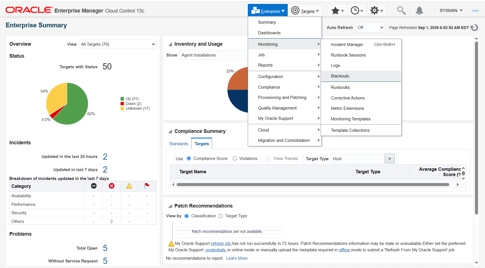
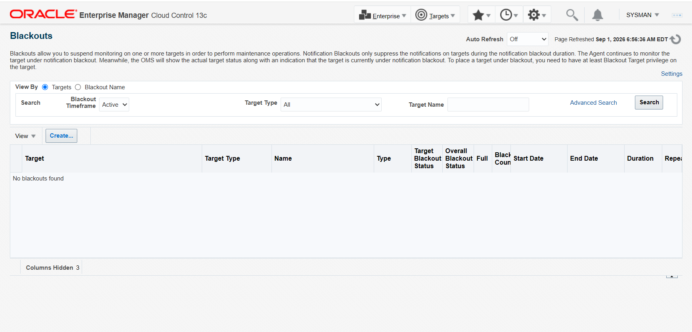
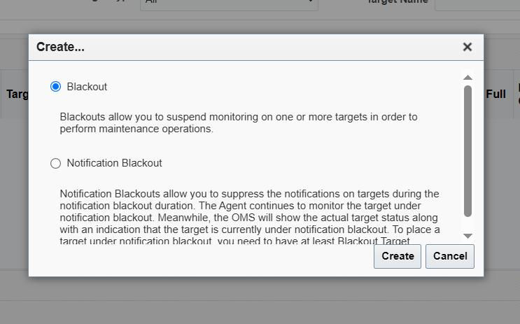
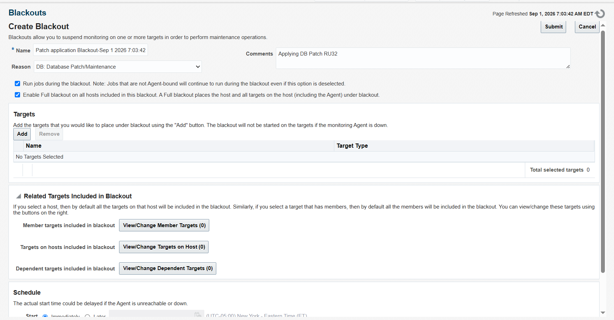
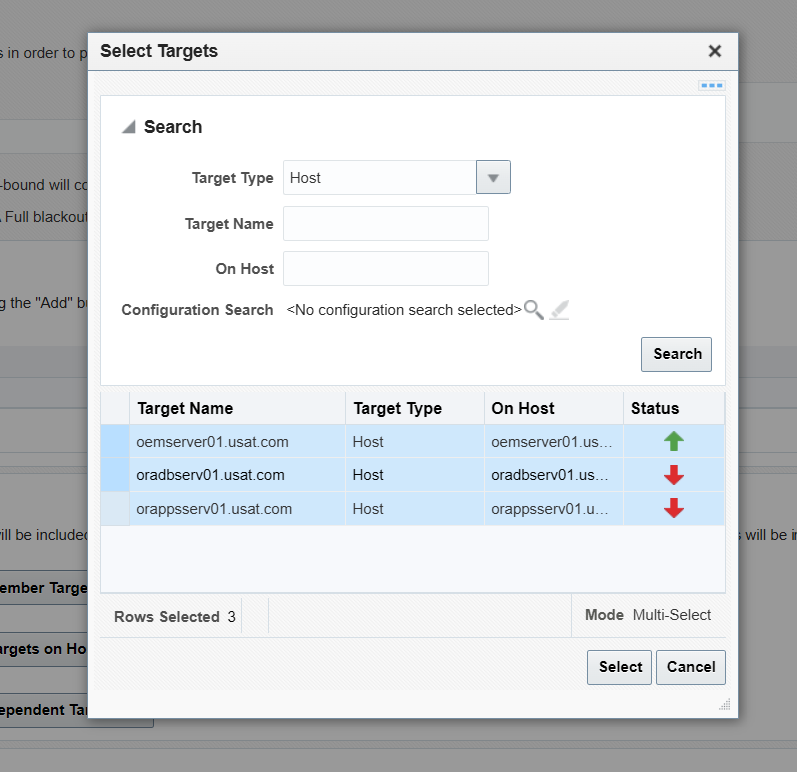
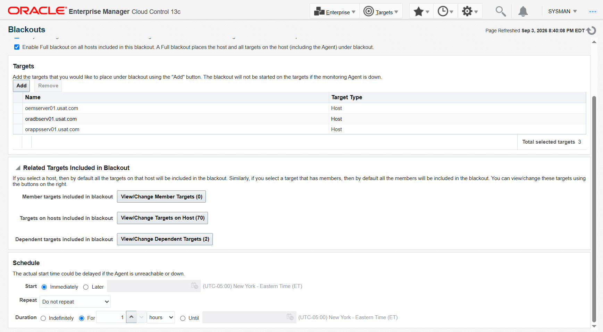
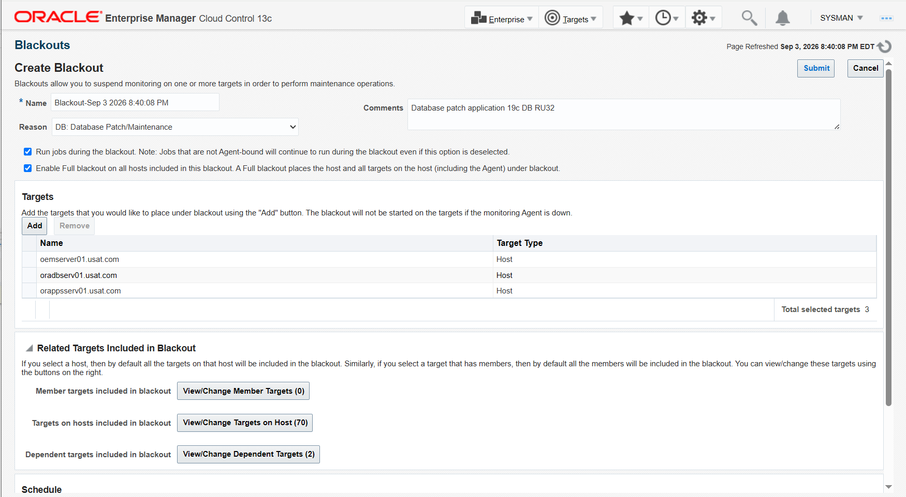
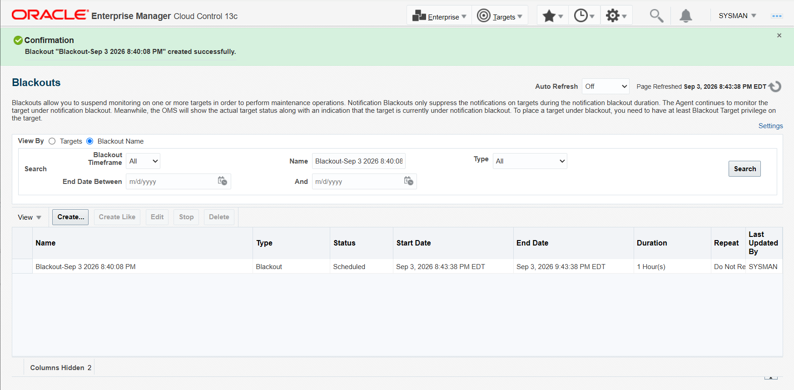

# Creating a Blackout in Enterprise Manager 13.5

**SOP: suspend monitoring on one or more targets for a planned maintenance window**

Status: 🟩 Confirmed. Used for real on 2026-09-03/04 to cover the
[Phase 7a repository patch](phase-7a-repository-db-ru32.md), and written up here
as a standalone procedure because every maintenance window in this project needs
it — Phase 7b's OMS upgrade, Phase 7c's agent rollout, and any RAC patching on
`oradbserv05/06` all start the same way.

**Why this is its own page rather than a step inside a runbook.** A blackout is
created through the OMS, so it has to exist *before* the OMS goes down. That
makes it the first thing in every window and the one step you cannot go back and
do afterwards. Duplicating a nine-screenshot click-path into each runbook that
needs it would guarantee the copies drift.

Screenshots referenced below are in [`screenshots/`](screenshots/) — same naming
convention as [`../installation/README.md`](../installation/README.md#15-screenshot-checklist-and-naming-convention)'s
Section 15.

---

## Contents

1. [What a blackout is, and what it is not](#1-what-a-blackout-is-and-what-it-is-not)
2. [The console click-path](#2-the-console-click-path)
3. [The `emcli` equivalent](#3-the-emcli-equivalent)
4. [The agent-side `emctl` alternative](#4-the-agent-side-emctl-alternative)
5. [Verifying a blackout is actually active](#5-verifying-a-blackout-is-actually-active)
6. [Clearing it afterwards](#6-clearing-it-afterwards)
7. [Why this is deliberately not automated](#7-why-this-is-deliberately-not-automated)

---

## 1. What a blackout is, and what it is not

A blackout suspends monitoring on a set of targets so that a planned outage does
not raise incidents, does not page anyone, and does not pollute availability
figures with downtime you scheduled on purpose.

Enterprise Manager offers two kinds, and the Create dialog makes you choose
between them up front:

| Type | What it does |
|---|---|
| **Blackout** | Suspends monitoring outright. The agent stops collecting for the target; the target shows as blacked out, not down. This is what a patch window wants. |
| **Notification Blackout** | Keeps monitoring running and only suppresses the *notifications*. The OMS still shows the real target status, annotated as under notification blackout. |

For a patching window you want the first. The database is genuinely going down;
there is no value in collecting metrics against it.

Two properties are worth understanding before filling in the form, because both
change what actually gets covered:

- **Full blackout** places the host *and every target on it, including the
  Agent*, under blackout. Without it the agent itself stays monitored, and an
  agent you are about to stop will register as down.
- **Related targets** are pulled in automatically. Selecting a host selects the
  targets on that host; selecting a composite target selects its members. The
  form tells you the counts before you submit — on the real run, three selected
  hosts brought 70 targets on hosts and 2 dependent targets with them.

A blackout left running after the window is a monitoring gap that looks exactly
like a healthy system. §6 is not optional.

---

## 2. The console click-path

**Who:** a user with at least the **Blackout Target** privilege on each target —
`SYSMAN` here
**Where:** `https://oemserver01.usat.com:7803/em`

### 2.1 Enterprise → Monitoring → Blackouts



### 2.2 The Blackouts page — click Create

The page lists blackouts filtered by timeframe. `Active` with no rows, as here,
means nothing is currently blacked out.



### 2.3 Choose Blackout, not Notification Blackout



Per §1: **Blackout**.

### 2.4 Name it, give a reason, tick Full blackout



| Field | What to put, and why |
|---|---|
| **Name** | EM pre-fills a timestamped name like `Blackout-Sep 3 2026 8:40:08 PM`. Accept it or type your own — but **write down whatever it ends up as**, because stopping the blackout later needs the exact name. |
| **Reason** | Pick from the dropdown; `DB: Database Patch/Maintenance` is the right one for a patch window. This is what makes the outage auditable as planned. |
| **Comments** | Free text — worth naming the actual change (`Database patch application 19c DB RU32`) so the record means something in six months. |
| **Run jobs during the blackout** | Leave ticked unless you have a reason not to. Note EM's own caveat: jobs that are not Agent-bound run regardless of this setting. |
| **Enable Full blackout on all hosts** | **Tick it.** This is what puts the Agent itself under blackout, which matters here because the window stops the agent. |

### 2.5 Add the targets

`Add` opens a target search. Set **Target Type** to `Host`, search, and
multi-select.



Selecting at **host** level rather than picking individual databases is the
right granularity for a patch window: it covers everything on the box without
requiring you to enumerate it correctly under time pressure.

Note the status arrows in that dialog — `oradbserv01` and `orappsserv01` are
already down. Blacking out a target whose agent is unreachable is allowed; EM
schedules the blackout and starts it if the agent comes up before the window
ends. §2.8 shows what that looks like afterwards.

### 2.6 Confirm what came with them, and set the schedule



**Read the related-target counts before submitting.** Three hosts brought 70
targets on hosts and 2 dependent targets. That is the actual blast radius, and
it is the number to sanity-check against what you expect to be taking down.

| Schedule field | Setting used |
|---|---|
| **Start** | `Immediately` — the window is starting now. `Later` takes a date/time in the displayed timezone. |
| **Repeat** | `Do not repeat` |
| **Duration** | `For 1 hours` — see the warning below |

> **Size the duration for the window you might have, not the one you hope for.**
> The Phase 7a window was created with a 1-hour duration and the patch ran from
> 06:40 to 07:26 — comfortable, but a blackout that expires mid-patch starts
> raising incidents against a database that is deliberately down, which is the
> exact noise the blackout existed to prevent. `Indefinitely` plus a disciplined
> §6 is a defensible choice for a long window; an under-sized fixed duration is
> not.
>
> EM also notes on this page that the actual start time can be delayed if the
> agent is unreachable or down.

### 2.7 Review, then Submit



### 2.8 Confirmation



Note the list now has to be viewed **By Blackout Name** rather than By Targets to
show the row.

Drilling into it shows the per-target picture, which is the part worth reading:


**`Start Partial` is not a failure.** It means some targets went into blackout
and some are waiting on an unreachable agent. For a Phase 7a-style window the
question is only whether the host you are about to patch is `Started` —
`oemserver01.usat.com` is, along with its OMS Platform and OMS Console targets.
The two down hosts will join if their agents come back before the blackout ends.

---

## 3. The `emcli` equivalent

Same result without the browser. Needs a SYSMAN login.

**Who:** `oracle`
**Where:** `oemserver01`

```bash
emcli login -username=sysman
emcli create_blackout -name="ru32_patch_window" \
  -add_targets="oemserver01.usat.com:host" \
  -reason="19c RU32 repository patch" \
  -schedule="duration:04:00"
```

`-add_targets` takes `name:type` pairs and can be repeated. `-reason` should
match one of the configured reasons for the record to be useful.

---

## 4. The agent-side `emctl` alternative

Useful when the console is not reachable, or when you want a node-level blackout
without touching the OMS at all.

**Who:** `oracle`
**Where:** `oemserver01`

```bash
. /home/oracle/.env/agent_env
emctl start blackout ru32_patch_window -nodeLevel
emctl status blackout
```

`-nodeLevel` covers every target on the host — the agent-side equivalent of
ticking Full blackout in §2.4.

> **This is the AGENT `emctl`, sourced from `agent_env`.** The OMS `emctl` has no
> blackout verb at all: given one it prints its own usage text and **exits 0**.
> An automated attempt in this project read that exit code as success and
> reported a blackout it had never created. Full write-up:
> [`known-risks.md`](../phase-01-foundation-2node-rac-12cR2/docs/known-risks.md)
> #150.

---

## 5. Verifying a blackout is actually active

Whichever route created it, verify from the agent side before relying on it:

```bash
. /home/oracle/.env/agent_env
emctl status blackout
```

Expect output naming the blackout and showing it unexpired:

```
Blackoutname = Blackout-Sep 3 2026 8:40:08 PM
Targets = (oemserver01.usat.com:host,)
Time = ({2026-09-03|20:43:40|3597 Sec,|} )
Expired = False
```

Two details that matter when parsing this, by hand or in code:

- `Blackoutname` is **one word**, no space before `name`.
- `Expired = False` is the field that says it is live. A blackout that has run
  its duration still appears in this output.

The Phase 7a role gates on exactly these two strings and refuses to shut anything
down without them.

---

## 6. Clearing it afterwards

**The single most important step on this page.** Monitoring stays suspended until
you stop the blackout, and a suspended target looks identical to a healthy one.

From the agent:

```bash
. /home/oracle/.env/agent_env
emctl stop blackout ru32_patch_window
emctl status blackout
```

From `emcli`:

```bash
emcli stop_blackout -name="Blackout-Sep 3 2026 8:40:08 PM"
```

From the console: **Enterprise → Monitoring → Blackouts**, switch **View By** to
`Blackout Name`, select the row, click **Stop**.

Clear it **after** the window's verification checklist passes, not before — the
verification itself is what tells you whether monitoring should be trusted again.

---

## 7. Why this is deliberately not automated

The Phase 7a Ansible role neither creates nor clears the blackout. It pauses,
prints the instructions above, waits for you to press Enter, and then verifies
independently via the agent's `emctl` — refusing to shut anything down if no
active blackout is visible.

Three reasons, in descending order of importance:

1. **Credentials.** A console or `emcli` blackout needs a SYSMAN login. Those
   credentials do not belong in this repository, in `group_vars`, or on an
   Ansible command line where they would land in the process table and the run
   log.
2. **There is no second chance.** Creating a blackout talks to the OMS. Once the
   OMS is down there is no way to create one, and no way to mark the window as
   planned retroactively. Making it a human checkpoint puts a person in front of
   the one step that cannot be retried.
3. **A verify-only gate is honest about what it knows.** The role can prove a
   blackout exists; it cannot prove the one you created covers the right targets
   for the right duration. Pausing for a human to check the console is the
   correct division of labour.

The verification in §5 is automated, because reading `emctl status blackout` needs
no credentials at all.

---

## Screenshot checklist

```
screenshots/
├── blackout-01-enterprise-monitoring-blackouts.png
├── blackout-02-blackouts-page-create.png
├── blackout-03-create-dialog-blackout-type.png
├── blackout-04-name-reason-full-blackout.png
├── blackout-05-select-targets-hosts.png
├── blackout-06-targets-added-schedule.png
├── blackout-07-review-before-submit.png
├── blackout-08-confirmation-scheduled.png
└── blackout-09-target-blackout-status.png
```

Captured against EM Cloud Control 13.5 on 2026-09-01/03. The `emcli` and
agent-side `emctl` paths in §3 and §4 have no screenshots — their output is
reproduced as text in §5, and in
[Phase 7a Part 2 §7](phase-7a-part2-the-patch-window.md#7-the-blackout-pause).

---

## Where this is used

- [Phase 7a Part 2, Section 7 — the blackout pause](phase-7a-part2-the-patch-window.md#7-the-blackout-pause)
- Phase 7b — OMS 13.5 → 24ai (planned)
- Phase 7c — administration groups and agent golden image (planned)
