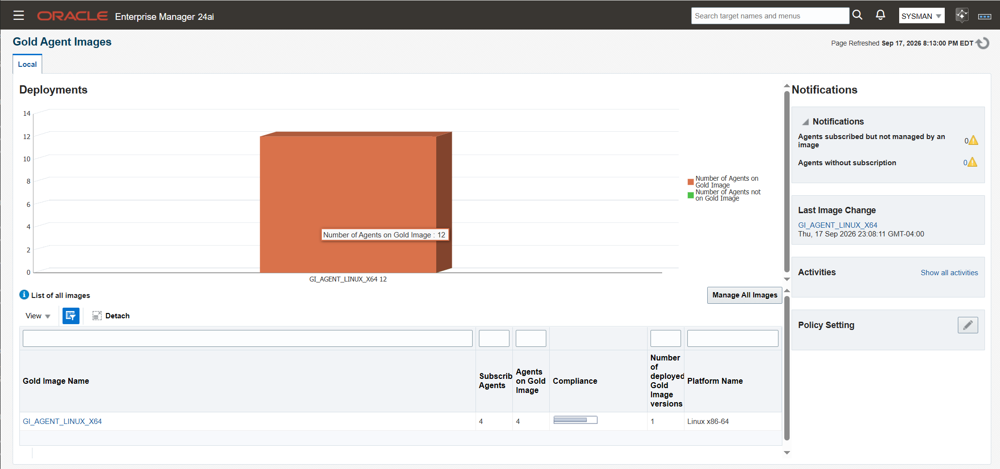
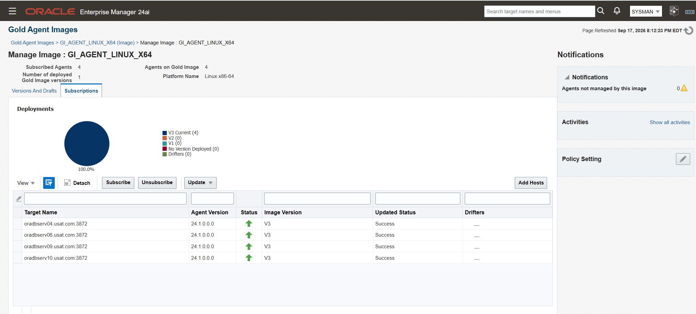

# When a gold image cut from a RAC node cannot update the other node

**Standing procedure: `NotUpdatable`, `Related agents are not updatable`, and the `EM_GI_MASTER_INFO` override**

Applies to Enterprise Manager 24ai Release 1 and to 13.5. Reached from
[Phase 7b Part 3](phase-7b-part3-golden-image.md),
[Phase 7c Part 2c](phase-7c-part2c-post-deployment.md) and
[Phase 7e](phase-7e-agent-patching.md), all of which hit it.

Status: 🟩 **Resolved 2026-09-17.** `oradbserv06` moved from V1 Pending to the current
image version. The flag is back at its default and the restore point is dropped.

> ### The deadlock, in one line
>
> The image source is an agent that cannot be updated from its own image. Put that
> source on a RAC node, and every other node of that cluster is related to it through a
> shared target, so the closure check can never be satisfied.
>
> **It does not time out or retry. It is permanent until the check is overridden.**

| # | Task | Status |
|---|---|---|
| 1 | Read the real failure reason | 🟩 |
| 2 | Take a restore point | 🟩 |
| 3 | Override the closure check | 🟩 |
| 4 | Update the single agent | 🟩 Success 2026-09-18 00:07 GMT |
| 5 | Put the flag back | 🟩 |
| 6 | Verify | 🟩 |
| 7 | Drop the restore point | 🟩 |
| | Appendix A: Notes | 🟩 |
| | Screenshots | 🟩 2 of 2 |

---

## Contents

1. [Read the real failure reason](#1-read-the-real-failure-reason)
2. [Take a restore point](#2-take-a-restore-point)
3. [Override the closure check](#3-override-the-closure-check)
4. [Update the single agent](#4-update-the-single-agent)
5. [Put the flag back](#5-put-the-flag-back)
6. [Verify](#6-verify)
7. [Drop the restore point](#7-drop-the-restore-point)

[Appendix A: Notes](#appendix-a-notes)

---

## The estate this happened on

| | |
|---|---|
| Cluster | `usatclust1`, two nodes: `oradbserv05` and `oradbserv06` |
| Shared target | `+ASM_usatclust1`, monitored by both nodes |
| Gold image | `GI_AGENT_LINUX_X64`, created at 13.5 with `oradbserv05` as the source |
| OMS | 24ai Release 1 Update 12, upgraded from 13.5 in [Phase 7c](phase-7c-oms-upgrade.md) |
| Repository | `oempdb`, a PDB in `usatcdb` since [Phase 7d](phase-7d-noncdb-to-pdb.md) |

The image predates the OMS upgrade. `oradbserv05` was chosen as the source because it
was the first agent built, before the cluster existed as a monitored entity.

---

## 1. Read the real failure reason

The subscription page reports `Pending` and flags the agent as a drifter. Neither is
the reason the update failed. Get the reason from the operation itself:

```bash
source ~/.env/oms_env
emcli login -username=sysman

emcli get_agent_update_status -op_name="GOLD_AGENT_IMAGE_UPDATE_2026_09_13_15_02_19_983"
```

Measured 2026-09-13:

```
Total Agents                 Status          Severity   Reason
------------                 ------          --------   ------
oradbserv06.usat.com:3872    NotUpdatable    ERROR      Related agents are not updatable.
                                                        Monitoring Target : +ASM_usatclust1,..
```

> ### `NotUpdatable` is not the same as drift
>
> | Symptom | What it means |
> |---|---|
> | Drifter | The agent's software state differs from the image version it is recorded on. A status label |
> | `NotUpdatable` | The update job refused to run. A prerequisite failure |
>
> The console shows the first. Only `get_agent_update_status` shows the second.

The named target is the cause. `+ASM_usatclust1` is monitored by both nodes, so
Enterprise Manager treats the two agents as related and requires them to move together.
[Appendix A.1](#a1-why-the-closure-can-never-be-satisfied) has the chain.

Confirm which agents the check considers eligible:

```bash
emcli get_not_updatable_agents -image_name="GI_AGENT_LINUX_X64"
emcli get_updatable_agents     -image_name="GI_AGENT_LINUX_X64"
```

---

## 2. Take a restore point

This procedure updates a `SYSMAN` table by hand. Take a guaranteed restore point on the
repository first.

```sql
-- connect to usatcdb as sysdba
alter session set container = oempdb;

create restore point B4EM_GI_MASTER_INFO_UPDATE guarantee flashback database;
```

Record the name. [§7](#7-drop-the-restore-point) drops it, and that step is not
optional.

---

## 3. Override the closure check

Connect as `SYSMAN` to the repository PDB:

```sql
conn sysman@oempdb
```

Read the current values:

```sql
SELECT property_name, property_value, property_type
FROM   em_gi_master_info
WHERE  property_name IN ('closureRelated', 'ignoreRelatedCheck');
```

Measured 2026-09-17:

```
PROPERTY_NAME        PROPERTY_VALUE   PROPERTY_TYPE
-------------------- ---------------- ------------------------------------------------
closureRelated       true             Auto-adds the closure of related agents for
                                      update when set ti true. Values can be true/false

ignoreRelatedCheck   false            Ignores Related agent closure checks.
```

Set the override:

```sql
UPDATE em_gi_master_info
SET    property_value = 'true'
WHERE  property_name = 'ignoreRelatedCheck';

COMMIT;
```

Confirm it took:

```sql
SELECT property_name, property_value
FROM   em_gi_master_info
WHERE  property_name IN ('closureRelated', 'ignoreRelatedCheck');
```

> ### Two parameters do this, and the guide names the other one
>
> | Parameter | In the 24ai Administrator's Guide | Effect |
> |---|---|---|
> | `closureRelated` | **Yes** | `false` stops related agents being auto-added to the update |
> | `ignoreRelatedCheck` | **No** | `true` skips the related-agent closure check entirely |
>
> `ignoreRelatedCheck` is what was used here and it worked. It is a row in the table
> with its own `PROPERTY_TYPE` description, but it does not appear in the guide.
> [Appendix A.2](#a2-which-parameter-to-reach-for) covers the difference.

---

## 4. Update the single agent

```bash
source ~/.env/oms_env
emcli login -username=sysman

emcli update_agents \
  -image_name="GI_AGENT_LINUX_X64" \
  -agents="oradbserv06.usat.com:3872" \
  -op_name="GOLD_AGENT_IMAGE_UPDATE_oradbserv06_$(date +%Y_%m_%d_%H_%M_%S)"
```

Blackout first if the agent monitors live targets. The update restarts it.

Monitor, repeating until it settles:

```bash
emcli get_agent_update_status -op_name="GOLD_AGENT_IMAGE_UPDATE_ORADBSERV06_2026_09_17_20_02_33"
```

Measured 2026-09-18, through three polls:

| Poll | Status | Time, GMT |
|---|---|---|
| 1 | `PendingUpdateInprogress` | 00:02:34 |
| 2 | `Inprogress` | 00:03:40 |
| 3 | **`Success`** | 00:03:40 to 00:07:24 |

Under four minutes, against an agent that had been `NotUpdatable` for four days.

---

## 5. Put the flag back

**Do this as soon as the update reports `Success`.** The override disables a safety
check for every agent, not only the one being updated.

```sql
UPDATE em_gi_master_info
SET    property_value = 'false'
WHERE  property_name = 'ignoreRelatedCheck';

COMMIT;

SELECT property_name, property_value
FROM   em_gi_master_info
WHERE  property_name IN ('closureRelated', 'ignoreRelatedCheck');
```

Expected: `closureRelated` `true`, `ignoreRelatedCheck` `false`.

---

## 6. Verify

**Setup → Manage Cloud Control → Gold Agent Images → `GI_AGENT_LINUX_X64` → Manage Image Versions and Subscriptions → Subscriptions**



| # | Check | Expected |
|---|---|---|
| 1 | `oradbserv06` Image Version | The current version, no longer V1 |
| 2 | `oradbserv06` Updated Status | `Success`, no longer `Pending` |
| 3 | Drifters | Zero |
| 4 | `emctl status agent` on the host | Running and ready, heartbeat `Ok` |
| 5 | Target count | Unchanged |
| 6 | `em_gi_master_info` | `ignoreRelatedCheck` back to `false` |
| 7 | Restore point | `B4EM_GI_MASTER_INFO_UPDATE` dropped, per [§7](#7-drop-the-restore-point) |



---

## 7. Drop the restore point

🟩 Dropped 2026-09-18.

```sql
-- connect to usatcdb as sysdba
DROP RESTORE POINT B4EM_GI_MASTER_INFO_UPDATE;
```

A guaranteed restore point holds flashback logs indefinitely and will fill the fast
recovery area. The same item was left open once already, at
[Phase 7a Part 3 §18.2](phase-7a-part3-verification.md#18-aftermath--what-is-still-outstanding),
which is why it is a numbered step here rather than a closing note.

Drop it only once the estate has run long enough to trust the change.

---

## Appendix A: Notes

### A.1 Why the closure can never be satisfied

Three facts, each individually reasonable:

| | |
|---|---|
| 1 | `oradbserv05` and `oradbserv06` both monitor `+ASM_usatclust1`, so Enterprise Manager treats them as **related** |
| 2 | `closureRelated` is `true` by default, so an update to one auto-adds the other |
| 3 | `oradbserv05` is the **image source**, and an agent cannot be updated from the image cut from it. [Phase 7b Part 3 §16.2](phase-7b-part3-golden-image.md#162-two-agents-cannot-be-subscribed) |

Together they deadlock. `oradbserv06`'s update requires `oradbserv05` to be updatable.
`oradbserv05` is never updatable. The check fails on every attempt, for as long as the
image has that source.

This is not a transient condition and it does not resolve by retrying, by resubscribing
or by cutting a newer version. It survived the 13.5 to 24ai OMS upgrade and two
separate image versions.

**The design lesson: do not cut a gold image from a clustered agent.** A standalone
host as the source keeps every cluster node updatable. Where the source is already on a
cluster node, this override is the way through.

### A.2 Which parameter to reach for

| Parameter | Documented in 24ai | What it does |
|---|---|---|
| `closureRelated` | Yes, in *Managing the Lifecycle of Agent Gold Images* | Set `false` and related agents are no longer auto-added to the update |
| `ignoreRelatedCheck` | Not on that page | Set `true` and the related-agent closure check is skipped |

Oracle's note for the first: *"When you have to update a set of related Management
Agents to an Agent Gold Image, it is mandatory to update all the related agents.
However, there is an option to override this in case if you want to update only a
selected few Agents to the Agent Gold Image. To achieve this, you have to set the
parameter `closureRelated` to `false` in the `EM_GI_MASTER_INFO` table."*

`ignoreRelatedCheck` is the one used here and it succeeded. Both are rows in the same
table and both carry their own `PROPERTY_TYPE` description. Anyone reproducing this
should try the documented parameter first, and treat the other as the fallback.

### A.3 What the console does not tell you

The Subscriptions page shows `Pending` and a drifter flag with an information icon.
Neither says `NotUpdatable`, and neither names `+ASM_usatclust1`.

The reason lives in the operation record and comes out of
`emcli get_agent_update_status -op_name=...`. Without the operation name from the
failed run, the diagnosis is guesswork. `emcli get_not_updatable_agents` gives the same
conclusion without needing the history.

### A.4 Editing a SYSMAN table by hand

This procedure writes to a repository table directly. Three things make that
acceptable here rather than reckless:

| | |
|---|---|
| The parameter is a documented knob | `EM_GI_MASTER_INFO` exists to be set, and the guide says so for `closureRelated` |
| A guaranteed restore point precedes it | [§2](#2-take-a-restore-point) |
| The flag is reverted immediately | [§5](#5-put-the-flag-back) |

Leaving `ignoreRelatedCheck` at `true` disables the check estate-wide. The check exists
because updating one node of a cluster and not the other leaves the cluster split, and
that is a real failure mode rather than bureaucracy.

---

**Sources:**
[Managing the Lifecycle of Agent Gold Images, Administrator's Guide 24ai](https://docs.oracle.com/en/enterprise-manager/cloud-control/enterprise-manager-cloud-control/24.1/emadv/managing-lifecycle-agent-gold-images.html),
the `closureRelated` override in `EM_GI_MASTER_INFO`, and the `-closure_related` and
`-closure_shared` parameters on `unsubscribe_agents` ·
[`get_updatable_agents`, EM CLI Verb Reference](https://docs.oracle.com/en/enterprise-manager/cloud-control/enterprise-manager-cloud-control/13.5/emcli/get-updatable-agents.html) ·
`emcli get_agent_update_status` output from `oemserver01`, the authority for the
`NotUpdatable` reason string and the target it names

---

Back to the **[Enterprise Manager index](README.md)**.
