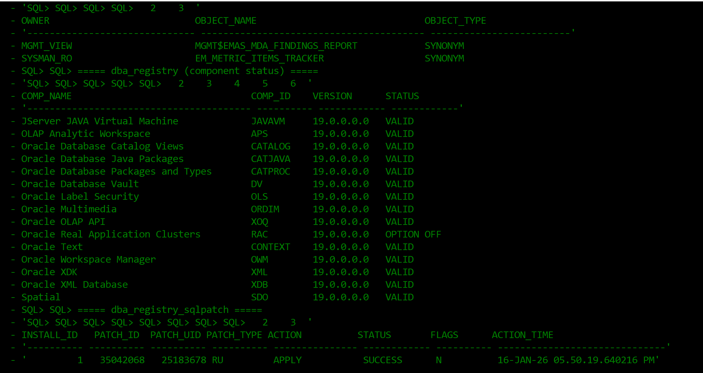
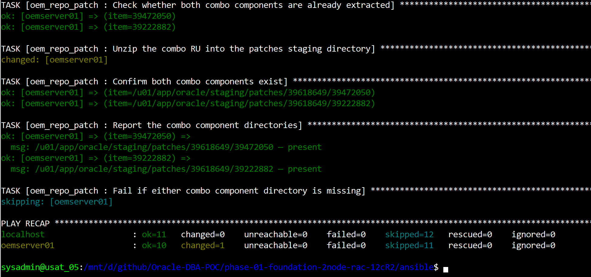

# Phase 7a — Part 1: Before the Window

**SOP: `oemcdb` on `oemserver01` — Combo 39618649 (Database RU 39472050 + OJVM 39222882), 19.19.0.0.0 → 19.32.0.0.0, Oracle Linux**

Part 1 of 3. **Part 1 (this page)** covers everything that is read-only and
belongs days ahead of the window: prerequisites, the syntax check, preflight,
staging the combo, and the pre-window checks.
[Part 2](phase-7a-part2-the-patch-window.md) is the destructive run.
[Part 3](phase-7a-part3-verification.md) is datapatch, verification and
aftermath. The index with the environment summary and the result is
[`phase-7a-repository-db-ru32.md`](phase-7a-repository-db-ru32.md).

Status: 🟩 Confirmed — every section below ran clean against the live lab.

| # | Section | Status |
|---|---|---|
| 1 | Prerequisites and decisions | 🟩 Confirmed |
| 2 | Syntax check, then the three commands | 🟩 Confirmed |
| 3 | Preflight | 🟩 Confirmed |
| 4 | Stage the combo | 🟩 Confirmed |
| 5 | Pre-window checks | 🟩 Confirmed |

Before starting, read
[`known-risks.md`](../phase-01-foundation-2node-rac-12cR2/docs/known-risks.md) —
the reasoning and debugging history behind every fix referenced across all three
parts — and
[`phase-7a-ansible.md`](phase-7a-ansible.md) for the role, tag and variable
reference.

Screenshots referenced below are in [`screenshots/`](screenshots/) — same naming
convention as `installation/`'s Section 15, numbered to match this page's own
section numbers (3, 4).

---

## Contents

1. [Prerequisites and decisions](#1-prerequisites-and-decisions)
2. [Syntax check, then the three commands](#2-syntax-check-then-the-three-commands)
3. [Preflight](#3-preflight)
4. [Stage the combo](#4-stage-the-combo)
5. [Pre-window checks](#5-pre-window-checks)

Continue to **[Part 2 — The patch window](phase-7a-part2-the-patch-window.md)**.

---

## 1. Prerequisites and decisions

| Item | Value |
|---|---|
| Target | Combo **39618649** — OJVM Component RU 19.32.0.0.260721 + Database Jul 2026 RU 19.32.0.0.260721 |
| MOS zip | `COMBO_OJVM_DBRU_19RU32_p39618649_190000_Linux-x86-64.zip` |
| OPatch zip | `p6880880_190000v52_Linux-x86-64.zip` — the **19.0.0.0.0** line |
| Staging root | `/u01/app/oracle/staging/patches` (already staged on `oemserver01`) |
| Database | `oemcdb`, 19.19.0.0.0, **non-CDB**, **single instance, no Grid Infrastructure** |
| Oracle Home | `/u01/app/oracle/product/19.3.0/db_1` |
| Apply mechanism | plain `opatch apply -silent`, twice — neither component is a system patch |
| Apply order | Database RU first, then OJVM, then **one** `datapatch` run covering both |
| OPatch minimum | **12.2.0.1.51** (OJVM README §1.2; the DB RU README names none) |
| Backup | full RMAN backup to `/u03/backups/rman/$ORACLE_SID/<timestamp>`, plus a guaranteed restore point |
| Blackout | created by hand through the EM console — [see the blackout page](oem-create-blackout.md) |

### The combo unzips into exactly two component directories

| Component | What it is | In scope |
|---|---|---|
| **39472050** | Database Release Update 19.32.0.0.260721 | yes — applied first |
| **39222882** | OJVM Component Release Update 19.32.0.0.260721 | yes — applied second |

Neither is Grid-only, and this host has no Grid Infrastructure anyway. Do not
apply the top-level combo directory the way the GI build does with `-applyRU`;
that flow is specific to `gridSetup.sh`.

> **Corrected 2026-09-01.** This runbook previously described combo **39467003**,
> the GI+DB combo with five components, of which only 39472050 was in scope
> because four were Grid-home-only. That was the wrong combo for this host.
> 39618649 is the DB-home combo, and it brings OJVM with it.
>
> The OPatch zip changed too, and not just its version. It was `gi_opatch_zip` —
> the 23xxxx-line download used by the Grid build. This home needs the
> **19.0.0.0.0** line. Full write-up: `known-risks.md` #142.

### OJVM relinks the Oracle home

`make`, `ar`, `ld` and `nm` must be on `PATH` (OJVM README §1.2). They are in
`/usr/bin` on this host; the role adds `/usr/bin:/bin` explicitly and runs
`which` on all four before applying, so a PATH problem fails with an obvious
cause rather than inside OPatch.

One more OJVM-specific thing, worth knowing before it appears in Part 3:
**`ORA-04068: existing state of packages has been discarded` may show up in the
alert log while `datapatch` runs.** OJVM README Known Issue 1 documents it as
benign — datapatch retries internally, and if datapatch itself reports no error
the patch applied correctly. Do not chase it.

---

## 2. Syntax check, then the three commands

**Who:** `ansible`
**Where:** the control node, from `phase-01-foundation-2node-rac-12cR2/ansible`

```bash
bash syntax-check.sh
```

It parses every `*.yml` with `yaml.safe_load`, runs `ansible-playbook
--syntax-check` on each playbook, and greps for nine patterns that have broken
this project's playbooks before. Exits non-zero on failure, so it chains safely:

```bash
bash syntax-check.sh && ansible-playbook -i inventory/hosts.ini oem-repo-patch.yml \
  -e oem_patch_confirm=yes --tags oem_repo_patch_preflight
```

`--syntax-check` on its own is not enough: it only parses files a playbook
actually reaches, so a role task file nothing currently includes keeps its error
until the day something does. What each of the nine checks looks for, and why:
[`phase-7a-ansible.md`](phase-7a-ansible.md#syntax-checking-and-audit).

The three commands, in order:

| # | Command | Nature |
|---|---|---|
| 1 | `--tags oem_repo_patch_preflight` | read-only, safe at any time (§3) |
| 2 | `--tags oem_repo_patch_stage` | idempotent, safe to re-run (§4) |
| 3 | no tags, plus `-e oem_repo_conflict_check_fatal=false` | **destructive** ([Part 2](phase-7a-part2-the-patch-window.md)) |

---

## 3. Preflight

Read-only and safe at any time. It resolves the SID, proves the running instance
belongs to the target Oracle home, checks free space, determines CDB or non-CDB,
and captures the pre-patch baselines that Part 3's verification compares against.

**Who:** `ansible`
**Where:** the control node

```bash
ansible-playbook -i inventory/hosts.ini oem-repo-patch.yml \
  -e oem_patch_confirm=yes --tags oem_repo_patch_preflight
```

### 3.1 The registry baseline

The first thing it captures is the component and patch registry as it stands
before anything is touched — the before-picture that Part 3 §16 diffs against.



**`RAC` at `OPTION OFF` is correct**, not a finding. This is a single-instance
database; the option is linked out. It is the one row that will still be
non-`VALID` after the patch, which is why the role counts registry rows rather
than demanding zero.

> **`dba_registry_sqlpatch` has no `version` column.** An earlier draft of the
> verification query selected one and failed with `ORA-00904: "VERSION": invalid
> identifier`. `patch_type` is the column that carries `RU` vs `INTERIM`.

### 3.2 The preflight summary


The five numbers this run has to produce, and what each is for:

| Captured | Value | Used by |
|---|---|---|
| SID | `oemcdb` | everything downstream — the backup path, the shutdown, datapatch |
| `ORACLE_HOME` | `/u01/app/oracle/product/19.3.0/db_1` | proves the running `pmon` binary lives in the home being patched |
| Version | `19.19.0.0.0` | Part 3 §16 check 3 |
| `PRE_INVALID_COUNT` | `2` | Part 3 §16 check 5 — the comparison baseline, not zero |
| `PRE_REGISTRY_NOT_VALID` | `1` | Part 3 §16 check 6 |
| Expected targets | `43` | Part 3 §16 check 12 |

> **The SID is discovered, not configured.** The role reads it from the running
> `ora_pmon_*` process and resolves that process's binary through
> `/proc/<pid>/exe` to confirm it belongs to the target home. Getting that
> discovery right took four attempts and is the single most-debugged task in the
> role — `ps -eo pid=,args=` silently emits one column, and `ps -ef | grep` matches
> the shell running the script. `known-risks.md` #146-#152 has the full account.

**This is also what settles the client-home question.** `group_vars/all.yml`
describes `/u01/app/oracle/product/19.3.0/db_1` as an Oracle *Client* home. A
client home has no instance running from it, so a preflight that resolves
`ora_pmon_oemcdb` inside this path proves the `group_vars` description is what is
wrong, not the path.

---

## 4. Stage the combo

Idempotent. Establishes the `oracle@oradbserv05` → `oracle@oemserver01` SSH
trust, copies the zip if it is not already local, and unzips it.

**Who:** `ansible`
**Where:** the control node

```bash
ansible-playbook -i inventory/hosts.ini oem-repo-patch.yml \
  -e oem_patch_confirm=yes --tags oem_repo_patch_stage
```

If that fails on authentication, run the trust on its own to read its per-pair
verification output:

```bash
ansible-playbook -i inventory/hosts.ini oem-repo-patch.yml \
  -e oem_patch_confirm=yes --tags ssh_trust
```



### 4.1 Re-running the stage step is safe, and it self-heals

The role stats both component directories first and only unzips when at least one
is missing:

| State | What happens |
|---|---|
| Both present | unzip skipped entirely — no 2.5 GB re-extract |
| One component deleted | re-extracts, restoring both |
| Whole `39618649/` deleted | re-extracts |

That middle row is the one worth knowing about. The guard used to be
`creates: .../patches/39618649` — the **parent** directory — which meant deleting
a single component left the parent in place, matched `creates:`, skipped the
unzip, and then failed verification with no way forward except deleting the
parent by hand. Same coarse-guard class as `known-risks.md` #32 and #68: the
guard checked something adjacent to what it was meant to prove.

Deleting a component directory and re-running is a legitimate way to test the
extract path, and the role is expected to recover from it.

### 4.2 Verify by hand if you want to see it yourself

**Who:** `oracle`
**Where:** `oemserver01`

```bash
cd /u01/app/oracle/staging/patches
ls -l COMBO_OJVM_DBRU_19RU32_p39618649_190000_Linux-x86-64.zip
ls -l p6880880_190000v52_Linux-x86-64.zip
ls -ld 39618649/39472050 39618649/39222882
```

The last command is the one that matters — **both** component directories must
exist.

> **Unzip into `patches/`, not into `patches/39618649/`.** Oracle's zip already
> contains a top-level `39618649/` folder, and unzipping into a destination that
> also names the patch double-nests it. Documented in `patching-strategy.md`.

> **The RU no longer travels from `oradbserv05`.** Earlier drafts described an
> `rsync` push from the RAC node, because the old GI combo was already there from
> the Grid build. 39618649 is a different patch and was staged here directly, so
> the copy step is a no-op — the role's `stat` finds the zip locally and skips it.
> The `ssh_equivalence` trust still gets established and verified, which costs
> nothing and leaves the path working if a future patch does need copying.

---

## 5. Pre-window checks

All read-only. Run them days before the window, not inside it.

### 5.1 Free space

**Who:** `oracle`
**Where:** `oemserver01`

Measured 2026-08-31:

```
Filesystem      Size  Used Avail Use% Mounted on
/dev/sdc1       100G   85G   16G  85% /u01
/dev/sda1        50G  6.3G   44G  13% /
```

16G free on `/u01` is workable for a Database RU plus OPatch's backup of the
existing home. Re-check immediately before the window rather than trusting this
snapshot.

> The agent's `Available disk space on upload filesystem : 15.95%` is a different
> metric. It reports the agent's own upload area, not the `/u01` mount, and is not
> the number that matters here.

### 5.2 Current OPatch version

**Who:** `oracle`
**Where:** `oemserver01`

```bash
export ORACLE_HOME=/u01/app/oracle/product/19.3.0/db_1
$ORACLE_HOME/OPatch/opatch version
```

**The minimum for this window is OPatch 12.2.0.1.51.** That number comes from the
OJVM README (39222882 §1.2); the Database RU README names no minimum at all. Both
patches go into the same home, so the stricter of the two governs.

The home shipped **12.2.0.1.37**, which is below it. The upgrade itself happens
inside the window ([Part 2 §6](phase-7a-part2-the-patch-window.md#6-update-opatch)),
because it is the first thing that changes the home.

### 5.3 Record the current patch inventory

```bash
$ORACLE_HOME/OPatch/opatch lsinventory -detail > ~/lsinventory_pre_ru32.txt
$ORACLE_HOME/OPatch/opatch lspatches
```

Keep that file. It is the before-picture, and the only reliable way to answer
"what was on this home beforehand" once the patch has run. The role captures its
own copy to `/u01/app/oracle/logs/oem_repo_patch/lsinventory_pre_<ts>.txt`.

### 5.4 Conflict check — against BOTH components

From the Database RU README §3.1.3 and the OJVM README §1.2. A conflict against
OJVM is just as blocking as one against the DB RU, and the two patches touch
different parts of the home.

```bash
export ORACLE_HOME=/u01/app/oracle/product/19.3.0/db_1
DBRU=/u01/app/oracle/staging/patches/39618649/39472050
OJVM=/u01/app/oracle/staging/patches/39618649/39222882

$ORACLE_HOME/OPatch/opatch prereq CheckMinimumOPatchVersion -phBaseDir $DBRU

$ORACLE_HOME/OPatch/opatch prereq CheckConflictAgainstOHWithDetail -phBaseDir $DBRU
$ORACLE_HOME/OPatch/opatch prereq CheckConflictAgainstOHWithDetail -phBaseDir $OJVM
```

A conflict found here is cheap. A conflict found partway through an apply is not.

> **Read the report, not the exit code.** `opatch prereq` exits 0 even when the
> prereq fails. The role gates on the string `Prereq "..." passed` appearing and
> `Prereq "..." failed` not appearing — and it checks for **both** verdicts,
> because with two checks writing to one stdout, "passed" being present proves
> nothing about which check produced it.

> **Two corrections, 2026-08-31, from reading the 39472050 README.** The flag is
> `-phBaseDir`, not `-ph`. And do **not** expect a *"This command doesn't support
> System Patch"* refusal — that is true of the combo, not of the Database RU
> component this home actually gets. `known-risks.md` #142.
>
> Note also that `CheckMinimumOPatchVersion` is how you answer "is OPatch new
> enough" — the README names no version number at all.

### 5.5 What this check reported, and why the window needs an override

The check came back with **ZOP-47**: `39472050` supersedes `35042068` (RU 19.19)
but does not carry forward five one-offs layered on top of it — `35037877`,
`34832725`, `35074478`, `34340632`, `29213893`.

**ZOP-47 is a superset finding, not a conflict.** A real conflict needs a
resolution patch from My Oracle Support; the README points at KB145571 for
deciding whether one exists, must be requested, or can be ignored. A superset is
fine.

Proceed knowingly:

```bash
-e oem_repo_conflict_check_fatal=false
```

That override is the right shape: the gate stays fatal by default, and a human
has to say, **per run**, that they have read the finding.

> **This pre-window check cannot be the gate**, because it runs before
> [Part 2 §11](phase-7a-part2-the-patch-window.md#11-roll-back-the-superseded-one-offs)
> rolls the one-offs back and therefore still sees them. The check that matters is
> the re-check *after* the rollback, which runs against the home exactly as it
> will be at apply time and is expected to pass cleanly. It did.

### 5.6 AHF compliance baseline

Standing practice for this project: an AHF compliance check immediately before
staging a patch and again after it completes. Two reports, before and after, are
far stronger evidence than "the patch applied cleanly."

```bash
ahf analysis create --type compliance
# or, depending on the AHF version installed:
tfactl orachk -profile dba
```

Keep the report path. It pairs with the post-patch run in
[Part 3 §16](phase-7a-part3-verification.md#16-verification-checklist).

---

Continue to **[Part 2 — The patch window](phase-7a-part2-the-patch-window.md)**.
Back to the **[index](phase-7a-repository-db-ru32.md)**.
