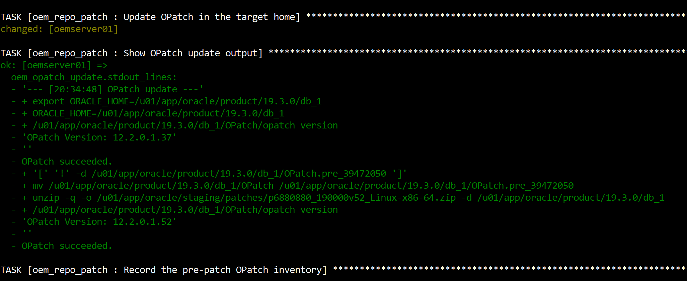
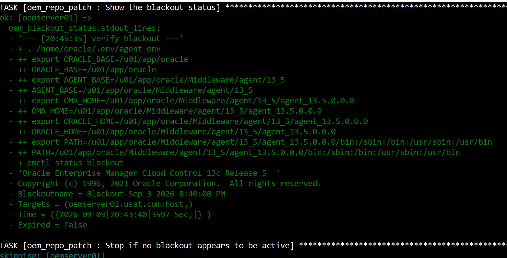
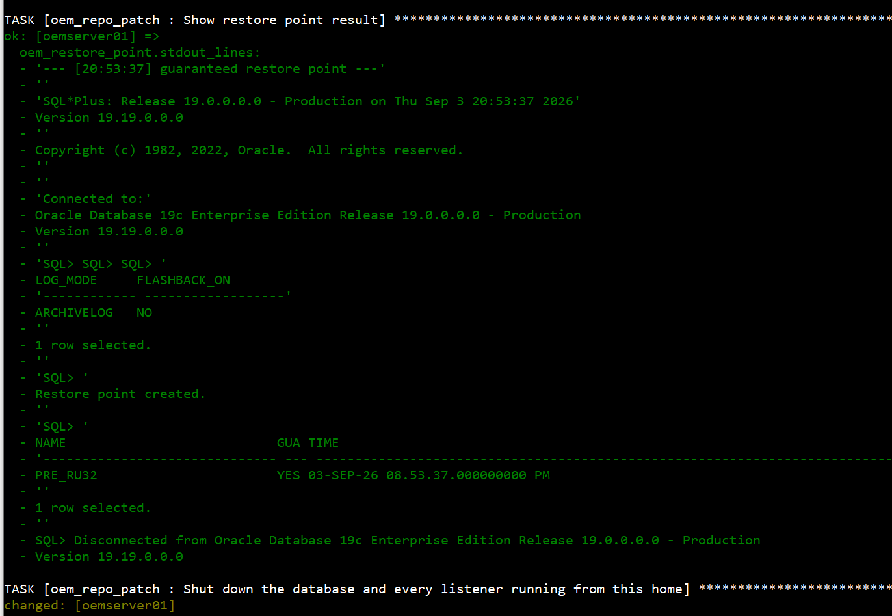

# Phase 7a — Part 2: The Patch Window

**SOP: `oemcdb` on `oemserver01` — Combo 39618649 (Database RU 39472050 + OJVM 39222882), 19.19.0.0.0 → 19.32.0.0.0, Oracle Linux**

Part 2 of 3. [Part 1](phase-7a-part1-before-the-window.md) covers the
prerequisites, preflight and staging — read that first; this page assumes the
combo is extracted, the preflight has run, and the conflict check has been read.
**Part 2 (this page)** is the destructive run: OPatch, the blackout pause,
stopping the stack, the backup, the rollback of superseded one-offs, and the
apply. [Part 3](phase-7a-part3-verification.md) is datapatch, verification and
aftermath. The index is
[`phase-7a-repository-db-ru32.md`](phase-7a-repository-db-ru32.md).

Status: 🟩 Confirmed — ran clean end to end on 2026-09-04.

| # | Section | Status |
|---|---|---|
| 6 | Update OPatch | 🟩 Confirmed |
| 7 | The blackout pause | 🟩 Confirmed |
| 8 | Stop the stack, in order | 🟩 Confirmed |
| 9 | Back up before the patch | 🟩 Confirmed |
| 10 | Shut down the database and listeners | 🟩 Confirmed |
| 11 | Roll back the superseded one-offs | 🟩 Confirmed |
| 12 | Apply both patches | 🟩 Confirmed |

**This is the destructive run.** One command drives Sections 6-12 and everything
in [Part 3](phase-7a-part3-verification.md):

```bash
ansible-playbook -i inventory/hosts.ini oem-repo-patch.yml \
  -e oem_patch_confirm=yes -e oem_repo_conflict_check_fatal=false
```

The sections below explain what each stage does, what its real output looked
like, and what to check. The manual equivalents are given for anyone running this
without Ansible.

Screenshots referenced below are in [`screenshots/`](screenshots/) — same naming
convention as `installation/`'s Section 15, numbered to match this page's own
section numbers (6-12).

---

## Contents

6. [Update OPatch](#6-update-opatch)
7. [The blackout pause](#7-the-blackout-pause)
8. [Stop the stack, in order](#8-stop-the-stack-in-order)
9. [Back up before the patch](#9-back-up-before-the-patch)
10. [Shut down the database and listeners](#10-shut-down-the-database-and-listeners)
11. [Roll back the superseded one-offs](#11-roll-back-the-superseded-one-offs)
12. [Apply both patches](#12-apply-both-patches)

Back to **[Part 1 — Before the window](phase-7a-part1-before-the-window.md)**.
Continue to **[Part 3 — Datapatch, verification and aftermath](phase-7a-part3-verification.md)**.

---

## 6. Update OPatch

The first thing that changes the home, and it happens **before** the blackout
pause deliberately — it is reversible, it does not touch the database, and doing
it early means the pause is the last safe stopping point rather than the
second-to-last.

**Who:** `oracle`
**Where:** `oemserver01`

```bash
export ORACLE_HOME=/u01/app/oracle/product/19.3.0/db_1
cd $ORACLE_HOME
mv OPatch OPatch.pre_39472050
unzip -q -o /u01/app/oracle/staging/patches/p6880880_190000v52_Linux-x86-64.zip -d $ORACLE_HOME
$ORACLE_HOME/OPatch/opatch version     # expect 12.2.0.1.52
```



**Moving rather than deleting means a failed patch has a way back.** The role
guards the move so a re-run does not clobber the saved copy with the new one.

`12.2.0.1.37 → 12.2.0.1.52`, clearing the **12.2.0.1.51** minimum from the OJVM
README ([Part 1 §5.2](phase-7a-part1-before-the-window.md#52-current-opatch-version)).
The role then runs `CheckMinimumOPatchVersion` against the patch itself rather
than trusting the version string, and it passed.

---

## 7. The blackout pause

**Nothing has been shut down yet when this pause fires.** It is the last point at
which the window can be abandoned with no cleanup.

The role does **not** create the blackout — you do, by hand. The full procedure,
with the console click-path, the `emcli` form and the agent-side `emctl` form, is
on its own page:

### ➜ [Creating a Blackout in Enterprise Manager 13.5](oem-create-blackout.md)

That page is separate because every maintenance window in this project starts
with it, and because a blackout cannot be created after the OMS is down —
creating one talks to the OMS, so there is no second chance and no way to mark
the window as planned retroactively.

### 7.1 What the pause looks like


Create the blackout, verify it independently in another session, then press
Enter. `Ctrl-C` then `A` aborts with nothing changed but OPatch.

### 7.2 Verify it before pressing Enter

**Who:** `oracle`
**Where:** `oemserver01`, in a second session

```bash
. /home/oracle/.env/agent_env && emctl status blackout
```



The role runs the same command itself and refuses to shut anything down without
`Blackoutname` and `Expired = False` in the output. That is why the "Stop if no
blackout appears to be active" task shows as `skipping` — the gate passed.

> **`agent_env`, not `oms_env`.** Blackouts are an **AGENT** `emctl` command. The
> OMS `emctl` has no blackout verb at all — it prints its own usage text and
> **exits 0**, which is exactly how an earlier automated attempt reported success
> having created nothing. `known-risks.md` #150.

---

## 8. Stop the stack, in order

Order matters. The OMS depends on the repository database, so it stops first and
starts last.

**Who:** `oracle`
**Where:** `oemserver01`

```bash
# 1. OMS, including the WebTier and admin server
. ~/.env/oms_env
emctl stop oms -all
emctl status oms

# 2. Agent
. ~/.env/agent_env
emctl stop agent
emctl status agent
```


**`emctl stop oms -all`, not `emctl stop oms`.** The plain form leaves the
WebLogic admin server running, which keeps a lock on the home. The screenshot
above is the proof it stopped: `AdminServer Successfully Stopped` only appears
with `-all`.

The database stays **up** through this section — it has to, because §9 backs it
up next.

---

## 9. Back up before the patch

A Release Update is reversible with `opatch rollback`, and the database side is
reversible with `datapatch`. Neither covers a mistake that corrupts the
repository. Take a real backup.

**Who:** `oracle`
**Where:** `oemserver01`

### 9.1 Full RMAN backup

```bash
export ORACLE_HOME=/u01/app/oracle/product/19.3.0/db_1
export ORACLE_SID=oemcdb
rman target / <<'RMAN'
CONFIGURE CONTROLFILE AUTOBACKUP ON;
RUN {
  ALLOCATE CHANNEL c1 DEVICE TYPE DISK;
  ALLOCATE CHANNEL c2 DEVICE TYPE DISK;
  SET CONTROLFILE AUTOBACKUP FORMAT FOR DEVICE TYPE DISK
    TO '/u03/backups/rman/oemcdb/<ts>/cf_%F';
  BACKUP AS COMPRESSED BACKUPSET DATABASE
    TAG 'PRE_RU32'
    FORMAT '/u03/backups/rman/oemcdb/<ts>/db_%d_%T_%U.bkp'
    PLUS ARCHIVELOG TAG 'PRE_RU32_ARC'
    FORMAT '/u03/backups/rman/oemcdb/<ts>/arc_%d_%T_%U.bkp';
  BACKUP CURRENT CONTROLFILE TAG 'PRE_RU32_CF'
    FORMAT '/u03/backups/rman/oemcdb/<ts>/ctl_%d_%T_%U.bkp';
}
RMAN
```


Two things in that output are design decisions rather than defaults:

- **Explicit `FORMAT` on every backup**, and a **session-scoped**
  `SET CONTROLFILE AUTOBACKUP FORMAT`. Without them the pieces land wherever the
  persistent RMAN configuration points, which on this database is the FRA — not
  the timestamped directory the run is supposed to be self-contained in. `SET`
  inside `RUN` rather than `CONFIGURE` means the window does not permanently
  alter the database's backup configuration.
- **The backup is gated on a positive marker.** The role fails unless
  `Recovery Manager complete.` appears in stdout, and fails if `RMAN-00569` does.
  Checking for the absence of errors is not the same as checking for success.

The real run wrote **1.6 GB** to `/u03/backups/rman/oemcdb/20260904T063751`.

> **`using target database control file instead of recovery catalog`.** This
> database is backed up with no recovery catalog. That is consistent with there
> being none configured — but it is an absence of evidence, not evidence of
> absence, and it matters because Oracle's §3.3.3 catalog upgrade is a real
> post-patch step if one exists. Listed as an open question on the
> [index](phase-7a-repository-db-ru32.md#open-questions-for-the-write-up).

### 9.2 Guaranteed restore point

```sql
SELECT log_mode, flashback_on FROM v$database;
CREATE RESTORE POINT PRE_RU32 GUARANTEE FLASHBACK DATABASE;
SELECT name, guarantee_flashback_database, time FROM v$restore_point;
```



**Read the two columns before the restore point, not after.** `LOG_MODE` is
`ARCHIVELOG` — good — but **`FLASHBACK_ON` is `NO`**. The guaranteed restore
point was created and is real, but flashback database is not enabled, so
`FLASHBACK DATABASE TO RESTORE POINT PRE_RU32` is not available as a rollback
path. **The RMAN backup in §9.1 was the actual safety net.**

That is worth being explicit about rather than leaving implied, because a
restore point in `v$restore_point` reads like a rollback plan and in this
configuration was not one.

> **It still has to be dropped.** A guaranteed restore point holds flashback logs
> indefinitely and will fill the fast recovery area. See
> [Part 3 §18](phase-7a-part3-verification.md#18-aftermath--what-is-still-outstanding).

---

## 10. Shut down the database and listeners

**Who:** `oracle`
**Where:** `oemserver01`

```bash
export ORACLE_HOME=/u01/app/oracle/product/19.3.0/db_1
export ORACLE_SID=oemcdb

# Stop every listener running from THIS home, by discovered name
LSNRS=$(ps -eo args= | awk -v h="${ORACLE_HOME}/bin/tnslsnr" '$1 == h { print $2 }')
for L in ${LSNRS}; do lsnrctl stop "${L}"; done

sqlplus / as sysdba <<'SQL'
SHUTDOWN IMMEDIATE
EXIT
SQL
```


**The listener is stopped by discovered name, not by `lsnrctl stop` alone.** A
bare `lsnrctl stop` targets `LISTENER`; this host's listener is
`oemserver01_listener`, and a listener still running out of the home blocks the
patch. The discovery reads `ps -eo args=` and matches on `argv[0]` being exactly
`$ORACLE_HOME/bin/tnslsnr`, so it cannot pick up a listener from a different
home.

### 10.1 Confirm nothing is still holding the home

`RESIDUAL_COUNT=0` in the screenshot above is the gate. The check walks
`/proc/<pid>/exe` rather than grepping `ps` output:

```bash
RESIDUAL=0
for procdir in /proc/[0-9]*; do
  pid=${procdir#/proc/}
  [ "$pid" = "$$" ] && continue
  exe=$(readlink -f "$procdir/exe" 2>/dev/null) || continue
  case "$exe" in
    /u01/app/oracle/product/19.3.0/db_1/*)
      echo "STILL RUNNING: pid=$pid exe=$exe"; RESIDUAL=$((RESIDUAL + 1));;
  esac
done
echo "RESIDUAL_COUNT=${RESIDUAL}"
```

> **Why not `ps -ef | grep`.** Because the shell running the check appears in its
> own output — the grep pattern is in the script's command line, so it matches
> itself. An earlier version of this check reported the home as busy on every run,
> and a variant of it reported `-1`. Resolving a PID's binary through
> `/proc/<pid>/exe` is immune to that, and also to a process whose command line
> lies about which home it came from. `known-risks.md` #151.

---

## 11. Roll back the superseded one-offs

**Database down, before applying anything.** §10 has just proved nothing is
holding the home.

The ZOP-47 report in
[Part 1 §5.5](phase-7a-part1-before-the-window.md#55-what-this-check-reported-and-why-the-window-needs-an-override)
names five one-offs layered on RU 19.19 that RU32 does not carry forward. **Two
of them are removed here explicitly. The other three are left to OPatch.**

**Who:** `oracle`
**Where:** `oemserver01`

```bash
export ORACLE_HOME=/u01/app/oracle/product/19.3.0/db_1
export PATH=$ORACLE_HOME/OPatch:$PATH

# 1. Binaries — in this order
opatch rollback -id 29213893 -silent
opatch rollback -id 35074478 -silent

# 2. SQL registry
cd $ORACLE_HOME/OPatch
sqlplus / as sysdba <<'SQL'
STARTUP
EXIT
SQL
./datapatch -verbose

# 3. Back down, ready for §12
sqlplus / as sysdba <<'SQL'
SHUTDOWN IMMEDIATE
EXIT
SQL
```

### 11.1 Both halves are required

`opatch rollback` removes the binaries; `datapatch` removes the matching SQL
registry entry. Skipping datapatch leaves `dba_registry_sqlpatch` claiming a
patch that is no longer in the home — the mirror image of the "patched binaries,
unpatched dictionary" state
[Part 3 §13](phase-7a-part3-verification.md#13-datapatch-the-step-people-forget)
exists to prevent.

**Datapatch needs no `-rollback` flag.** With the binaries already gone it
compares the two registries and works out what to undo. The real run showed
exactly that:

```
Interim patch 29213893: Binary registry: Not installed
                        SQL registry: Applied successfully on 16-JAN-26
The following interim patches will be rolled back: 29213893
Patch 29213893 rollback: SUCCESS
```

> **`-silent` is not optional here.** Interactively, `35074478` prompts *"Please
> shutdown Oracle instances running out of this ORACLE_HOME ... Is the local
> system ready for patching? [y|n]"*. Without `-silent` it hangs forever, since
> Ansible allocates no PTY — the same failure mode as `known-risks.md` #6.

### 11.2 Verify — and accept two different correct outcomes


```sql
SELECT patch_id, action, status, action_time
FROM   dba_registry_sqlpatch ORDER BY action_time;
```

| Patch | Result | Correct? |
|---|---|---|
| `29213893` | `ROLLBACK` / `SUCCESS` row | ✅ |
| `35074478` | **no row at all** | ✅ |

`35074478` touched `oracle.rdbms.rsf`/`oracle.rdbms`, not `dbscripts`, so it
never had a SQL registry entry to remove. The role accepts either
`ROLLBACK_<id>=SUCCESS` or `ROLLBACK_<id>=NO_ROW` and fails on anything else —
demanding a `SUCCESS` row for a patch with no SQL payload would fail a correct
rollback.

### 11.3 The post-rollback conflict re-check

This is the check that matters. It runs against the home exactly as it will be at
apply time.


**Passed for both components.** That confirms the assumption behind leaving three
one-offs alone: `35037877`, `34832725` and `34340632` are subsets that OPatch
will deactivate on its own when the superset RU goes on.

§12 then confirmed it explicitly rather than silently — see below.

---

## 12. Apply both patches

**Plain `opatch apply -silent`, twice — Database RU first, then OJVM.** Not a
choice between two mechanisms. Both READMEs say the same thing for a non-RAC
home: shut down all instances and listeners, `cd` to the patch directory, run
`opatch apply`.

**Who:** `oracle`
**Where:** `oemserver01`

```bash
export ORACLE_HOME=/u01/app/oracle/product/19.3.0/db_1
export PATH=$ORACLE_HOME/OPatch:/usr/bin:/bin:$PATH

# make/ar/ld/nm must resolve — OJVM relinks (OJVM README §1.2)
which make ar ld nm

# 1. Database Release Update
cd /u01/app/oracle/staging/patches/39618649/39472050
$ORACLE_HOME/OPatch/opatch apply -silent

# 2. OJVM Release Update — only after step 1 succeeds
cd /u01/app/oracle/staging/patches/39618649/39222882
$ORACLE_HOME/OPatch/opatch apply -silent
```

**Order matters, and there is no datapatch between them.** One `datapatch` run in
[Part 3 §13](phase-7a-part3-verification.md#13-datapatch-the-step-people-forget)
covers both — that is the point of shipping them as a combo. Do not run datapatch
after the DB RU and again after OJVM.

`-silent` answers prompts with their defaults, which is right for patches the
§11.3 conflict check came back clean on. It does not replace that check.

### 12.1 The subset patches deactivated themselves, and said so

Four subset patches went inactive during the DB RU apply, each announced by name:

```
Sub-set patch [35037877] has become inactive due to the application of a
super-set patch [39472050].
```

That is the ZOP-47 assumption from
[Part 1 §5.5](phase-7a-part1-before-the-window.md#55-what-this-check-reported-and-why-the-window-needs-an-override)
confirmed in the tool's own words. Nothing had to be re-applied on top of the RU.

> **If the OJVM apply fails on make target `jox_refresh_knlopt`**, that is Issue 1
> in the OJVM README's Known Issues — check it there rather than treating it as a
> generic relink failure. It did not occur on this run; `which make ar ld nm` all
> resolved.

### 12.2 Verify both binary patches landed

```bash
$ORACLE_HOME/OPatch/opatch lspatches
```


Both IDs present. **A combo where only one half landed is worse than neither
landing, because it is silent** — datapatch will happily report SUCCESS for the
component that is actually there. The role fails on either ID being absent, not
just the RU.

> **The apply itself has no screenshot.** The two `opatch apply -silent` runs took
> several minutes each and scrolled past; §12.2's inventory and
> [Part 3 §16](phase-7a-part3-verification.md#16-verification-checklist)'s registry
> are the evidence they succeeded, and both are stronger evidence than the apply's
> own console output would have been. Noted here rather than left as an unexplained
> gap in the numbering.

---

Back to **[Part 1 — Before the window](phase-7a-part1-before-the-window.md)**.
Continue to **[Part 3 — Datapatch, verification and aftermath](phase-7a-part3-verification.md)**.
