# Phase 7b Part 2: Administration Groups and Template Collections

**SOP: build a Production, Test and Development hierarchy, give each tier its monitoring templates, then assign Lifecycle Status so targets join their group and receive their settings**

**Step 4 of 6 in execution order.** The agents are installed and on the gold image
([Part 1](phase-7b-part1-reference-agent.md) and
[Part 3](phase-7b-part3-golden-image.md)).

Status: 🟩 Confirmed 2026-09-06.

| # | Section | Status |
|---|---|---|
| 6 | What an administration group does | 🟩 |
| 7 | Create the hierarchy | 🟩 |
| 8 | Build the monitoring templates | 🟩 |
| 9 | Create and associate the template collections | 🟩 |
| 10 | Assign Lifecycle Status | 🟩 |
| 11 | Verify | 🟩 |
| 12 | Discover and promote the remaining targets | 🟩 |

Screenshots are in [`screenshots/`](screenshots/).

---

## 6. What an administration group does

Targets are not added to an administration group by hand. Membership comes from a
target property, here Lifecycle Status. Set the property, and the target joins the
matching group and receives that group's monitoring settings.

| | Ordinary group | Administration group |
|---|---|---|
| Membership | Added by hand | Derived from a target property |
| A new target | Added manually | Joins automatically if the property matches |
| How many | Any number | One hierarchy per OMS |

Two things follow. There is one hierarchy for the whole installation, and a target
with no Lifecycle Status joins nothing and raises no error.

**Order matters: build the hierarchy and the templates first, assign targets last.**
Settings are applied to targets as they join.

---

## 7. Create the hierarchy

**Setup → Add Target → Administration Groups**

The page has four tabs. It opens on Getting Started, which has no controls.
**Associations** stays greyed out until a hierarchy exists.

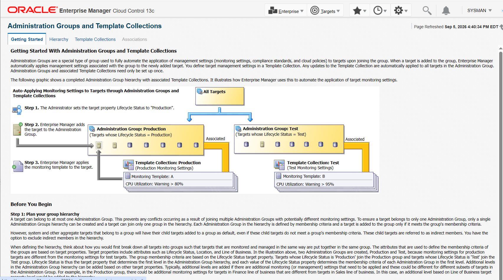

Finish §§7.1 to 7.3 in one visit. The Hierarchy tab warns that changing tabs
before clicking **Create** loses the work.

### 7.1 Add the level

Click **Hierarchy**. Both panels start empty.

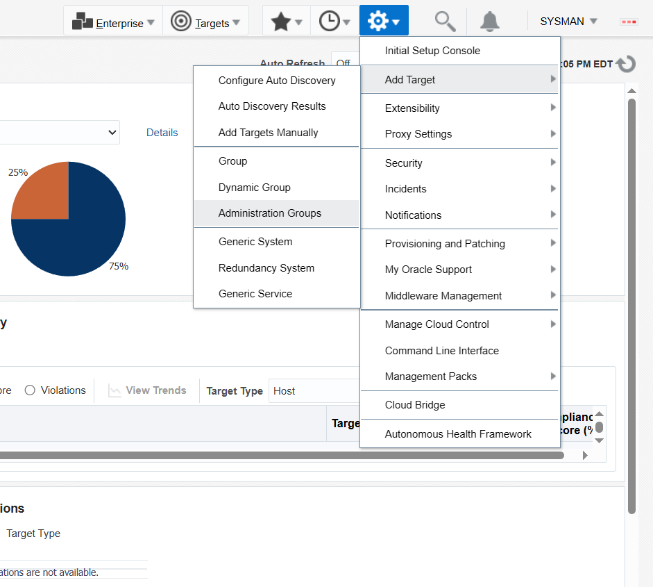

In **Hierarchy Levels**, click the arrow beside **Add** and pick **Lifecycle
Status**.

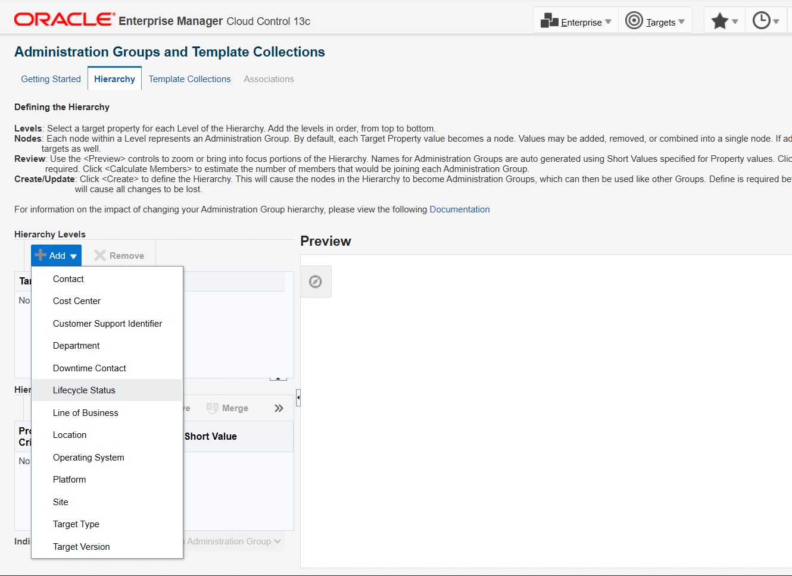

One level only. All five Lifecycle Status values appear as nodes, each with an
auto-generated Short Value.

```
Administration Group Hierarchy
└── Lifecycle Status
    ├── Production
    ├── Test
    └── Development
```

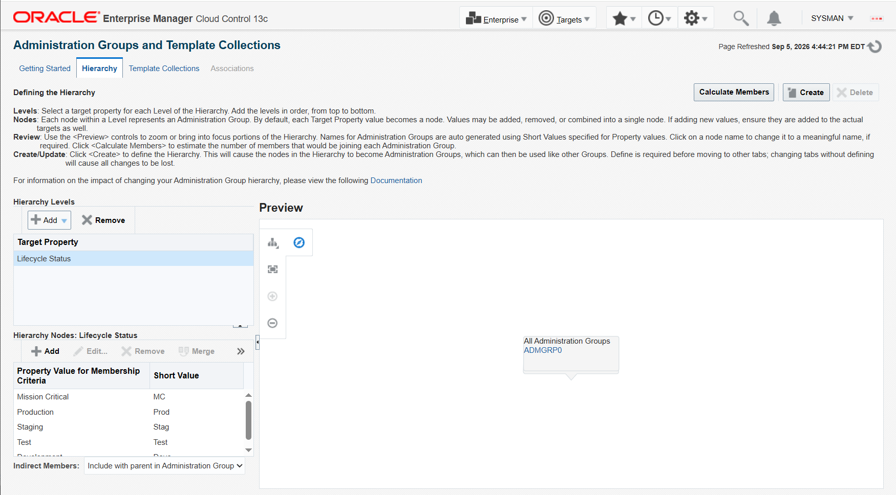

### 7.2 Keep three nodes

Keep `Production`, `Test` and `Development`. Select `Mission Critical` and click
**Remove**, then do the same for `Staging`. Each node kept needs its own template
collection, and this estate has no targets in those two tiers.

**Add** in the same toolbar opens a shuttle dialog that does the same job.

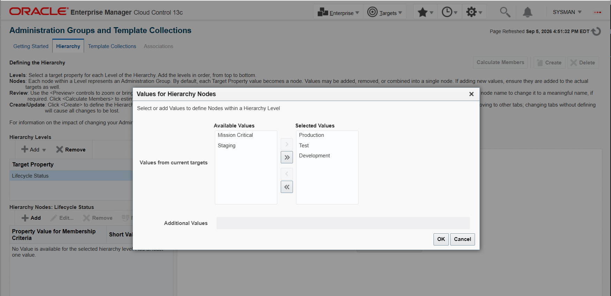

Leave **Indirect Members** at **Include with parent in Administration Group**.

### 7.3 Create

1. Click **Calculate Members**. The count after each group name reads `(0)` until
   §10 assigns Lifecycle Status.
2. Rename a node by clicking its name in the **Preview** pane. `Deve-Grp` is a
   truncation.
3. Click **Create**, then **OK**, and refresh.

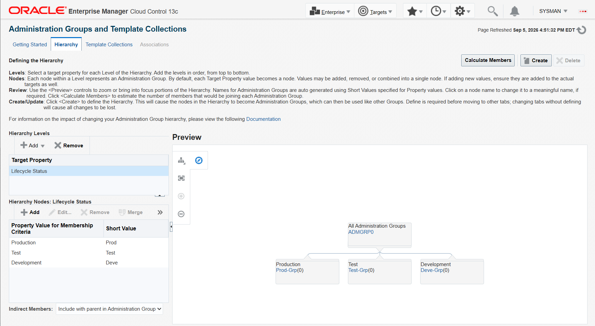

The button now reads **Update** and **Delete** is enabled. That confirms the
hierarchy exists.

---

## 8. Build the monitoring templates

A monitoring template holds metric thresholds for **one target type** and applies
to targets of that type only.

**Enterprise → Monitoring → Monitoring Templates → Create**

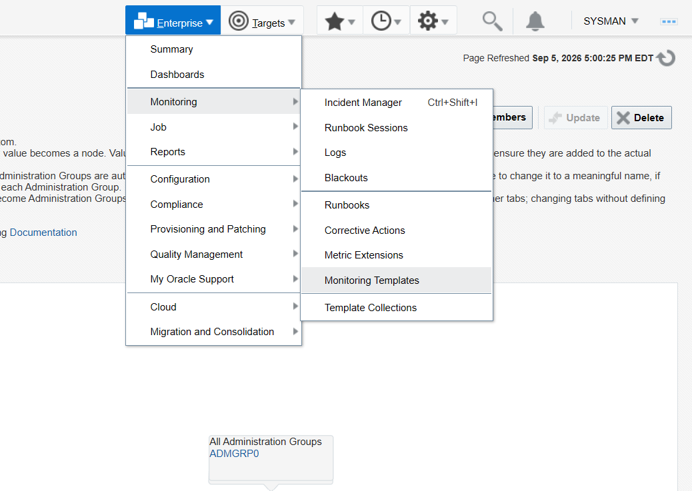

### 8.1 Seven templates

| Template | Target Type Category | Target Type | Tier |
|---|---|---|---|
| `TPL_DB_PROD` | Databases | Database Instance | Production |
| `TPL_DB_TEST` | Databases | Database Instance | Test |
| `TPL_DB_DEV` | Databases | Database Instance | Development |
| `TPL_RACDB_PROD` | Databases | Cluster Database | Production |
| `TPL_CLUSTER_PROD` | Databases | Cluster | Production |
| `TPL_HOST_PROD` | Servers, Storage and Network | Host | Production |
| `TPL_HOST_NONPROD` | Servers, Storage and Network | Host | Test and Development |

Cluster templates in Production only. Host thresholds are not tiered between Test
and Development.

### 8.2 Copy Monitoring Settings

Set **Copy Monitoring Settings using** to **Target Type**, pick the category and
type from the table, then **Continue**.

**Target Type** does not require a target of that type to exist, which is what
allows the two cluster templates to be built before discovery runs.

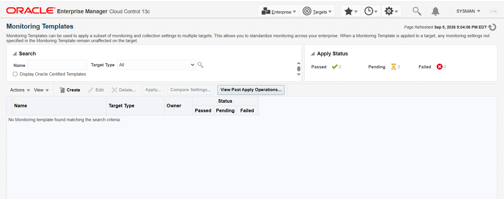

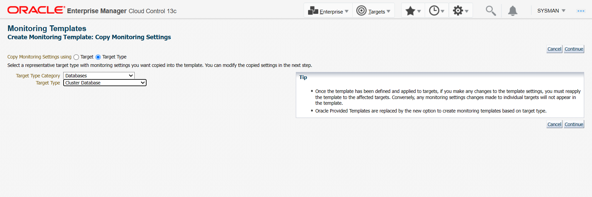

### 8.3 General tab

Enter the **Name** and a **Description**. **Target Type** and **Owner** are fixed.

**Leave Default Template unchecked.** Checked, it applies the template to every
newly discovered target of that type regardless of Lifecycle Status, which
bypasses the groups entirely.

Then go to **Metric Thresholds**.

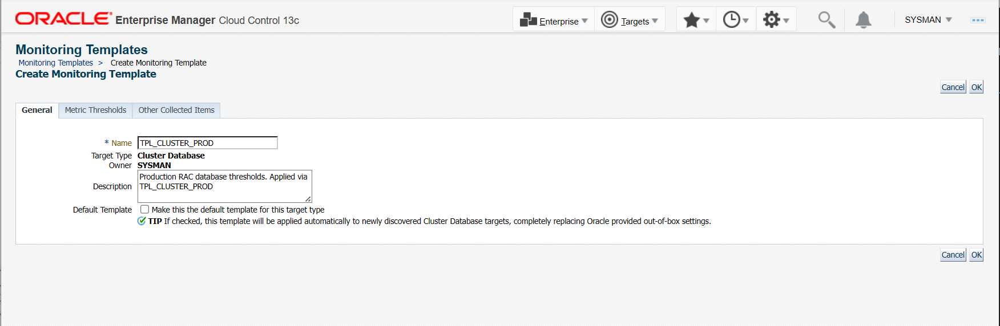

### 8.4 Metric Thresholds tab

Seeding from Target Type already loaded Oracle's defaults. Change only these.

**Database-level metrics.** For RAC these live on the Cluster Database target, not
the instances, so set them in `TPL_RACDB_PROD` as well as `TPL_DB_*`.

| Metric | Production | Test | Development |
|---|---|---|---|
| Tablespace Space Used (%) | 85 / 95 | 90 / 97 | 92 / 97 |
| Archive Area Used (%) | 80 / 90 | 85 / 95 | 90 / 95 |
| Failed Login Count | 50 / 150 | default | default |

**Instance-level metrics.** `TPL_DB_*` only.

| Metric | Production | Test | Development |
|---|---|---|---|
| Session Limit (%) | 80 / 90 | 90 / 95 | 95 / 98 |

Lower tiers get looser thresholds rather than disabled metrics. Notification
differences belong in incident rules.

**Failed Login Count needs `audit_trail` set to `DB` or `XML`** or it never
registers.

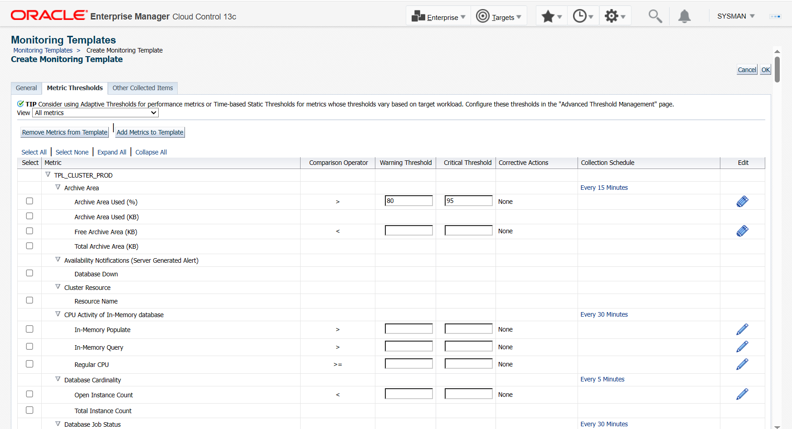

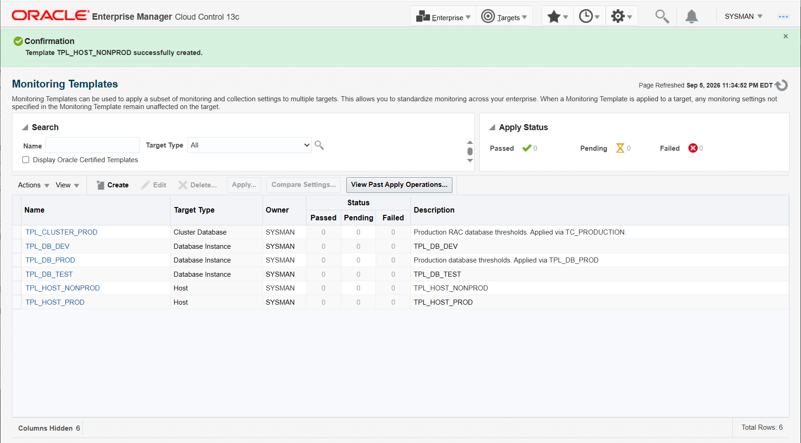

---

## 9. Create and associate the template collections

**Setup → Add Target → Administration Groups → Template Collections tab**

### 9.1 One collection per tier

| Collection | Contains |
|---|---|
| `TC_PRODUCTION` | `TPL_DB_PROD`, `TPL_HOST_PROD`, `TPL_RACDB_PROD`, `TPL_CLUSTER_PROD` |
| `TC_TEST` | `TPL_DB_TEST`, `TPL_HOST_NONPROD` |
| `TC_DEVELOPMENT` | `TPL_DB_DEV`, `TPL_HOST_NONPROD` |

A collection holds templates for several target types. Whichever template matches
a joining target's type is the one applied.

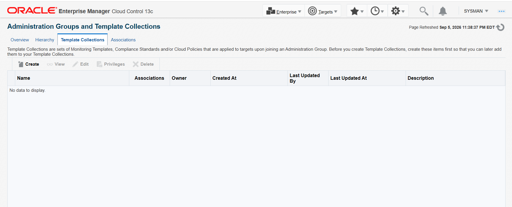

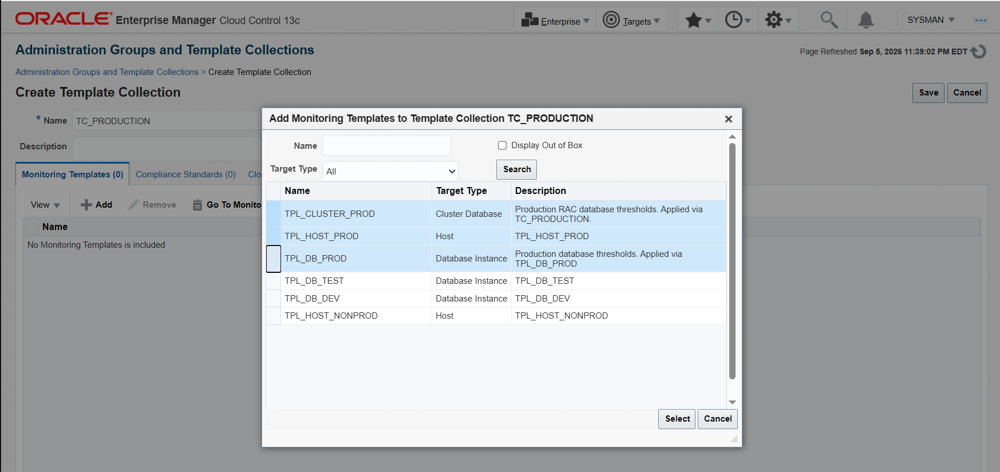

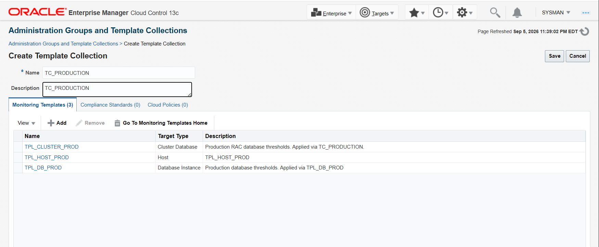

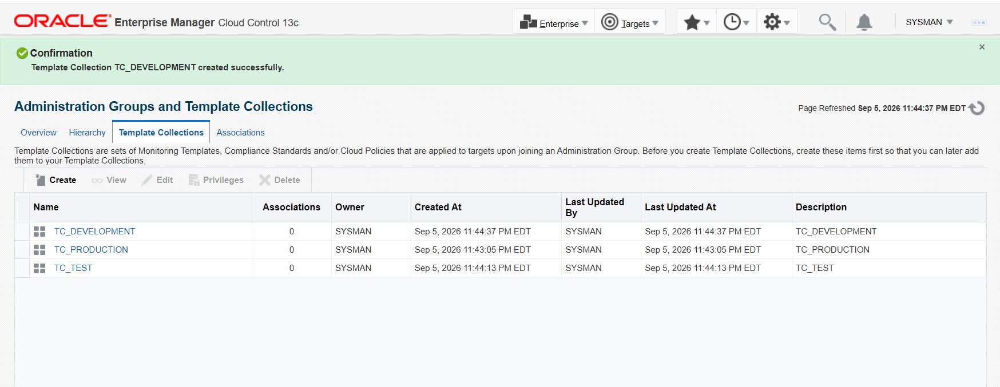

### 9.2 Associate each collection with its group

The **Associations** tab is the documented route. **Associate Template Collection**
did not enable there on this estate, with or without a node selected. The Groups
page reaches the same action and works.

**Setup → Add Target → Groups**

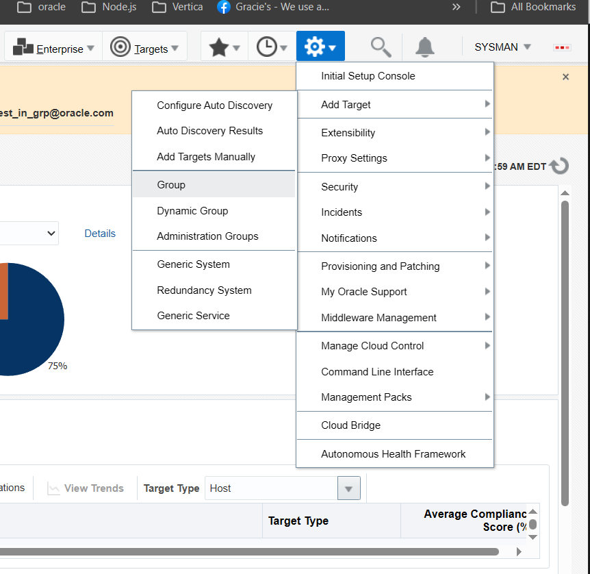

The page opens on a create dialog. Click **Cancel**.

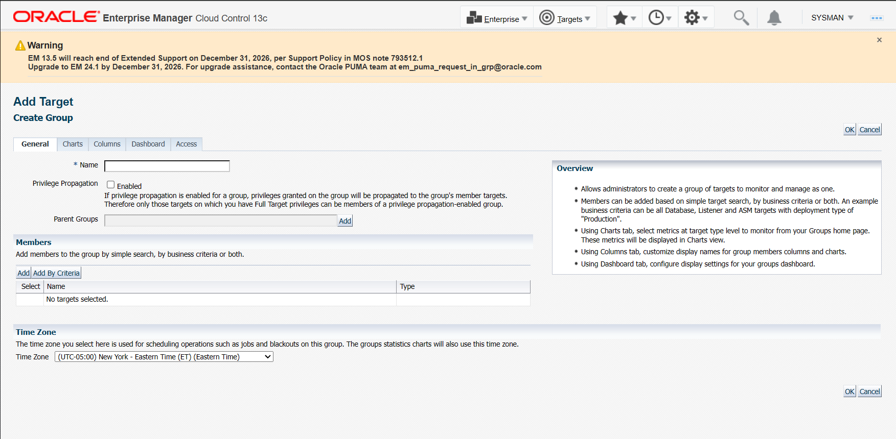

Cancelling lands on the **Groups** list. Select the administration group by name.

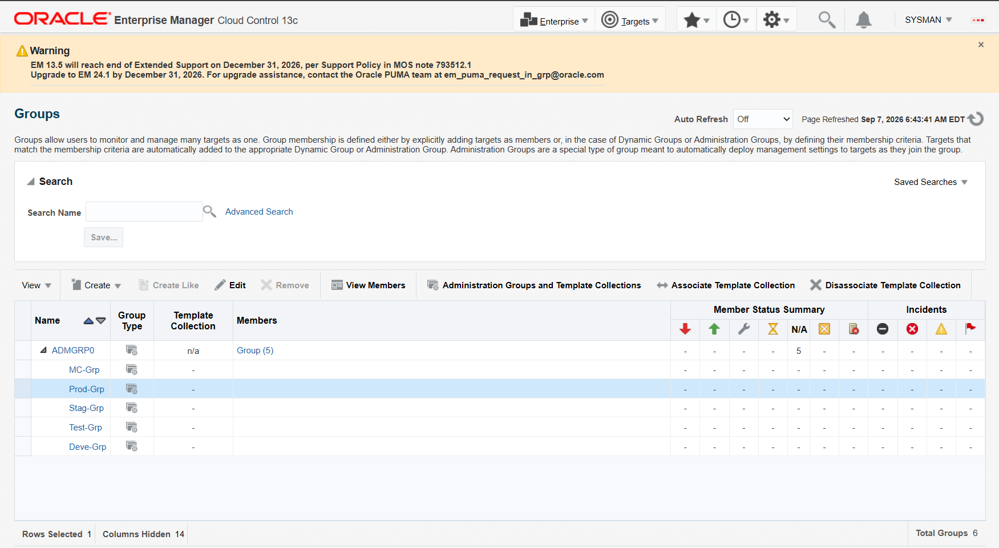

**Associate Template Collection** enables once a group row is selected. Click it,
choose the collection, click **Select**, then **Continue**.

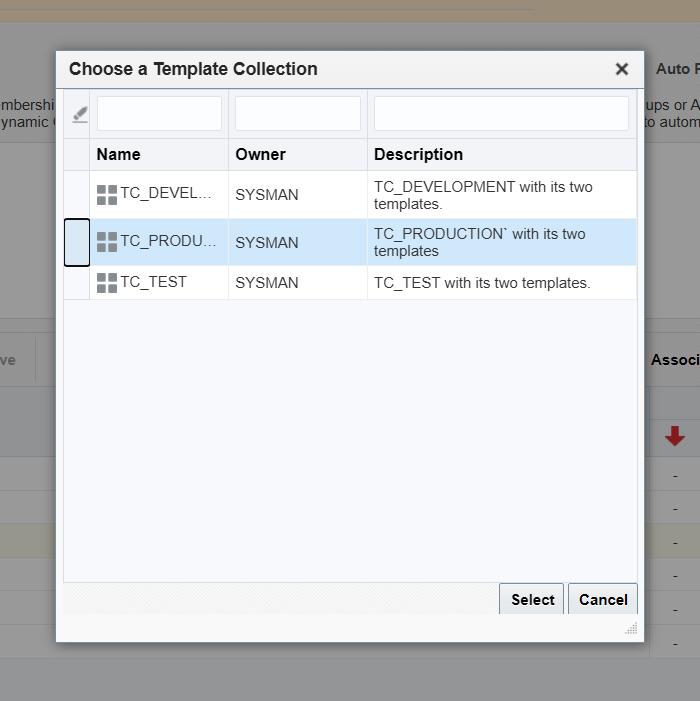

Repeat for the other two tiers.

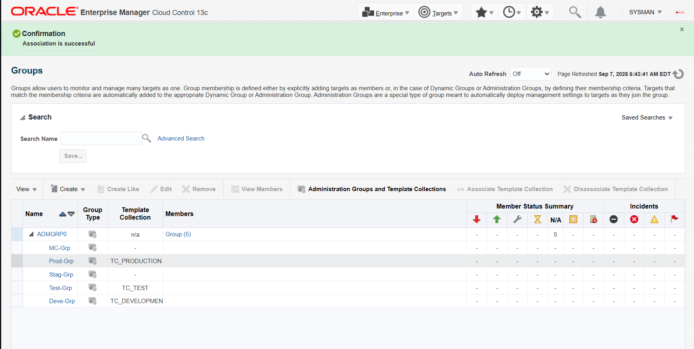

Verify on **Administration Groups → Associations**. Each node shows its
collection, and the Template Collections tab's **Associations** column moves from
`0` to `1`.

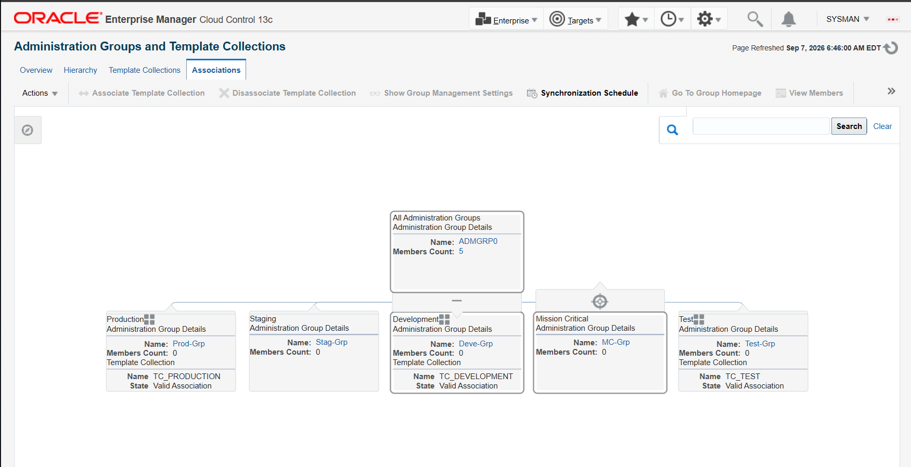

There is no `emcli` verb for this association.

---

## 10. Assign Lifecycle Status

This populates the groups.

### 10.1 The assignment

| Lifecycle Status | Hosts |
|---|---|
| Production | `oemserver01`, `oradbserv05`, `oradbserv06` |
| Test | `oradbserv09`, `oradbserv10` |
| Development | `oradbserv01`, `orappsserv01`, `oradbserv04` |

The standby cluster `usatclust2` is Test because that is where switchover testing
happens, and a cluster taken down as part of a test should not alert at Production
thresholds.

Accepted values: `Development`, `MissionCritical`, `Production`, `Stage`, `Test`.
Note `Stage`, not Staging, and `MissionCritical` as one word.

### 10.2 Propagation

Every target carries its own Lifecycle Status and is matched on its own.

| Parent | Propagates to members |
|---|---|
| Cluster target types, for example `usatclust1` or the `apexdb` cluster database | Automatically |
| Group and system targets, for example a `_sys` Database System target | With `-propagate_to_members` |
| A host | Not at all. A host is not a parent of the databases on it |

Propagation reaches current members only, not targets added later.

### 10.3 On targets already promoted

**Targets → All Targets**, select the targets for one tier, right-click, then
**Target Setup → Properties**. Set **Lifecycle Status**.

Do the cluster and system targets first and let propagation cover their members.

### 10.4 During promotion

A target being promoted takes its Lifecycle Status in the wizard, which avoids a
second pass.

**Setup → Add Target → Auto Discovery Results**

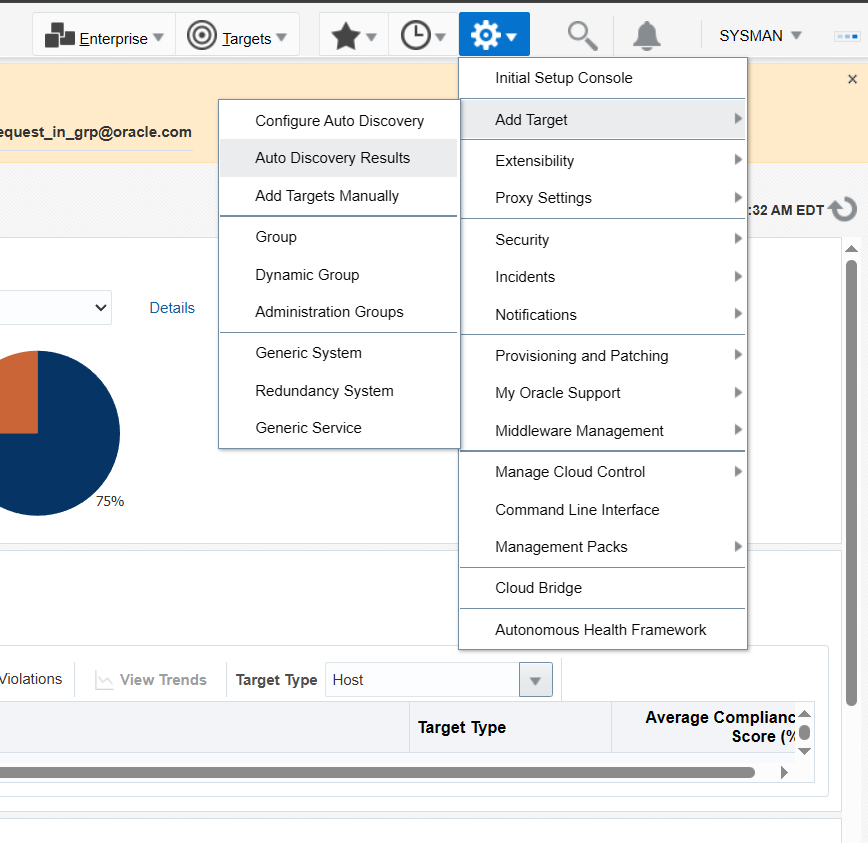

Targets are promoted one type at a time.


Use **Search** to narrow to one target. This example promotes `+ASM_usatclust1`.

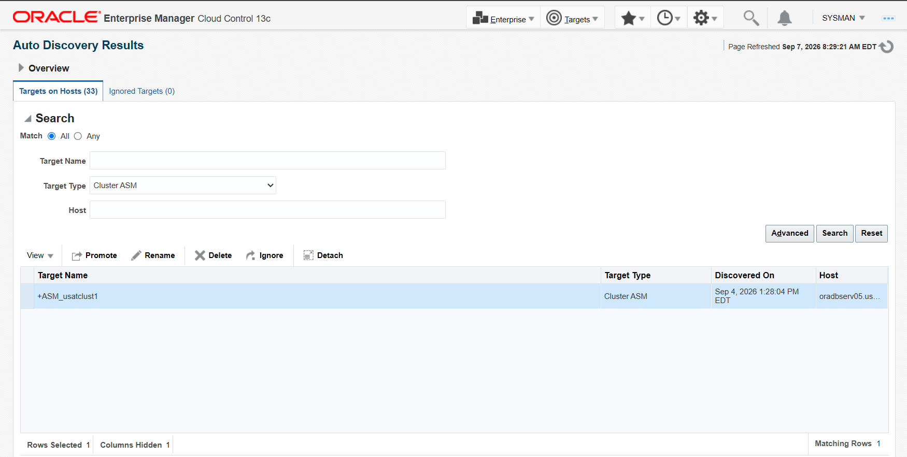

Select it and click **Promote**. Step 1 of 2 carries two buttons at the top right.

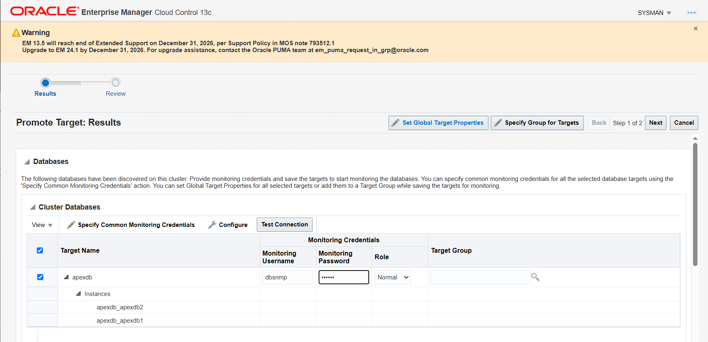

**Set Global Target Properties** opens a dialog with Contact, Cost Center,
Department, Lifecycle Status, Line of Business and Location. Set Lifecycle Status
and click **OK**.

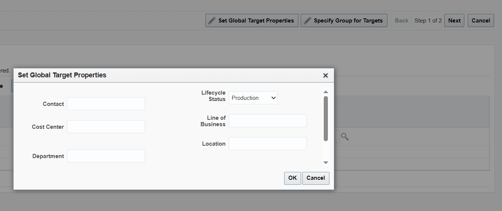

**Specify Group for Targets** opens a picker filtered to Target Type `Group`.
Select `Prod-Grp` and click **Select**. This is optional; the target joins on its
Lifecycle Status alone.

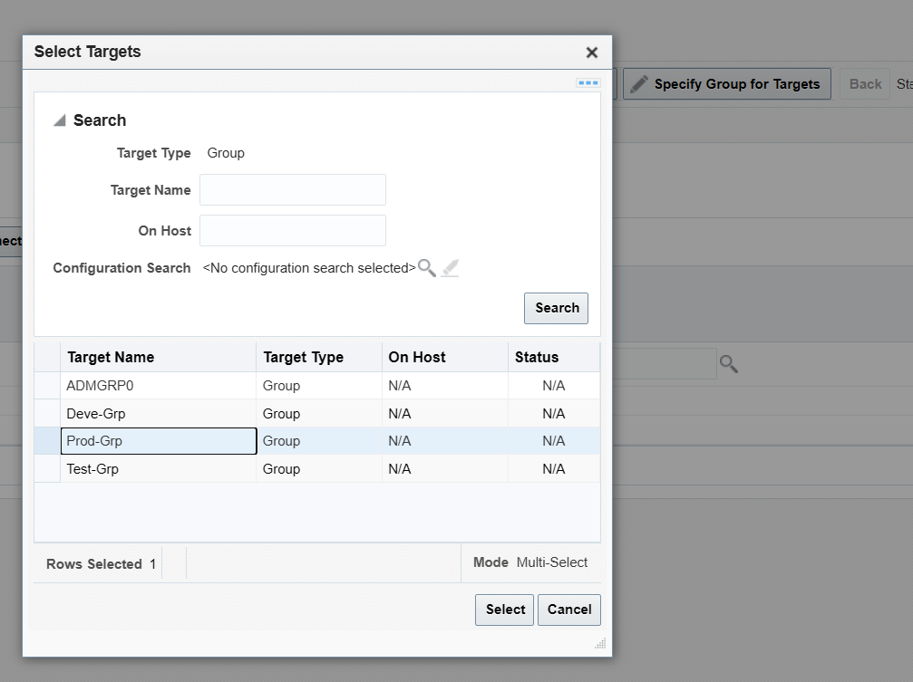

Set **Monitoring Credentials**, click **Test Connection**, then **Next**.

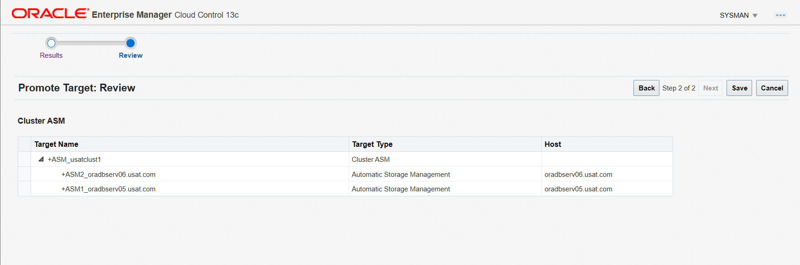

Click **Save**, follow the prompts, then **OK**.

`emcli` equivalents are in [Appendix A](#appendix-a-emcli-equivalents).

---

## 11. Verify

Open each group node. Members should be present, and the **Synchronization Status**
region reports Synchronized, Pending, Running, Failed, Excluded and N/A counts per
item. Any non-zero Failed count is where to look first.

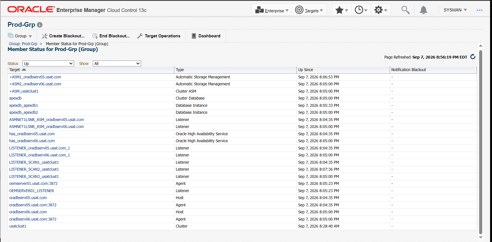

| # | Check | Expected |
|---|---|---|
| 1 | Hierarchy has three nodes | Production, Test, Development |
| 2 | Seven templates exist | §8.1 |
| 3 | Three collections associated | Associations column reads `1` for each |
| 4 | Each node has members | Non-zero |
| 5 | No failed targets in Synchronization Status | Zero |
| 6 | A Production threshold matches its template | Tablespace Space Used 85 / 95 |
| 7 | The same metric differs on Development | 92 / 97 |
| 8 | Target count unchanged | Grouping adds no targets |

An empty group means the Lifecycle Status did not take. Read the property back
rather than re-running the hierarchy wizard.

---

## 12. Discover and promote the remaining targets

### ➜ [Discovering and Promoting Targets in Enterprise Manager 13.5](oem-discover-and-promote-targets.md)

Run once per host. Set Lifecycle Status during promotion, as in §10.4.

| Host | What to expect |
|---|---|
| `oradbserv05` | Node 1 of `usatclust1`, deferred from Part 1 so the gold image was cut clean |
| `oradbserv06` | Node 2 of `usatclust1`. Its targets join the existing `apexdb` cluster database |
| `oradbserv09`, `oradbserv10` | `usatclust2` and `apexdb_stby`. Add the Data Guard association afterwards |
| `oradbserv04` | Host only. Part 4 monitors what runs on it |

Discovery can surface a target type no template covers. Such a target joins its
group normally and keeps its default monitoring, with no error raised. Add a
template to the collection where a type is worth tiering.

Record the estate target count from **Targets → All Targets** and write it into
the [index](phase-7b-extending-coverage.md). Part 1 recorded 168 before any agent
was installed.

---

## Appendix A: `emcli` equivalents

```bash
. ~/.env/oms_env
emcli login -username=sysman
emcli sync
```

Assign Lifecycle Status. A cluster target propagates automatically, a system or
group target only when asked, and a single target not at all.

```bash
emcli set_target_property_value \
  -property_records="apexdb:rac_database:Lifecycle Status:Production"

emcli set_target_property_value \
  -property_records="oemcdb_sys:oracle_dbsys:Lifecycle Status:Production" \
  -propagate_to_members

emcli set_target_property_value \
  -property_records="oradbserv05.usat.com:host:Lifecycle Status:Production"
```

Read it back:

```bash
emcli get_target_property_value \
  -target_names="oradbserv05.usat.com" -target_types="host" \
  -property_names="Lifecycle Status"
```

`-property_records` takes `target_name:target_type:property_name:value`, separated
by `;` for several. Only one property propagates at a time.

**Confirm the property name before scripting a long list.** Oracle's reference
gives `Lifecycle Status`, while its own example uses `LifeCycle Status`. A name
that does not match sets nothing and reports no error.

```bash
emcli list_target_property_names
```

Groups, collections and target count:

```bash
emcli get_targets -targets=composite
emcli list_template_collections
emcli get_targets | wc -l
```

---

## Related pages

- [Discovering and Promoting Targets](oem-discover-and-promote-targets.md), the standing procedure §12 runs once per host
- [Part 1: The reference agent](phase-7b-part1-reference-agent.md)
- [Part 3: Agent gold image](phase-7b-part3-golden-image.md)

**Sources:**
[Administration Groups and Template Collections (13.5)](https://docs.oracle.com/en/enterprise-manager/cloud-control/enterprise-manager-cloud-control/13.5/emmon/administration-groups-and-template-collections.html) ·
[`set_target_property_value`](https://docs.oracle.com/en/enterprise-manager/cloud-control/enterprise-manager-cloud-control/13.4/emcli/set_target_property_value.html) ·
[Using Monitoring Templates](https://docs.oracle.com/cd/E63000_01/EMADM/mon_temp.htm)
