# Phase 7b Part 3: Agent Gold Image

**SOP: build a versioned Management Agent image from a reference agent, then use it to install agents on four unmonitored hosts**

Part 3 of 4, and the next step after Part 1 §4.
[Part 1](phase-7b-part1-reference-agent.md) deployed a single reference agent
to `oradbserv05`. **Part 3 (this page)** cuts a gold image from that agent and
uses it to install agents on `oradbserv04`, `oradbserv06`, `oradbserv09` and
`oradbserv10`.

Discovery has not run on any of these hosts yet. The image is a software baseline
(agent version, patches, plug-ins), not a copy of `oradbserv05`, and cutting it
before discovery keeps it a plain 13.5 agent. Targets are discovered on all five
hosts in
[Part 2 §12](phase-7b-part2-admin-groups.md#12-discover-and-promote-targets--all-five-hosts),
after the administration groups exist to receive them.

Status: 🟩 Confirmed. Ran against the live lab on 2026-09-04 and 2026-09-05.

| # | Section | Status |
|---|---|---|
| 13 | Confirm the reference agent | 🟩 Confirmed |
| 14 | Create the gold image and its first version | 🟩 Confirmed |
| 15 | Install agents on the four remaining hosts | 🟩 Confirmed |
| 16 | Subscriptions | 🟩 Confirmed |
| 17 | Verification | 🟩 Confirmed |

**Result:** gold image `GI_AGENT_LINUX_X64`, version `V1_13.5.0.0.0_BASE`, cut
from `oradbserv05` and set Current. Agents installed from that image on
`oradbserv04`, `oradbserv06`, `oradbserv09` and `oradbserv10`. All four subscribed
automatically, all four on V1 Current, zero drifters. Six agents Up and uploading
with Secure Upload enabled.

Screenshots are in [`screenshots/`](screenshots/), named `7c-NN[a-z]-slug.png` to
match this page's section numbers (13 to 17).

---

## Contents

13. [Confirm the reference agent](#13-confirm-the-reference-agent)
14. [Create the gold image and its first version](#14-create-the-gold-image-and-its-first-version)
15. [Install agents on the four remaining hosts](#15-install-agents-on-the-four-remaining-hosts)
16. [Subscriptions](#16-subscriptions)
17. [Verification](#17-verification)
18. [Screenshot checklist](#18-screenshot-checklist)

**Console first.** Every section is written as console steps.
[Appendix A](#appendix-a-emcli-equivalents) gives the `emcli` equivalents.
[Appendix B](#appendix-b-additional-scenarios) covers two situations outside this
build.

---

## What a gold agent image is

A gold agent image is a named, versioned snapshot of a Management Agent: its
version, its patches and its deployed plug-ins. It has two uses.

| Use | What it does | Where |
|---|---|---|
| Provisioning | Installs a new agent on a host that has none, carrying the image's version, patches and plug-ins | §15 |
| Lifecycle | Existing agents subscribe to the image. A new version can then be staged and pushed to all subscribers in one operation, and the console reports which have drifted | §16, and later agent patching |

This build uses provisioning. One agent is installed by hand, an image is cut from
it, and the remaining four hosts are installed from that image.

Two agents in this estate cannot use gold images at all. Oracle states: *"You
cannot update a central agent with an Agent Gold Image."* The central agent is the
one installed with every OMS, which here is `oemserver01`. The image source agent,
`oradbserv05`, cannot subscribe to the image cut from it.

---

## Prerequisites

`oracle` needs passwordless sudo on each host that will receive an agent. Without
it the deployment prerequisite check fails with *"visiblepw is not set in the
sudoers file"*.

Verify over SSH rather than locally. EM runs sudo without a TTY, and a local
`sudo true` can succeed where EM's attempt fails.

```bash
for h in oradbserv04 oradbserv06 oradbserv09 oradbserv10; do
  printf '%-16s ' "$h"
  ssh oracle@${h}.usat.com sudo -n true 2>/dev/null && echo OK || echo MISSING
done
```

Where it is missing, as `root` on that host:

```bash
visudo -f /etc/sudoers.d/11-oracle     # add:  oracle ALL=(ALL) NOPASSWD: ALL
chmod 0440 /etc/sudoers.d/11-oracle
```

The RAC nodes receive this from `os_prep`'s `/etc/sudoers.d/11-oracle-grid`.
`oradbserv04` was built outside the Ansible baseline and does not have it.

---

## 13. Confirm the reference agent

The image takes the software state of the source agent: its version, its patches
and its plug-ins. It does not take that host's targets, its `emd.properties` or
its instance directory.

Oracle imposes two conditions on the source agent, both met by `oradbserv05`:

- It must be a standalone agent, not a central agent.
- It must be a secure agent.

### 13.1 Inspect the reference

**Who:** `oracle`
**Where:** `oradbserv05`

```bash
export AGENT_HOME=/u01/app/oracle/Middleware/agent/13_5/agent_13.5.0.0.0
$AGENT_HOME/bin/emctl status agent
$AGENT_HOME/OPatch/opatch lspatches
$AGENT_HOME/bin/emctl listplugins agent
```

From the OMS:

```bash
. ~/.env/oms_env
emcli login -username=sysman
emcli list_plugins_on_agent -agent_names="oradbserv05.usat.com:3872"
```

| Check | Expected |
|---|---|
| Agent status | `Running and Ready`, with a real `Last successful upload` timestamp |
| Patches | Whatever 13.5 shipped, plus anything applied deliberately |
| Plug-ins | The 13.5 agent defaults. No discovery has run on this host |
| Hand-edited configuration | None |

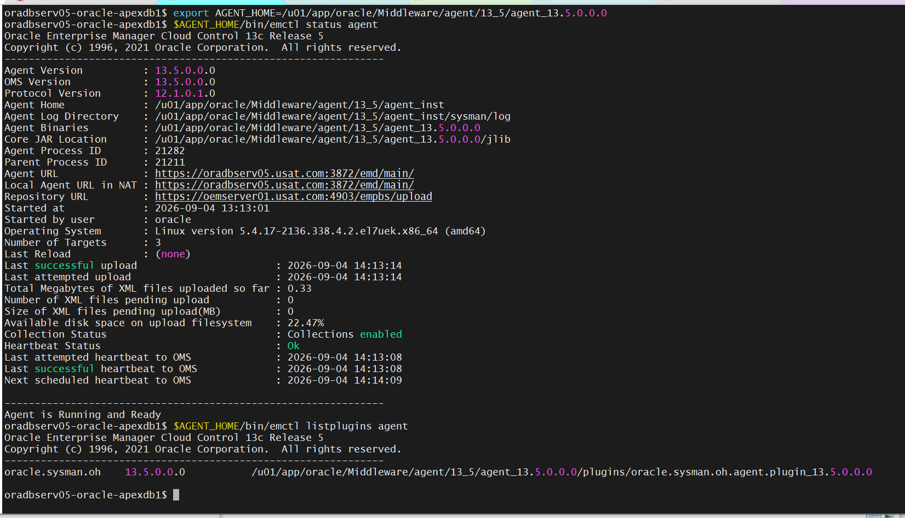

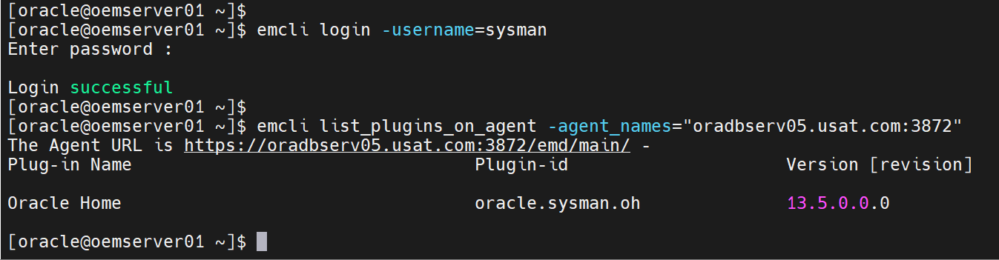

### 13.2 Record what the reference contains

```bash
$AGENT_HOME/OPatch/opatch lsinventory -detail > ~/agent_reference_v1.txt
$AGENT_HOME/bin/emctl listplugins agent >> ~/agent_reference_v1.txt
```

§15.4 compares each provisioned agent against this file.

---

## 14. Create the gold image and its first version

### 14.0 Prerequisite: Software Library upload location

Gold agent images are stored in the Software Library. Without a configured upload
location, image creation fails at the final step, after the agent has completed
its work. The job log ends with:

```
Storing gold agent image
oracle.sysman.core.goldagentimage.exception.GoldImageOperationException:
  Unable to store gold agent image V1_13.5.0.0.0_BASE
```

**Setup → Provisioning and Patching → Software Library**

If a location is listed, continue to §14.1. If not, create one:

1. On the **Software Library: Administration** page, select **OMS Shared File system**
2. Click **+Add**
3. Enter a unique name, the host, and a path on the OMS host
4. Click **OK**

Credentials are optional and are used only for transferring files.

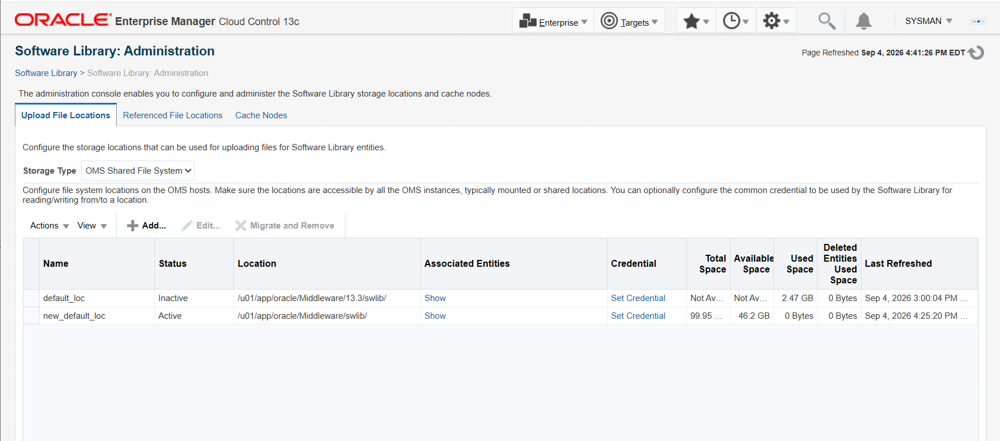

| Field | Guidance |
|---|---|
| Storage type | OMS Shared File system, which is Oracle's recommended option |
| Path | A filesystem with headroom. Each image version is roughly 1 GB and versions accumulate. Check `df -h` first. `/u01` on `oemserver01` was 85% used at Phase 7a |

The first upload location submits a job named `SWLIBREGISTERMETADATA_*`, which
imports plug-in metadata from the OMS Oracle home. Wait for it to succeed before
§14.1.

`emcli` equivalent: [Appendix A.1](#a1-software-library-140).

### 14.1 Create the image

**Setup → Manage Cloud Control → Gold Agent Images**

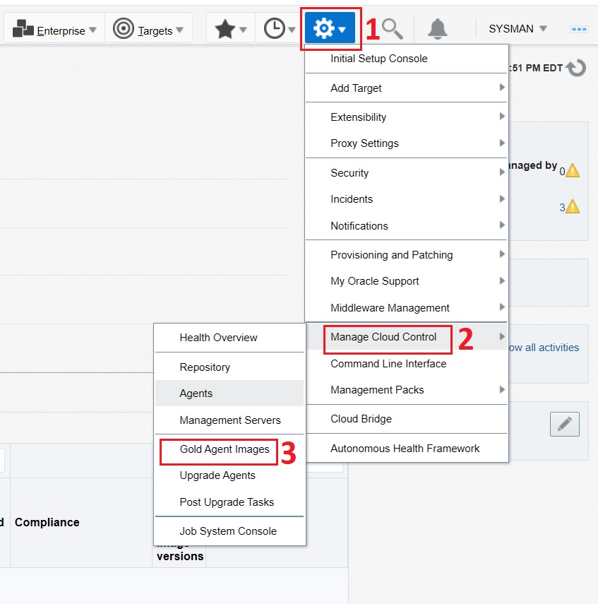

Click **Manage All Images**.

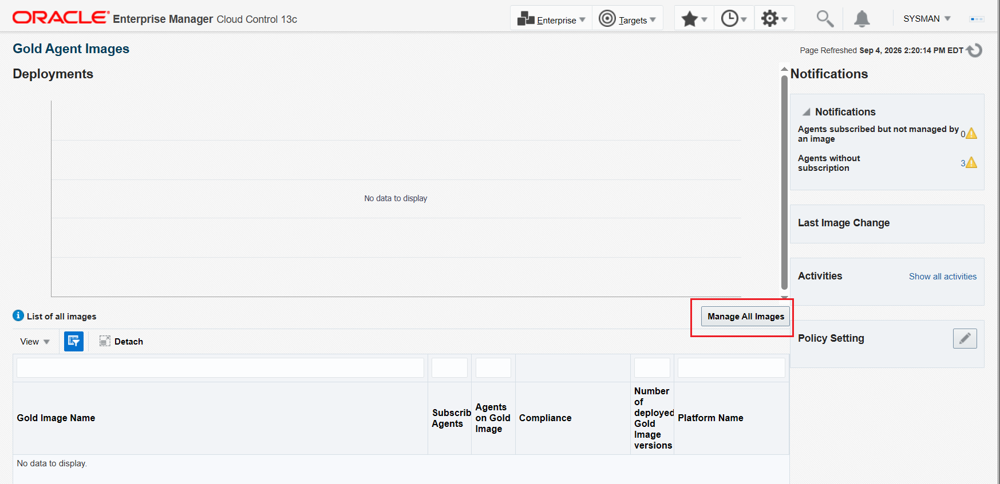

Click **Create**.

| Field | Value |
|---|---|
| Image Name | `GI_AGENT_LINUX_X64` |
| Description | `Agent Gold Image Linux` |
| Platform | `Linux x86-64` |

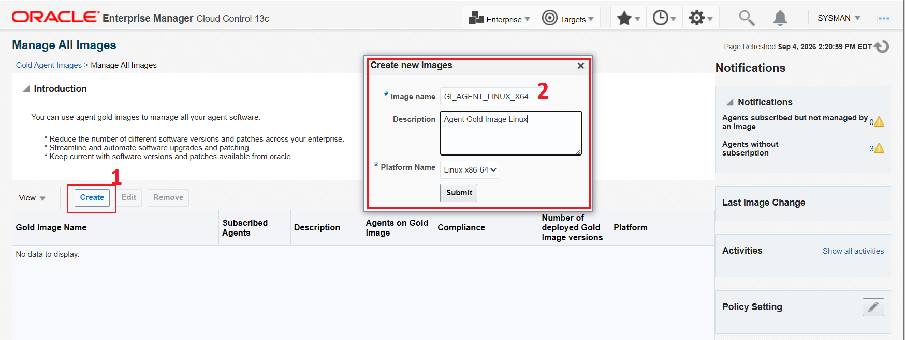

One image serves one platform. An image cannot be deployed to an agent on a
different platform, or installed as a different OS user than the one it was built
from. All five hosts here are Linux x86-64 with `oracle` as the install user.

### 14.2 Create version 1 from the reference agent

Select the newly created gold image from the list, then:

**Manage Image Versions and Subscriptions → Versions and Drafts tab → Actions → Create**

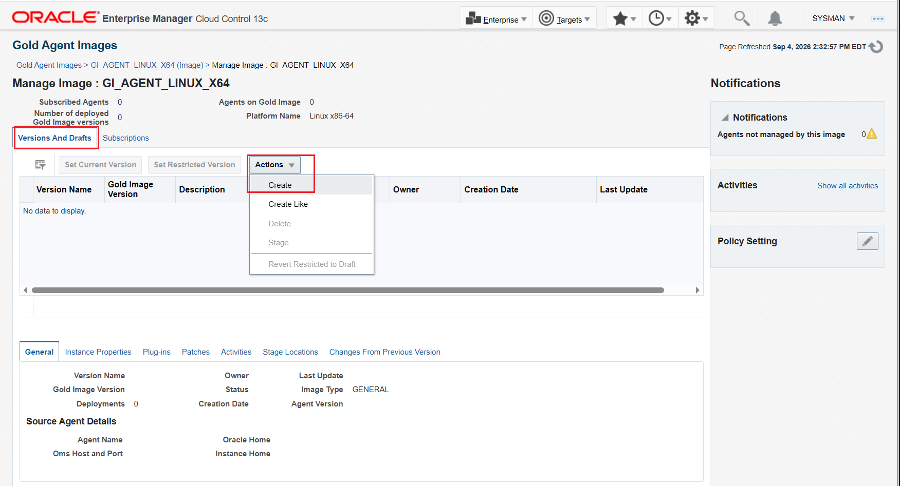

| Field | Value |
|---|---|
| Version Name | `V1_13.5.0.0.0_BASE` |
| Create image by | Selecting a source agent |
| Source agent | `oradbserv05.usat.com:3872` |

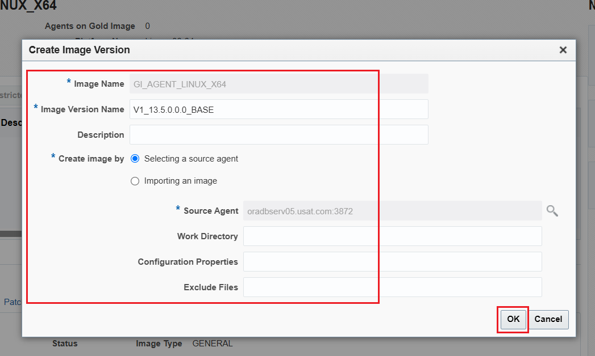

The version name is capped at 20 characters. `V1_13.5.0.0.0_BASE` is 18.

The form offers three optional fields. Leave all three empty for this build.

| Field | Default | Purpose |
|---|---|---|
| Work Directory | `$AGENT_INSTANCE_HOME/install` | Scratch space used while building the image. Requires 750 MB free |
| Configuration Properties | empty | Names from the source agent's `emd.properties` to capture into the image, separated by semicolons, for example `MaxThread;GracefulShutdown` |
| Exclude Files | empty | Relative paths to omit, separated by semicolons, for example `agent_13.5.0.0.0/cfgtoollogs/agentDeploy;agent_13.5.0.0.0/oui` |

There is no plug-in selection on this form. The image takes the plug-ins the
source agent has.

If the source agent's `emd.properties` has been edited since the agent last
started, reload it first so the version captures the running configuration:

```bash
$AGENT_HOME/bin/emctl reload agent
```

Click **OK** on the Create Image Summary.

Creating a version submits a job. Track it at
**Gold Agent Images → Image Activities** and confirm it succeeds before
continuing.

### 14.3 Set the version Current

A new version is created as a **Draft**. Draft versions cannot be used to install
or update agents. Setting the version Current is what makes it usable.

**Gold Agent Images → click the image name**

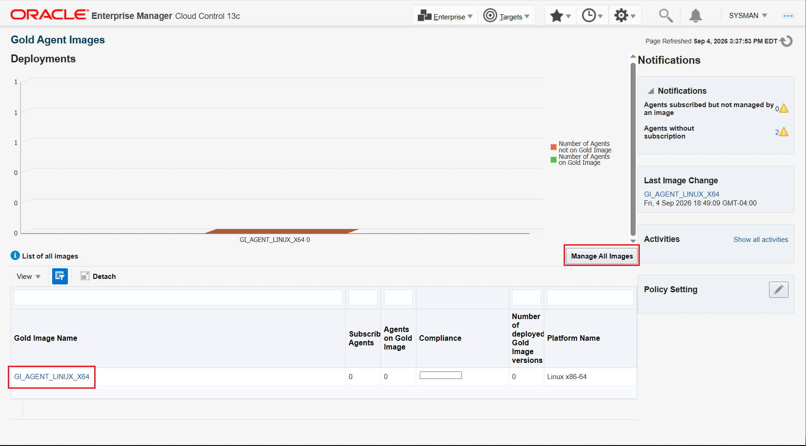

**Manage Image Versions and Subscriptions**

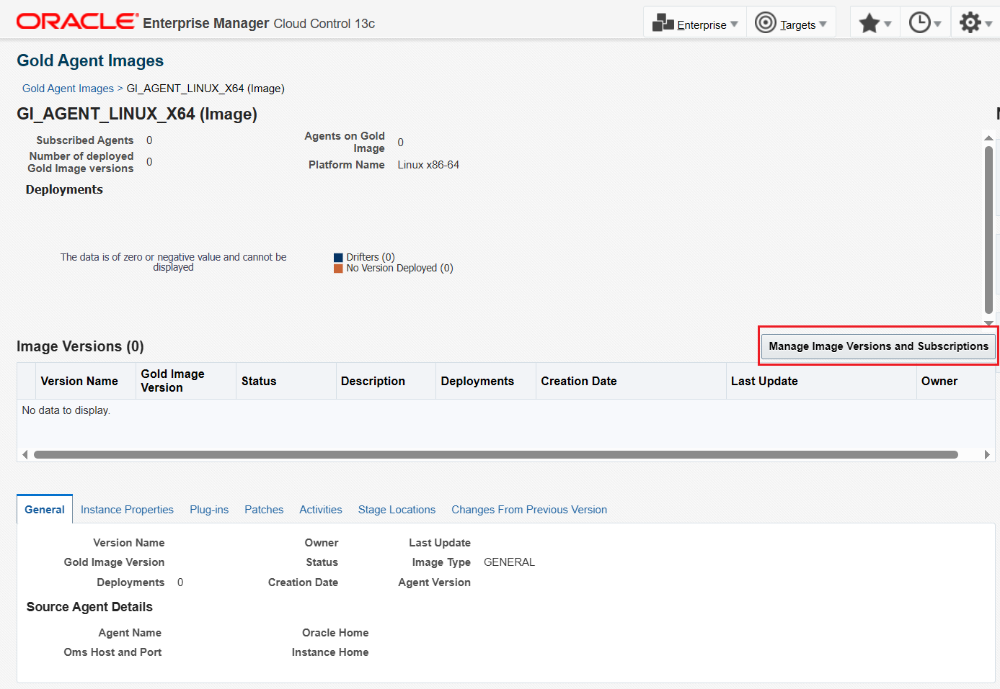

**Versions and Drafts → select the version → Set Current Version**

This also submits a job. Check **Image Activities** for the result.

Once a version is Active (Current) it cannot be reverted to Draft or Restricted.

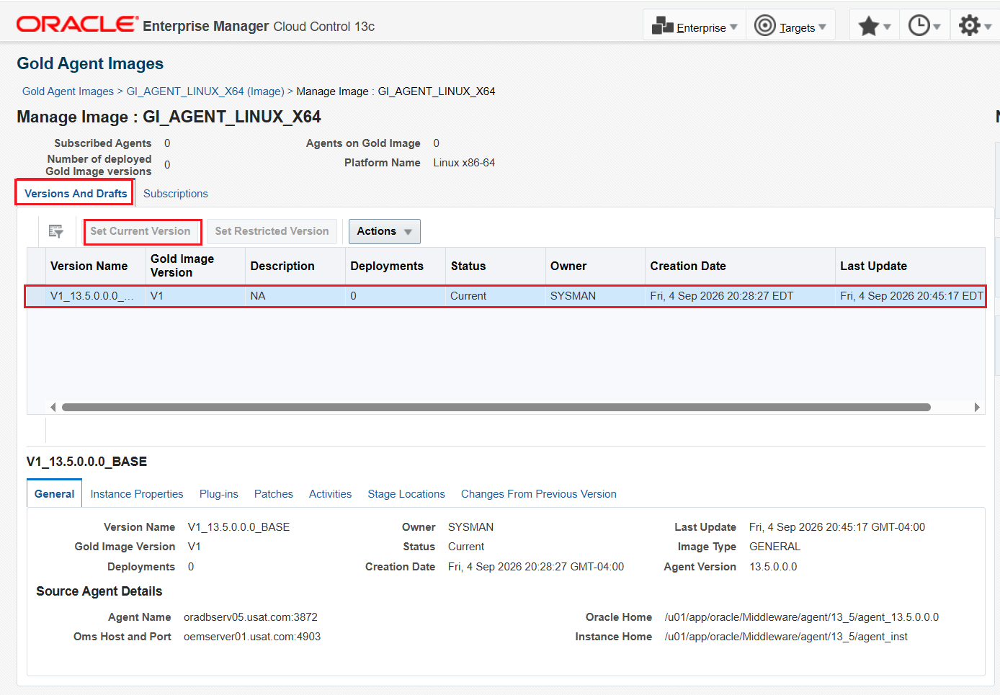

`emcli` equivalent for the whole of §14:
[Appendix A.2](#a2-create-the-image-and-version-141-to-143).

---

## 15. Install agents on the four remaining hosts

`oradbserv04`, `oradbserv06`, `oradbserv09` and `oradbserv10` have no agent. They
are installed from the image, so each arrives carrying V1's version, patches and
plug-ins.

### 15.1 Before you start

- The image must be Active (Current) from §14.3. A Draft version cannot be
  deployed from.
- Each host must meet
  [Part 1 §2](phase-7b-part1-reference-agent.md#2-host-prerequisites) and
  [Appendix B](phase-7b-part1-reference-agent.md#appendix-b-notes-for-the-remaining-hosts),
  including the passwordless sudo in [Prerequisites](#prerequisites) above.

### 15.2 Run the Add Host Targets wizard

**Setup → Add Target → Add Targets Manually → Install Agent on Host**

That page presents three panels. Use the leftmost, **Add Host Targets**. The
neighbouring **Add Target Manually** button registers a database or listener, not
an agent.

#### Page 1: Host and Platform

Expand **Agent Software Options**, which is collapsed beneath the Session Name
field, and select the gold image `GI_AGENT_LINUX_X64` version
`V1_13.5.0.0.0_BASE`.

Add the four hosts with platform `Linux x86-64`:

`oradbserv06.usat.com`, `oradbserv09.usat.com`, `oradbserv10.usat.com`,
`oradbserv04.usat.com`

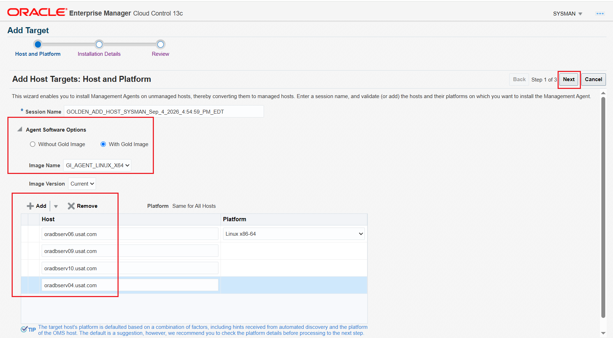

With **Platform → Same for All Hosts** selected, only the first row shows a
platform dropdown and the remaining rows inherit it. Confirm all four before
continuing. A wrong platform fails after the software has been staged.

If Agent Software Options offers no gold image, the wizard is performing a fresh
install rather than an image install. In that case cancel and use
[Appendix A.3](#a3-install-from-the-image-with-agentpullsh-152).

Click **Next**.

#### Page 2: Installation Details

| Field | Value |
|---|---|
| Installation Base Directory | `/u01/app/oracle/Middleware/agent/13_5` |
| Named Credential | `NC_HOST_ORACLE` |
| Port | Leave blank. The agent selects the first free port from 3872 |

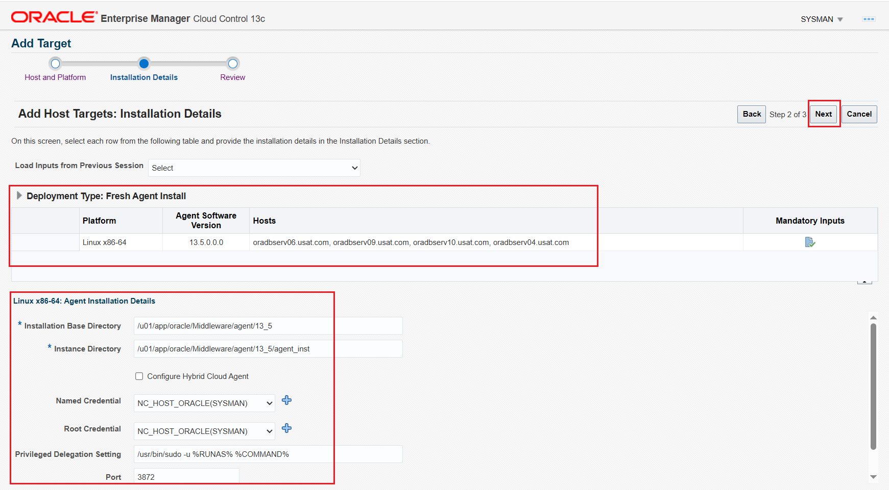

Click **Next**.

#### Page 3: Review

Click **Deploy Agent**.

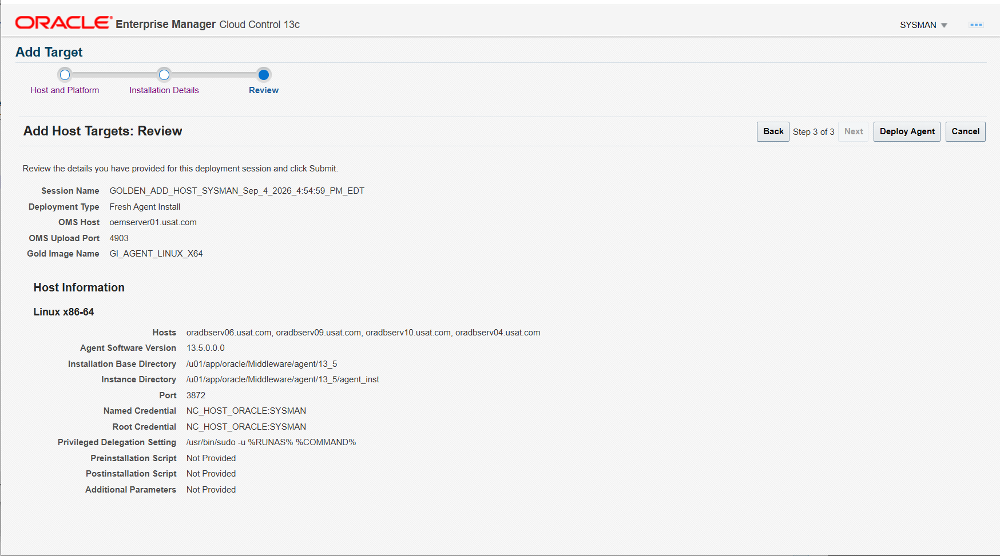

#### Agent Deployment Summary

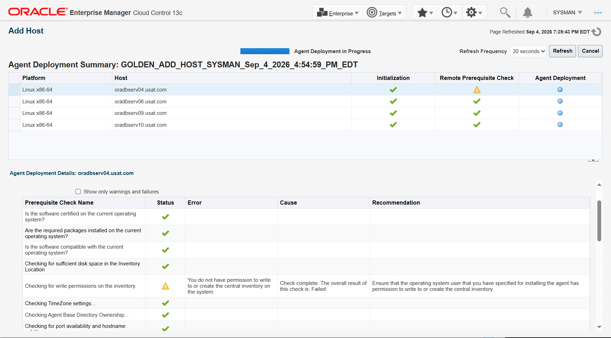

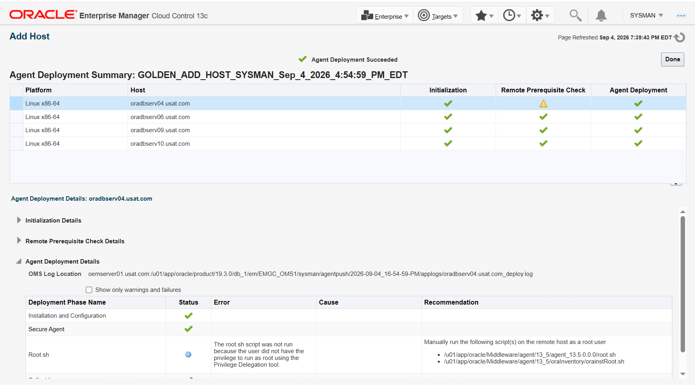

Track progress at **Setup → Add Target → Install Agent Results**.

### 15.3 Run `root.sh` on each host if you didn't use the sudo option.

**Who:** `root`
**Where:** each of `oradbserv04`, `06`, `09`, `10`

```bash
/u01/app/oracle/Middleware/agent/13_5/agent_13.5.0.0.0/root.sh
```

This sets ownership and the setuid bit on `nmosudo` and registers the agent's
`oraInst.loc`. Without it the agent cannot run privileged metric collections.

### 15.4 Confirm each agent is uploading and matches the image

**Who:** `oracle`
**Where:** each of `oradbserv04`, `06`, `09`, `10`

```bash
export AGENT_HOME=/u01/app/oracle/Middleware/agent/13_5/agent_13.5.0.0.0
$AGENT_HOME/bin/emctl status agent
$AGENT_HOME/OPatch/opatch lspatches
$AGENT_HOME/bin/emctl listplugins agent
```

Expect `Agent is Running and Ready`, `Heartbeat Status : Ok`, zero pending upload
files, and a real `Last successful upload` timestamp.

The console equivalent for all four at once is in
[§17.2](#172-every-agent-uploading).

Compare agent version and patches against `~/agent_reference_v1.txt` from §13.2.
That comparison confirms the installation came from the image.

Plug-in lists will diverge later, after Part 2 §12 discovers each host's targets
and the OMS deploys the plug-ins those target types need. `oradbserv04` runs no
Oracle database and will not carry the database plug-in. Compare before discovery
for image fidelity.

**Next:**
[Part 2 §12](phase-7b-part2-admin-groups.md#12-discover-and-promote-targets--all-five-hosts)
discovers and promotes targets on all five hosts.

---

## 16. Subscriptions

Subscription declares which image an agent is measured against. It is what makes
the drift report in §17 possible, and what allows a future version to be pushed to
all subscribers in one operation.

Subscribing changes nothing on the agent itself.

### 16.1 The four provisioned agents are already subscribed

Installing an agent from a gold image subscribes it automatically.
`oradbserv04`, `06`, `09` and `10` show V1, Current, Success immediately after
§15, with no subscription step performed.

This is also the confirmation that the wizard performed a gold image install
rather than a fresh install.

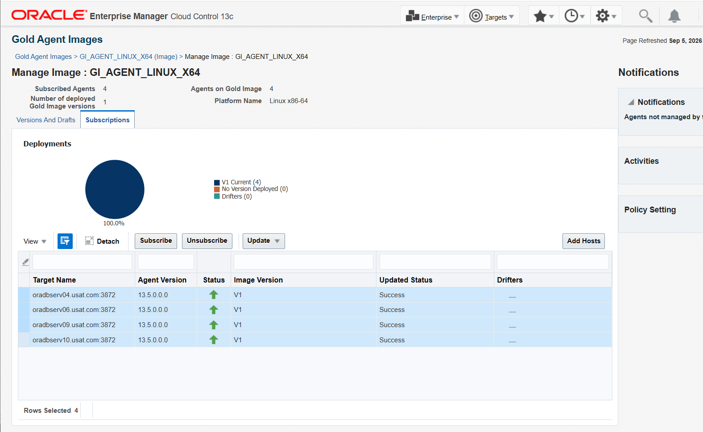

Header values on that page: Subscribed Agents 4, Agents on Gold Image 4, Number of
deployed Gold Image versions 1, Platform Name Linux x86-64.

### 16.2 Two agents cannot be subscribed

| Agent | Reason |
|---|---|
| `oradbserv05` | Image source. An agent cannot subscribe to the image cut from it. Its software state is V1 by definition, so it does not appear in the drift chart |
| `oemserver01` | Central agent. Oracle: *"You cannot update a central agent with an Agent Gold Image."* It is upgraded with the OMS, which is Phase 7b |

Gold agent images manage standalone agents. Both exclusions are documented
behaviour.

### 16.3 Subscribing an agent manually

**Gold Agent Images → click the image → Manage Image Versions and Subscriptions →
Subscriptions tab → Subscribe**

The table on that tab lists agents that are already subscribed. It is not a
picker. The **Subscribe** button above the table opens the target search, which
lists only eligible agents.

To subscribe every eligible agent in one command, omit `-agents`:

```bash
. ~/.env/oms_env
emcli login -username=sysman
emcli sync

emcli subscribe_agents -image_name="GI_AGENT_LINUX_X64"
```

### 16.4 Checking eligibility

```bash
emcli get_updatable_agents     -image_name="GI_AGENT_LINUX_X64"
emcli get_not_updatable_agents -image_name="GI_AGENT_LINUX_X64"
```

`get_not_updatable_agents` returns the agent name and the reason it is excluded.

`get_updatable_agents` returning **"No Updatable Agent Found"** is a normal result
once every subscriber is on the current version. Its criteria include *"Not
already updated"*.

---

## 17. Verification

### 17.1 Every subscriber on the current version

**Gold Agent Images → click the image → Subscriptions**

The Deployments chart reports three buckets: V1 Current, No Version Deployed, and
Drifters. Expect all subscribers in the first and zero drifters.

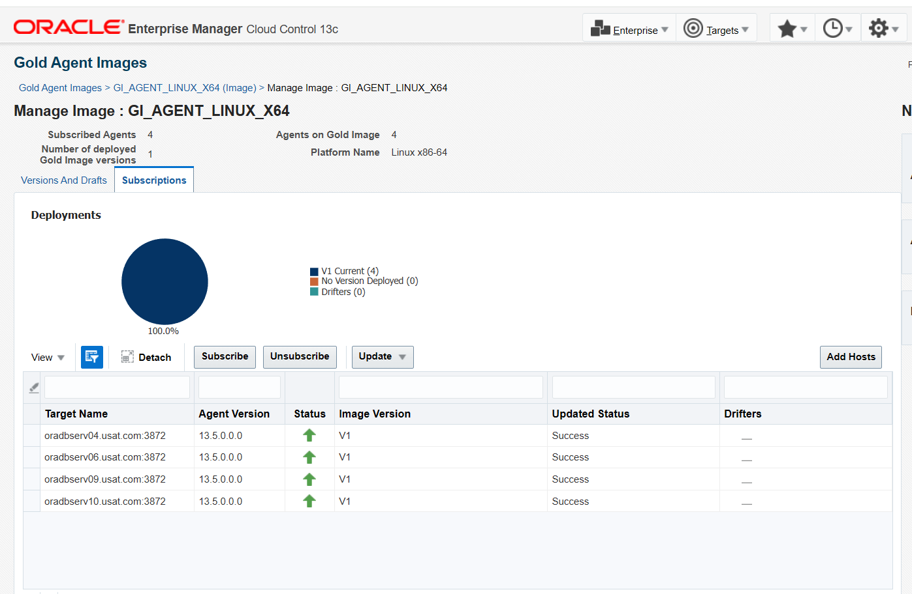

The chart covers subscribed agents only. `oradbserv05` and `oemserver01` do not
appear, per §16.2. A 100 percent reading is 100 percent of the four subscribers.

### 17.2 Every agent uploading

**Setup → Manage Cloud Control → Agents**

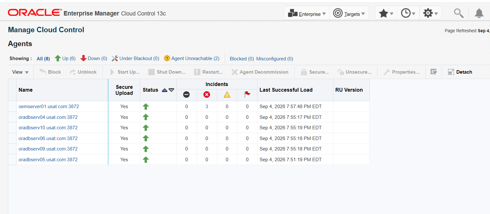

Confirmed on this run:

| Agent | Status | Secure Upload | Last Successful Load |
|---|---|---|---|
| `oemserver01.usat.com:3872` | Up | Yes | Sep 4, 2026 7:57:48 PM |
| `oradbserv04.usat.com:3872` | Up | Yes | Sep 4, 2026 7:55:17 PM |
| `oradbserv05.usat.com:3872` | Up | Yes | Sep 4, 2026 7:51:19 PM |
| `oradbserv06.usat.com:3872` | Up | Yes | Sep 4, 2026 7:55:18 PM |
| `oradbserv09.usat.com:3872` | Up | Yes | Sep 4, 2026 7:55:18 PM |
| `oradbserv10.usat.com:3872` | Up | Yes | Sep 4, 2026 7:55:19 PM |

The page header reports All (8), Up (6), Down (0), Under Blackout (0), Agent
Unreachable (2), Blocked (0), Misconfigured (0). The two unreachable agents are
outside the scope of this phase.

`oemserver01` and `oradbserv05` are included here. They are excluded from the
image, not from the estate.

Per host:

```bash
$AGENT_HOME/bin/emctl status agent
```

Expect `Agent is Running and Ready`, `Heartbeat Status : Ok`, zero pending upload
files, and a real `Last successful upload` timestamp.

### 17.3 Target count

**Targets → All Targets** and read the total.

Installing agents adds one host target per host. The full estate count is recorded
in Part 2 §12.2, after discovery, and replaces Phase 7a's figure of 43 in future
patch windows.

### 17.4 Verification checklist

| # | Check | Expected |
|---|---|---|
| 1 | Image exists with a Current version | `GI_AGENT_LINUX_X64` / `V1_13.5.0.0.0_BASE` |
| 2 | Four hosts installed from the image | Agents present on `oradbserv04`, `06`, `09`, `10` |
| 3 | Provisioned agents match the image | §15.4, agent version and patches against `~/agent_reference_v1.txt` |
| 4 | Four provisioned agents subscribed | Automatic. `oradbserv05` and `oemserver01` cannot be subscribed, per §16.2 |
| 5 | Subscribers on the current version | Four on V1, zero drifters |
| 6 | Every agent uploading | Six agents Up, Secure Upload Yes, recent Last Successful Load. §17.2 |
| 7 | `root.sh` run on each new host | §15.3 |
| 8 | Rollback available | Previous agent homes not yet cleaned up |

All eight confirmed on this run.

---

## 18. Screenshot checklist

Nineteen images captured for this part, all embedded above.

```
screenshots/
├── 7c-13a1-reference-agent-plugins.png
├── 7c-13a2-reference-agent-plugins.png
├── 7c-14a0a-software-library-admin.png
├── 7c-14a1-create-gold-agent-image.png
├── 7c-14a2-create-gold-agent-image.png
├── 7c-14a3-create-gold-agent-image.png
├── 7c-14b1-create-image-version.png
├── 7c-14b2-create-image-version.png
├── 7c-14d1-version-set-current.png
├── 7c-14d2-version-set-current.png
├── 7c-14d3-version-set-current.png
├── 7c-15a2-agent-software-options-expanded.png
├── 7c-15a3-agent-software-options-expanded.png
├── 7c-15a4-agent-software-options-expanded.png
├── 7c-15a6-agent-software-options-expanded.png
├── 7c-15a7-agent-software-options-expanded.png
├── 7c-15a8-agent-software-options-expanded.png
├── 7c-16a-subscribe-agents.png
└── 7c-17a-all-agents-current.png
```

Three steps were not captured. The text records what each produced, in the same
way `installation/README.md` Section 15 handles its own uncaptured steps:

| Step | Not captured | Covered instead by |
|---|---|---|
| §14.0 | The `SWLIBREGISTERMETADATA_*` job completing | The job either succeeds or §14.2 fails at the storing step |
| §15.3 | `root.sh` output on each host | §17.2 confirms all four agents uploading, which requires it |
| §15.4 | Per-host `emctl status agent` and `opatch lspatches` on a provisioned host | §17.2's console view of all agents Up with Secure Upload |

Two naming notes. The `7c-15a*` series runs 2, 3, 4, 6, 7, 8 with no `7c-15a5`.
The `7c-15a8` file shows the Manage Cloud Control Agents page rather than the
Agent Software Options page its filename suggests; it is used in §17.2.

---

## What this enables

Agent patching becomes a single operation rather than one per host: create a new
image version with the patch applied, set it Current, stage it, then update the
subscribers.

Fleet Maintenance in EM 24ai is a separate feature and patches databases and Grid
Infrastructure out of place. Gold agent images apply to the agents; Fleet
Maintenance applies to the Oracle homes those agents monitor. Both are relevant to
Phase 7b.

---

## Appendix A: `emcli` equivalents

The console is the primary route for every section above. These commands are the
equivalents, for scripting a rebuild or for use when the console is unavailable.

All assume:

```bash
. ~/.env/oms_env
emcli login -username=sysman
emcli sync
```

### A.1 Software Library (§14.0)

```bash
emcli list_swlib_storage_locations

emcli add_swlib_storage_location \
  -name="SWLIB_UPLOAD" \
  -path="/u03/swlib" \
  -type="OmsShared"
```

`-type` defaults to `OmsShared`. The `OmsAgent`, `Nfs` and `ExtAgent` types also
require `-host`, and the agent types require credentials.

### A.2 Create the image and version (§14.1 to §14.3)

`create_gold_agent_image` creates the image and its first version in one call.

```bash
# Agents eligible to be a source
emcli get_targets -target="oracle_emd"

emcli create_gold_agent_image \
  -image_name="GI_AGENT_LINUX_X64" \
  -version_name="V1_13.5.0.0.0_BASE" \
  -source_agent="oradbserv05.usat.com:3872" \
  -gold_image_description="Agent Gold Image Linux"

emcli promote_gold_agent_image \
  -version_name="V1_13.5.0.0.0_BASE" \
  -maturity="Current"
```

Optional parameters matching §14.2's three fields: `-working_directory`,
`-config_properties`, `-exclude_files`.

### A.3 Install from the image with `AgentPull.sh` (§15.2)

Use this when the Add Host Targets wizard offers no gold image. Oracle documents
`AgentPull.sh` for installing a new agent from an image. Copy it from the OMS to
each destination host and run it there as `oracle`.

```bash
# Read-only, lists what is available
./AgentPull.sh LOGIN_USER=sysman LOGIN_PASSWORD=<password> \
  CURL_PATH=/usr/bin -showGoldImages

./AgentPull.sh LOGIN_USER=sysman LOGIN_PASSWORD=<password> \
  CURL_PATH=/usr/bin -showGoldImageVersions IMAGE_NAME=GI_AGENT_LINUX_X64

# Install the current version
./AgentPull.sh \
  LOGIN_USER=sysman \
  LOGIN_PASSWORD=<password> \
  CURL_PATH=/usr/bin \
  IMAGE_NAME=GI_AGENT_LINUX_X64 \
  AGENT_BASE_DIR=/u01/app/oracle/Middleware/agent/13_5 \
  AGENT_REGISTRATION_PASSWORD=<registration password>
```

| Parameter | Notes |
|---|---|
| `IMAGE_NAME` | Installs the current version of that image |
| `VERSION_NAME` | Use instead of `IMAGE_NAME` to pin a specific version |
| `AGENT_BASE_DIR` | Where the image is downloaded and the agent installed |
| `CURL_PATH` | Directory holding `curl` |
| `-download_only` | Fetch without installing, for staging ahead of a window |

Passwords supplied on the command line appear in the process table. For the real
run use a response file, with any filename except `agent.rsp`, which the script
reserves:

```bash
cat > /u01/app/oracle/staging/agent.properties <<'EOF'
LOGIN_USER=sysman
LOGIN_PASSWORD=<password>
PLATFORM="Linux x86-64"
AGENT_REGISTRATION_PASSWORD=<registration password>
EOF
chmod 600 /u01/app/oracle/staging/agent.properties

./AgentPull.sh RSPFILE_LOC=/u01/app/oracle/staging/agent.properties \
  CURL_PATH=/usr/bin IMAGE_NAME=GI_AGENT_LINUX_X64 \
  AGENT_BASE_DIR=/u01/app/oracle/Middleware/agent/13_5

shred -u /u01/app/oracle/staging/agent.properties
```

Locate the script rather than assuming its path:

```bash
find /u01/app/oracle/Middleware -name 'AgentPull.*' 2>/dev/null
```

### A.4 Subscriptions (§16)

```bash
emcli subscribe_agents -image_name="GI_AGENT_LINUX_X64"

emcli get_updatable_agents     -image_name="GI_AGENT_LINUX_X64"
emcli get_not_updatable_agents -image_name="GI_AGENT_LINUX_X64"
```

---

## Appendix B: Additional scenarios

Neither situation arises in this build. Both are recorded because they apply to
this estate later.

### B.1 Updating an agent that is already monitoring live targets

Installing an agent on an unmonitored host, as in §15, raises no incidents.
Nothing was being monitored on those hosts before the agent existed. Creating the
image in §14 also needs no blackout: the job starts and stops its own, named
`CREATE_GOLD_IMAGE`, which is visible in the job log.

Updating an agent that already monitors live targets is different. The update
restarts the agent, so its targets become unreachable for the duration and raise
incidents. Create a blackout first, using
[Creating a Blackout in Enterprise Manager 13.5](oem-create-blackout.md), and
select **Enable Full blackout on all hosts** so the agent itself is covered.

Staging and updating are two separate operations. Staging copies the image to the
hosts and changes nothing running. Updating applies it and restarts the agent.

```bash
emcli update_agents -image_name="GI_AGENT_LINUX_X64" \
  -stage_location=/u01/app/oracle/staging/gold_image \
  -op_name="STAGE_GI_V1" -stage_only

emcli update_agents -image_name="GI_AGENT_LINUX_X64" \
  -op_name="UPDATE_GI_V1"
```

Status and rollback:

```bash
emcli get_agent_update_status -op_name="UPDATE_GI_V1"
emcli get_agent_update_status -op_name="UPDATE_GI_V1" -severity=ERROR

emcli update_agents -op_name="ROLLBACK_GI_V1" -rollback
```

Rollback works because the previous agent home is retained on the host. The
cleanup operation removes that option, so run it only after the new version is
verified.

Clear the blackout once verification passes. See
[the blackout page §6](oem-create-blackout.md#6-clearing-it-afterwards).

### B.2 Updating an agent that carries more plug-ins than the image

An agent can subscribe successfully and still be refused an update:

```
Agent is not compatible with the given Gold Image.
  Few deployed plug-ins on the Management Agent are missing in the Gold Image:
```

Enterprise Manager will not update an agent from an image that carries fewer
plug-ins than the agent already has, because doing so would remove monitoring
capability from a working host.

This affects established agents that have discovered targets and acquired the
corresponding plug-ins. V1 was cut from a freshly installed agent before any
discovery ran, so it carries the 13.5 defaults only.

The resolution is to cut a later version from an agent that carries the required
plug-ins, set it Current, and update against that version. Compare plug-in lists
first, because the error message truncates its own list.

---

**Sources:**
[Managing the Lifecycle of Agent Gold Images (13.5)](https://docs.oracle.com/en/enterprise-manager/cloud-control/enterprise-manager-cloud-control/13.5/emadv/managing-lifecycle-agent-gold-images.html) ·
[Creating an Agent Gold Image](https://docs.oracle.com/cd/E73210_01/EMUPG/GUID-279B934E-58F0-429A-A7B2-A2A1584ED259.htm) ·
[Creating an Agent Gold Image Version](https://docs.oracle.com/cd/E73210_01/EMUPG/GUID-48E43AE2-7712-4E59-AA11-A4273FF16822.htm) ·
[Setting a Version as Current](https://docs.oracle.com/cd/E73210_01/EMUPG/GUID-CE5DD165-70A6-4F13-B120-E3F5FFFDD584.htm) ·
[Updating Standalone Management Agents Using a Gold Image Version](https://docs.oracle.com/cd/E73210_01/EMUPG/GUID-01F64260-6357-4EEA-838B-CB70626884CB.htm) ·
[Installing an Agent Using the AgentPull Script](https://docs.oracle.com/en/enterprise-manager/cloud-control/enterprise-manager-cloud-control/13.5/emadv/installing-oracle-management-agent-silent-mode.html) ·
[Configuring Software Library Storage Location](https://docs.oracle.com/en/enterprise-manager/cloud-control/enterprise-manager-cloud-control/13.4/emadm/configuring-software-library-storage-location.html)

---

Back to **[Part 1: The reference agent](phase-7b-part1-reference-agent.md)**.
Continue to **[Part 2: Administration groups and template collections](phase-7b-part2-admin-groups.md)**.
Back to the **[index](phase-7b-extending-coverage.md)**.
