# Phase 7b Part 4: Metric Extensions for APEX, ORDS and MongoDB

**SOP: monitor three components Enterprise Manager has no target type for. The APEX engine inside `apexdb`, standalone ORDS on `oradbserv04:8080`, and MongoDB 6.0 bound to `127.0.0.1:27017`**

**Step 6 of 6, last in execution order.**

Status: 🟩 Confirmed 2026-09-09. All four extensions are published, deployed and
returning real values on their targets' All Metrics pages.

| # | Section | Status |
|---|---|---|
| 18 | What is being monitored | 🟩 |
| 19 | Credentials | 🟩 Confirmed 2026-09-08 |
| 20 | ME 1: APEX activity | 🟩 Confirmed 2026-09-09 |
| 21 | ME 2: ORDS health | 🟩 Confirmed 2026-09-09 |
| 22 | ME 3: NestWise Node proxy | 🟩 Confirmed 2026-09-08 |
| 23 | ME 4: MongoDB | 🟩 Confirmed 2026-09-08 |
| 24 | Publish, deploy and verify | 🟩 Confirmed 2026-09-09 |


[Appendix A](#appendix-b-emcli-for-metric-extensions) holds the `emcli` verbs.

---

## 18. What is being monitored

| Component | Where | Detail |
|---|---|---|
| APEX engine | inside `apexdb` on `usatclust1` | Pages render in the database. ORDS is the web front only |
| ORDS 26.x | `oradbserv04.usat.com:8080` | Standalone under systemd, Java 21, connects via SCAN to `apexdb_rw` |
| Node proxy | `oradbserv04.usat.com:4000` | `nestwise` service account, env at `/etc/nestwise-proxy.env` |
| MongoDB 6.0 | `oradbserv04.usat.com:27017` | `bindIp: 127.0.0.1`, `authorization: enabled` |

EM 13.5 has no target type for standalone ORDS, a Node process, or MongoDB.

**Check Self Update for a supported plug-in before building these.**
**Setup → Extensibility → Self Update → Plug-ins**. This page assumes none exists
for these three components in 13.5.

### 18.1 The lifecycle

```
Create (Draft) → Test against a real target → Save as Deployable Draft
              → Publish → Deploy to targets
```

Test while the extension is still a Draft. It cannot be edited once it is a
Deployable Draft.

**Enterprise → Monitoring → Metric Extensions**

---

## 19. Credentials

| ME | Needs | Named Credential |
|---|---|---|
| APEX activity | Database login on `apexdb` | None. Use Default Monitoring Credentials. See §19.1 |
| ORDS health | None | |
| Node proxy | None | |
| MongoDB | Mongo login | None. A protected file on the host. See §19.3 |

### 19.1 The database credential for ME 1

No Named Credential is needed. The wizard's Credentials step offers **Use Default
Monitoring Credentials**, which is the `dbsnmp` login supplied when the database
was promoted. See §20.4.

`dbsnmp` must be unlocked with a known password and hold `SELECT_CATALOG_ROLE`,
per
[the discovery procedure §5.1](oem-discover-and-promote-targets.md#51-prepare-the-database-monitoring-account).

### 19.2 A read-only MongoDB user

**Who:** `mongod` administrator. **Where:** `oradbserv04`.

```javascript
// mongosh -u dbadmin -p --authenticationDatabase admin
use admin
db.createUser({
  user: "em_monitor",
  pwd: passwordPrompt(),
  roles: [ { role: "clusterMonitor", db: "admin" } ]
})
```

`clusterMonitor` allows read-only diagnostics such as `serverStatus` and
`dbStats`. It gives no access to application data.

`passwordPrompt()` asks for the password when the command runs, so it never lands
in shell history. §19.3 needs the same value.

### 19.3 Give the extension the Mongo password

No Named Credential is created for MongoDB. `em_monitor` is a MongoDB user, not a
Linux user, and OEM Host Credentials only hold Linux logins.

Put the username and password in one file that only the agent can read.

**Who:** `root`. **Where:** `oradbserv04`.

```bash
install -o oracle -g oinstall -m 600 /dev/null /etc/em-mongo-monitor.conf
vi /etc/em-mongo-monitor.conf
```

Two lines:

```
MONGO_USER=em_monitor
MONGO_PWD=<the password from 19.2>
```

Mode `600` owned by `oracle` means only `oracle` and `root` can read it. The
Enterprise Manager agent on this host runs as `oracle`. `mongodba`, `mongod` and
`nestwise` cannot read it.

#### Test it as the agent user

```bash
cd /tmp
sudo -u oracle bash -c '. /etc/em-mongo-monitor.conf; mongosh --quiet -u "$MONGO_USER" -p "$MONGO_PWD" --authenticationDatabase admin --host 127.0.0.1 --port 27017 --eval "db.serverStatus().connections.current"'
```

A number means it works.

`cd /tmp` first. `sudo -u oracle` keeps the current directory, and `oracle` cannot
enter `/root`, which fails with `EACCES: chdir '/root'` before the file is read.

Logged in as `oracle`, drop the `sudo` and run both lines in the same shell:

```bash
. /etc/em-mongo-monitor.conf
mongosh --quiet -u "$MONGO_USER" -p "$MONGO_PWD" --authenticationDatabase admin --host 127.0.0.1 --port 27017 --eval "db.serverStatus().connections.current"
```

---

## 20. ME 1: APEX activity

APEX runs inside the database, so this is a SQL Metric Extension against the
`apexdb` target. No agent-side script, no credential file.

**Enterprise → Monitoring → Metric Extensions**

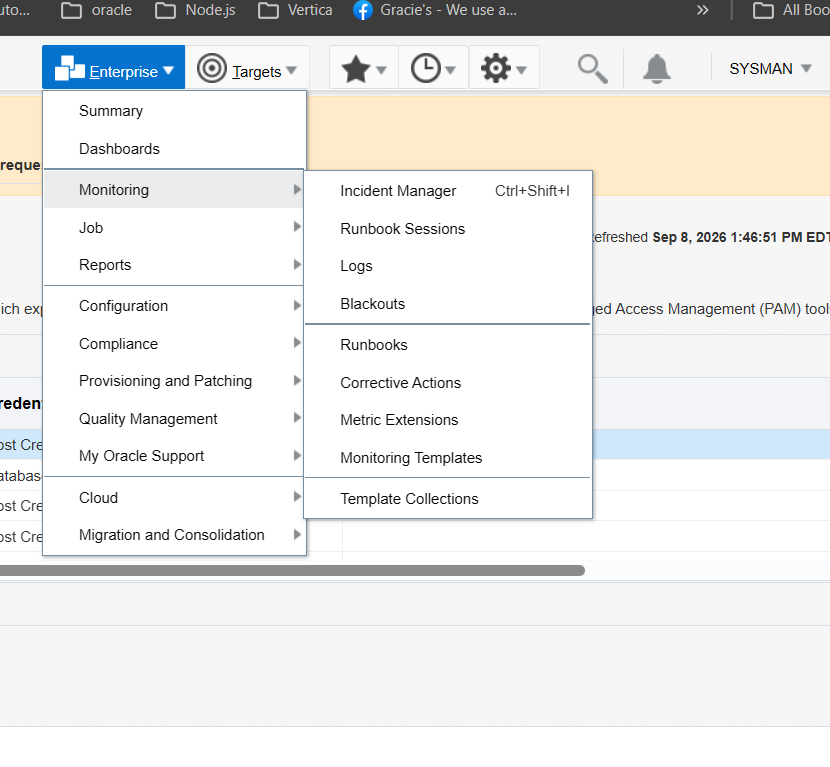

Click **Create**. The Target Type dropdown in the Search panel filters the list.
It is not where the target type is chosen.

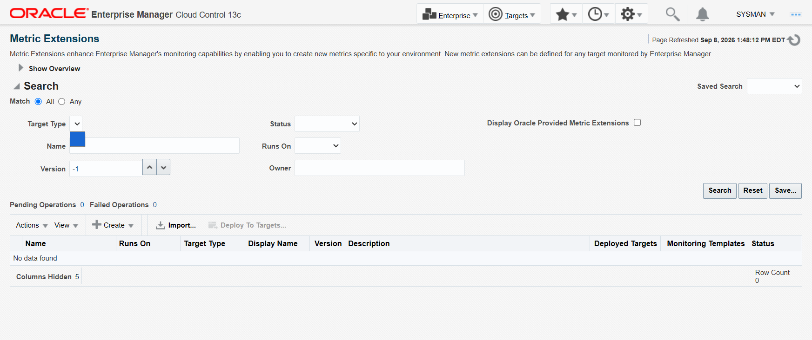

The wizard is six steps.

### 20.1 Step 1: General Properties

| Field | Value |
|---|---|
| Target Type | `Cluster Database` |
| Name | `APEX_ACTIVITY` |
| Display Name | `APEX Application Activity` |
| Adapter | `SQL` |
| Data Collection | Enabled |
| Data Upload | Yes |
| Collection Schedule | Every 15 minutes |

**The Name field is labelled `Name ME$` because Enterprise Manager adds the `ME$`
prefix.** Type `APEX_ACTIVITY` and the extension becomes `ME$APEX_ACTIVITY`. Typing
`ME_APEX_ACTIVITY` produces `ME$ME_APEX_ACTIVITY`. The field rejects `$`, which is
the clue.

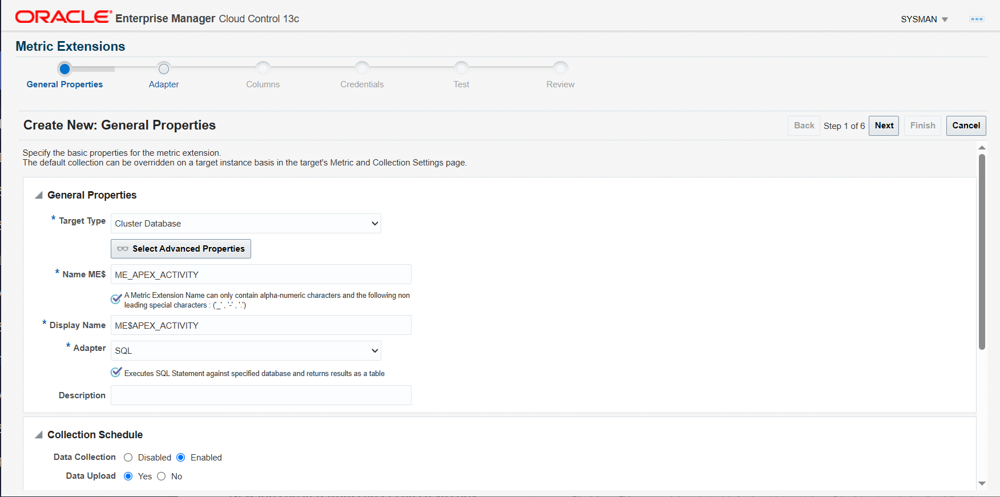

**Display Name is what appears on charts and in incidents.** Use readable words,
not the internal name.


### 20.2 Step 2: Adapter

Paste the query into **SQL Query**.

```sql
SELECT COUNT(*)                                        AS page_views_2m,
       NVL(ROUND(AVG(elapsed_time), 3), 0)             AS avg_elapsed_sec,
       COUNT(DISTINCT apex_session_id)                 AS distinct_sessions,
       SUM(CASE WHEN page_view_type = 'Error' THEN 1
                ELSE 0 END)                            AS error_views_2m
FROM   apex_workspace_activity_log
WHERE  view_date > SYSDATE - (2/1440)
```

**No trailing semicolon.** The page states it: *"Normal SQL statements should not
be semi-colon terminated."*

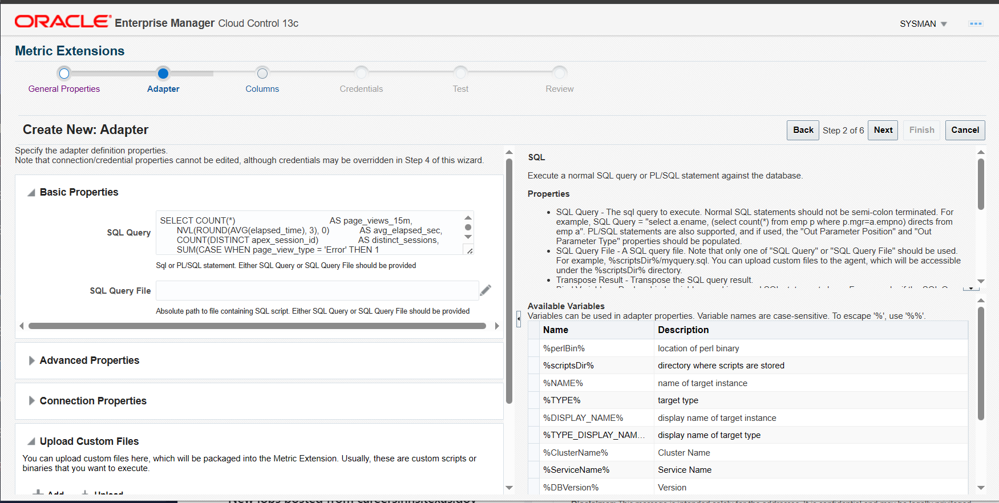


**The window matches the collection schedule.** `2/1440` is two minutes, the same
as the schedule in §20.1, so each collection counts a fresh interval. A 15 minute
window collected every 2 minutes would overlap, counting the same page view
roughly seven times across successive collections.

### 20.3 Step 3: Columns

**Order matters.** The page states it: *"The order of the metric columns matter,
and it should match the order that they are returned from the adapter."* Columns
map to the SELECT list by position, not by name.

| # | Name | Display Name | Type | Value Type | Unit |
|---|---|---|---|---|---|
| 1 | `page_views_2m` | Page Views (2 min) | Data Column | Number | views |
| 2 | `avg_elapsed_sec` | Average Page Elapsed Time | Data Column | Number | seconds |
| 3 | `distinct_sessions` | Distinct Sessions | Data Column | Number | sessions |
| 4 | `error_views_2m` | Error Page Views (2 min) | Data Column | Number | errors |

All four are Data Columns. No Key column, because the query returns one row.

On column 4 only:

| Field | Value |
|---|---|
| Comparison Operator | `>` |
| Warning | `0` |
| Critical | `10` |

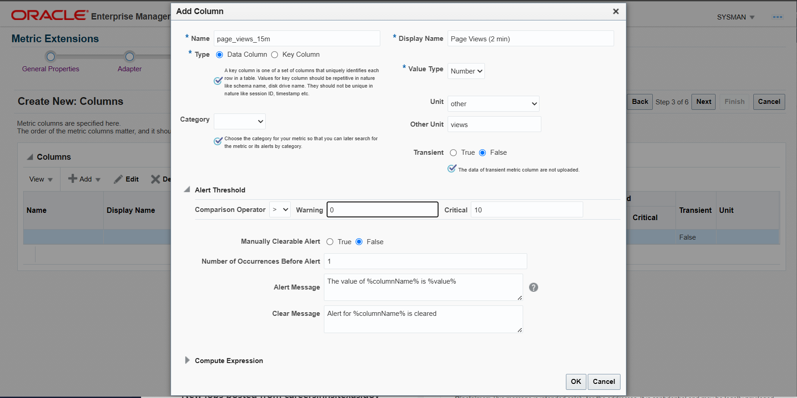

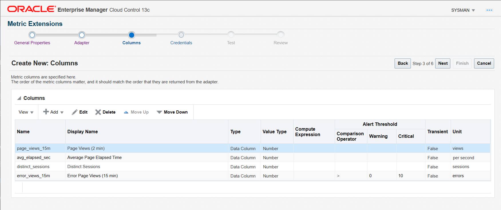

That screenshot shows v1, which used a 15 minute window with display names already
reading "(2 min)". v2 makes the query, the column names and the display names all
agree at two minutes.

### 20.4 Step 4: Credentials

**Use Default Monitoring Credentials.** That is `dbsnmp`, supplied when the
database was promoted, and the same credential every other database metric on this
target uses.

**Specify Credential Set** is only for an extension that needs a different login
from normal monitoring. Come back here if §20.6 returns zeros.

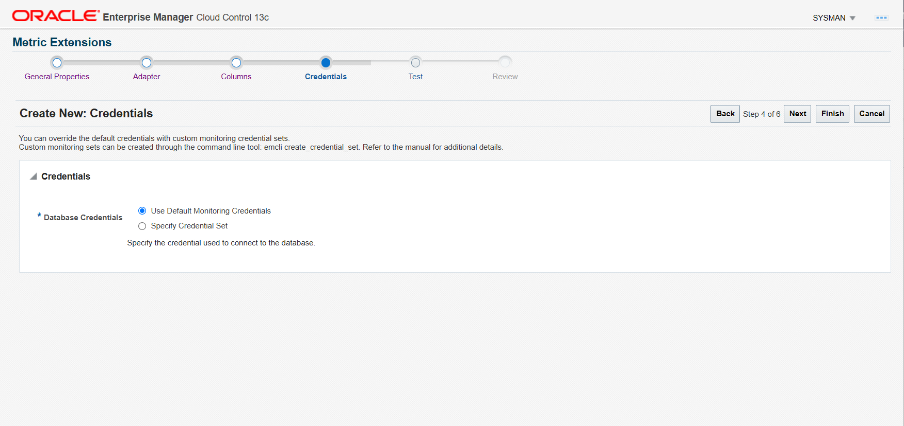

### 20.5 Step 5: Test

**Add**, pick `apexdb`, **Run Test**.

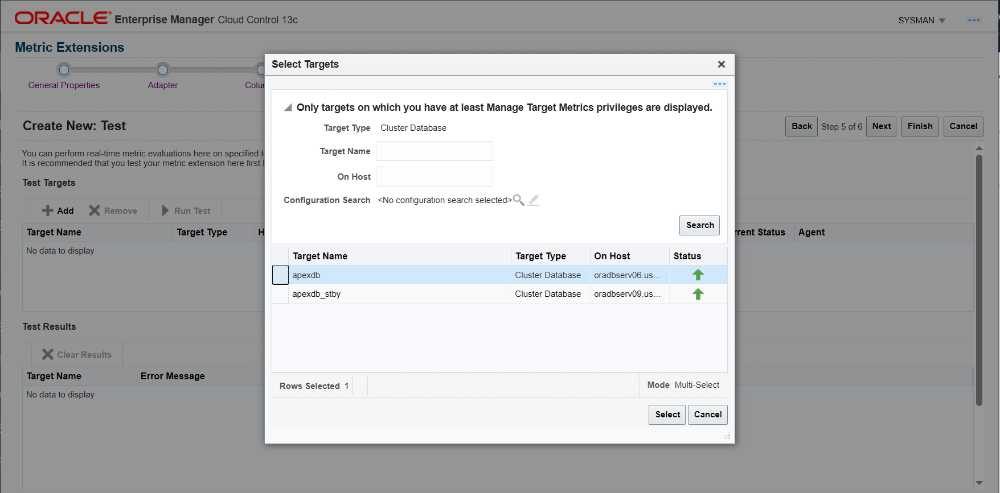

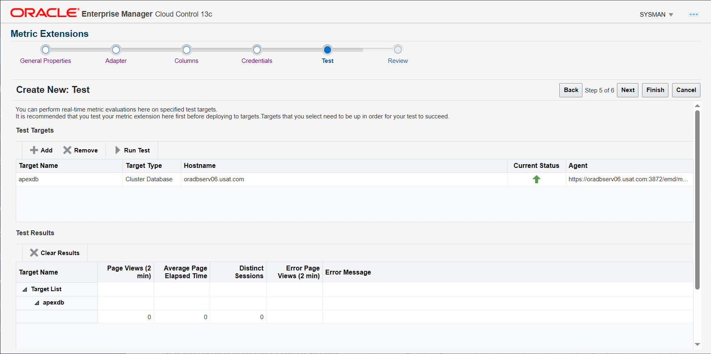

### 20.6 If the test returns zeros

The first test on this estate returned `0` in every column with `apexdb` up and
the query running.

**A query that returns no rows tests as a pass.** Nothing on screen indicates a
problem.

Two causes, in this order:

1. **No APEX traffic inside the window.** The window is two minutes, so browse
   NestWise pages and run the test straight afterwards.
2. **`dbsnmp` cannot see the log.** `apex_workspace_activity_log` is filtered by
   workspace security context, so `SELECT_CATALOG_ROLE` is not enough. Either grant
   `dbsnmp` the APEX administrator role, or point the extension at
   `APEX_XXXXXX.WWV_FLOW_ACTIVITY_LOG` with a credential that can read it.

**Resolved 2026-09-09 by cause 1.** Browsing the Neighborhood Explorer page
produced page views, and the metric returned `2 views` on the next collection.
`dbsnmp` reads the log without additional grants on this estate.

**ORDS REST calls do not count.** `apex_workspace_activity_log` records APEX page
views. A k6 run against the ORDS REST modules drives the same PL/SQL packages and
generates real database load, but creates no page views, so it leaves this metric
at zero. Only APEX page requests populate it.

### 20.7 Step 6: Review, then Finish

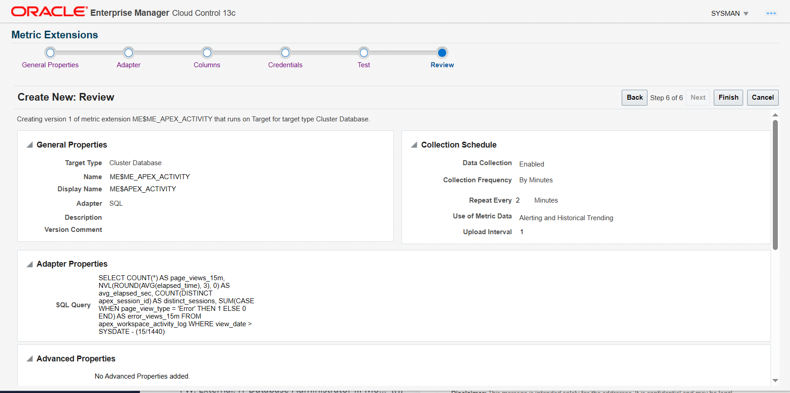

Finish saves it as an editable Draft. Publishing and deployment are §24.

---

## 21. ME 2: ORDS health

### 21.1 General Properties

| Field | Value |
|---|---|
| Target Type | `Host` |
| Name | `ORDS_HEALTH` |
| Display Name | `ORDS Listener Health` |
| Adapter | `OS Command, Multiple Columns` |
| Collection Schedule | Every 5 minutes |

Enterprise Manager adds the `ME$` prefix, so the extension becomes
`ME$ORDS_HEALTH`.

### 21.2 Adapter

Paste into **Command**. Leave **Script**, **Arguments** and **Starts With** empty.
Set **Delimiter** to `|`.

```
/bin/bash -c 'PORT=8080; URL=http://localhost:$PORT/ords/f?p=100:1; CODE=$(curl -s -o /dev/null -w "%%{http_code}" --max-time 10 "$URL" 2>/dev/null); MS=$(curl -s -o /dev/null -w "%%{time_total}" --max-time 10 "$URL" 2>/dev/null); UP=$(systemctl is-active ords >/dev/null 2>&1 && echo 1 || echo 0); RSS=$(ps -o rss= -C java --sort=-rss 2>/dev/null | head -1 | tr -d " "); echo "${CODE:-0}|${MS:-0}|${UP}|${RSS:-0}"'
```

**The URL is an APEX page, not `/ords/`.** `/ords/` returns its landing redirect
from ORDS itself, without touching the database, so it stays healthy while ORDS
cannot reach `apexdb_rw`. Requesting an APEX page forces ORDS to use its
connection pool. Substitute the real application ID for `100`.

**Two things about that line, both of which break it silently.**

**Escape the percent signs as `%%`.** The Available Variables panel states: *"To
escape '%', use '%%'."* Enterprise Manager reads `%...%` as its own variable
substitution, so `curl`'s `%{http_code}` and `%{time_total}` must be written
`%%{http_code}` and `%%{time_total}`.

**Command is a single line.** Newlines are lost, so the statements need `;`
separators.

Run it as `oracle` on the host first, with single `%`, and confirm the shape:

```bash
[oracle@oradbserv04 ~]$ /bin/bash -c 'PORT=8080; URL=http://localhost:$PORT/ords/f?p=100:1; CODE=$(curl -s -o /dev/null -w "%{http_code}" --max-time 10 "$URL" 2>/dev/null); MS=$(curl -s -o /dev/null -w "%{time_total}" --max-time 10 "$URL" 2>/dev/null); UP=$(systemctl is-active ords >/dev/null 2>&1 && echo 1 || echo 0); RSS=$(ps -o rss= -C java --sort=-rss 2>/dev/null | head -1 | tr -d " "); echo "${CODE:-0}|${MS:-0}|${UP}|${RSS:-0}"'
302|0.012|1|801536
```

Four fields, three pipes.

### 21.3 Columns

Order must match the `echo` order.

| # | Name | Display Name | Type | Value Type | Unit | Operator | Critical |
|---|---|---|---|---|---|---|---|
| 1 | `http_code` | HTTP Response Code | Data Column | Number | | `>=` | `500` |
| 2 | `response_ms` | Response Time | Data Column | Number | seconds | | |
| 3 | `service_up` | ORDS Service Up | Data Column | Number | | `<` | `1` |
| 4 | `java_rss_kb` | Java Resident Memory | Data Column | Number | kilobytes | | |

Leave Category, Compute Expression, Warning and the message fields at their
defaults. Transient stays False.

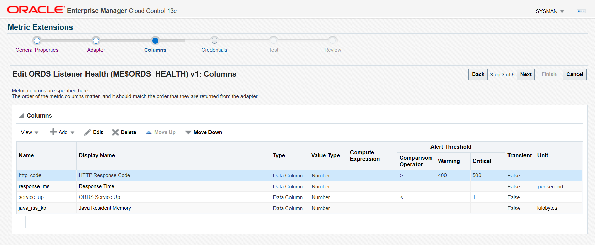

### 21.4 What each state produces

Measured on this estate 2026-09-08, all three states.

| State | `http_code` | `service_up` | Alerts |
|---|---|---|---|
| Healthy | `302` | `1` | No |
| ORDS running, database unreachable | `571` | `1` | Yes, `http_code >= 500` |
| ORDS stopped | `000` | `0` | Yes, `service_up < 1` |

**`systemctl` reports `active (running)` while ORDS cannot serve a page.** With
`apexdb_rw` stopped, ORDS starts, logs its pool as `INVALID`, and stays up. That
is why `service_up` alone never caught it, and why the URL had to change.

`571` is not a standard HTTP code. It is in the 5xx class, so `>=` 500 catches it
without a threshold change.

**When `http_code` is 5xx and `service_up` is 1, the database is the problem.**
Check the service first, from a cluster node:

```bash
srvctl status service -d apexdb -s apexdb_rw
srvctl start service  -d apexdb -s apexdb_rw
```

The ORDS log names it directly. `ORA-12514` means the listener does not know the
service, which is the service not being registered rather than a credentials or
network fault.

**ORDS recovers without a restart.** It retries its connection pool, so the metric
clears on its own once the service returns.

A `sql` or `sqlplus` connection to `apexdb_rw` is a useful manual check alongside
this. Reaching `ORA-01017`, invalid username or password, is a **positive** result:
authentication only happens after the TCP connect, the listener handshake and
service resolution have all succeeded.

**Do not alert on "not 200".** A healthy APEX page request answers `302`, the
session redirect, so `!=` 200 would leave the metric permanently critical against
a working stack.

`ps -C java` matches any Java process. Nothing else on this host runs Java today.
If that changes, match the ORDS process specifically.

### 21.5 Credentials and Test

Credentials: **Use Default Monitoring Credentials**. The command needs no login.

Test against `oradbserv04.usat.com`.

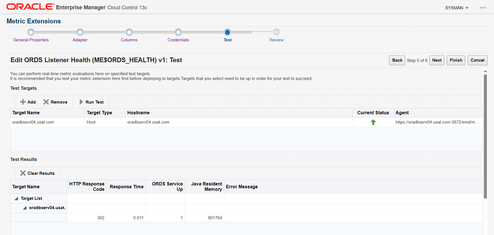

**Confirmed 2026-09-08.** `302 | 0.011 | 1 | 801616`, matching the shell run in
§21.2. The matching `302` also confirms the `%%` escaping worked, since a mangled
`%{http_code}` would have returned `0`.


---

## 22. ME 3: NestWise Node proxy

The proxy is the path every MongoDB-sourced APEX region uses. If it is down, the
Neighborhood Detail page loses its listings, weather and movies while
Oracle-sourced content keeps working.

### 22.1 General Properties

| Field | Value |
|---|---|
| Target Type | `Host` |
| Name | `NESTWISE_PROXY` |
| Display Name | `NestWise Node Proxy` |
| Adapter | `OS Command, Multiple Columns` |
| Collection Schedule | Every 5 minutes |

Enterprise Manager adds the `ME$` prefix, giving `ME$NESTWISE_PROXY`.

### 22.2 Adapter

Paste into **Command**. **Delimiter** is `|`. Leave **Script**, **Arguments** and
**Starts With** empty.

```
/bin/bash -c 'PORT=4000; CODE=$(curl -s -o /dev/null -w "%%{http_code}" --max-time 10 http://localhost:$PORT/api/weather/current 2>/dev/null); MS=$(curl -s -o /dev/null -w "%%{time_total}" --max-time 10 http://localhost:$PORT/api/weather/current 2>/dev/null); UP=$(systemctl is-active nestwise-proxy >/dev/null 2>&1 && echo 1 || echo 0); echo "${CODE:-0}|${MS:-0}|${UP}"'
```

Single line with `;` separators, and `%%` on curl's format strings. The same two
rules as §21.2, and the same failure if either is missed: this extension first
returned `0 | 0 | blank` from a multi-line, single-`%` version while the shell
returned `200|0.006|1`.

`/api/weather/current` is the cheapest of the five read endpoints and it touches
MongoDB, so a 200 proves the whole proxy to Mongo path rather than only that Node
is listening.

Check it in a shell first, single `%`:

```bash
oradbserv04:mongodba:~$ /bin/bash -c 'PORT=4000; CODE=$(curl -s -o /dev/null -w "%{http_code}" --max-time 10 http://localhost:$PORT/api/weather/current 2>/dev/null); MS=$(curl -s -o /dev/null -w "%{time_total}" --max-time 10 http://localhost:$PORT/api/weather/current 2>/dev/null); UP=$(systemctl is-active nestwise-proxy >/dev/null 2>&1 && echo 1 || echo 0); echo "${CODE:-0}|${MS:-0}|${UP}"'
200|0.007|1
```

### 22.3 Columns

| # | Name | Display Name | Type | Value Type | Unit | Operator | Warning | Critical |
|---|---|---|---|---|---|---|---|---|
| 1 | `http_code` | HTTP Response Code | Data Column | Number | | `!=` | | `200` |
| 2 | `response_ms` | Response Time | Data Column | Number | seconds | | | |
| 3 | `service_up` | Proxy Service Up | Data Column | Number | | `<` | | `1` |

Leave Category, Compute Expression and the message fields at their defaults.
Transient stays False.

**`!=` 200 works here where it would not for ORDS.** This is an API endpoint that
returns 200, not a redirect, so anything else is a fault. It also catches the `0`
the script emits when nothing answers, so one operator covers both cases.

`service_up` still earns its place. It separates the service being dead from the
service running with a failing endpoint.

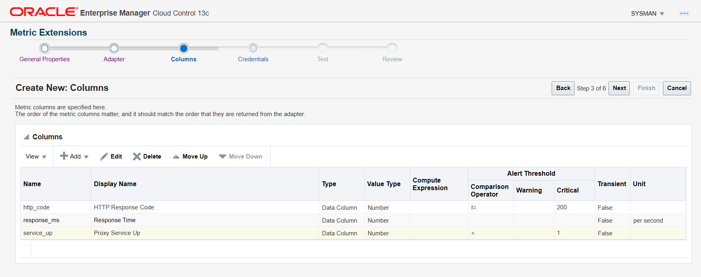

### 22.4 Credentials and Test

Credentials: **Use Default Monitoring Credentials**. The command needs no login.

Test against `oradbserv04.usat.com`.

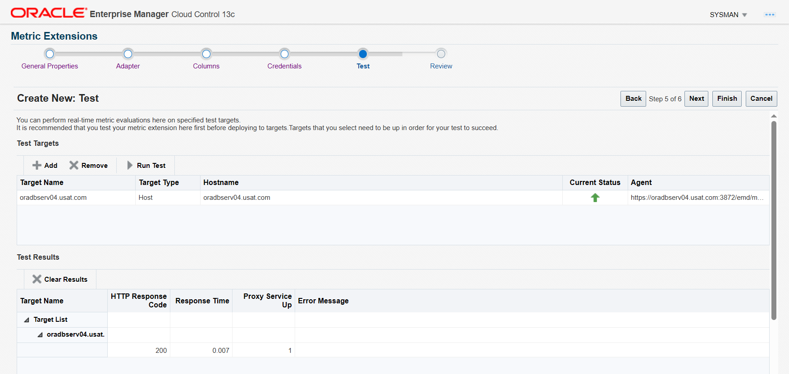

**Confirmed 2026-09-08.** `200 | 0.008 | 1`, matching the shell run above.

**`POST /api/admin/reload` is not called from here.** It is the only write
endpoint, it requires `NESTWISE_ADMIN_TOKEN`, and a monitoring check does not
mutate application state. The token stays in `/etc/nestwise-proxy.env`, mode 640,
`root:nestwise`, and is referenced by no Metric Extension.

---

## 23. ME 4: MongoDB

| Field | Value |
|---|---|
| Target Type | `Host` |
| Name | `MONGODB_STATUS` |
| Display Name | `MongoDB Server Status` |
| Adapter | `OS Command, Multiple Columns` |
| Collection Schedule | Every 5 minutes |

Enterprise Manager adds the `ME$` prefix, giving `ME$MONGODB_STATUS`.

### 23.1 Adapter

| Field | Value |
|---|---|
| Command | The line below |
| Script | **Empty** |
| Arguments | Empty |
| Delimiter | `\|` |
| Starts With | Empty |

```
/bin/bash -c 'UP=$(systemctl is-active mongod >/dev/null 2>&1 && echo 1 || echo 0); if [ "$UP" -eq 0 ]; then echo "0|0|0|0|0"; exit 0; fi; . /etc/em-mongo-monitor.conf; OUT=$(/usr/bin/mongosh --quiet -u "$MONGO_USER" -p "$MONGO_PWD" --authenticationDatabase admin --host 127.0.0.1 --port 27017 --eval "var s = db.serverStatus(); print([s.connections.current, s.connections.available, s.opcounters.query, Math.round(s.uptime)].join(\"|\"));" 2>/dev/null); echo "${UP}|${OUT:-0|0|0|0}"'
```

**Leave Script empty.** The page states the command line is built as **Command +
Script + Arguments**. Putting `/etc/em-mongo-monitor.conf` there appends it after
the script, where it becomes `$0`, and every error message is then prefixed with
that path rather than with `/bin/bash`.

**Single line with `;` separators.** A multi-line paste loses its newlines and
`if [ "$UP" -eq 0 ]` runs into `then` with nothing between them, giving
`syntax error near unexpected token 'then'`.

No `%%` escaping here. This script has no `curl` format strings, so there is no
`%` for Enterprise Manager to misread.

**Use the absolute path to `mongosh`.** The agent runs as `oracle` with a minimal
environment. Confirm it first:

```bash
sudo -u oracle which mongosh
```

### 23.2 Columns

The script emits **five** values. Define **five** columns, in this order.

| # | Name | Display Name | Type | Value Type | Unit | Operator | Warning | Critical |
|---|---|---|---|---|---|---|---|---|
| 1 | `service_up` | MongoDB Service Up | Data Column | Number | | `<` | | `1` |
| 2 | `conn_current` | Current Connections | Data Column | Number | connections | | | |
| 3 | `conn_available` | Available Connections | Data Column | Number | connections | `<` | `100` | `20` |
| 4 | `queries_total` | Total Queries | Data Column | Number | queries | | | |
| 5 | `uptime_sec` | Uptime | Data Column | Number | seconds | | | |

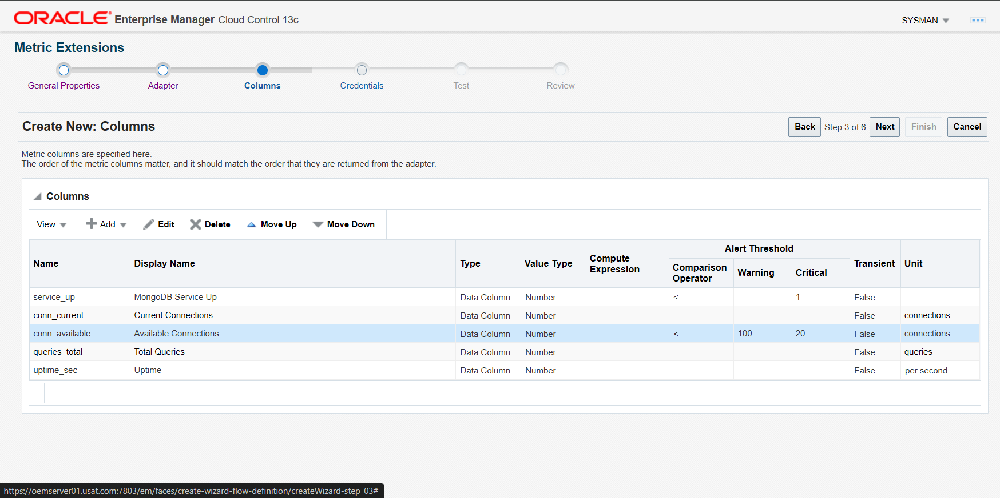

### 23.3 Credentials and Test

Credentials: **Use Default Monitoring Credentials**. The Mongo login reaches the
command through `/etc/em-mongo-monitor.conf`, not through Enterprise Manager.

Run the whole line as `oracle` before pasting it into the wizard:

```bash
cd /tmp
sudo -u oracle /bin/bash -c 'UP=$(systemctl is-active mongod >/dev/null 2>&1 && echo 1 || echo 0); if [ "$UP" -eq 0 ]; then echo "0|0|0|0|0"; exit 0; fi; . /etc/em-mongo-monitor.conf; OUT=$(/usr/bin/mongosh --quiet -u "$MONGO_USER" -p "$MONGO_PWD" --authenticationDatabase admin --host 127.0.0.1 --port 27017 --eval "var s = db.serverStatus(); print([s.connections.current, s.connections.available, s.opcounters.query, Math.round(s.uptime)].join(\"|\"));" 2>/dev/null); echo "${UP}|${OUT:-0|0|0|0}"'
```

**Run it as `oracle`, not as `mongodba`.** `/etc/em-mongo-monitor.conf` is mode
600 owned by `oracle`, so `mongodba` gets `Permission denied` and the script falls
through to `1|0|0|0|0`. That is the protection working, not a fault.

Test against `oradbserv04.usat.com`.

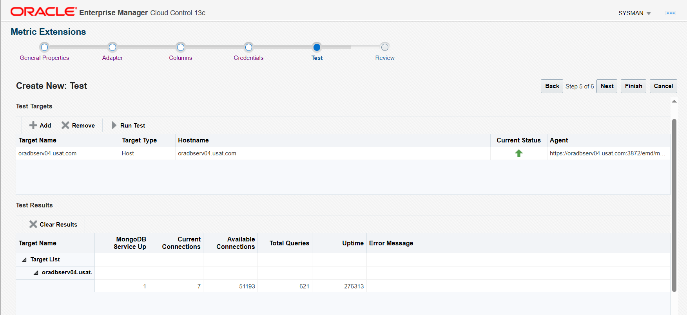

**Confirmed 2026-09-08.** `1 | 7 | 51193 | 621 | 276313`. Service up, 7 current
connections, 51193 available, 621 queries since start, 276313 seconds of uptime.

---

## 24. Publish, deploy and verify

Four extensions exist, each **Editable**, deployed to nothing.

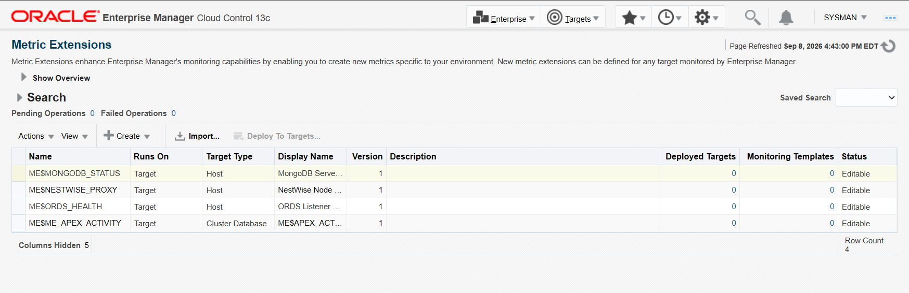

An extension moves through three states. Each step is on the **Actions** menu of
the Metric Extensions page, with the extension selected.

| State | Reached by | What it allows |
|---|---|---|
| Editable | The wizard | Editing. Cannot deploy |
| Deployable Draft | Save as Deployable Draft | Deploying to targets. Visible only to its creator. No further editing |
| Published | Publish Metric Extension | Visible to all administrators. Can be added to a monitoring template |

**An extension cannot be edited once it is a Deployable Draft.** Changing it means
creating a new version.

### 24.1 Save as Deployable Draft

Select the extension, then **Actions → Save as Deployable Draft**. Repeat for all
four.

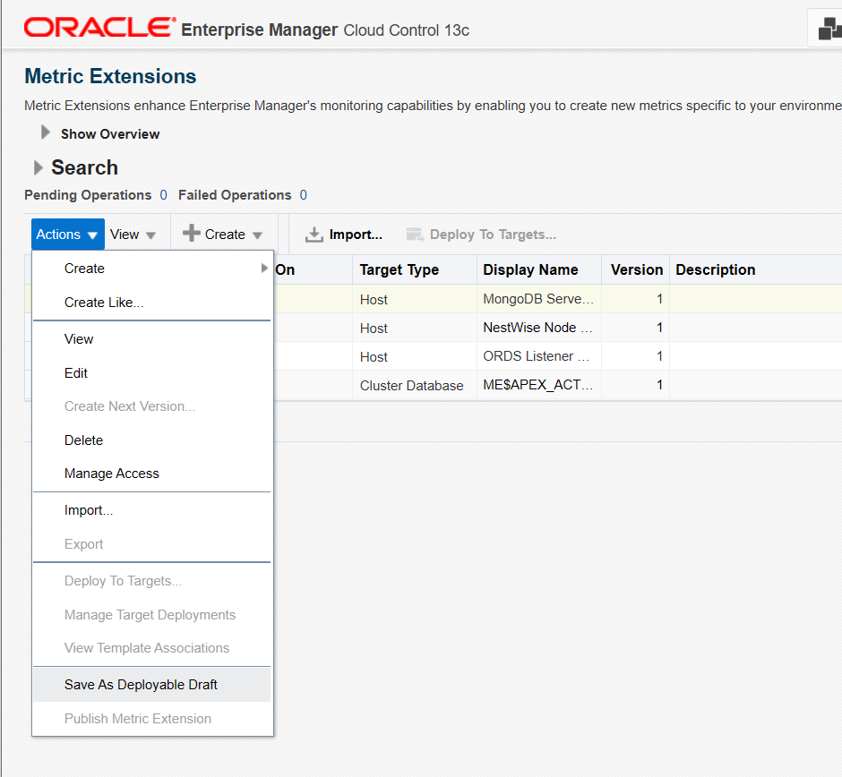

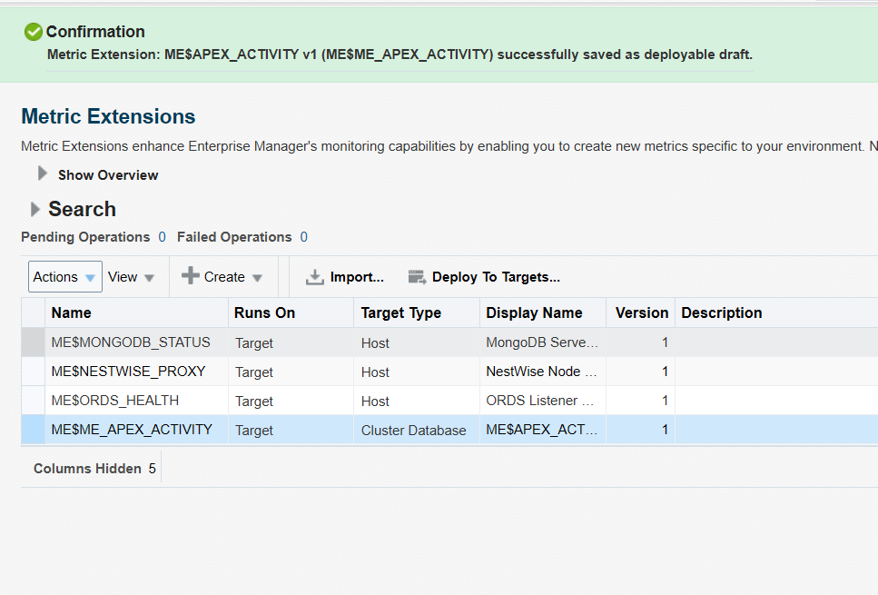

The confirmation gives both names, for example
`ME$APEX_ACTIVITY v1 (ME$ME_APEX_ACTIVITY)`. The name in brackets is the internal
name. A double prefix there means `ME$` was typed into the prefixed Name field.
See §20.1.

**Deploy To Targets** becomes enabled at this point.

### 24.2 Publish

**Actions → Publish Metric Extension**, for each of the four.

Publishing is required before an extension can be added to a monitoring template.
Oracle's Metric Extensions chapter states: *"You cannot add metric extensions to
monitoring templates before publishing the extension."*

### 24.3 Deploy to targets

**Actions → Deploy To Targets**, then **Add**.

| Extension | Target Type | Target |
|---|---|---|
| `ME$APEX_ACTIVITY` | Cluster Database | `apexdb` |
| `ME$ORDS_HEALTH` | Host | `oradbserv04.usat.com` |
| `ME$NESTWISE_PROXY` | Host | `oradbserv04.usat.com` |
| `ME$MONGODB_STATUS` | Host | `oradbserv04.usat.com` |

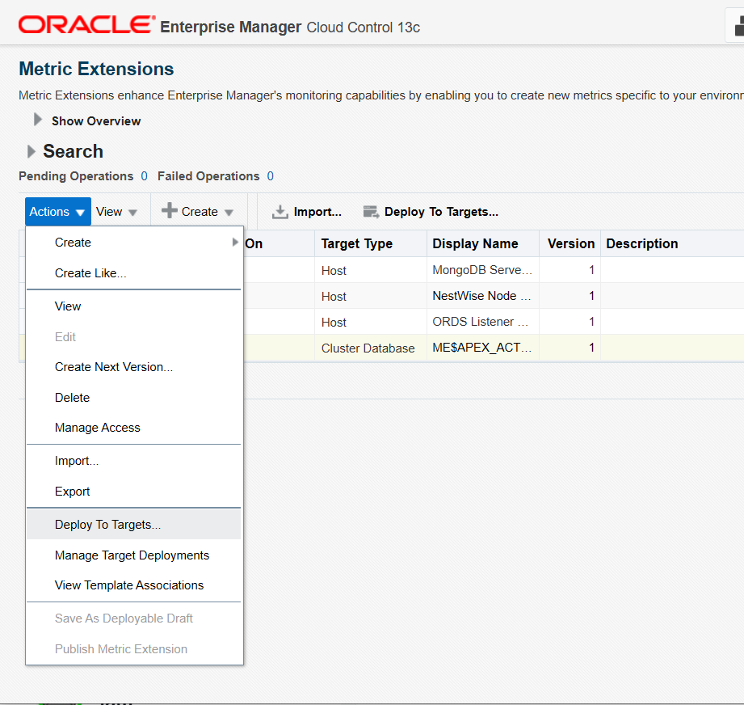

The picker lists only targets of the extension's own type. For
`ME$APEX_ACTIVITY` that is `apexdb` and `apexdb_stby`.

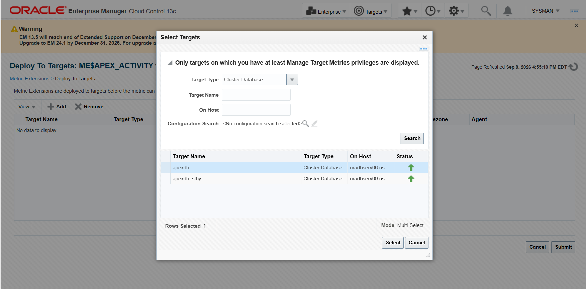

**Deploy `ME$APEX_ACTIVITY` to `apexdb` only.** `apexdb_stby` is a physical
standby and is read-only, so the APEX activity log there reflects the primary
rather than any local usage.

Click **Submit**.

### 24.4 Adding an extension to a monitoring template

Deploying to targets one at a time is right for this estate, which has one
application host. A monitoring template is how the same extension reaches many
targets, and how a future target picks it up on joining its administration group.

**Enterprise → Monitoring → Monitoring Templates**, edit the template, then
**Metric Thresholds → Add Metrics to Template**. Set **Search** to **Metric
Extensions**, tick the extension's metrics, and click **Continue**.

An extension only goes into a template of its own target type.

| Extension | Target type | Template |
|---|---|---|
| `ME$APEX_ACTIVITY` | Cluster Database | The Cluster Database template, §8.1 |
| `ME$ORDS_HEALTH`, `ME$NESTWISE_PROXY`, `ME$MONGODB_STATUS` | Host | A Host template |

**Do not add the three host extensions to `TPL_HOST_NONPROD`.** That template sits
in both `TC_TEST` and `TC_DEVELOPMENT`, so the ORDS, Node and MongoDB checks would
also reach `oradbserv09` and `oradbserv10`, which run none of them. `service_up`
would read `0` on each and stay permanently critical. A separate Host template for
the application tier is the answer when a second application host appears.

The page's own note explains why the non-alerting columns are correct: *"Empty
Thresholds will disable alerts for that metric."*

### 24.5 Verify

```bash
emcli list_metric_extension_on_target -target="oradbserv04.usat.com:host"
```

Then open the target's **All Metrics** page and confirm the extensions are
returning real values. Deployment succeeding is not the same as data arriving.

**Confirmed 2026-09-09.** All four extensions appear on their targets' All Metrics
pages with populated charts.

| Target | Metric category | Reading |
|---|---|---|
| `apexdb` | `APEX_ACTIVITY` | Page Views (2 min), `2 views` |
| `oradbserv04.usat.com` | `NestWise Node Proxy` | Response Time, `0.006` |
| `oradbserv04.usat.com` | `ORDS Listener Health` | Present |
| `oradbserv04.usat.com` | `MongoDB Server Status` | Present |

The custom categories appear alongside the out-of-box ones in the All Metrics
tree.

**Outstanding.** Response Time displays as `per second` on both the proxy and the
ORDS extensions. It is a duration in seconds, so the Unit on that column is wrong.
Correcting it requires a new version.

### 24.6 Screenshots still to capture

The wizard screenshots for all four extensions are in §§20 to 23. The rest:

| File | Shows |
|---|---|
| `7c-24a-me-published-list.png` | All four Published with non-zero Deployed Targets |
| `7c-24c-metrics-charting.png` | The metrics returning real values on All Metrics |

---


## Appendix A: `emcli` for metric extensions

A metric extension cannot be created from `emcli`. The EM 13.5 Monitoring Guide
lists five verbs and none of them authors one. The console wizard in §20 is the
only way to build one.

| Verb | What it does |
|---|---|
| `save_metric_extension_draft` | Save an editable extension as a deployable draft |
| `publish_metric_extension` | Publish a deployable draft for all administrators |
| `export_metric_extension` | Write a published extension to an archive file |
| `import_metric_extension` | Load an archive, optionally under a new name |
| `get_unused_metric_extensions` | List extensions deployed to agents but attached to no target |

```bash
. ~/.env/oms_env
emcli login -username=sysman

emcli save_metric_extension_draft -target_type=<type> -name=ME$APEX_ACTIVITY -version=1
emcli publish_metric_extension    -target_type=<type> -name=ME$APEX_ACTIVITY -version=1

emcli export_metric_extension -file_name=me_apex.zip \
  -target_type=<type> -name=ME$APEX_ACTIVITY -version=1

emcli import_metric_extension -file_name=me_apex.zip
```

`-target_type` wants the internal target type name, not the console display name.
Read it from the target before scripting:

```bash
emcli get_targets -targets=apexdb
```

The useful case for these verbs is moving a finished extension between
environments: build once in the console, export, import elsewhere.

---

Back to the **[index](phase-7b-extending-coverage.md)**.
