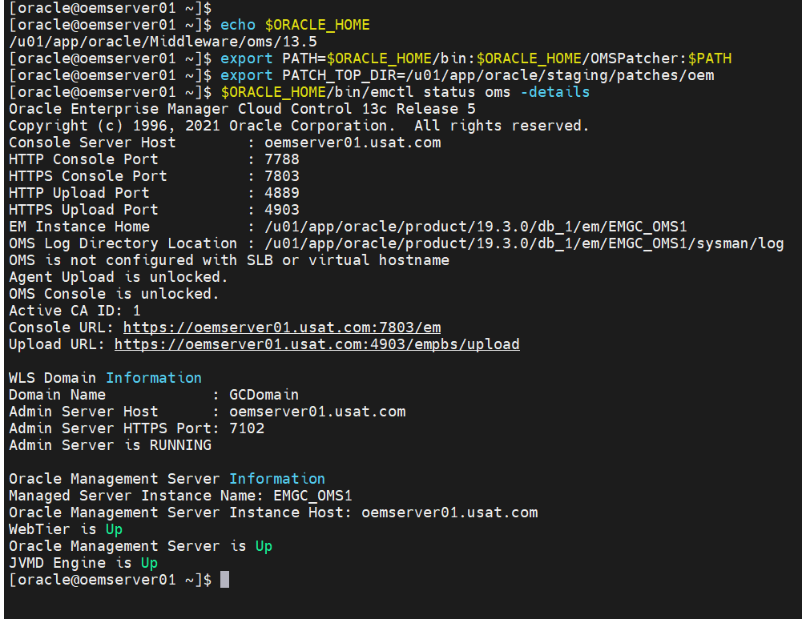
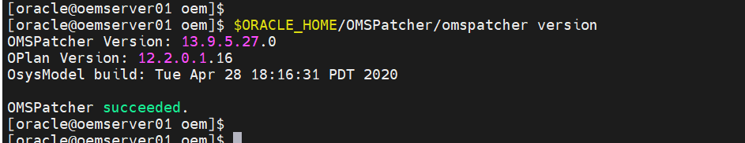
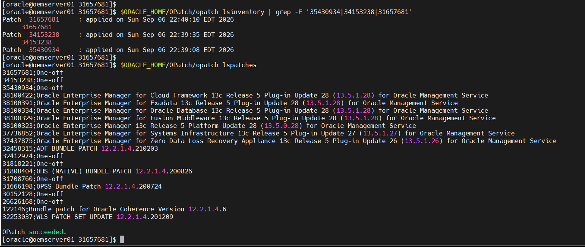
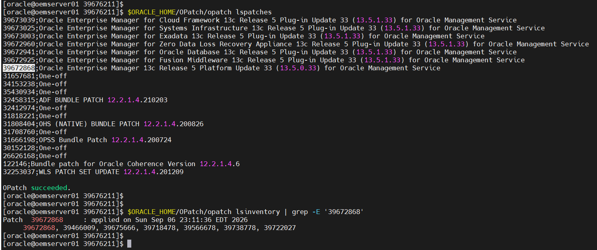
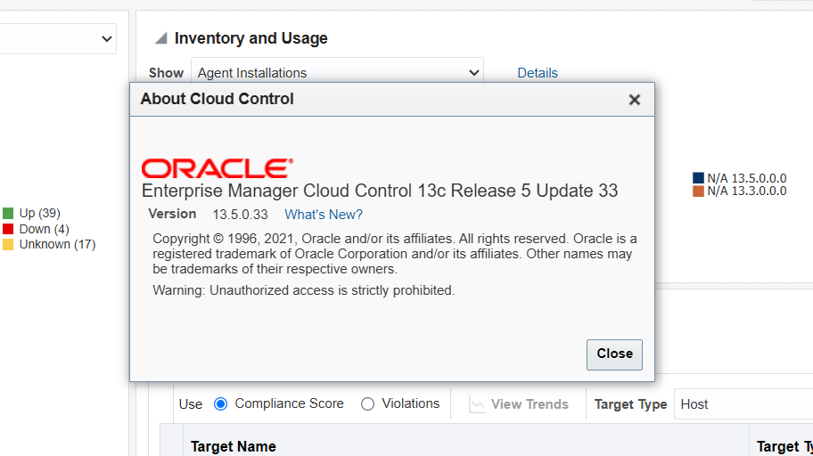

# Phase 7c Part 1: Patching the OMS to 13.5 RU33

**SOP: `oemserver01`, Enterprise Manager 13.5.0.0.0 to 13.5.0.33, patch 39676211, Oracle Linux**

Part 1 of 2. **Part 1 (this page)** takes the OMS from base 13.5.0.0.0 to Release
Update 33. [Part 2](phase-7c-part2-24ai-upgrade.md) is the upgrade to 24ai
Release 1. The index with the environment summary is
[`phase-7c-oms-upgrade.md`](phase-7c-oms-upgrade.md).

Status: 🟩 Confirmed. Ran clean end to end on 2026-09-06. The OMS is at
**13.5.0.33**.

| # | Section | Status |
|---|---|---|
| 1 | Prerequisites and decisions | 🟩 Confirmed 2026-09-06 |
| 2 | Why traditional patching and not Rapid Platform Update | 🟩 Confirmed 2026-09-06 |
| 3 | Capture the environment | 🟩 Confirmed 2026-09-06 |
| 4 | Upgrade OMSPatcher to 13.9.5.27.0 | 🟩 Confirmed 2026-09-06 |
| 5 | Create the WebLogic property file | 🟩 Confirmed 2026-09-06 |
| 6 | Analyze | 🟩 Confirmed 2026-09-06 |
| 7 | The patch window | 🟩 Confirmed 2026-09-06 |
| 8 | Verification | 🟩 Confirmed 2026-09-06 |
| 9 | Rollback | ⬜ Not required |
| 10 | Screenshot checklist | 🟩 Verified 2026-09-07 |

PNEWS1628 does not apply to this estate. See
[Appendix C](#appendix-c-pnews1628-not-applicable-to-this-estate).

Every command runs as **`oracle` on `oemserver01`** unless the step says
otherwise. Sections are labelled Who, What and Where where the answer is not that
default.

Screenshots are in [`screenshots/`](screenshots/), numbered to this page's section
numbers. The checklist is §10.

---

## Contents

1. [Prerequisites and decisions](#1-prerequisites-and-decisions)
2. [Why traditional patching and not Rapid Platform Update](#2-why-traditional-patching-and-not-rapid-platform-update)
3. [Capture the environment](#3-capture-the-environment)
4. [Upgrade OMSPatcher to 13.9.5.27.0](#4-upgrade-omspatcher-to-1395270)
5. [Create the WebLogic property file](#5-create-the-weblogic-property-file)
6. [Analyze](#6-analyze)
7. [The patch window](#7-the-patch-window)
8. [Verification](#8-verification)
9. [Rollback](#9-rollback)
10. [Screenshot checklist](#10-screenshot-checklist)

[Appendix A](#appendix-a-the-rollback-patch-id-list) holds the rollback patch id
list. [Appendix B](#appendix-b-what-stays-manual-and-why) records what is not
automated. [Appendix C](#appendix-c-pnews1628-not-applicable-to-this-estate)
records why PNEWS1628 does not apply here.

---

## 1. Prerequisites and decisions

| Item | Value |
|---|---|
| Target | **Enterprise Manager 13c Release 5 Update 33 (13.5.0.33)** |
| Patch | **39676211**, a System patch, released 18 August 2026 |
| MOS zip | `oem13.5_RU33_p39676211_135000_Generic.zip` |
| Apply mechanism | `omspatcher apply`, **traditional patching** (see §2) |
| Staging root | `/u01/app/oracle/staging/patches/oem` |
| Host | `oemserver01.usat.com`, single OMS, no Server Load Balancer |
| Repository database | `oemcdb`, **19.32.0.0.0** after [Phase 7a](phase-7a-repository-db-ru32.md) |
| Console | `https://oemserver01.usat.com:7803/em` |
| Backup | RMAN backup of `oemcdb`, plus a filesystem backup of the Middleware home, `gc_inst`, the Software Library and the inventory |
| Blackout | Created through the console, [see the blackout page](oem-create-blackout.md) |

### 1.1 The prerequisites, and where this estate stands against each

Taken from Section 2 of the RU33 README. Each row is a claim to confirm in §3,
not an assumption to carry forward.

| README prerequisite | Requirement | This estate |
|---|---|---|
| 1 | WebLogic Administration Server up | Confirm in §3 |
| 2 | Repository database and listener up | Confirm in §3 |
| 3 | Repository database at RU **19.12.0.0.0 or later** | **19.32.0.0.0**, cleared by Phase 7a |
| 4 | Rapid Platform Update needs RU3 or later already applied traditionally | Not met, and not needed. See §2 |
| 5 | Oracle Repository Creation Utility patch 33053642 | Windows only. Not applicable |
| 6 | OMSPatcher **13.9.5.27.0 or later** | Staged. Applied in §4 |
| 7 | Three JDBC patches at 12.2.1.4.0 | Staged. Applied in §7.5 |
| 8 | `ORACLE_HOME` set to the Middleware Oracle Home | §3.1 |
| 9 | `PATH` includes `unzip`, `$ORACLE_HOME/bin`, `$ORACLE_HOME/OMSPatcher` | §3.1 |
| 10 | WebLogic Administration Server credential access | §5 |
| 11 | A `<PATCH_TOP_DIR>` for the unzipped RU | §3.7 |
| 12 | RU zip extracted into `<PATCH_TOP_DIR>` | §3.7 |
| 13 | `omspatcher apply -analyze` completes | §6 |

**Prerequisite 3 was cleared by Phase 7a.** The RU33 README requires 19.12.0.0.0
or later. Oracle's 24ai Upgrade Guide separately requires 19.22.0.0.0 or later for
the upgrade in Part 2. At 19.32.0.0.0 the repository meets both.

### 1.2 What is staged

Confirmed present in `/u01/app/oracle/staging/patches/oem` on 2026-09-06:

| File | Patch | Purpose |
|---|---|---|
| `oem13.5_RU33_p39676211_135000_Generic.zip` | 39676211 | The RU itself, 1.49 GB |
| `OMSPatcher_patch_version_13.9.5.27.0_p19999993_135000_Generic.zip` | 19999993 | OMSPatcher 13.9.5.27.0 |
| `Oracle_JDBC_Fusion_Middleware_12.2.1.4.0_p35430934_122140_Generic.zip` | 35430934 | JDBC MLR, supersedes 32720458 and 33607709 |
| `Oracle_JDBC_Fusion_Middleware_12.2.1.4.0_p34153238_122140_Generic.zip` | 34153238 | JDBC |
| `Oracle_JDBC_Fusion_Middleware_12.2.1.4.0_p31657681_191000_Generic.zip` | 31657681 | JDBC |


**OPatch patch 28186730 is not staged and is not required here.** README
prerequisite 7 states that the *"OPatch version present in Middleware Oracle Home
is good to apply the JDBC Patches"*. Record the version found in §3.2 as the
evidence for that.

---

## 2. Why traditional patching and not Rapid Platform Update

The README offers two routes. Section 3 is traditional patching, which takes the
OMS down for the whole apply. Section 4 is Rapid Platform Update, which splits
the work into `omspatcher deploy` with the OMS up and `omspatcher update` during
a shorter downtime.

**Rapid Platform Update is not available on this OMS.** README prerequisite 4
states that to use it, *"Enterprise Manager 13c Release 5 Update 3 patch or its
later Release Update version patch should have been applied on all OMSes using
traditional patching method"*, and that a first-time RU application must go
through traditional patching first.

This OMS is at base 13.5.0.0.0 with no RU applied. RU33 is therefore its first
Release Update, and traditional patching is the only route. Rapid Platform Update
becomes available for the next RU.

A second gate applies regardless. README Section 4 step 1 states that if `/tmp` is
mounted with `noexec`, traditional patching must be used. Check it in §3.

---

## 3. Capture the environment

**Who:** `oracle` on `oemserver01`. **What:** read-only. **Where:** any shell.

Nothing here changes the system. Run it days ahead of the window and record the
output, because §5 and §6 depend on values found here.

### 3.1 Set the environment

`ORACLE_HOME` must point at the **Middleware Oracle Home**, which README
prerequisite 8 names explicitly. Derive it from the installed inventory rather
than typing it from an earlier note. Phase 7a's open questions record that a path
on this host was described incorrectly in `group_vars`.

```bash
grep -i oms /u01/app/oraInventory/ContentsXML/inventory.xml
```

Set it, then confirm it is the home the running OMS belongs to:

```bash
export ORACLE_HOME=<Middleware Oracle Home from above>
export PATH=$ORACLE_HOME/bin:$ORACLE_HOME/OMSPatcher:$PATH
export PATCH_TOP_DIR=/u01/app/oracle/staging/patches/oem

$ORACLE_HOME/bin/emctl status oms -details
```

Values confirmed on this estate 2026-09-06. `omspatcher` reports
`Running from : /u01/app/oracle/Middleware/oms/13.5`, matching the OMS home Phase
7a recorded.

| Value | This estate | Used by |
|---|---|---|
| Middleware Oracle Home | `/u01/app/oracle/Middleware/oms/13.5` | §4, §7 |
| Domain Name | `GCDomain` | §5 |
| Admin Server Host | `oemserver01.usat.com` | §5 |
| Admin Server HTTPS Port | `7102` | §5 |
| Enterprise Manager console port | `7803` | §8 |
| OMS version | Record it. §8 compares against it | §8 |
| Repository connect descriptor | Record it | §8 |



### 3.2 Record the tool versions

```bash
$ORACLE_HOME/OPatch/opatch version
$ORACLE_HOME/OMSPatcher/omspatcher version
```

```
[oracle@oemserver01 ~]$ $ORACLE_HOME/OPatch/opatch version
OPatch Version: 13.9.4.2.5

OPatch succeeded.

[oracle@oemserver01 ~]$
[oracle@oemserver01 ~]$ $ORACLE_HOME/OMSPatcher/omspatcher version
OMSPatcher Version: 13.9.5.26.0
OPlan Version: 12.2.0.1.16
OsysModel build: Tue Apr 28 18:16:31 PDT 2020

OMSPatcher succeeded.
[oracle@oemserver01 ~]$
```

Confirmed on this estate 2026-09-06:

| Tool | Version found | Required |
|---|---|---|
| OPatch | `13.9.4.2.5` | The README accepts the version present in the Middleware home |
| OMSPatcher | `13.9.5.26.0` | `13.9.5.27.0` or later. §4 raises it |

A base 13.5.0.0.0 install ships an OMSPatcher below `13.9.5.27.0`. The OPatch
version recorded here is the evidence for the decision in §1.2 not to stage patch
28186730.

### 3.3 Confirm the repository database and its RU

```bash
sqlplus / as sysdba <<'SQL'
SELECT version_full FROM v$instance;
SQL
```

```
SQL>
SQL> SELECT version_full FROM v$instance;

VERSION_FULL
-----------------
19.32.0.0.0

SQL>
```

`version_full` should return `19.32.0.0.0`. Anything below `19.12.0.0.0` fails
README prerequisite 3.

### 3.4 Record `job_queue_processes`

`omspatcher` changes this parameter during the apply and sets it afterwards. The
README states that it restores the original value if the repository database is
discovered, and otherwise sets it to the default of 50.

Record the value now. Without a recorded starting value there is nothing to
compare against in §8.

```bash
sqlplus -s / as sysdba <<'SQL'
SELECT name, value FROM v$parameter WHERE name = 'job_queue_processes';
SQL
```

| | Value |
|---|---|
| Before the patch | |
| After the patch (§8) | |

### 3.5 Check `/tmp` for `noexec`

```bash
findmnt -no OPTIONS /tmp
```

If `noexec` appears, note it against §2. It does not change this run, which is
traditional patching either way. It decides whether Rapid Platform Update is
available for the next RU.

### 3.6 Confirm free space

The RU zip is 1.49 GB compressed. The extracted patch directory and the Middleware
home both need room.

```bash
df -h /u01 /tmp
du -sh $ORACLE_HOME
```

### 3.7 Extract the RU

```bash
cd $PATCH_TOP_DIR
unzip -q oem13.5_RU5_p39676211_135000_Generic.zip 
ls -d $PATCH_TOP_DIR/39676211
```

The README calls the extracted directory `<PATCH_TOP_DIR>/39676211`, and §6 and
§7 both run from inside it.

---

## 4. Upgrade OMSPatcher to 13.9.5.27.0

**Who:** `oracle` on `oemserver01`. **What:** replaces a utility directory inside
the Middleware home. **Where:** `$ORACLE_HOME`. **OMS state:** may stay running.

Procedure from My Oracle Support Doc ID 2809842.1.

```bash
cd $PATCH_TOP_DIR
mv $ORACLE_HOME/OMSPatcher $ORACLE_HOME/OMSPatcher_old
unzip -q OMSPatcher_patch_version_13.9.5.27.0_p19999993_135000_Generic.zip -d $ORACLE_HOME/
```

The zip unpacks a complete `OMSPatcher/` tree, so the existing directory is moved
aside rather than unpacked over. `OMSPatcher_old` is the rollback for this step.

Verify:

```bash
$ORACLE_HOME/OMSPatcher/omspatcher version
```

Confirmed on this estate 2026-09-06:

```
[oracle@oemserver01 oem]$ $ORACLE_HOME/OMSPatcher/omspatcher version
OMSPatcher Version: 13.9.5.27.0
OPlan Version: 12.2.0.1.16
OsysModel build: Tue Apr 28 18:16:31 PDT 2020

OMSPatcher succeeded.
[oracle@oemserver01 oem]$
```



**A version below `13.9.5.27.0` fails README prerequisite 6.** Do not continue
past this check. README prerequisite 6 is met at `13.9.5.27.0`.

---

## 5. Create the WebLogic property file

**Who:** `oracle` on `oemserver01`. **What:** creates an encrypted credential pair
and a property file. **Where:** a directory readable only by `oracle`.

`omspatcher` needs the WebLogic Administration Server URL and credentials for
every operation, including `-analyze`. Without a property file it prompts for them
on each run.

### 5.1 Generate the encrypted config and key

```bash
mkdir -p /u01/app/oracle/staging/patches/oem/wlskeys
chmod 700 /u01/app/oracle/staging/patches/oem/wlskeys

$ORACLE_HOME/OMSPatcher/wlskeys/createkeys.sh \
  -oh $ORACLE_HOME \
  -location /u01/app/oracle/staging/patches/oem/wlskeys
```

Enter the WebLogic Administration Server credentials when prompted. Two files are
written, `config` and `key`.

**The WebLogic password is entered here and appears in no file in this
repository.** The encrypted pair stays on `oemserver01` under a `700` directory
owned by `oracle`.

### 5.2 Write the property file

**The protocol is `t3s`, not `https`.** `omspatcher` connects to the WebLogic
Administration Server over JMX, which runs on T3 over SSL. The README's syntax is
`t3s://<admin server host>:<admin server HTTPS port>`. An `https://` URL is
accepted by the file and then fails at connect time with error code 231.

The port is the same one the WebLogic Admin Console answers on. On this estate the
console is at `https://oemserver01.usat.com:7102/console`, so the Admin Server
HTTPS port is **7102** and the JMX URL is `t3s://oemserver01.usat.com:7102`.

That port is not the Enterprise Manager console port. `7803` is the EM console,
`7102` is the WebLogic Administration Server. Take it from `emctl status oms
-details` rather than from either assumption.

```bash
cat > /u01/app/oracle/staging/patches/oem/omspatcher.properties <<EOF
AdminServerURL=t3s://oemserver01.usat.com:7102
AdminConfigFile=/u01/app/oracle/staging/patches/oem/wlskeys/config
AdminKeyFile=/u01/app/oracle/staging/patches/oem/wlskeys/key
EOF

chmod 600 /u01/app/oracle/staging/patches/oem/omspatcher.properties
```

| Port | Serves | Protocol in this file |
|---|---|---|
| 7803 | Enterprise Manager console | Not used here |
| 7102 | WebLogic Administration Server | `t3s` |

---

## 6. Analyze

**Who:** `oracle` on `oemserver01`. **What:** read-only. **OMS state:** running.

The analyze step does not install anything. It checks that the RU can be
installed. Configuration and credential problems surface here rather than in the
window.

```bash
cd $PATCH_TOP_DIR/39676211
omspatcher apply -analyze \
  -property_file /u01/app/oracle/staging/patches/oem/omspatcher.properties
```

`omspatcher` prompts for a database username. The default is `sys`. This estate
has not created the non-SYS admin user that RU15 and later allow, so answer `sys`.

### 6.1 Two log files, not one

`omspatcher` writes both and names them in its own output. The second is the one
with the detail.

```
$ORACLE_HOME/cfgtoollogs/omspatcher/opatch<timestamp>.log
$ORACLE_HOME/cfgtoollogs/omspatcher/39676211/omspatcher_<timestamp>_analyze.log
```

### 6.2 Outcomes

| Outcome | Action |
|---|---|
| Clean | Proceed to §7 |
| `WARNING:Apply the 12.2.1.4.0 version of the following JDBC Patch(es)` | Expected before §7.5. It is a warning, not the failure. See §6.4 |
| `OMSPatcher failed to establish JMX connection to weblogic server`, error code 231 | The property file. See §6.3 |
| Anything else | Stop. The README's instruction is to contact Oracle Support rather than proceed |

### 6.3 Error code 231 is the property file

Nothing has been changed when this appears. Check, in order:

| Check | How |
|---|---|
| Protocol is `t3s`, not `https` | Encountered on this estate 2026-09-06. See [§5.2](#52-write-the-property-file) |
| Port is the WebLogic Administration Server port, not the console port | `7102`, not `7803` |
| The Administration Server is running | `$ORACLE_HOME/bin/emctl status oms -details` |
| `config` and `key` are readable and current | Regenerate with §5.1 |

The error message also suggests `OMSPatcher.OMS_DISABLE_HOST_CHECK=true` with
`-invPtrLoc`. That applies to virtual host configurations. This OMS is not on one.

### 6.4 The JDBC warning is expected on the first run

Analyze names all three prerequisite patches:

```
WARNING:Apply the 12.2.1.4.0 version of the following JDBC Patch(es) on OMS Home
before proceeding with patching.
1.MLR patch 35430934(or its superset),which includes bugs 32720458 and 33607709
2.Patch 31657681
3.Patch 34153238
```

This confirms README prerequisite 7 rather than contradicting it. The patches are
applied in §7.5, with the OMS stopped, because OPatch cannot replace files a
running WebLogic server holds open.


### 6.5 Run record

**🟩 `OMSPatcher succeeded.` 2026-09-06 21:46.** Confirmations from the run:

```
[oracle@oemserver01 39676211]$ omspatcher apply -analyze -property_file /u01/app/oracle/staging/patches/oem/omspatcher.properties
OMSPatcher Automation Tool
Copyright (c) 2017, Oracle Corporation.  All rights reserved.


OMSPatcher version : 13.9.5.27.0
OUI version        : 13.9.4.0.0
Running from       : /u01/app/oracle/Middleware/oms/13.5
Log file location  : /u01/app/oracle/Middleware/oms/13.5/cfgtoollogs/omspatcher/opatch2026-09-06_21-46-04PM_1.log

WARNING:Apply the 12.2.1.4.0 version of the following JDBC Patch(es) on OMS Home before proceeding with patching.
1.MLR patch 35430934(or its superset),which includes bugs 32720458 and 33607709
2.Patch 31657681
3.Patch 34153238

OMSPatcher log file: /u01/app/oracle/Middleware/oms/13.5/cfgtoollogs/omspatcher/39676211/omspatcher_2026-09-06_21-46-10PM_analyze.log


Enter DB user name : sys
Enter 'sys' password :
Checking if current repository database is a supported version
Current repository database version is supported


Prereq "checkComponents" for patch 39672868 passed.

Prereq "checkComponents" for patch 39673039 passed.

Prereq "checkComponents" for patch 39673025 passed.

Prereq "checkComponents" for patch 39672960 passed.

Prereq "checkComponents" for patch 39672925 passed.

Prereq "checkComponents" for patch 39672941 passed.

Prereq "checkComponents" for patch 39673003 passed.

Configuration Validation: Success


Running apply prerequisite checks for sub-patch(es) "39672868,39672960,39673039,39673025,39673003,39672925,39672941" and Oracle Home "/u01/app/oracle/Middleware/om                                                                             s/13.5"...
Sub-patch(es) "39672868,39672960,39673039,39673025,39673003,39672925,39672941" are successfully analyzed for Oracle Home "/u01/app/oracle/Middleware/                                                                                           oms/13.5"


Complete Summary
================


All log file names referenced below can be accessed from the directory "/u01/app/oracle/Middleware/oms/13.5/cfgtoollogs/omspatcher/2026-09-06_21-46-04PM                                                                                        _SystemPatch_39676211_1"

Prerequisites analysis summary:
-------------------------------

The following sub-patch(es) are applicable:

             Featureset                                                      Sub-patches                                                                                                                                                                                   Log file
             ----------                                                      -----------                                                                                                                                                                                   --------
  oracle.sysman.top.oms   39672868,39672960,39673039,39673025,39673003,39672925,39672941   39672868,39672960,39673039,39673025,39673003,39672925,3967294                                                                                        1_opatch2026-09-06_21-46-20PM_1.log


The following sub-patches are not needed by any component installed in the OMS system:
39672995,34430509,36752930,39672976,39672986,36329046,39673009,36752891


--------------------------------------------------------------------------------
The following warnings have occurred during OPatch execution:
1) Apply the 12.2.1.4.0 version of the following JDBC Patch(es) on OMS Home before proceeding with patching.
1.MLR patch 35430934(or its superset),which includes bugs 32720458 and 33607709
2.Patch 31657681
3.Patch 34153238

--------------------------------------------------------------------------------
Log file location: /u01/app/oracle/Middleware/oms/13.5/cfgtoollogs/omspatcher/39676211/omspatcher_2026-09-06_21-46-10PM_analyze.log

OMSPatcher succeeded.
[oracle@oemserver01 39676211]$

```

---

## 7. The patch window

Everything from here changes the system. Work in order.

### 7.1 Create the blackout

**Who:** You, through the console. **Where:**
`https://oemserver01.usat.com:7803/em`.

Follow the standing procedure,
**[Creating a Blackout in Enterprise Manager 13.5](oem-create-blackout.md)**.
Cover `oemserver01.usat.com`, the `oemcdb` database and listener targets, and the
`Management Services and Repository` target.

This is not scripted, for the reason recorded in
[Appendix B](#appendix-b-what-stays-manual-and-why).

Confirm the blackout is active before stopping anything.

### 7.2 Back up


The RU changes both the OMS binaries and the repository schema. The README
requires a backup of both.

#### 7.2.1 What to back up

| # | Artefact | What it is |
|---|---|---|
| 1 | Repository database | `oemcdb`, the schema the RU alters |
| 2 | Middleware home | The OMS binaries, `$ORACLE_HOME` |
| 3 | `gc_inst` | The OMS instance home. Configuration, not binaries |
| 4 | Software Library | Gold agent images, plug-in artefacts, deployment procedures |
| 5 | Oracle inventory | The patch registry. Without it `opatch` cannot describe the home |

#### 7.2.2 Find each path

Derive these rather than typing them from an earlier note.

```bash
# 2. Middleware home, and 3. gc_inst
$ORACLE_HOME/bin/emctl status oms -details | grep -iE 'oms home|instance'

# 4. Software Library
emcli list_swlib_storage_locations

# 5. Oracle inventory
grep INVENTORY_LOC /etc/oraInst.loc
```

`emcli list_swlib_storage_locations` is the same command that diagnosed the gold
image failure in [Phase 7b Part 3](phase-7b-part3-golden-image.md).

Paths on this estate, confirmed 2026-09-06:

| # | Path |
|---|---|
| 2 | `/u01/app/oracle/Middleware/oms/13.5` |
| 3 | `/u01/app/oracle/product/19.3.0/db_1/em/EMGC_OMS1` |
| 4 | `/u01/app/oracle/Middleware/swlib` |
| 5 | `/u01/app/oraInventory` |

#### 7.2.3 Back up the repository database

An RMAN backup, following
[Phase 7a Part 2 §9](phase-7a-part2-the-patch-window.md#9-back-up-before-the-patch).

Add a guaranteed restore point, as Phase 7a did:

```sql
CREATE RESTORE POINT PRE_EM_RU33 GUARANTEE FLASHBACK DATABASE;
SELECT name, guarantee_flashback_database, time FROM v$restore_point;
```
```
SQL> CREATE RESTORE POINT PRE_EM_RU33 GUARANTEE FLASHBACK DATABASE;

Restore point created.

SQL>
SQL> SELECT name, guarantee_flashback_database, time FROM v$restore_point;

NAME
--------------------------------------------------------------------------------
GUA TIME
--- ---------------------------------------------------------------------------
PRE_RU32
YES 04-SEP-26 06.53.41.000000000 AM

PRE_EM_RU33
YES 06-SEP-26 10.11.28.000000000 PM


SQL>
```

### 7.3 Stop the OMS

The filesystem archives in §7.4 must be taken with the OMS down, so nothing is
written while `tar` is reading. §7.5 also needs the OMS down, because OPatch
cannot replace files a running WebLogic server holds open.

```bash
$ORACLE_HOME/bin/emctl stop oms
$ORACLE_HOME/bin/emctl status oms
```

### 7.4 Back up the four filesystem artefacts

`tar -C <parent> <directory>` archives the directory with a relative path, so the
restore does not depend on where the archive is unpacked.

```bash
BKP=/u03/backups/oms/pre_ru33_$(date +%Y%m%d)
mkdir -p $BKP

# 2. Middleware home
tar czf $BKP/middleware_home.tar.gz -C /u01/app/oracle/Middleware oms

# 3. gc_inst
tar czf $BKP/gc_inst.tar.gz -C /u01/app/oracle/product/19.3.0/db_1/em EMGC_OMS1

# 4. Software Library
tar czf $BKP/swlib.tar.gz -C /u01/app/oracle/Middleware swlib

# 5. Oracle inventory
tar czf $BKP/orainventory.tar.gz -C /u01/app oraInventory
```

Substitute the paths from §7.2.2 if they differ on the host being patched.

#### 7.4.1 Confirm the backups are readable

An archive that will not list is not a backup.

```bash
ls -lh $BKP
for f in $BKP/*.tar.gz; do echo "== $f"; tar tzf "$f" >/dev/null && echo OK || echo FAIL; done
df -h /u03
```
```
[oracle@oemserver01 39676211]$ for f in $BKP/*.tar.gz; do echo "== $f"; tar tzf "$f" >/dev/null && echo OK || echo FAIL; done
== /u03/backups/oms/pre_ru33_20260906/gc_inst.tar.gz
OK
== /u03/backups/oms/pre_ru33_20260906/middleware_home.tar.gz
OK
== /u03/backups/oms/pre_ru33_20260906/orainventory.tar.gz
OK
== /u03/backups/oms/pre_ru33_20260906/swlib.tar.gz
OK
[oracle@oemserver01 39676211]$ df -h /u03
Filesystem      Size  Used Avail Use% Mounted on
/dev/sde1       100G   30G   71G  30% /u03
[oracle@oemserver01 39676211]$

```

### 7.5 Apply the three JDBC prerequisite patches

These are FMW and WebLogic binaries. OPatch cannot replace files that a running
server holds open, which is the `checkActiveFilesAndExecutables` class of failure
the README warns about. The OMS is already stopped from §7.3.

Apply in the order the README lists them.

```bash
cd $PATCH_TOP_DIR
for z in Oracle_JDBC_Fusion_Middleware_12.2.1.4.0_p35430934_122140_Generic.zip \
         Oracle_JDBC_Fusion_Middleware_12.2.1.4.0_p34153238_122140_Generic.zip \
         Oracle_JDBC_Fusion_Middleware_12.2.1.4.0_p31657681_191000_Generic.zip
do
  unzip -q -o "$z" -d $PATCH_TOP_DIR/jdbc
done


cd $PATCH_TOP_DIR/jdbc/35430934 && $ORACLE_HOME/OPatch/opatch apply -silent -verbose
cd $PATCH_TOP_DIR/jdbc/34153238 && $ORACLE_HOME/OPatch/opatch apply -silent -verbose
cd $PATCH_TOP_DIR/jdbc/31657681 && $ORACLE_HOME/OPatch/opatch apply -silent -verbose
```

Verify all three landed:

```bash
$ORACLE_HOME/OPatch/opatch lsinventory | grep -E '35430934|34153238|31657681'
```



**35430934 is an MLR that includes 32720458 and 33607709.** If either of those is
already present, OPatch reports them as subsets and deactivates them. Phase 7a
documented the same pattern for the superseded one-off patches. It is expected
behaviour, not a failure.

### 7.6 Start the WebLogic Administration Server only

`omspatcher apply` connects to the Administration Server over JMX, the same
connection §6 established. The Administration Server must therefore be running
while the OMS managed servers stay down.

```bash
$ORACLE_HOME/bin/emctl start oms -admin_only
```

### 7.7 Apply the Release Update

```bash
cd $PATCH_TOP_DIR/39676211
omspatcher apply \
  -property_file /u01/app/oracle/staging/patches/oem/omspatcher.properties
```

Answer `sys` at the database username prompt.

This is the long step. It patches the binaries, runs the repository schema
changes, and starts the OMS. Three documented behaviours:

- **`omspatcher` starts the OMS when it finishes.** Running `emctl start oms`
  alongside it is not required.
- **It submits the Enterprise Manager DBMS scheduler jobs.**
- **It sets `job_queue_processes`.** The README states it restores the original
  value if the repository database is discovered, and otherwise sets it to the
  default of 50. §8.3 reads it back against the value recorded in §3.4.

Verify the applied patch list before leaving this step:

```bash
cd $ORACLE_HOME/OMSPatcher
./omspatcher lspatches
```
```
[oracle@oemserver01 OMSPatcher]$ /u01/app/oracle/Middleware/oms/13.5/OPatch/opatch lspatches
39673039;Oracle Enterprise Manager for Cloud Framework 13c Release 5 Plug-in Update 33 (13.5.1.33) for Oracle Management Service
39673025;Oracle Enterprise Manager for Systems Infrastructure 13c Release 5 Plug-in Update 33 (13.5.1.33) for Oracle Management Service
39673003;Oracle Enterprise Manager for Exadata 13c Release 5 Plug-in Update 33 (13.5.1.33) for Oracle Management Service
39672960;Oracle Enterprise Manager for Zero Data Loss Recovery Appliance 13c Release 5 Plug-in Update 33 (13.5.1.33) for Oracle Management Service
39672941;Oracle Enterprise Manager for Oracle Database 13c Release 5 Plug-in Update 33 (13.5.1.33) for Oracle Management Service
39672925;Oracle Enterprise Manager for Fusion Middleware 13c Release 5 Plug-in Update 33 (13.5.1.33) for Oracle Management Service
39672868;Oracle Enterprise Manager 13c Release 5 Platform Update 33 (13.5.0.33) for Oracle Management Service
31657681;One-off
34153238;One-off
35430934;One-off
32458315;ADF BUNDLE PATCH 12.2.1.4.210203
32412974;One-off
31818221;One-off
31808404;OHS (NATIVE) BUNDLE PATCH 12.2.1.4.200826
31708760;One-off
31666198;OPSS Bundle Patch 12.2.1.4.200724
30152128;One-off
26626168;One-off
122146;Bundle patch for Oracle Coherence Version 12.2.1.4.6
32253037;WLS PATCH SET UPDATE 12.2.1.4.201209

OPatch succeeded.
[oracle@oemserver01 OMSPatcher]$
```



### 7.8 Synchronise emcli

**Where:** every host with an `emcli` installation, not only `oemserver01`.

```bash
emcli sync
```

### 7.9 Clear the blackout

Through the console, once §8 confirms the OMS is healthy. Not before.

---

## 8. Verification

Run every check in this section before clearing the blackout in §7.9.

| Check | Status |
|---|---|
| 8.1 The patch is registered | 🟩 Confirmed 2026-09-06 |
| 8.2 The OMS and central agent are up and uploading | 🟩 Confirmed 2026-09-06 |
| 8.3 `job_queue_processes` matches the recorded value | 🟩 Confirmed 2026-09-06 |
| 8.4 The console is reachable and the estate is intact | 🟩 Confirmed 2026-09-06 |
| 8.5 The administration groups survived | 🟩 Confirmed 2026-09-06 |

### 8.1 The patch is registered

**`emctl status oms -details` does not report the Release Update level.** It
reports the base release, the console URL, the Admin Server and the repository
connection. The applied patch list comes from `omspatcher`.

```bash
cd $ORACLE_HOME/OMSPatcher
./omspatcher lspatches
```

The evidence for this run is the §7.7 screenshot, which captures the apply summary
and the resulting patch list in one place.

### 8.2 The OMS and central agent are up and uploading

```bash
$ORACLE_HOME/bin/emctl status oms -details
$AGENT_INSTANCE_HOME/bin/emctl status agent
```

The central agent's instance home is not the same directory as its Oracle home.
Phase 7a recorded the agent Oracle home as
`/u01/app/oracle/Middleware/agent/13_5`. Take the instance home from the agent's
own `emctl status agent` output.

Look for `Last successful upload` with a timestamp after the restart, the same
check Phase 7b used on each new agent.



### 8.3 `job_queue_processes` matches the recorded value

```bash
sqlplus -s / as sysdba <<'SQL'
SELECT name, value FROM v$parameter WHERE name = 'job_queue_processes';
SQL
```

Compare against the value recorded in [§3.4](#34-record-job_queue_processes). A
result of `50` where the recorded value was different means `omspatcher` did not
discover the repository database and applied its default. Set the original value
back.

### 8.4 The console is reachable and the estate is intact

Log in at `https://oemserver01.usat.com:7803/em` and compare the target count
against the number taken immediately before §7.3.

```bash
emcli get_targets | wc -l
```

### 8.5 The administration groups survived

Phase 7b built the administration group hierarchy. Confirm it is intact.

```bash
emcli get_targets -targets=composite
```
```
[oracle@oemserver01 OMSPatcher]$ emcli get_targets -targets=composite
Status  Status           Target Type           Target Name
 ID
-9      N/A              group                 Test-Grp
-9      N/A              group                 MC-Grp
-9      N/A              group                 Stag-Grp
-9      N/A              group                 Deve-Grp
-9      N/A              group                 Prod-Grp
-9      N/A              group                 ADMGRP0
[oracle@oemserver01 OMSPatcher]$
```

The hierarchy is intact. `MC-Grp` and `Stag-Grp` are the Mission Critical and
Staging nodes, which Phase 7b Part 2 did not use.

---

## 9. Rollback

**Deinstalling the RU is documented in README Section 5.** It
changes the repository schema in both directions, where restoring the backups from
§7.2 and §7.4 returns it to a single known state.

Order matters:

1. Deinstall the RU33 patch on the **central agent** before deinstalling it on the
   OMS.
2. Stop the OMS.
3. Run the rollback with the patch id list in
   [Appendix A](#appendix-a-the-rollback-patch-id-list).
4. Start the OMS.
5. Run `emcli sync` on every `emcli` installation.

```bash
$ORACLE_HOME/bin/emctl stop oms

omspatcher rollback -id <see Appendix A> \
  -property_file /u01/app/oracle/staging/patches/oem/omspatcher.properties

$ORACLE_HOME/bin/emctl start oms
emcli sync
```

Run `-analyze` first, as the apply was analyzed in §6:

```bash
omspatcher rollback -analyze -id <see Appendix A> \
  -property_file /u01/app/oracle/staging/patches/oem/omspatcher.properties
```

Two README conditions do not apply to this estate. No Holistic Patch has been
applied, so there is nothing to deinstall first. Fleet Maintenance is not in use,
so the `DB_FIPS140` step does not arise.

---

## 10. Screenshot checklist

Verified against `screenshots/` on 2026-09-07.

| File | Section | Shows | Status |
|---|---|---|---|
| `7c-03a-emctl-status-oms-details.png` | 3.1 | Starting version and Admin Server details | 🟩 Embedded |
| `7c-04a-omspatcher-version.png` | 4 | OMSPatcher 13.9.5.27.0 | 🟩 Embedded |
| `7.4_Apply_the_three_JDBC_patch_verify.png` | 7.5 | The three JDBC patches in `opatch lsinventory` | 🟩 Embedded |
| `7.5_Apply_the_Release_Update.png` | 7.7 | The apply summary and `omspatcher lspatches` | 🟩 Embedded |
| `8.1_The_version_moved.png` | 8.2 | `emctl status oms -details` after the patch | 🟩 Embedded |

Every screenshot referenced in this page exists in `screenshots/` and is embedded.
Sections 6 and 7.1 carry no screenshot. Their evidence is the pasted `omspatcher`
output in §6.5 and the blackout page's own screenshots.

Two naming conventions are in use. Sections 3 and 4 follow the
`7c-NN[a-z]-slug.png` convention used elsewhere in this directory. Sections 7 and 8
use `N.N_Description.png`. Renaming affects the markdown links only, not the
content.

---

## Appendix A: The rollback patch id list

From Section 5 of the RU33 README. **This list is correct only because RU33 is the
first Release Update applied to this OMS.** If any later RU is applied on top,
the list changes, and My Oracle Support note KB390077 is what supplies the
replacement.

```
39672868,39673039,39672995,34430509,36752930,39673025,39672960,39672925,39672941,39672976,39672986,36329046,39673009,39673003,36752891
```

Fifteen ids. Pass them to `omspatcher rollback -id` as a single comma separated
argument with no spaces.

**Eight of those fifteen will never be installed on this OMS.** The §6 analyze
established that only seven apply here:

```
39672868,39672960,39673039,39673025,39673003,39672925,39672941
```

The other eight are *"not needed by any component installed in the OMS system"*,
because the plug-ins they target are not deployed.

**Read the applied set rather than using the README list directly.**

```bash
cd $ORACLE_HOME/OMSPatcher
./omspatcher lspatches
```

Then analyze the rollback with those ids before running it:

```bash
omspatcher rollback -analyze -id <ids from lspatches> \
  -property_file /u01/app/oracle/staging/patches/oem/omspatcher.properties
```

The README list is recorded here as the documented starting point and as the
record of what the RU contains.

---

## Appendix C: PNEWS1628, not applicable to this estate

README Section 1 states that after applying the 13.5.0.33 patch it is *"mandatory
to execute the steps in the Actions section of My Oracle Support Note
PNEWS1628"*, and that this is *"with reference to the fixes to support OAuth move
from OAM to IDCS"*.

That OAuth change governs how Enterprise Manager authenticates outbound to My
Oracle Support. It applies to an OMS running in Online mode, where the OMS
connects to My Oracle Support for Self Update, patch downloads and service
requests.

**This OMS is not connected to My Oracle Support and does not use online
patching**, so there is no OAuth configuration for the change to act on. The
Actions section was not run.

Revisit this if the OMS is later switched to Online mode. The connection mode is
shown under **Setup → Provisioning and Patching → Offline Patching**.

---

## Appendix B: What stays manual and why

| Step | Why it is not automated |
|---|---|
| Creating and clearing the blackout | Requires `emcli` and `sysman` login credentials, which are kept out of this repository, out of `group_vars`, and off any command line |
| The WebLogic property file | Creating it requires the WebLogic Administration Server password. The encrypted `config` and `key` pair stays on `oemserver01` under a `700` directory |
| The `sys` prompt during apply | `omspatcher` prompts for it interactively. Passing it another way places a privileged password in the process table |
| PNEWS1628 ([Appendix C](#appendix-c-pnews1628-not-applicable-to-this-estate)) | Its Actions section is behind My Oracle Support and cannot be reproduced here. Not applicable to this estate |
| Rollback | Requires a decision between rolling back and restoring from §7.2 |

This is the same division Phase 7a used, recorded in
[`phase-7a-ansible.md`](phase-7a-ansible.md#what-stays-manual-and-why).

---

## Sources

- Patch 39676211 README, *Oracle Enterprise Manager 13c Release 5 Update 33
  (13.5.0.33) for Oracle Management Service*, released 18 August 2026
- My Oracle Support Doc ID 2809842.1, *How To Upgrade Enterprise Manager 13.5
  Cloud Control OMSPatcher Utility to the Latest Version*
- My Oracle Support KB313420, *How to Apply Release Update on the OMS During the
  Install Upgrade*, which covers the `-bitonly` route used during an install or
  upgrade rather than the configured-OMS route used here
- [Patching Oracle Management Service, Cloud Control Administrator's Guide 13.5](https://docs.oracle.com/en/enterprise-manager/cloud-control/enterprise-manager-cloud-control/13.5/emadm/patching-oracle-management-service-and-repository.html)
