# Phase 7c Part 1: The Reference Agent

**SOP: deploy one EM 13.5 Management Agent to `oradbserv05`, verify it, and leave it ready to serve as the source for the gold agent image**

Part 1 of 4. This page installs a single agent. That agent is the source from
which [Part 3](phase-7c-part3-golden-image.md) cuts the gold image used to install
agents on the four remaining hosts.

No targets are discovered here. The image is a software baseline, and cutting it
from an agent that has discovered nothing keeps it a plain 13.5 agent. Discovery
runs on all five hosts in
[Part 2 §12](phase-7c-part2-admin-groups.md#12-discover-and-promote-targets--all-five-hosts),
after the administration groups exist to receive the targets.

Status: 🟩 Confirmed. Ran against the live lab on 2026-09-04.

| # | Section | Status |
|---|---|---|
| 1 | Establish what is monitored today | 🟩 Confirmed |
| 2 | Host prerequisites | 🟩 Confirmed |
| 3 | Named Credentials | 🟩 Confirmed |
| 4 | Deploy the agent | 🟩 Confirmed |
| 5 | Verify the agent | 🟩 Confirmed |

**Result:** agent 13.5.0.0.0 installed on `oradbserv05.usat.com:3872`, running,
secure, and uploading to `oemserver01.usat.com:4903`.

Screenshots are in [`screenshots/`](screenshots/), named `7c-NN[a-z]-slug.png` to
match this page's section numbers.

---

## Contents

1. [Establish what is monitored today](#1-establish-what-is-monitored-today)
2. [Host prerequisites](#2-host-prerequisites)
3. [Named Credentials](#3-named-credentials)
4. [Deploy the agent](#4-deploy-the-agent)
5. [Verify the agent](#5-verify-the-agent)
6. [Screenshot checklist](#6-screenshot-checklist)

[Appendix A](#appendix-a-silent-install-with-agentdeploysh) covers the silent
install method. [Appendix B](#appendix-b-notes-for-the-remaining-hosts) records
two host-specific points that apply in Part 3.

---

## 1. Establish what is monitored today

Record the baseline before anything changes.

**Who:** `oracle`
**Where:** `oemserver01`

```bash
. ~/.env/oms_env
emcli login -username=sysman
emcli get_targets -targets=host
emcli get_targets | wc -l
```

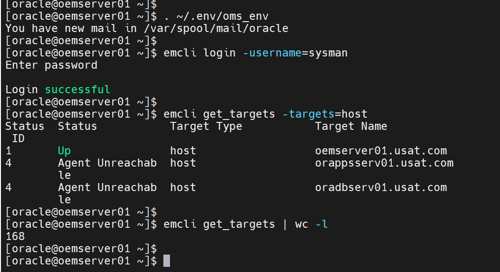

Three hosts are known to Enterprise Manager: `oemserver01` is Up, and
`oradbserv01` and `orappsserv01` are Agent Unreachable. Total target count is
**168**.

Neither RAC cluster is monitored. Confirm that on the host itself rather than
inferring it from the target list.

**Who:** `oracle`
**Where:** `oradbserv05`

```bash
ls -d /u01/app/oracle/Middleware/agent 2>/dev/null || echo "no agent home"
/u01/app/oracle/Middleware/agent/agent_13.5.0.0.0/bin/emctl status agent 2>/dev/null \
  || echo "no agent installed"
```

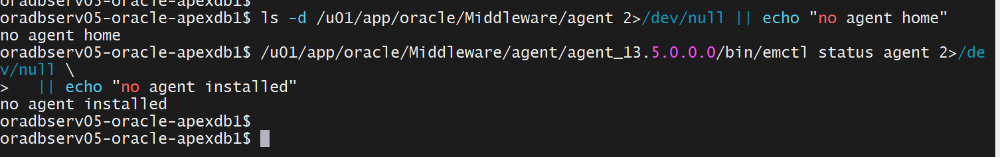

Both checks return negative. `oradbserv05` has no agent.

---

## 2. Host prerequisites

The agent install fails late when any of these is missing, so check them first.

**Who:** `root`, then `oracle`
**Where:** `oradbserv05`

| # | Requirement | Check |
|---|---|---|
| 2.1 | Install user exists with a real home | `id oracle && echo $HOME` |
| 2.2 | Agent base directory exists and is writable, and is not inside an existing `ORACLE_HOME` | `mkdir -p /u01/app/oracle/Middleware && ls -ld /u01/app/oracle/Middleware` |
| 2.3 | At least 10 GB free in the agent base | `df -h /u01` |
| 2.4 | Port range free. The agent takes the first free port from 3872 | `ss -tlnp \| grep -E '387[0-9][0-9]'` |
| 2.5 | OMS reachable on the upload port | `curl -skI https://oemserver01.usat.com:4903/empbs/upload \| head -1` |
| 2.6 | Time in sync with the OMS | `chronyc tracking` |
| 2.7 | Name resolution agrees through NSS, not just DNS | `getent hosts oemserver01.usat.com` |
| 2.8 | Passwordless sudo for `oracle`, tested over SSH | `ssh oracle@oradbserv05.usat.com sudo -n true && echo ok` |

An agent occupies roughly 1 GB installed. The margin in 2.3 is for its logs and
for staged gold images later.

Clock skew between agent and OMS causes upload failures that report as
certificate problems, which is why 2.6 is on the list.

**Run 2.8 over SSH rather than from a local shell.** Enterprise Manager runs sudo
without a TTY. A local `sudo true` can succeed where the wizard's attempt fails
with *"visiblepw is not set in the sudoers file"*. The RAC nodes receive
passwordless sudo from `os_prep`'s `/etc/sudoers.d/11-oracle-grid`.

---

## 3. Named Credentials

The wizard needs a credential to log in to the target host, and a privileged one
if it is to run `root.sh`.

**Who:** SYSMAN, or a user with the Create Named Credential privilege
**Where:** `https://oemserver01.usat.com:7803/em`

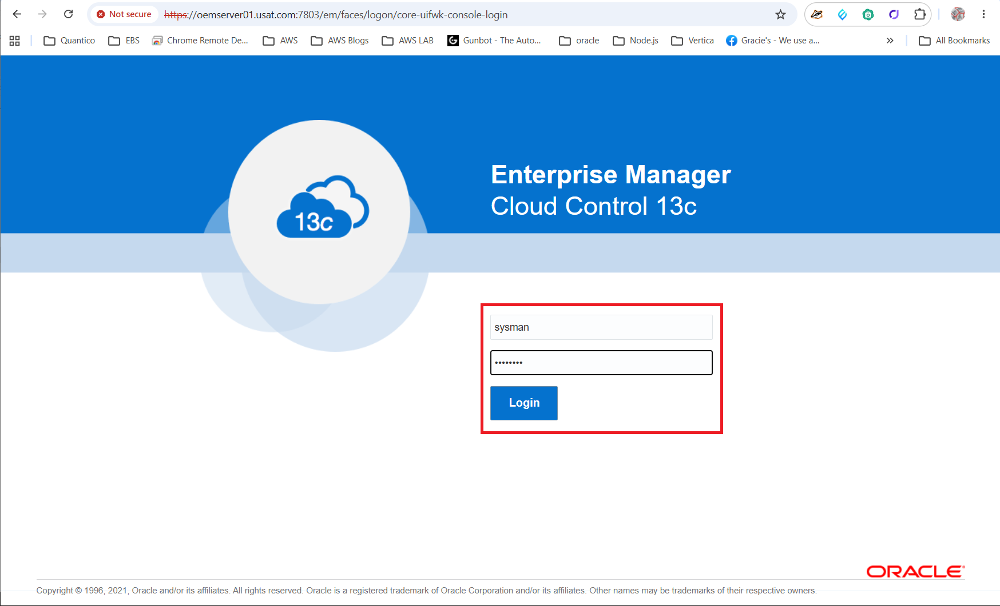

**Setup → Security → Named Credentials**

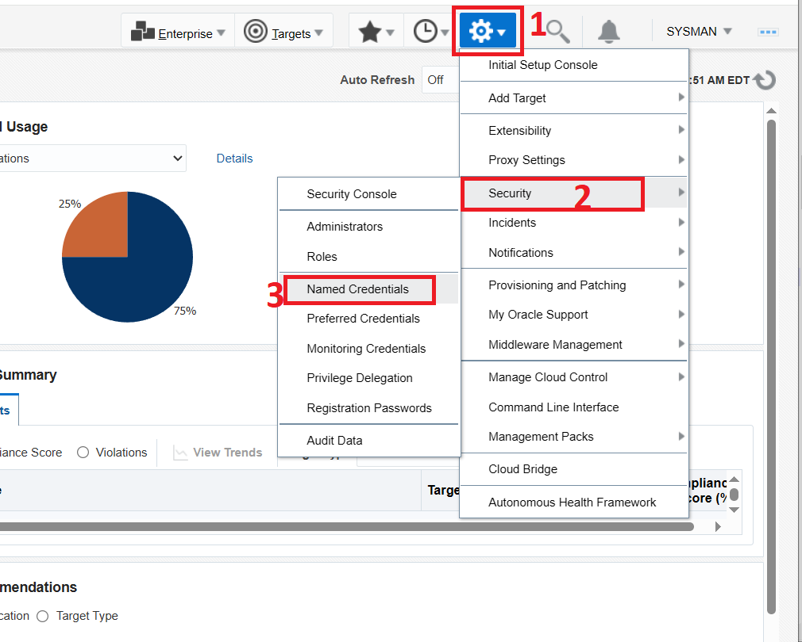

The Named Credentials page lists existing credentials and provides Create, Edit,
Manage Access, Delete, Test and View References.

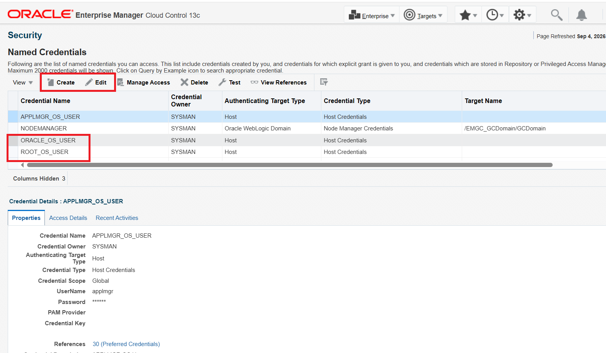

### 3.1 Create the host credential

Click **Create** and complete the form.

| Field | Value |
|---|---|
| Credential name | `NC_HOST_ORACLE` |
| Credential description | `Oracle OS User` |
| Authenticating Target Type | `Host` |
| Credential type | `Host Credentials` |
| Scope | `Global` |
| UserName | `oracle` |
| Run Privilege | `None` |

Use **Test and Save**. The Test options dialog asks for a Test
Target type of `Host` and a Test Target Name, which here is
`oemserver01.usat.com`, an existing monitored host.

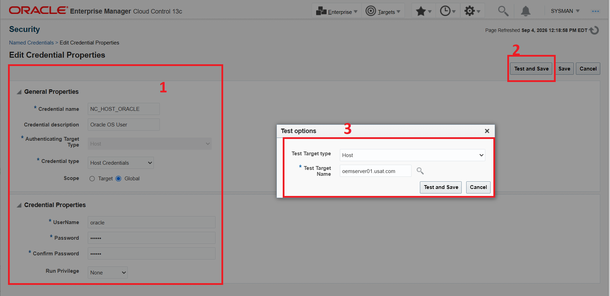

### 3.2 Create the privileged credential

| Field | Value |
|---|---|
| Credential name | `NC_HOST_ROOT_SUDO` |
| Credential description | `Sudo Root` |
| Authenticating Target Type | `Host` |
| Credential type | `Host Credentials` |
| Scope | `Global` |
| UserName | `oracle` |
| Run Privilege | `Sudo` |
| Run as | `root` |

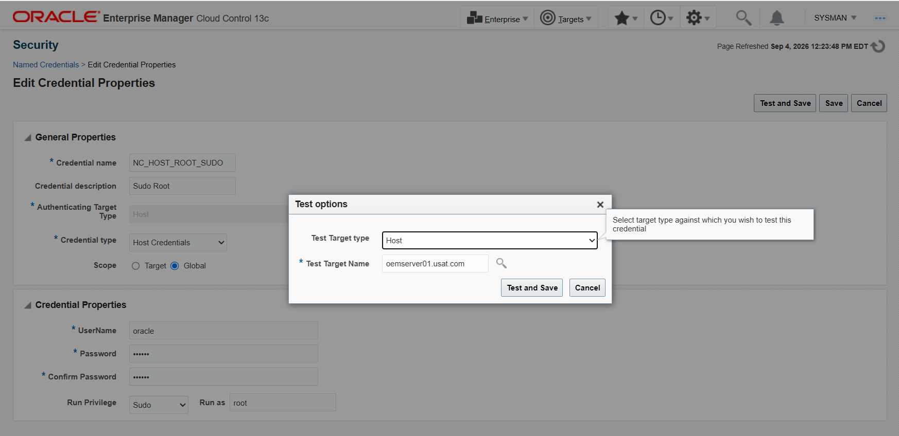

### 3.3 Test both credentials

Select a credential on the Named Credentials page and click **Test**. Test Type
`Basic` performs the remote operation and launches the corresponding Perl
command.

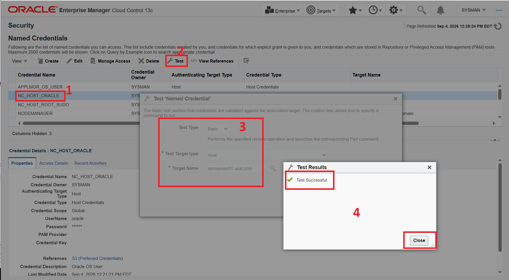

Both credentials return **Test Successful**.

These passwords are entered here and nowhere else. They are held in the
Enterprise Manager credential store and referenced by name afterwards. No file in
this repository contains them.

---

## 4. Deploy the agent

One host. The remaining four are installed from the gold image in
[Part 3 §15](phase-7c-part3-golden-image.md#15-install-agents-on-the-four-remaining-hosts).

**Setup → Add Target → Add Targets Manually**

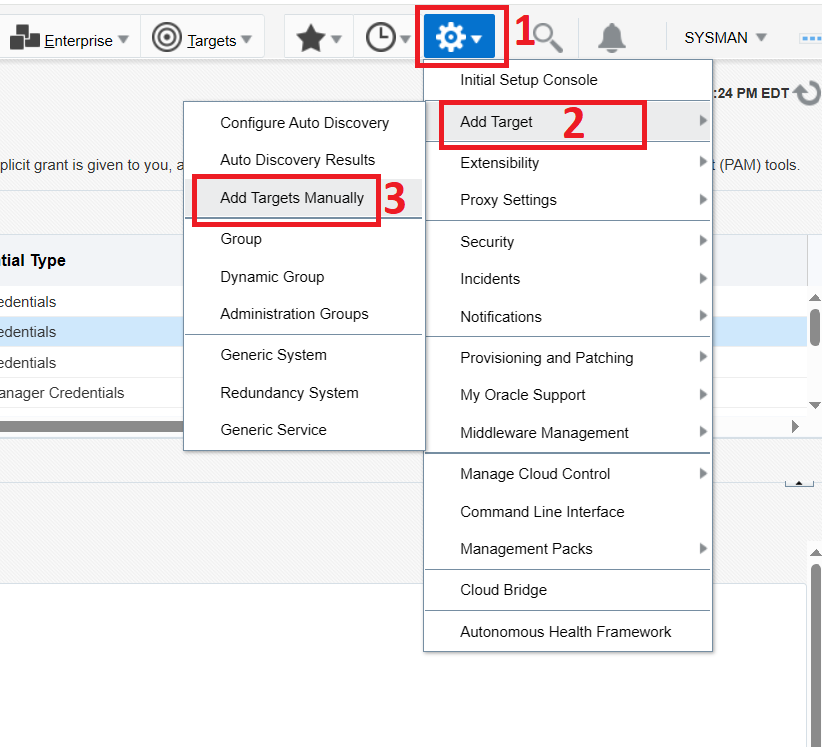

That page presents three panels. Use the leftmost, **Add Host Targets**, and click
**Install Agent on Host**. The neighbouring **Add Target Manually** button
registers a database or listener rather than installing an agent.

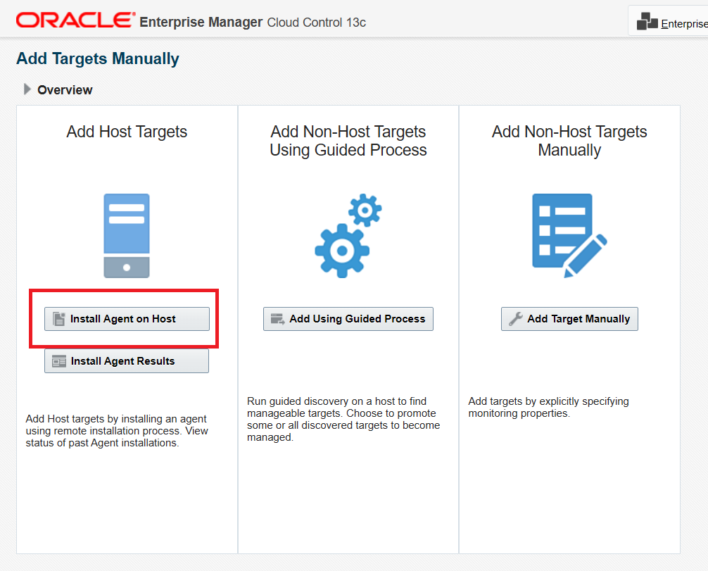

### 4.1 Host and Platform

| Field | Value |
|---|---|
| Session Name | `ADD_HOST_SYSMAN_Sep_4_2026_12_43_52_PM_EDT` (the wizard supplies a timestamped default) |
| Host | `oradbserv05.usat.com` |
| Platform | `Linux x86-64` |

Enter the fully qualified name. It becomes the target name and is awkward to
change later.

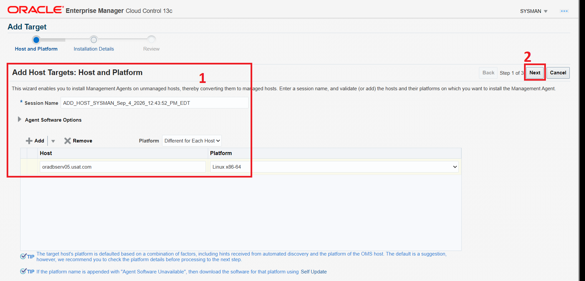

The page carries two tips from Oracle. The platform shown is a suggestion derived
partly from the OMS host's platform, so confirm it before continuing. If a
platform name is appended with "Agent Software Unavailable", download that
platform's software through Self Update.

The platform recorded here is also the platform of the gold image built from this
agent. An image can only be deployed to hosts matching it. All five hosts in this
phase are Linux x86-64.

Click **Next**.

### 4.2 Installation Details

Deployment Type is **Fresh Agent Install**, with Agent Software Version
13.5.0.0.0.

| Field | Value |
|---|---|
| Installation Base Directory | `/u01/app/oracle/Middleware/agent/13_5` |
| Instance Directory | `/u01/app/oracle/Middleware/agent/13_5/agent_inst` |
| Named Credential | `NC_HOST_ORACLE(SYSMAN)` |
| Root Credential | `NC_HOST_ROOT_SUDO(SYSMAN)` |
| Privileged Delegation Setting | `/usr/bin/sudo -u %RUNAS% %COMMAND%` |
| Port | `3872` |

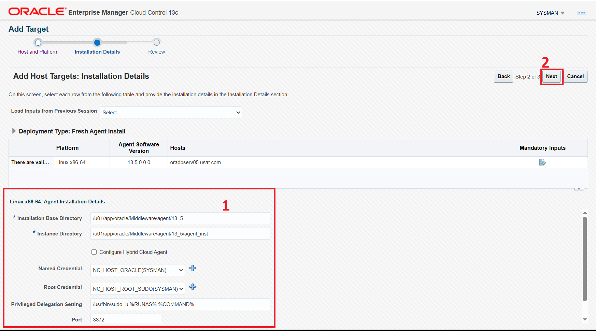

The base directory matches `oemserver01`'s existing layout, where `AGENT_BASE` is
`/u01/app/oracle/Middleware/agent/13_5`, so the estate stays consistent with OFA.

Click **Next**.

### 4.3 Review

The Review page restates the session, deployment type, OMS host and upload port,
and every value from Installation Details.

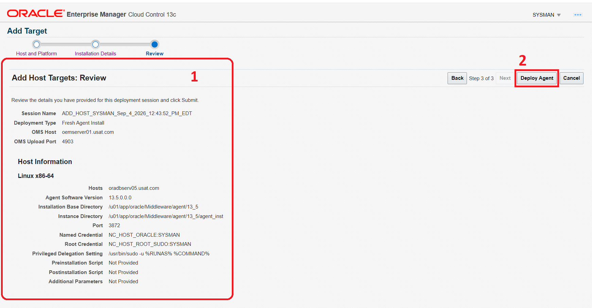

Click **Deploy Agent**.

### 4.4 Deployment

The Add Host page tracks three phases per host: Initialization, Remote
Prerequisite Check and Agent Deployment. It also prints the OMS-side log
locations for the prerequisite check and the deployment.

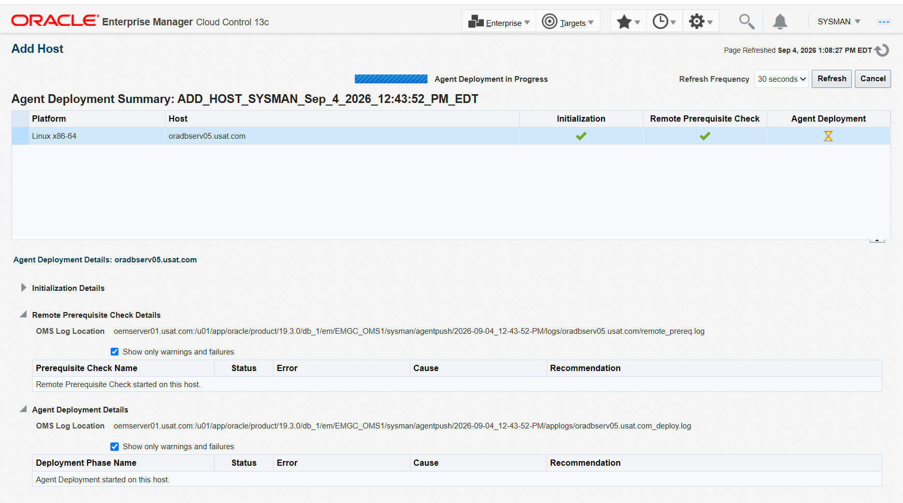

Read any warnings rather than looking only for green ticks. The two
`Show only warnings and failures` panels report nothing beyond the phase start
messages on this run.

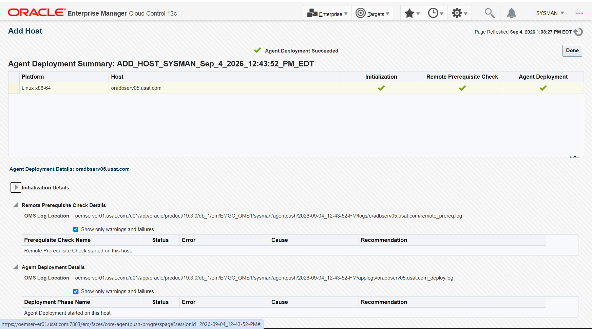

**Agent Deployment Succeeded.**

### 4.5 Run `root.sh`

The install leaves `root.sh` pending unless the wizard ran it.

**Who:** `root`
**Where:** `oradbserv05`

```bash
/u01/app/oracle/Middleware/agent/13_5/agent_13.5.0.0.0/root.sh
```

It sets ownership and the setuid bit on `nmosudo` and registers the agent's
`oraInst.loc`. Without it the agent cannot run privileged metric collections.

---

## 5. Verify the agent

### 5.1 From the host

**Who:** `oracle`
**Where:** `oradbserv05`

```bash
cd /u01/app/oracle/Middleware/agent/13_5/agent_13.5.0.0.0/bin
./emctl status agent
```


Confirmed on this run:

| Field | Value |
|---|---|
| Agent Version | 13.5.0.0.0 |
| OMS Version | 13.5.0.0.0 |
| Agent URL | `https://oradbserv05.usat.com:3872/emd/main/` |
| Repository URL | `https://oemserver01.usat.com:4903/empbs/upload` |
| Started by user | `oracle` |
| Number of XML files pending upload | 0 |
| Collection Status | Collections enabled |
| Heartbeat Status | Ok |
| Last successful upload | 2026-09-04 13:24:14 |

Ending in **Agent is Running and Ready**.

`Last successful upload` must be a real timestamp. An agent that starts but never
uploads reports as running, and is the failure this check exists to catch.

The agent reports **Number of Targets: 3**. Those are the agent's own targets, on
a host where nothing has been discovered.

### 5.2 From the console

**Setup → Manage Cloud Control → Agents**

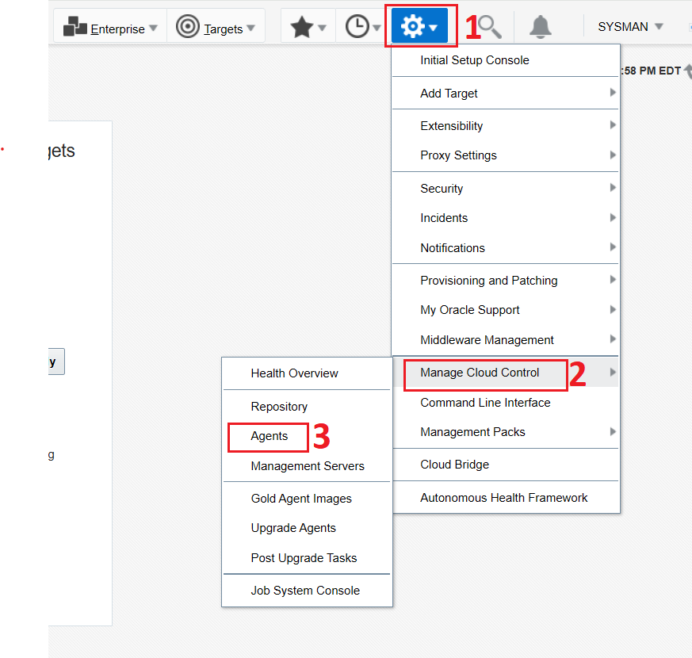

Open the agent to see its home page.


Confirmed on this run: Status Up, Availability 100.00 percent, Secure Yes, Agent
Collecting Yes, Restarts in the last 24 hours 0, Agent Upload Interval 15
minutes, and Partner Agent `oemserver01.usat.com:3872`.

**Secure Yes matters for Part 3.** Oracle will not create a gold image version
from an unsecure agent.

The agent is now ready to serve as the image source in
[Part 3 §13](phase-7c-part3-golden-image.md#13-confirm-the-reference-agent).

---

## 6. Screenshot checklist

```
screenshots/
├── 7c-01a-emcli-get-targets-baseline.png
├── 7c-01b-agent-status-per-host.png
├── 7c-03a1-oem-login-page.png
├── 7c-03a2-oem-Setup-name-credentials.png
├── 7c-03a3-oem-Setup-name-credentials_create_edit.png
├── 7c-03a4-named-credentials-create.png
├── 7c-03b1-named-credential-test-ok.png
├── 7c-03b2-named-credential-test-ok.png
├── 7c-04a1-add-host-targets-hostnames.png
├── 7c-04a2-add-host-targets-hostnames.png
├── 7c-04a3-add-host-targets-hostnames.png
├── 7c-04b1-installation-details.png
├── 7c-04b2-installation-details.png
├── 7c-04c-prerequisite-check-results.png
├── 7c-04d-deployment-in-progress.png
├── 7c-04e1-agent-status-uploading.png
├── 7c-04e2-agent-status-uploading.png
└── 7c-04e3-agent-status-uploading.png
```

Eighteen images, all embedded above. Two steps were not captured: the §2
prerequisite checks, and the §4.5 `root.sh` run. Section 5 confirms both
indirectly, because an agent that is Up, Secure and uploading requires them.

Two naming notes. `7c-04b2` shows the Review page rather than Installation
Details, and `7c-04e2` shows the Setup menu path rather than agent status. Both
filenames were assigned before the sections were finalised.

---

## Appendix A: Silent install with `agentDeploy.sh`

Not used on this run. The console wizard in §4 succeeded. This method is
documented because it writes its own log on the target host, which is a better
diagnostic than the console summary when a deployment fails.

### A.1 Get the deployment kit from the OMS

**Who:** `oracle`
**Where:** `oemserver01`

```bash
. ~/.env/oms_env
emcli login -username=sysman
emcli get_supported_platforms
emcli get_agentimage -destination=/tmp/agentimage \
  -platform="Linux x86-64" -version=13.5.0.0.0
```

Copy the resulting zip to the target host.

### A.2 Install

**Who:** `oracle`
**Where:** the target host

```bash
mkdir -p /u01/app/oracle/Middleware/agent/13_5
cd /u01/app/oracle/staging/agent
unzip -q agentimage.zip
./agentDeploy.sh \
  AGENT_BASE_DIR=/u01/app/oracle/Middleware/agent/13_5 \
  OMS_HOST=oemserver01.usat.com \
  EM_UPLOAD_PORT=4903 \
  AGENT_REGISTRATION_PASSWORD=<registration password>
```

Then `root.sh` as in §4.5 and the checks in §5.

The registration password is not the SYSMAN password. It is set under
**Setup → Security → Registration Passwords**. It is a shared secret for agent
enrolment and does not belong in this repository.

---

## Appendix B: Notes for the remaining hosts

These apply when [Part 3 §15](phase-7c-part3-golden-image.md#15-install-agents-on-the-four-remaining-hosts)
installs agents on `oradbserv04`, `06`, `09` and `10`.

### B.1 The install user on `oradbserv04`

That host runs the NestWise application tier and has `ords`, `mongod` and
`nestwise` service accounts, kept separate per
[`../nestwise-app/docs/mongodb-server-install.md`](../nestwise-app/docs/mongodb-server-install.md).
Do not install the agent as any of them.

Use `oracle`, matching the rest of the estate. A gold image can only be deployed
to agents that share the install user and platform it was built from.

### B.2 Additional parameters and the central inventory

The wizard's Additional Parameters field was left empty on this run. It is where
`-invPtrLoc` goes when a host has a non-default `oraInst.loc`, which the RAC nodes
do at `/u01/app/oraInventory` per
[`../installation/README.md`](../installation/README.md). The agent maintains its
own inventory location and does not normally need this. If an install fails
reporting inventory permissions, this is the field to set.

---

## Related pages

- [Part 3: Agent gold image](phase-7c-part3-golden-image.md), which cuts the image from this agent
- [Part 2: Administration groups and template collections](phase-7c-part2-admin-groups.md), where discovery runs
- [Discovering and Promoting Targets](oem-discover-and-promote-targets.md), the standing procedure

---

Continue to **[Part 3: Agent gold image](phase-7c-part3-golden-image.md)**.
Back to the **[index](phase-7c-extending-coverage.md)**.
