# Phase 7c Part 2a: Pre-deployment

**Everything that happens while the 13.5 OMS is still serving the console**

Part 2a of three. [Part 2b](phase-7c-part2b-deployment.md) is the downtime
window. [Part 2c](phase-7c-part2c-post-deployment.md) is what follows it. The
index is [`phase-7c-part2-24ai-upgrade.md`](phase-7c-part2-24ai-upgrade.md).

Status: 🟩 Confirmed. Ran on 2026-09-10 and 2026-09-11. The 24ai binaries are
installed and patched to RU12.

None of this section costs downtime. The 24ai binaries are installed and patched
beside the running 13.5 OMS. Only `ConfigureGC.sh` in Part 2b needs the stack
down.

| # | Section | Status |
|---|---|---|
| 1 | Stage the software | 🟩 Confirmed 2026-09-10 |
| 2 | Prerequisites | 🟩 Confirmed 2026-09-10 |
| 3 | Run the EM Prerequisite Kit | 🟩 Confirmed 2026-09-11 |
| 4 | Install the software only | 🟩 Confirmed 2026-09-11 |
| 5 | Patch the binaries to RU12 | 🟩 Confirmed 2026-09-11 |
| 6 | Screenshot checklist | 🟩 Twenty-five embedded |

Every command runs as **`oracle` on `oemserver01`** unless the step says
otherwise.

**`ORACLE_HOME` means two different things on this page.** §2 addresses the 13.5
home through `~/.env/oms_env`. §4.7 and §5 set it to the new 24ai home.

---

## Contents

1. [Stage the software](#1-stage-the-software)
2. [Prerequisites](#2-prerequisites)
3. [Run the EM Prerequisite Kit](#3-run-the-em-prerequisite-kit)
4. [Install the software only](#4-install-the-software-only)
5. [Patch the binaries to RU12](#5-patch-the-binaries-to-ru12)
6. [Screenshot checklist](#6-screenshot-checklist)

[Appendix A](#appendix-a-certificate-remediation-not-required): certificate
remediation, not needed.

---

## 1. Stage the software

Staged alongside the Part 1 artefacts, in
`/u01/app/oracle/staging/patches/oem`.

### 1.1 What is staged

Confirmed present on 2026-09-10:

| File | Component | Size |
|---|---|---|
| `V1046951-01.zip` | 24ai Cloud Control software, part 1 of 5 | 1.62 GB |
| `V1046952-01.zip` | part 2 of 5 | 1.53 GB |
| `V1046953-01.zip` | part 3 of 5 | 1.92 GB |
| `V1046954-01.zip` | part 4 of 5 | 1.68 GB |
| `V1046955-01.zip` | part 5 of 5 | 1.67 GB |
| `OEM_24ai.1_RU12_p39675954_241000_Generic.zip` | **24ai Release Update 12**, patch 39675954 | 2.13 GB |
| `OMSPatcher_patch_version_13.9.24.16.0_p19999993_241000_Generic.zip` | OMSPatcher **13.9.24.16.0** for 24.1 | 3.13 MB |
| `OPATCH_13.9.4.2.24_OEM_13.5_24.1_FMW_WLS_12.2.1.4.0_p28186730_1394224_Generic.zip` | OPatch **13.9.4.2.24**, patch 28186730 | 59.7 MB |

`wlskeys/` and `omspatcher.properties` are also there from Part 1. Neither is
used on this path. They address the 13.5 home. Leave them alone.

**OPatch 28186730 was staged during the Part 1 window and never applied**,
because the RU33 README accepted the OPatch already in the 13.5 home. It gets
applied here, in §5.3, against the 24ai home.

Where each came from:

| What | Where |
|---|---|
| 24ai Cloud Control software | <https://www.oracle.com/enterprise-manager/downloads/cloud-control-downloads.html> |
| The 24ai Release Update | My Oracle Support. The list is KA1271 |
| OMSPatcher 19999993 | My Oracle Support. The **24.1** build, not the 13.5 one |
| OPatch 28186730 | My Oracle Support |

### 1.2 The update plug-ins are not needed here

`PLUGIN_LOCATION` is for plug-ins beyond the set the installer already carries.
KB315275 states it as a condition: *"If you have any additional plugins then Pass
PLUGIN_LOCATION="*.

Six plug-ins are deployed on this Management Server, and all six are the default
media set:

| Plug-in id | Plug-in |
|---|---|
| `oracle.sysman.db` | Oracle Database |
| `oracle.sysman.emas` | Oracle Fusion Middleware |
| `oracle.sysman.xa` | Oracle Exadata |
| `oracle.sysman.si` | Systems Infrastructure |
| `oracle.sysman.cfw` | Cloud Framework |
| `oracle.sysman.am` | Zero Data Loss Recovery Appliance |

The mapping comes from Part 1's
[§7.7 `lspatches` output](phase-7c-part1-oms-ru33.md#77-apply-the-release-update),
where RU33 delivered exactly one plug-in sub-patch for each of the six. Nothing
was ever added beyond the default set, so no `.opar` files are staged and §4.2
runs without `PLUGIN_LOCATION`.

**Confirm it at the installer's plug-in screen, not here.** The installer selects
the 24ai version of every plug-in already deployed. If it reports one it cannot
satisfy from its own media, fetch that single `.opar` and re-run with
`PLUGIN_LOCATION`. Some browsers rewrite `.opar` to `.zip` on download; rename it
back or the installer will not see it.

### 1.3 Extract

The five `V*.zip` files are one distribution split into parts.

```bash
mkdir -p /u01/app/oracle/staging/patches/oem/24ai_software
cd /u01/app/oracle/staging/patches/oem

for z in V1046951-01.zip V1046952-01.zip V1046953-01.zip \
         V1046954-01.zip V1046955-01.zip
do
  unzip -q -o "$z" -d /u01/app/oracle/staging/patches/oem/24ai_software
done

ls -lh /u01/app/oracle/staging/patches/oem/24ai_software
```

Expected result:

| File | Role |
|---|---|
| **`em24100_linux64.bin`** | The installer. The only file run in §4.2 |
| `em24100_linux64-2.zip` to `-5.zip` | Companion payloads |

**All five stay in the same directory.** The `.bin` reads the four companion zips
from beside itself. Running it alone fails partway through.

`V1046984-01.zip` is a sixth, separate download, *Extraction Instructions by
platform*. It holds one README and is not needed once the above completes.

### 1.4 Host floors

```bash
df -h /tmp /u01
ulimit -Hn
ulimit -Sn
cat /proc/sys/fs/file-max
```

| Check | Required | Found |
|---|---|---|
| `/tmp` free | Above 14 GB | |
| `/u01` free | 40 GB for the 24.1 homes | |
| `softnofiles` | 30000 | |
| `file-max` | 65536 | |

If `/tmp` cannot be grown, §4.2 passes an alternative directory with
`-J-Djava.io.tmpdir`.

---

## 2. Prerequisites

| When | Sections |
|---|---|
| Any time before the window | 2.1 to 2.4, 2.6 to 2.11 |
| Immediately before the window | 2.5 |

**Every `emctl` in this section is the 13.5 one**, addressed by full path,
because §5.1 repoints `ORACLE_HOME` at the 24ai home and §2.5 can be run after
that.

```bash
source ~/.env/oms_env
```

### 2.1 Database initialization parameter

Requires a database restart.

```sql
ALTER SYSTEM SET "_allow_insert_with_update_check" = TRUE SCOPE = BOTH;
-- restart the database
SHOW PARAMETER _allow_insert_with_update_check
```

Expected after restart: `TRUE`.

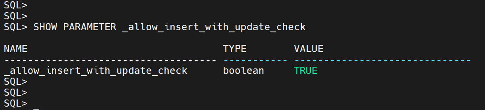

### 2.2 Undeploy obsolete plug-ins

🟩 **Both done. Confirmed 2026-09-10.**

Twelve plug-ins are obsolete in 24ai:

| Plug-in | Identifier | Undeploy from |
|---|---|---|
| Oracle Fusion Application | `oracle.sysman.emfa` | OMS and agents |
| Oracle OraHealth Checks | `oracle.sysman.orhc` | OMS and agents |
| Oracle Secure Enterprise Health Check | `oracle.em.sehc` | OMS and agents |
| Oracle Virtual Networking | `oracle.em.sovn` | OMS and agents |
| Oracle Audit Vault | `oracle.em.soav` | OMS and agents |
| Oracle Cloud Framework | `oracle.em.sooc` | OMS and agents |
| Microsoft .NET Framework | `oracle.em.smdn` | OMS and agents |
| Microsoft Active Directory | `oracle.em.smad` | OMS and agents |
| Configuration and Compliance | `oracle.sysman.csm` | OMS and agents |
| **Client System Analyzer** | **`oracle.sysman.csa`** | **Central agent** |
| Big Data Appliance | `oracle.sysman.bda` | OMS and agents |
| Microsoft IIS | `oracle.em.smis` | OMS and agents |

**`oracle.sysman.vt` (Oracle Virtualization) comes off Agents only, never the
OMS.** Undeploying it from the OMS can leave invalid objects that fail the
upgrade.

A plug-in must be off every agent before it can come off the OMS.

#### What was found, and what was done

```bash
source ~/.env/oms_env
emcli list_plugins_on_server
emcli list_plugins_on_agent -all
```

Seven plug-ins on the Management Server on 2026-09-06, one obsolete:

| Plug-in id | Version | Obsolete |
|---|---|---|
| `oracle.sysman.am` | 13.5.1.0.0 | No |
| `oracle.sysman.cfw` | 13.5.1.0.0 | No |
| `oracle.sysman.db` | 13.5.1.0.0 | No |
| `oracle.sysman.emas` | 13.5.1.0.0 | No |
| **`oracle.sysman.orhc`** | **13.4.1.0.0** | **Yes** |
| `oracle.sysman.si` | 13.5.1.0.0 | No |
| `oracle.sysman.xa` | 13.5.1.0.0 | No |

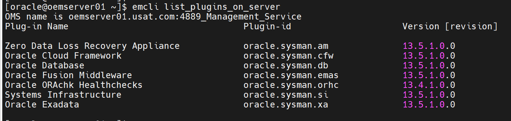

`oracle.sysman.csa` 13.5.0.0.0 was on the central agent and on no other agent.

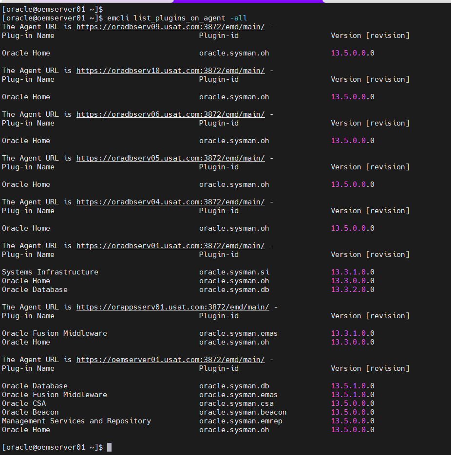

| Plug-in | Where | Outcome |
|---|---|---|
| `oracle.sysman.orhc` | OMS only | 🟩 Undeployed 2026-09-06, eleven steps, all Success |
| `oracle.sysman.csa` | Central agent only | 🟩 Undeployed |
| The other ten | Nowhere | Nothing to do |

A populated **Latest Downloaded** column on the console Plug-ins page does not
mean deployed. **On Management Server** is the column that counts.

#### Blackout first: this costs 7m42s

`undeploy_plugin_from_server` stops and restarts the Management Server as two of
its own steps. Measured here on 2026-09-06:

| Step | Elapsed |
|---|---|
| Stop management server | 41 seconds |
| Deconfigure from middle tier | 4 seconds |
| Deconfigure from Management Repository | 14 seconds |
| Update inventory | 1 second |
| **Start management server** | **6 minutes 42 seconds** |

**Total OMS outage: 7 minutes 42 seconds.** The restart is almost all of it.

Create the blackout first, using
**[Creating a Blackout in Enterprise Manager 13.5](oem-create-blackout.md)**.
Agents queue uploads while the OMS is down and flush on its return, so nothing
collected is lost.

The agent undeploy restarts that agent only, not the OMS.

#### Undeploy

**Log in and sync first.** Without a session the undeploy verbs return *"The
command name is not a recognized command"*, which reads like a missing verb
rather than a missing login.

```bash
source ~/.env/oms_env
emcli login -username=sysman
emcli sync

emcli undeploy_plugin_from_agent -plugin="oracle.sysman.csa:13.5.0.0.0" \
  -agent_names="oemserver01.usat.com:3872"

emcli undeploy_plugin_from_server -plugin="oracle.sysman.orhc"
```

Qualifying with `:13.5.0.0.0` avoids ambiguity where more than one version is
registered. `undeploy_plugin_from_server` prompts for the repository `sys`
password.

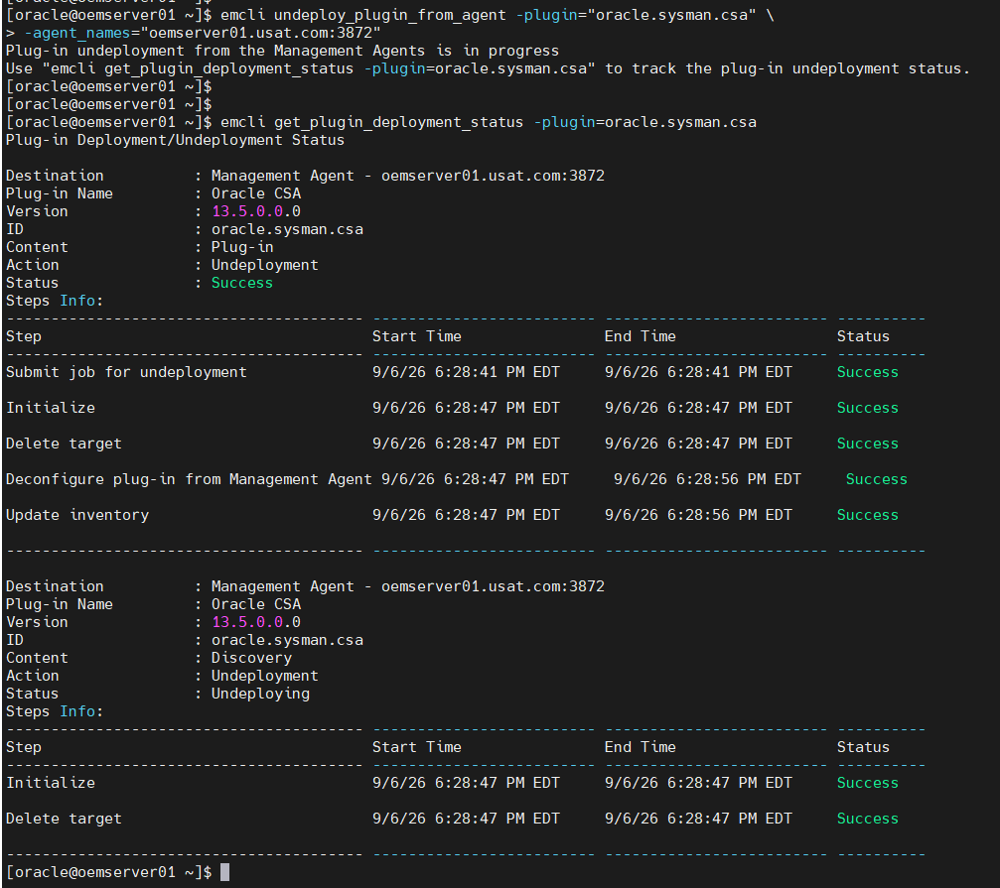

The console route is **Setup → Extensibility → Plug-ins**, select the row, then
**Undeploy From**. It submits the same job with the same OMS restart.

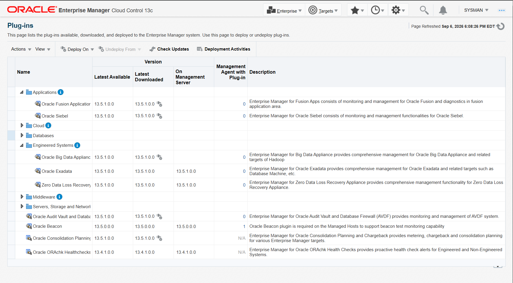

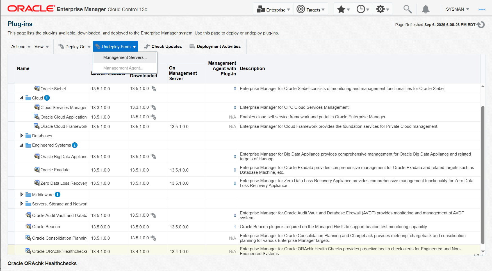

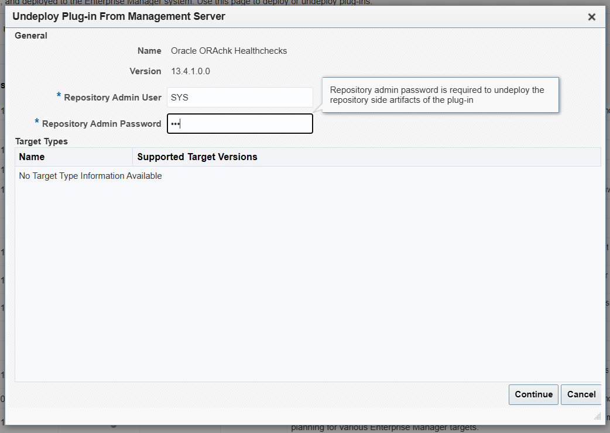

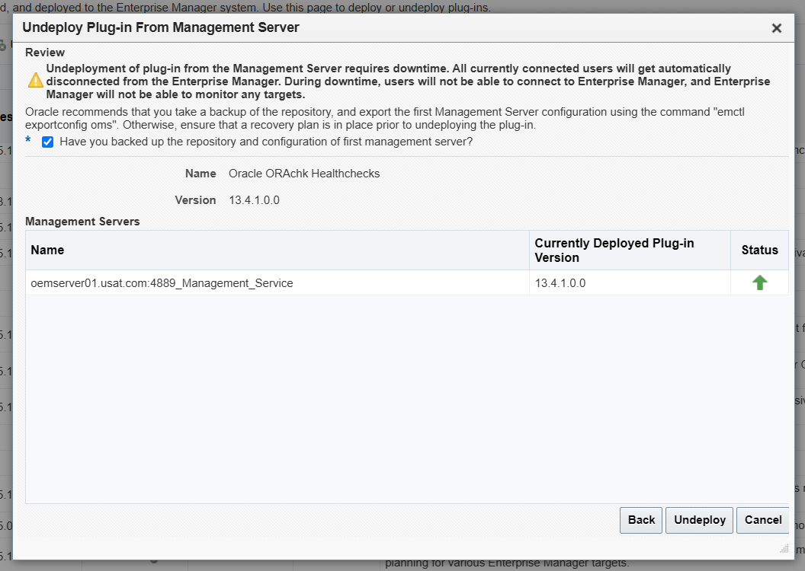

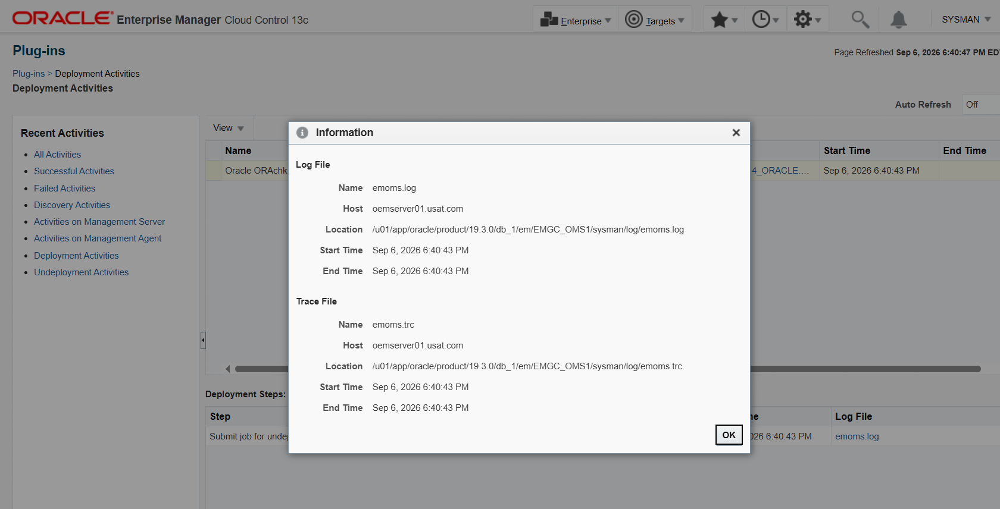

#### Watching it, once the OMS goes down

```bash
source ~/.env/oms_env
emcli get_plugin_deployment_status -plugin=oracle.sysman.orhc
```

**That command stops working the moment the restart begins.** It returns *"The
connection to the OMS is broken or has been actively interrupted by the OMS"*.
That is the restart, not a failure. Track it from the OMS side instead:

```bash
source ~/.env/oms_env
emctl status oms -details
```

`emctl status oms -details` prints the same step table while the OMS is down.
When it stops printing it and reports `Oracle Management Server is Up`, log back
in. The `emcli` session expired during the outage.

```bash
source ~/.env/oms_env
emcli login -username=sysman
emcli get_plugin_deployment_status -plugin=oracle.sysman.orhc
```

**A failure on the final step, `Remove plug-in's Oracle home`, is not fatal.**
The metadata is already marked removed by then, and the 24ai install is out of
place, so a leftover directory in the 13.5 home is not carried forward. This run
reported all eleven steps Success. A failure on any earlier step is a stop.

#### Confirmation

The Management Server now carries six plug-ins, none obsolete:

```
[oracle@oemserver01 ~]$ source ~/.env/oms_env
[oracle@oemserver01 ~]$ emcli list_plugins_on_server
OMS name is oemserver01.usat.com:4889_Management_Service
Plug-in Name                                 Plugin-id                     Version [revision]

Zero Data Loss Recovery Appliance            oracle.sysman.am              13.5.1.0.0
Oracle Cloud Framework                       oracle.sysman.cfw             13.5.1.0.0
Oracle Database                              oracle.sysman.db              13.5.1.0.0
Oracle Fusion Middleware                     oracle.sysman.emas            13.5.1.0.0
Systems Infrastructure                       oracle.sysman.si              13.5.1.0.0
Oracle Exadata                               oracle.sysman.xa              13.5.1.0.0
```

The central agent carries five, with no `csa`:

```

The Agent URL is https://oemserver01.usat.com:3872/emd/main/ -
Plug-in Name                                 Plugin-id                     Version [revision]

Oracle Database                              oracle.sysman.db              13.5.1.0.0
Oracle Fusion Middleware                     oracle.sysman.emas            13.5.1.0.0
Oracle Beacon                                oracle.sysman.beacon          13.5.0.0.0
Management Services and Repository           oracle.sysman.emrep           13.5.0.0.0
Oracle Home                                  oracle.sysman.oh              13.5.0.0.0
```

**`csa` is the one that matters.** Left in place it fails the central agent
upgrade inside `ConfigureGC.sh`, which is past the point where stopping is cheap.
It is gone, so that failure cannot arise.

Undeploying `orhc` removes the Enterprise Manager integration for ORAchk health
checks. AHF continues to run per host from the command line.

### 2.3 Repository snapshots and triggers

```sql
SELECT master, log_table FROM all_mview_logs WHERE log_owner = 'SYSMAN';

SELECT trigger_name FROM sys.dba_triggers
 WHERE triggering_event LIKE 'LOGON%' AND status = 'ENABLED';

SELECT trigger_name FROM sys.dba_triggers
 WHERE triggering_event LIKE 'LOGOFF%' AND status = 'ENABLED';
```

Drop any snapshots. Disable any logon or logoff triggers for the upgrade, and
re-enable them in [Part 2c](phase-7c-part2c-post-deployment.md).

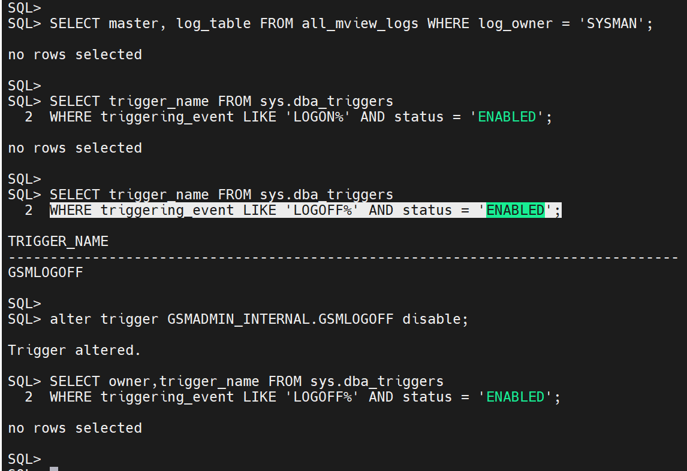

### 2.4 Enable Delete Target auditing

```bash
source ~/.env/oms_env
emcli show_audit_settings
```

If Delete Target is not enabled, enable it with `emcli update_audit_settings`.

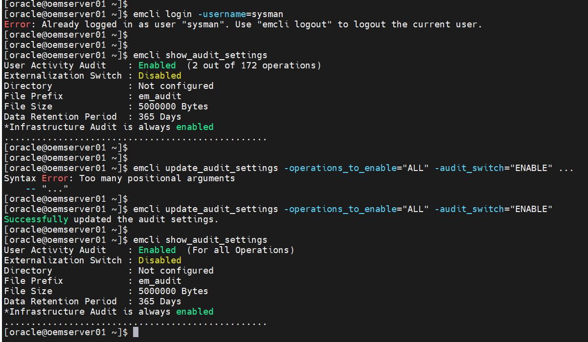

### 2.5 Copy the emkey to the repository

Run immediately before the window. The upgrade fails without it.

```bash
source ~/.env/oms_env
emctl config emkey -copy_to_repos
emctl status emkey
```

**The success message is the one that sounds like a warning.** Before the copy,
`emctl status emkey` says *"The EMKey is configured properly."* That state does
**not** satisfy the upgrade. After the copy it says:

> *"The EMKey is configured properly, but is not secure."*

That is what you want here. [Part 2c §1](phase-7c-part2c-post-deployment.md)
puts it back.

If the copy fails, My Oracle Support 2543058.1 covers it.

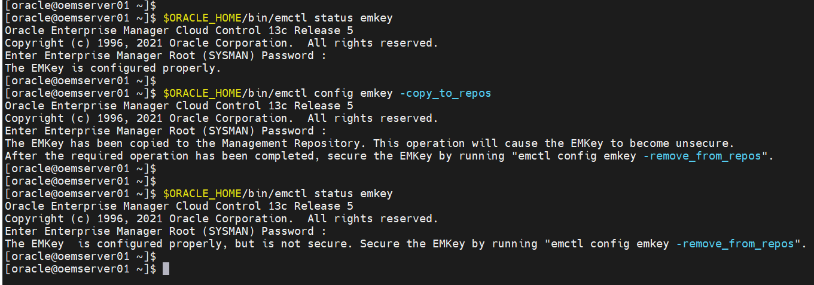

### 2.6 Certificate check

The signature algorithm must not be `SHA1withRSA`.

```bash
source ~/.env/oms_env
emctl secdiag openurl \
  -url https://oemserver01.usat.com:7803/console -ssl_protocol TLSv1.2

openssl s_client -connect oemserver01.usat.com:7803 </dev/null 2>/dev/null \
  | openssl x509 -noout -text | grep -E 'Signature Algorithm|Public-Key'
```

`Public-Key: (1024 bit)` or higher passes. `sha1WithRSA` or `md5` fails.

**🟩 Passed 2026-09-06.** Remediation, not needed here, is in
[Appendix A](#appendix-a-certificate-remediation-not-required).

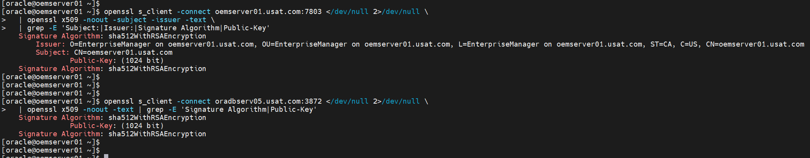

### 2.7 Record the tuned memory settings

The upgrade resets these.

```bash
for p in OMS_HEAP_MIN OMS_HEAP_MAX OMS_PERMGEN_MIN OMS_PERMGEN_MAX; do
  echo -n "$p = "; $OMS135/bin/emctl get property -name $p
done
```

| Property | Before | After |
|---|---|---|
| `OMS_HEAP_MIN` |256M| |
| `OMS_HEAP_MAX` |1740M| |
| `OMS_PERMGEN_MIN` |128M| |
| `OMS_PERMGEN_MAX` |768M| |

Re-applied in [Part 2c §3](phase-7c-part2c-post-deployment.md).

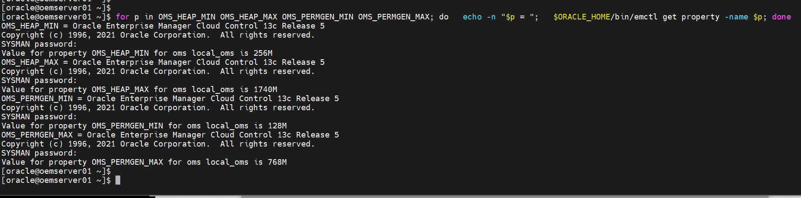

### 2.8 Active job executions per job type

The upgrade offers to postpone job type upgrades where one job type has more than
5,000 active executions.

**Enterprise → Job → Activity**, filtered to Scheduled and Running, grouped by
job type.

A query against `sysman.mgmt_job_exec_summary` gives the same answer, but the
status code values differ between releases. Confirm them against
`sysman.mgmt_job_state_desc` before trusting a query over the console.

This estate runs a handful of job types from Phase 7b. Crossing 5,000 is not
expected. Record the result rather than assuming it.

### 2.9 Every agent in scope is at 13c Release 5

🟩 **Confirmed 2026-09-10.**

Oracle's Upgrade Guide:

> *"If you have any earlier releases of Management Agent, then before upgrading
> the OMS to 24ai Release 1, make sure you upgrade the Management Agents of other
> earlier releases to 13c Release 5 using the Agent Upgrade Console."*

```bash
source ~/.env/oms_env
emcli list_plugins_on_agent -all
```

| Agent | Plug-ins |
|---|---|
| `oemserver01` | `db` 13.5.1.0.0, `emas` 13.5.1.0.0, `beacon` 13.5.0.0.0, `emrep` 13.5.0.0.0, `oh` 13.5.0.0.0 |
| `oradbserv04` | `oh` 13.5.0.0.0 |
| `oradbserv05` | `oh` 13.5.0.0.0, `db` 13.5.1.0.0 |
| `oradbserv06` | `db` 13.5.1.0.0, `oh` 13.5.0.0.0 |
| `oradbserv09` | `db` 13.5.1.0.0, `oh` 13.5.0.0.0 |
| `oradbserv10` | `db` 13.5.1.0.0, `oh` 13.5.0.0.0 |

`oradbserv04` carries `oh` alone because it is the NestWise application tier.
ORDS, MongoDB and the Node proxy are not target types Enterprise Manager 13.5
discovers, which is why
[Phase 7b Part 4](phase-7b-part4-metric-extensions.md) monitors them with Metric
Extensions.

**Setup → Manage Cloud Control → Upgrade Agents** is the route if an agent is
ever found below 13.5.

### 2.10 Repository grants and profile

Two common hardening measures both stop the upgrade.

```sql
-- if DBMS_RANDOM execute has been revoked from public
GRANT EXECUTE ON DBMS_RANDOM TO DBSNMP;

-- the password verify function rejects the passwords the upgrade sets
SELECT profile, limit FROM dba_profiles
 WHERE resource_name = 'PASSWORD_VERIFY_FUNCTION';

ALTER PROFILE DEFAULT LIMIT PASSWORD_VERIFY_FUNCTION NULL;
```

Record the original value. Restored in
[Part 2c](phase-7c-part2c-post-deployment.md).

### 2.11 Firewall and memory events

**SQL ALG must be disabled in the firewall.** With SQL Application Layer Gateway
inspection active the upgrade can hang on one operation rather than fail, which
is the worse of the two outcomes.

**Clear any maximum memory usage events.** Events 10261 and 10262 are the ones
the Upgrade Guide names.

```sql
SELECT value FROM v$parameter WHERE name = 'event';
```

---

## 3. Run the EM Prerequisite Kit

**Mandatory.** The kit ships inside the 24ai distribution and checks against
24ai's requirements. The copy in the 13.5 home is the wrong one.

The installer runs the kit for you, which avoids hunting for the binary.

### 3.1 Extract the response file templates

```bash
mkdir -p /u01/app/oracle/staging/patches/oem/rsp
cd /u01/app/oracle/staging/patches/oem/24ai_software

./em24100_linux64.bin -getResponseFileTemplates \
  -outputLoc /u01/app/oracle/staging/patches/oem/rsp \
  -J-Djava.io.tmpdir=/tmp
```

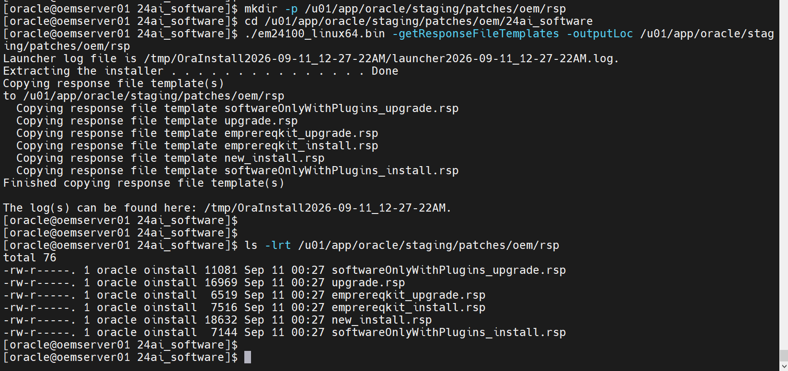

Two of the templates matter: `emprereqkit_upgrade.rsp` here, and
`softwareOnlyWithPlugins_upgrade.rsp` if §4 is ever run silently.

### 3.2 Complete it, then destroy it

```bash
chmod 600 /u01/app/oracle/staging/patches/oem/rsp/emprereqkit_upgrade.rsp
```

| Field | Value on this estate |
|---|---|
| `UNIX_GROUP_NAME` | `oinstall` |
| `OLD_BASE_DIR` | `/u01/app/oracle/Middleware/oms/13.5` |
| `ONE_SYSTEM` | `true` |
| `b_upgrade` | `true` |
| `EM_INSTALL_TYPE` | `NOSEED` |
| `INSTALL_WITH_NON_SYS_USER` | `false` |
| `SYS_PASSWORD` | See below |
| `SYSMAN_PASSWORD` | See below |

The response file holds two privileged passwords in clear text. The project
convention since Phase 7a is that `-dbPassword`, `-reposPassword` and
`-repos_pwd` are never passed on a command line, because they land in the process
table. A file persists, so it is controlled instead.

| Control | |
|---|---|
| Mode | `600`, owned by `oracle`, set before the passwords go in |
| Location | Outside this repository. Never committed |
| Lifetime | Shred it once §3.3 completes |

```bash
shred -u /u01/app/oracle/staging/patches/oem/rsp/emprereqkit_upgrade.rsp
```

The interactive `emprereqkit` binary under
`24ai_software/install/requisites/bin` prompts for both instead and needs no
file. Prefer it where the session allows a prompt.

### 3.3 Run it

```bash
cd /u01/app/oracle/staging/patches/oem/24ai_software

./em24100_linux64.bin EMPREREQ_KIT=true -silent \
  -responseFile /u01/app/oracle/staging/patches/oem/rsp/emprereqkit_upgrade.rsp
```

### 3.4 Read the result

| Finding | Action |
|---|---|
| `job_queue_processes` | Auto-fixable. [Part 2b](phase-7c-part2b-deployment.md) sets it to zero deliberately |
| `oracle.sysman.csa` still deployed | Should not arise. Confirmed gone in [§2.2](#22-undeploy-obsolete-plug-ins) |
| Minimum 24ai Release Update not applied | Expected here. §5 applies RU12 |
| Memory parameters | On a non-CDB these read at instance level and should be clean. The PDB warning does not apply |
| Anything else failed | Stop. Fix it before §4 |

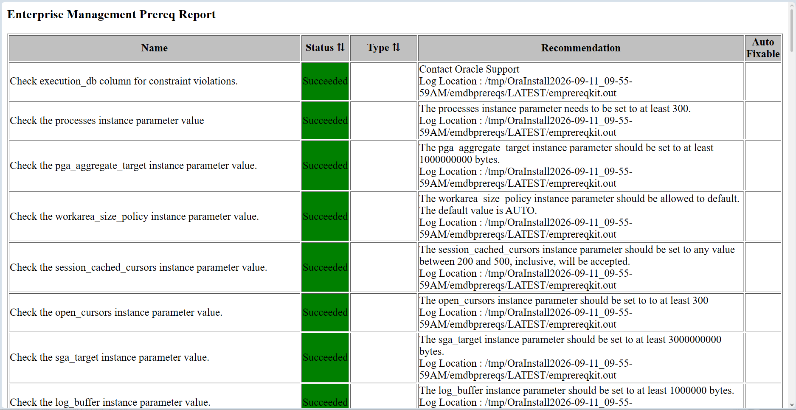

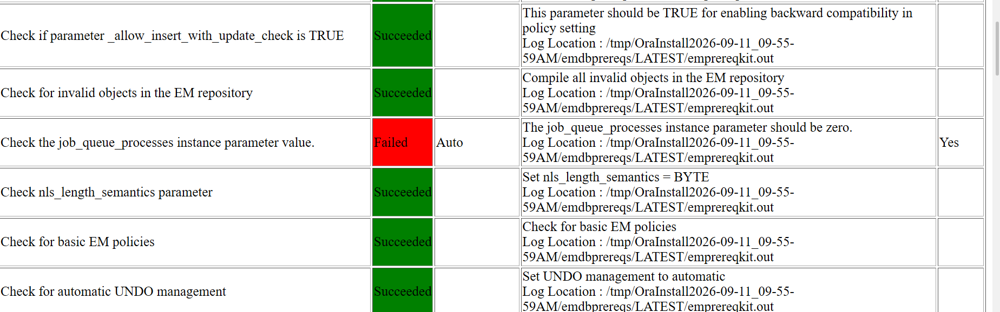

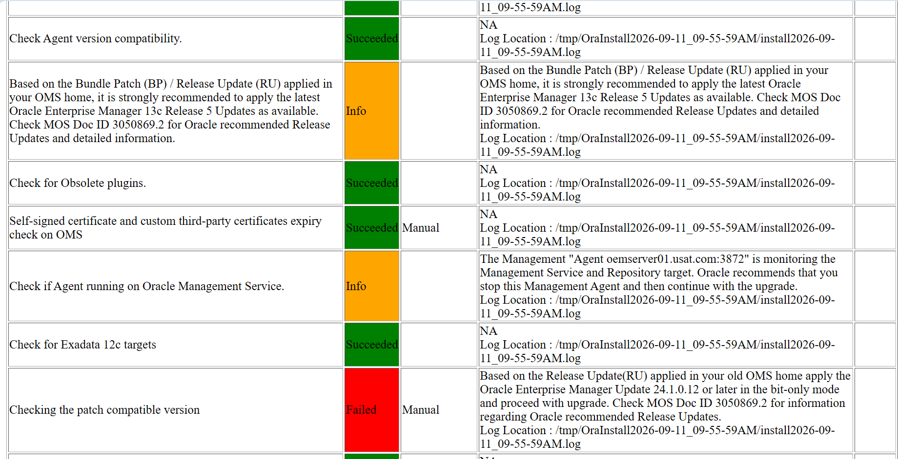

---

## 4. Install the software only

The 13.5 OMS stays up throughout. Nothing here interrupts monitoring.

### 4.1 Start a VNC session

**Run the installer inside VNC.** A dropped VPN or an idle SSH timeout ends the
run, and it restarts from the beginning.

### 4.2 Run the installer

```bash
mkdir -p /u01/app/oracle/staging/patches/oem/tmp
cd /u01/app/oracle/staging/patches/oem/24ai_software

./em24100_linux64.bin \
  -J-Djava.io.tmpdir=/u01/app/oracle/staging/patches/oem/tmp
```

`-J-Djava.io.tmpdir` points the installer at an alternative temporary directory,
which is needed when `/tmp` has less than 14 GB free.

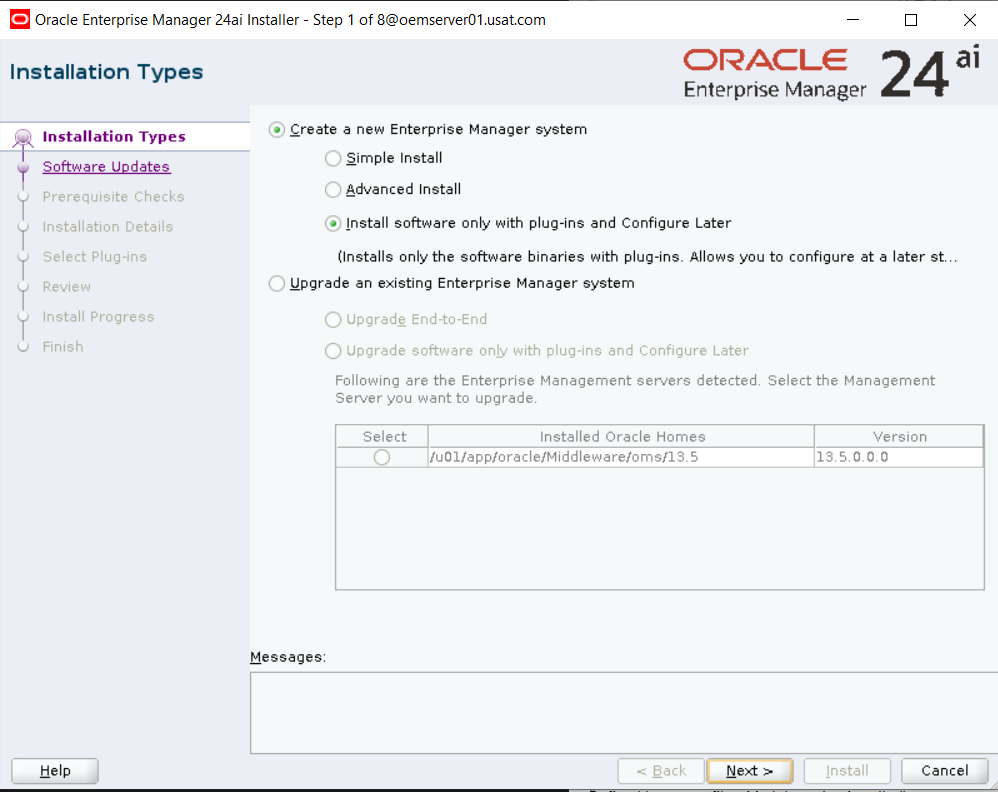

### 4.3 Choose the installation type

Choose **Upgrade software only with plug-ins and Configure Later**.

**Not Upgrade End-to-End.** That path configures the OMS at base 24.1 and leaves
no opportunity to patch the binaries first.


On **Software Updates**, choose **Skip**.

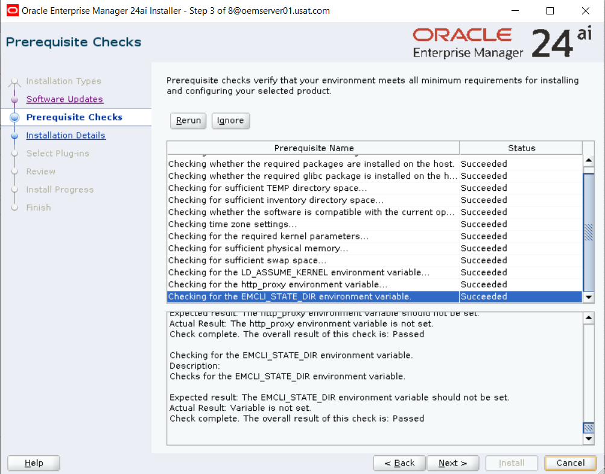

### 4.4 Record the new homes

The installer asks for **two** new locations and creates both.

| | Path |
|---|---|
| 13.5 Middleware home | `/u01/app/oracle/Middleware/oms/13.5` |
| 13.5 agent home | `/u01/app/oracle/Middleware/agent/13_5` |
| **24ai Middleware home** | `/u01/app/oracle/Middleware/24ai` |
| **24ai agent base** | `/u01/app/oracle/Middleware/agent24` |

The 40 GB floor in §1.4 covers the pair.

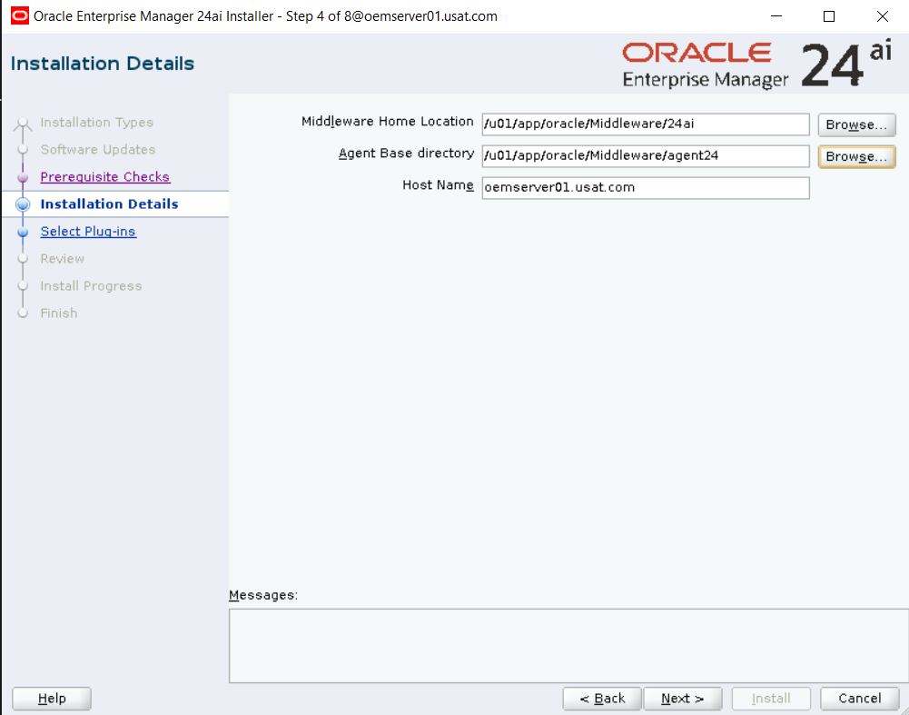

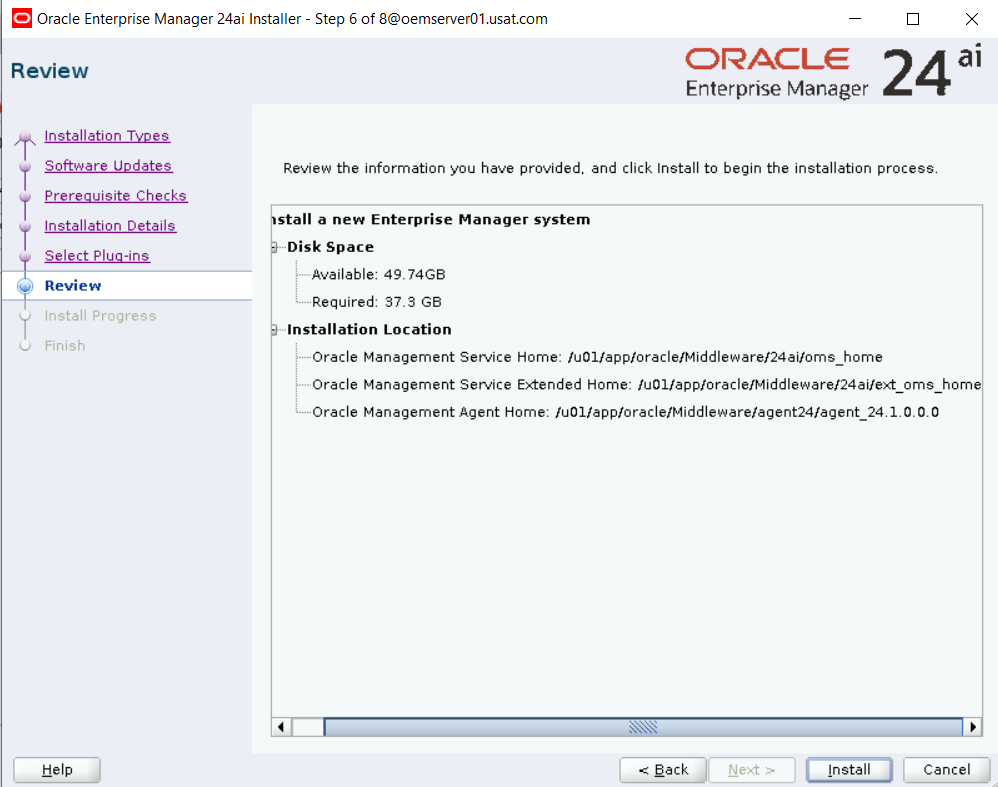

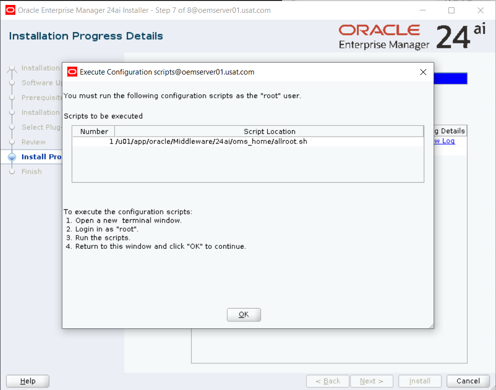

### 4.5 Run `allroot.sh`

**Who:** `root`.

```bash
sudo /u01/app/oracle/Middleware/24ai/oms_home/allroot.sh
```

It runs two scripts, the OMS home's `root.sh` and the new agent home's `root.sh`.
Both must report Finished.

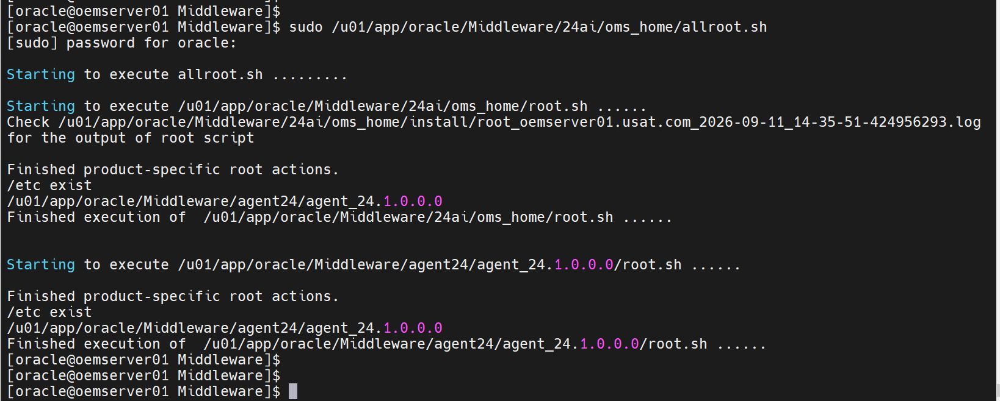

Click **OK** once `allroot.sh` completes.

### 4.6 Stop at the ConfigureGC.sh prompt

The installer finishes by naming `ConfigureGC.sh` as the next step.

**Do not run it here.** That is [Part 2b](phase-7c-part2b-deployment.md), after
§5 patches the binaries and after the 13.5 stack is stopped.

Click **Close** and continue to §5.

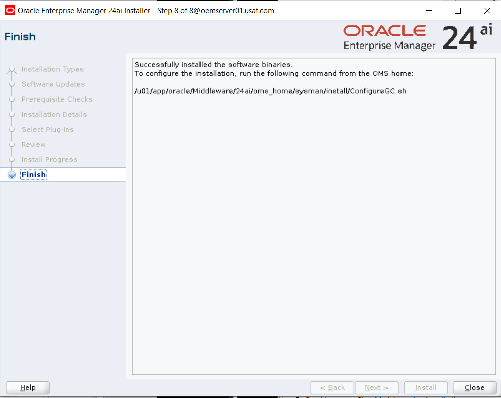

### 4.7 Confirm

```bash
export ORACLE_HOME=/u01/app/oracle/Middleware/24ai/oms_home
$ORACLE_HOME/OPatch/opatch lsinventory | head -20
$ORACLE_HOME/OPatch/opatch lspatches
```

```
[oracle@oemserver01 Middleware]$ export ORACLE_HOME=/u01/app/oracle/Middleware/24ai/oms_home
[oracle@oemserver01 Middleware]$ $ORACLE_HOME/OPatch/opatch lsinventory | head -20
Oracle Interim Patch Installer version 13.9.4.2.17
Copyright (c) 2026, Oracle Corporation.  All rights reserved.


Oracle Home       : /u01/app/oracle/Middleware/24ai/oms_home
Central Inventory : /u01/app/oraInventory
   from           : /u01/app/oracle/Middleware/24ai/oms_home/oraInst.loc
OPatch version    : 13.9.4.2.17
OUI version       : 13.9.4.0.0
Log file location : /u01/app/oracle/Middleware/24ai/oms_home/cfgtoollogs/opatch/opatch2026-09-11_15-39-52PM_1.log


OPatch detects the Middleware Home as "/u01/app/oracle/Middleware/24ai/oms_home"

Lsinventory Output file location : /u01/app/oracle/Middleware/24ai/oms_home/cfgtoollogs/opatch/lsinv/lsinventory2026-09-11_15-39-52PM.txt

--------------------------------------------------------------------------------
Local Machine Information::
Hostname: oemserver01.usat.com
ARU platform id: 226
[oracle@oemserver01 Middleware]$
[oracle@oemserver01 Middleware]$
[oracle@oemserver01 Middleware]$ $ORACLE_HOME/OPatch/opatch lspatches
37103277;FMW Thirdparty Bundle Patch 12.2.1.4.240925
37096063;OSS 19C BUNDLE PATCH 12.2.1.4.241001
37035947;OWSM BUNDLE PATCH 12.2.1.4.240908
37028738;ADF BUNDLE PATCH 12.2.1.4.240905
36964687;WebCenter Core Bundle Patch 12.2.1.4.240819
36851321;RDA release 24.4-20241015 for OFM 12.2.1.4 SPB
36789759;FMW PLATFORM BUNDLE PATCH 12.2.1.4.240812
36316422;OPSS Bundle Patch 12.2.1.4.240220
34065178;One-off
30152128;One-off
26626168;One-off
1221423;Coherence Cumulative Patch 12.2.1.4.23
37033394;OHS (NATIVE) DB19C BUNDLE PATCH 12.2.1.4.240906
36615359;DATABASE RELEASE UPDATE 19.24.0.0.0 FOR FMW DBCLIENT
34809489;One-off
37087476;WLS PATCH SET UPDATE 12.2.1.4.240922
35965629;ADR FOR WEBLOGIC SERVER 12.2.1.4.0 CPU JAN 2024

OPatch succeeded.
[oracle@oemserver01 Middleware]$
```


Record the starting patch list. §5.6 compares against it.

---

## 5. Patch the binaries to RU12

**The 13.5 OMS is still up.** `-bitonly` patches the new 24ai binaries and
touches nothing that is running. This is the step that keeps the Release Update
out of the downtime window.

### 5.1 Point the environment at the 24ai home

```bash
export ORACLE_HOME=/u01/app/oracle/Middleware/24ai/oms_home
export PATH=$ORACLE_HOME/bin:$ORACLE_HOME/OMSPatcher:$PATH

echo $ORACLE_HOME
```

Confirm it is the 24ai home and not the 13.5 home before continuing.

### 5.2 Upgrade OMSPatcher

From My Oracle Support KB371380.

```bash

mv $ORACLE_HOME/OMSPatcher $ORACLE_HOME/OMSPatcher_old

unzip -q /u01/app/oracle/staging/patches/oem/OMSPatcher_patch_version_13.9.24.16.0_p19999993_241000_Generic.zip \
-d  $ORACLE_HOME

$ORACLE_HOME/OMSPatcher/omspatcher version
```

The zip unpacks a complete `$ORACLE_HOME/OMSPatcher/` tree. `OMSPatcher_old` is
the rollback for this step.

Expect **`OMSPatcher Version: 13.9.24.16.0`**. 24ai numbers OMSPatcher in the
`13.9.24.x.0` series, not the `13.9.5.x.0` series
[Part 1 §4](phase-7c-part1-oms-ru33.md#4-upgrade-omspatcher-to-1395270) used at
13.5.

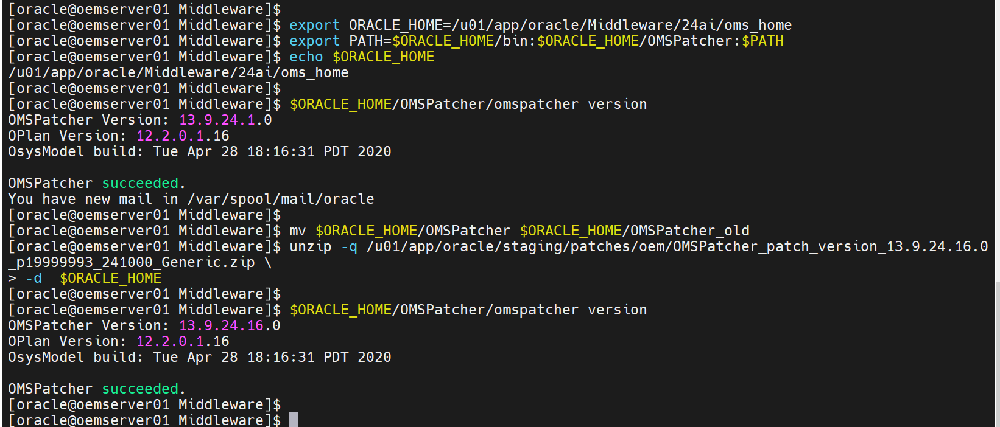


### 5.3 Upgrade OPatch

**Required by KB282751 step 4.** Patch **28186730**, OPatch **13.9.4.2.24**.

```bash
cd /u01/app/oracle/staging/patches/oem
unzip -q OPATCH_13.9.4.2.24_OEM_13.5_24.1_FMW_WLS_12.2.1.4.0_p28186730_1394224_Generic.zip \
  -d /u01/app/oracle/staging/patches/oem/opatch_24ai
```

**Skipping this step produces a failure that does not name OPatch.** KB371380
documents only the OMSPatcher upgrade. §5.5 then fails with:

```
Prerequisite check "CheckMinimumOPatchVersion" failed.
```

Recorded in KB540933 and KB253309.

**28186730 is not applied with `opatch apply`.** The Fusion Middleware OPatch
update ships as a generic jar installer that replaces the `OPatch` directory.
Read the README in the extracted patch. The usual form:

```bash
$ORACLE_HOME/oracle_common/jdk/bin/java -jar \
  /u01/app/oracle/staging/patches/oem/opatch_24ai/<version>/opatch_generic.jar \
  -silent oracle_home=$ORACLE_HOME

$ORACLE_HOME/OPatch/opatch version
```

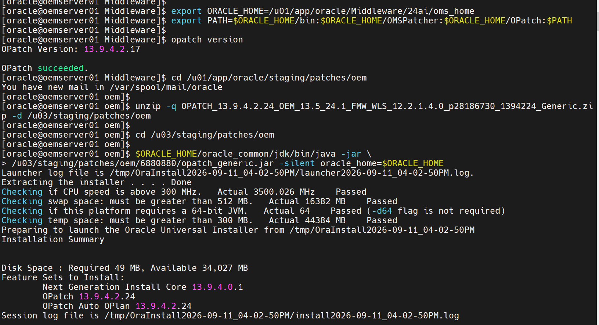

Confirmed output:

```
Saving the inventory fmwshare-wlst-dependencies

 Component : oracle.fmwshare.pyjar

Saving the inventory oracle.fmwshare.pyjar

The install operation completed successfully.

Logs successfully copied to /u01/app/oraInventory/logs.
[oracle@oemserver01 oem]$
[oracle@oemserver01 oem]$ opatch version
OPatch Version: 13.9.4.2.24

OPatch succeeded.
[oracle@oemserver01 oem]$
```

Expect `13.9.4.2.24`.

**No Release Update prerequisite patches on this path.** KB282751 names *"Review
the README of RU and apply the mandatory prerequisites patches if any"* under
**Fresh Install of 24ai OEM** only. Its **Upgrading to 24ai OEM** section goes
straight to `-bitonly`. Part 1's three JDBC patches were prerequisites for
patching a configured 13.5 OMS carrying years of one-offs; §5.5 patches freshly
installed 24.1 binaries carrying nothing.

### 5.4 Extract the Release Update

```bash
unzip -q /u01/app/oracle/staging/patches/oem/OEM_24ai.1_RU12_p39675954_241000_Generic.zip \
  -d /u01/app/oracle/staging/patches/oem

ls -d /u01/app/oracle/staging/patches/oem/39675954
```

### 5.5 Analyze, then apply

```bash
cd /u01/app/oracle/staging/patches/oem/39675954
$ORACLE_HOME/OMSPatcher/omspatcher apply -analyze -bitonly -silent
```

**`-bitonly` raises an interactive prompt.** Without `-silent` the run sits
waiting on it:

```
WARNING: OMSPatcher has been invoked with bitonly option but the System patch
provided has deployment metadata.
Invocation in bitonly mode will prevent OMSPatcher from deploying artifacts.

Do you want to proceed? [y|n]
```

`-silent` auto answers `Y`. `-bitonly` patches binaries without deploying
artifacts, because `ConfigureGC.sh` does the deployment in Part 2b.

Then apply:

```bash
$ORACLE_HOME/OMSPatcher/omspatcher apply -bitonly -silent
```

### 5.6 Verify

```bash
$ORACLE_HOME/OMSPatcher/omspatcher lspatches
```

Record the sub-patch list. Part 2b §6.4 compares against it after the upgrade.

### 5.7 Run the Prerequisite Kit again

The first run in §3 reported the minimum 24ai Release Update as not applied.
Re-run it now that RU12 is on the binaries.

```bash
cd /u01/app/oracle/staging/patches/oem/24ai_software

./em24100_linux64.bin EMPREREQ_KIT=true -silent \
  -responseFile /u01/app/oracle/staging/patches/oem/rsp/emprereqkit_upgrade.rsp
```

Every check must pass before the window opens. Continue to
[Part 2b](phase-7c-part2b-deployment.md).

---

## 6. Screenshot checklist

Embedded above:

| File | Section | Shows |
|---|---|---|
| `3.1_Database_initialization_parameter.png` | 2.1 | `_allow_insert_with_update_check` set to `TRUE` |
| `3.2_Undeploy_obsolete_plug-ins_oms.png` | 2.2 | `emcli list_plugins_on_server` |
| `3.2_Undeploy_obsolete_plug-ins_agent.png` | 2.2 | `emcli list_plugins_on_agent -all` |
| `3.2_Undeploy_obsolete_plug-ins_oem_console.png` | 2.2 | The Plug-ins page |
| `3.2_Undeploy_obsolete_plug-ins_from_emcli.png` | 2.2 | The `emcli` undeploy |
| `3.2_Undeploy_obsolete_plug-ins_from_console1.png` to `4.png` | 2.2 | The console undeploy, four steps |
| `3.3_Check_repository_snapshots_triggers.png` | 2.3 | Snapshot and trigger queries |
| `3.4_Enable_Delete_Target_auditing.png` | 2.4 | `emcli show_audit_settings` |
| `3.5_Copy_the_emkey_to_the_repository.png` | 2.5 | `emctl config emkey -copy_to_repos` |
| `3.6_Check_certificate_key_strength.png` | 2.6 | Signature algorithm and key strength |
| `3.7_Record_the_tuned_memory_set.png` | 2.7 | The four OMS memory properties |
| `3.1_Extract_the_response_file_templates.png` | 3.1 | The response file templates written |
| `3.4_Enterprise_Management_Prereq_Report1.png` to `3.png` | 3.4 | The Prerequisite Kit report, three parts |
| `4.2_Run_the_installer1.png` | 4.2 | The installer opening |
| `4.2_Run_the_installer2.png` | 4.3 | **Upgrade software only with plug-ins and Configure Later** selected |
| `4.2_Run_the_installer3.png` | 4.3 | Prerequisite Checks passing |
| `4.2_Run_the_installer4.png` | 4.4 | The 24ai Middleware home and agent base |
| `4.2_Run_the_installer5.png` | 4.4 | The review screen |
| `4.2_Run_the_installer6.png` | 4.4 | The install progressing |
| `4.2_Run_the_installer7.png` | 4.5 | The `allroot.sh` prompt |
| `4.2_Run_the_installer8.png` | 4.6 | The completion screen naming `ConfigureGC.sh` |
| `5.2_Upgrade_OMSPatcher.png` | 5.2 | `omspatcher version` reporting 13.9.24.16.0 |
| `5.3_Upgrade_OPatch.png` | 5.3 | `opatch version` reporting 13.9.4.2.24 |

Every screenshot referenced on this page exists in `screenshots/` and is
embedded.

Still to capture:

| File | Section | Shows | Status |
|---|---|---|---|
| `7c2a-01-staged-software.png` | 1.1 | `ls -lrt` of the staging directory | ⬜ |
| `7c2a-01-extracted-installer.png` | 1.3 | `em24100_linux64.bin` and its four companion zips | ⬜ |
| `7c2a-05-bitonly-analyze.png` | 5.5 | `omspatcher apply -analyze -bitonly -silent` | ⬜ |
| `7c2a-05-bitonly-apply.png` | 5.5 | `omspatcher apply -bitonly -silent` completing | ⬜ |
| `7c2a-05-lspatches.png` | 5.6 | The RU12 sub-patch list | ⬜ |
| `7c2a-05-prereq-rerun.png` | 5.7 | The Prerequisite Kit passing after RU12 | ⬜ |

---

## Appendix A: Certificate remediation, not required

**Not needed. The check in §2.6 passed on 2026-09-06.** Kept because a failed
certificate check is expensive to research under time pressure.

`$ORACLE_HOME` in this appendix is the 13.5 home. Certificate work happens before
the upgrade.

Estate-wide view:

```bash
$ORACLE_HOME/bin/emctl secdiag dumpcertsinrepos -repos_conndesc "<connect descriptor>"
```

Omit `-repos_pwd` and let it prompt. Companion verbs:
`emctl secdiag dumpcertsinfile -file <loc>` reads a JKS, SSO, P12 or base64 file;
`emctl secdiag openurl -url <url>` diagnoses a connectivity failure.

Reissuing:

```bash
$ORACLE_HOME/bin/emctl secure oms -key_strength 2048 -sign_alg sha512 \
  -reset -force_newca -console
```

| Parameter | Accepts |
|---|---|
| `-key_strength` | `512`, `1024`, `2048` |
| `-sign_alg` | `md5`, `sha1`, `sha256`, `sha384`, `sha512` |
| `-cert_validity` | Days, 1 to 3650 |

`-reset` creates a new Certificate Authority and `-force_newca` proceeds even
where agents are still secured against the old one. Every agent then has to be
re-secured.

MD5 does not stop the upgrade. The installer writes the affected agents to
`/tmp/OraInstall<timestamp>/md5Target.txt`.

My Oracle Support 2179909.1 covers reconfiguring MD5 agents to SHA. 1611578.1
covers key strength.

---

**Next:** [Part 2b: Deployment](phase-7c-part2b-deployment.md).
Sources for all three parts are on the
[index](phase-7c-part2-24ai-upgrade.md#sources).
