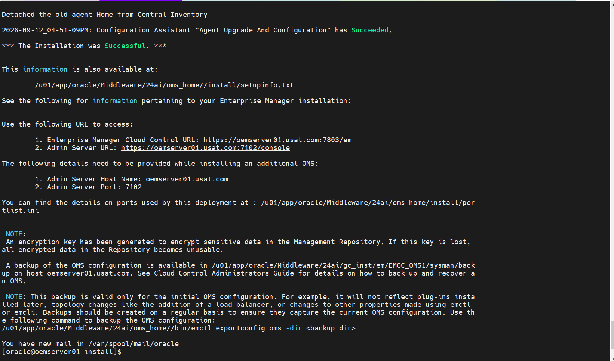
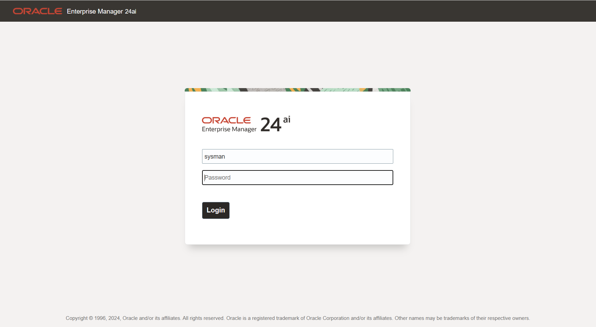
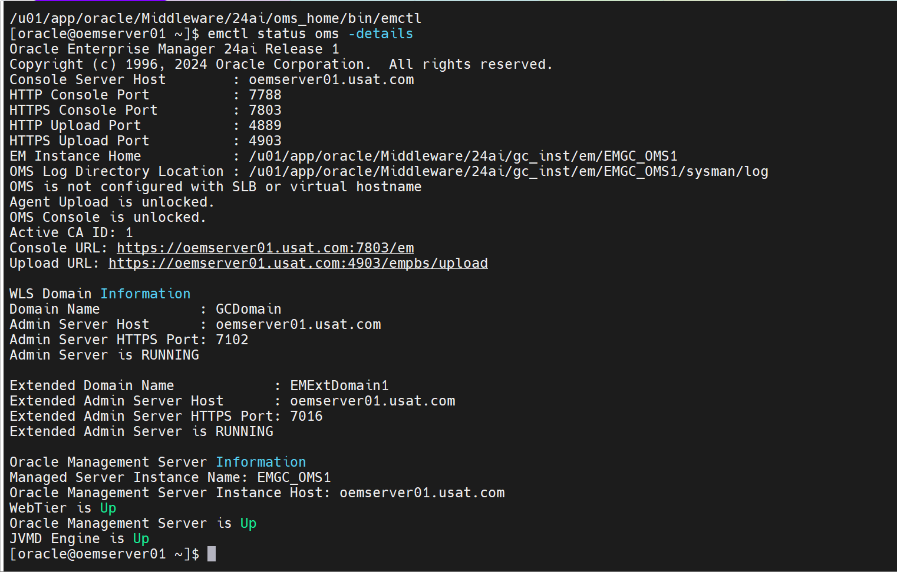
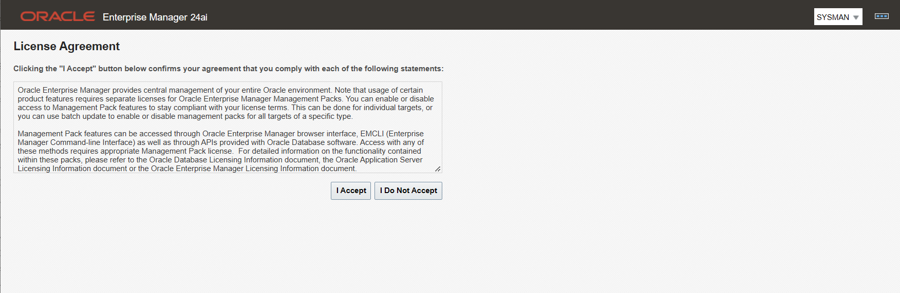
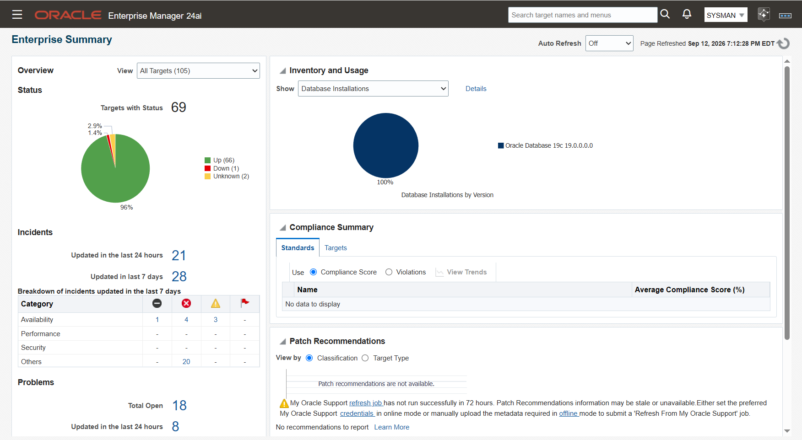
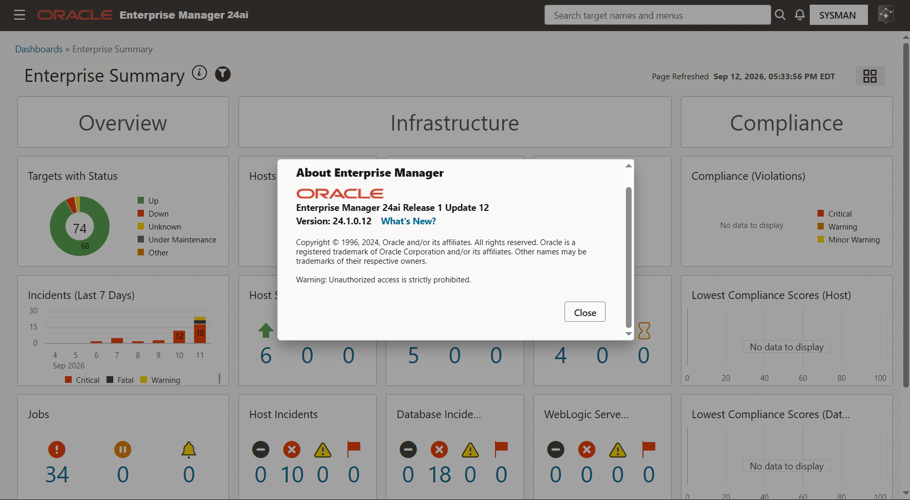

# Phase 7c Part 2b: Deployment

**SOP: the downtime window. Stop the 13.5 stack, run `ConfigureGC.sh`, verify**

Part 2b of three. [Part 2a](phase-7c-part2a-pre-deployment.md) staged, installed
and patched the 24ai binaries with the 13.5 OMS still running.
[Part 2c](phase-7c-part2c-post-deployment.md) is what follows. The index is
[`phase-7c-part2-24ai-upgrade.md`](phase-7c-part2-24ai-upgrade.md).

Status: 🟩 Confirmed. Ran on 2026-09-12. The OMS is at **24ai Release 1** and the
central agent at **24.1.0.0.0**.

| # | Section | Status |
|---|---|---|
| 1 | Before you stop anything | 🟩 Confirmed 2026-09-12 |
| 2 | Stop the 13.5 stack | 🟩 Confirmed 2026-09-12 |
| 3 | Back up, with the stack down | 🟩 Confirmed 2026-09-12 |
| 4 | Run `ConfigureGC.sh` | 🟩 Confirmed 2026-09-12 |
| 5 | If it fails | ⬜ Not required |
| 6 | Verification | 🟩 Confirmed 2026-09-12 |
| 7 | Rollback | ⬜ Not required |
| 8 | Screenshot checklist | 🟩 Six embedded |

Every command runs as **`oracle` on `oemserver01`** unless the step says
otherwise.

The environment comes from the files under `~/.env`. `oms_env` addresses the 13.5
OMS home in §1 to §3 and the 24ai OMS home in §6, because it was updated after
the upgrade.

**The repository database stays up throughout.** Only the OMS and the central
agent are stopped.

**Run `ConfigureGC.sh` inside VNC.** A dropped VPN or an idle timeout ends the run
and it restarts from the beginning.

[Appendix A](#appendix-a-notes) holds the reasoning behind the steps.

---

## Contents

1. [Before you stop anything](#1-before-you-stop-anything)
2. [Stop the 13.5 stack](#2-stop-the-135-stack)
3. [Back up, with the stack down](#3-back-up-with-the-stack-down)
4. [Run ConfigureGC.sh](#4-run-configuregcsh)
5. [If it fails](#5-if-it-fails)
6. [Verification](#6-verification)
7. [Rollback](#7-rollback)
8. [Screenshot checklist](#8-screenshot-checklist)

---

## 1. Before you stop anything

These three require the OMS to be running.

### 1.1 Create the blackout

**Who:** You, through the console at `https://oemserver01.usat.com:7803/em`.

Follow the standing procedure,
**[Creating a Blackout in Enterprise Manager 13.5](oem-create-blackout.md)**.
Cover `oemserver01.usat.com`, the `oemcdb` database and listener targets, and the
`Management Services and Repository` target.

Confirm the blackout is active before stopping anything.

### 1.2 Record the target count

```bash
emcli login -username=sysman
emcli get_targets | wc -l
```

| | Count |
|---|---|
| Before the upgrade | **203** |
| After the upgrade (§6.5) | |

### 1.3 Copy the emkey to the repository

Run this again if Part 2a §2.5 ran days earlier.

```bash
source ~/.env/oms_env
emctl config emkey -copy_to_repos
emctl status emkey
```

Confirmed output:

```
emctl status emkey
Oracle Enterprise Manager Cloud Control 13c Release 5
Copyright (c) 1996, 2021 Oracle Corporation.  All rights reserved.
Enter Enterprise Manager Root (SYSMAN) Password :
The EMKey  is configured properly, but is not secure. Secure the EMKey by running "emctl config emkey -remove_from_repos".
```

*"configured properly, but is not secure"* is the state the upgrade requires.
[Part 2c §2](phase-7c-part2c-post-deployment.md#2-re-secure-the-emkey) returns it
to secure.

---

## 2. Stop the 13.5 stack

### 2.1 Stop the OMS

```bash
source ~/.env/oms_env
emctl stop oms -all
emctl status oms
```

`-all` also stops the WebLogic Administration Server. See
[Appendix A](#appendix-a-notes) for how this differs from Part 1, and for the
JVMD and ADP check.

### 2.2 Stop the central agent

```bash
source ~/.env/agent_env
emctl stop agent
emctl status agent
```

The agent monitoring the **Management Services and Repository** target must be
down. Leaving it running can fail the upgrade.

### 2.3 Set `job_queue_processes` to zero

```sql
show parameter job_queue_processes
alter system set job_queue_processes = 0 scope = memory sid='*';
```

`scope = memory` rather than `both`, so a database restart restores the original
value.

| | Value |
|---|---|
| Before the upgrade | **100** |
| Restored in [Part 2c §9](phase-7c-part2c-post-deployment.md#9-restore-what-was-changed-for-the-upgrade) | |

---

## 3. Back up, with the stack down

The OMS and the agent are down from §2. The repository database stays open, which
RMAN and the restore point both require. Reasoning is in
[Appendix A](#appendix-a-notes).

### 3.1 What to back up

| # | Artefact | Path on this estate |
|---|---|---|
| 1 | Repository database | `oemcdb` |
| 2 | 13.5 Middleware home | `/u01/app/oracle/Middleware/oms/13.5` |
| 3 | `gc_inst` | `/u01/app/oracle/product/19.3.0/db_1/em/EMGC_OMS1` |
| 4 | Software Library | `/u01/app/oracle/Middleware/swlib` |
| 5 | Oracle inventory | `/u01/app/oraInventory` |

The same five as [Part 1 §7.2](phase-7c-part1-oms-ru33.md#72-back-up).

### 3.2 Guaranteed restore point and RMAN

```sql
CREATE RESTORE POINT PRE_EM_24AI GUARANTEE FLASHBACK DATABASE;
SELECT name, guarantee_flashback_database, time FROM v$restore_point;
```

Then the RMAN backup, following
[Phase 7a Part 2 §9](phase-7a-part2-the-patch-window.md#9-back-up-before-the-patch).

### 3.3 Confirm nothing is holding files open

```bash
source ~/.env/oms_env
emctl status oms
ps -ef | grep -E 'EMGC_OMS1|[j]ava.*oms/13.5' | grep -v grep
```

Both must return empty or report the OMS down. A running process here means §2.1
did not complete.

### 3.4 The filesystem archives

```bash
BKP=/u03/backups/oms/pre_24ai_$(date +%Y%m%d)
mkdir -p $BKP

sudo tar czf $BKP/middleware_home.tar.gz -C /u01/app/oracle/Middleware oms
sudo tar czf $BKP/gc_inst.tar.gz -C /u01/app/oracle/product/19.3.0/db_1/em EMGC_OMS1
sudo tar czf $BKP/swlib.tar.gz -C /u01/app/oracle/Middleware swlib
sudo tar czf $BKP/orainventory.tar.gz -C /u01/app oraInventory
```

`tar -C <parent> <directory>` archives with a relative path, so the restore does
not depend on where the archive is unpacked.

### 3.5 Verify the archives

```bash
ls -lh $BKP
for f in $BKP/*.tar.gz; do echo "== $f"; tar tzf "$f" >/dev/null && echo OK || echo FAIL; done
df -h /u03
```

Every archive must report `OK`. Rollback in §7 depends on this listing and on the
restore point from §3.2.

---

## 4. Run `ConfigureGC.sh`

This step upgrades the repository schema in place. There is no schema downgrade,
so from here the only route back is §7.

### 4.1 The response file

`/u01/app/oracle/staging/patches/oem/rsp/upgrade.rsp`

```
#------------------------------------------------------------------#
# Name        : RESPONSEFILE_VERSION
# Type        : string
# Description : Response file name.
#------------------------------------------------------------------#
RESPONSEFILE_VERSION=2.2.1.0.0
UNIX_GROUP_NAME=oinstall
INVENTORY_LOCATION=/u01/app/oraInventory
ORACLE_MIDDLEWARE_HOME_LOCATION=/u01/app/oracle/Middleware/24ai
ORACLE_INSTANCE_HOME_LOCATION=/u01/app/oracle/Middleware/24ai/gc_inst
OLD_BASE_DIR=/u01/app/oracle/Middleware/oms/13.5
ONE_SYSTEM=true
AGENT_BASE_DIR=/u01/app/oracle/Middleware/agent24
OLD_DATABASE_SYSMAN_PASSWORD=
WLS_ADMIN_SERVER_USERNAME=weblogic
WLS_ADMIN_SERVER_PASSWORD=
WLS_ADMIN_SERVER_CONFIRM_PASSWORD=
NODE_MANAGER_PASSWORD=
NODE_MANAGER_CONFIRM_PASSWORD=
DATABASE_HOSTNAME=oemserver01.usat.com
LISTENER_PORT=1521
SERVICENAME_OR_SID=oemcdb
SYS_PASSWORD=
SYSMAN_PASSWORD=
EMPREREQ_AUTO_CORRECTION=true
INSTALL_WITH_NON_SYS_USER=false
REPOSITORY_BACKUP_DONE=true
b_upgrade=true
EM_INSTALL_TYPE=NOSEED
```

The file holds five credentials: the 13.5 SYSMAN password, the WebLogic
Administration Server password, the Node Manager password, `sys` and `sysman`.
The fields are blank in this repository and are populated only on the host.

| Control | |
|---|---|
| Mode | `chmod 600`, owned by `oracle`, set before the passwords are entered |
| Location | `/u01/app/oracle/staging/patches/oem/rsp`, outside this repository |
| Lifetime | `shred -u` once §4.2 completes |

```bash
chmod 600 /u01/app/oracle/staging/patches/oem/rsp/upgrade.rsp
```

`SERVICENAME_OR_SID=oemcdb` is the SID, because `oemcdb` is a non-CDB.
`REPOSITORY_BACKUP_DONE=true` records that §3 was completed.

### 4.2 Run it

Inside the VNC session.

```bash
cd /u01/app/oracle/Middleware/24ai/oms_home/sysman/install
./ConfigureGC.sh -silent -responseFile /u01/app/oracle/staging/patches/oem/rsp/upgrade.rsp
```

It configures the 24ai OMS against the existing repository, upgrades the
repository schema, and upgrades the central agent to 24ai.





### 4.3 Shred the response file

```bash
shred -u /u01/app/oracle/staging/patches/oem/rsp/upgrade.rsp
```

---

## 5. If it fails

⬜ Not required on this run.

Fix the reported issue and click **Retry**. If the GUI has been closed:

```bash
/u01/app/oracle/Middleware/24ai/oms_home/oui/bin/runConfig.pl \
  /u01/app/oracle/Middleware/24ai/oms_home
```

Read the log before retrying.

| Failure | Reference |
|---|---|
| OMSCA step, *"Error reading trustStore Wallet"* | KB274749 |
| Central agent step, `updateInventory`, *"EMD update_inventory plugin failed: Agent may be running"* | A timeout waiting for the old agent to stop. Clears on retry. If the log shows a failure rather than a timeout, raise a service request |

---

## 6. Verification

The blackout stays on until
[Part 2c §1](phase-7c-part2c-post-deployment.md#1-clear-the-blackout).

| # | Check | Status |
|---|---|---|
| 6.1 | The OMS is up and reporting 24ai | 🟩 Confirmed 2026-09-12 |
| 6.2 | The central agent is up and uploading | 🟩 Confirmed 2026-09-12 |
| 6.3 | The console is reachable | 🟩 Confirmed 2026-09-12 |
| 6.4 | The 24ai version and RU12 are registered | 🟩 Confirmed 2026-09-12 |
| 6.5 | The target count matches | 🟨 Record it |

### 6.1 The OMS is up and reporting 24ai

```bash
source ~/.env/oms_env
emctl status oms -details
```

Confirmed output:

```
[oracle@oemserver01 ~]$ which emctl
/u01/app/oracle/Middleware/24ai/oms_home/bin/emctl
[oracle@oemserver01 ~]$ emctl status oms -details
Oracle Enterprise Manager 24ai Release 1
Copyright (c) 1996, 2024 Oracle Corporation.  All rights reserved.
Console Server Host        : oemserver01.usat.com
HTTP Console Port          : 7788
HTTPS Console Port         : 7803
HTTP Upload Port           : 4889
HTTPS Upload Port          : 4903
EM Instance Home           : /u01/app/oracle/Middleware/24ai/gc_inst/em/EMGC_OMS1
OMS Log Directory Location : /u01/app/oracle/Middleware/24ai/gc_inst/em/EMGC_OMS1/sysman/log
OMS is not configured with SLB or virtual hostname
Agent Upload is unlocked.
OMS Console is unlocked.
Active CA ID: 1
Console URL: https://oemserver01.usat.com:7803/em
Upload URL: https://oemserver01.usat.com:4903/empbs/upload

WLS Domain Information
Domain Name            : GCDomain
Admin Server Host      : oemserver01.usat.com
Admin Server HTTPS Port: 7102
Admin Server is RUNNING

Extended Domain Name            : EMExtDomain1
Extended Admin Server Host      : oemserver01.usat.com
Extended Admin Server HTTPS Port: 7016
Extended Admin Server is RUNNING

Oracle Management Server Information
Managed Server Instance Name: EMGC_OMS1
Oracle Management Server Instance Host: oemserver01.usat.com
WebTier is Up
Oracle Management Server is Up
JVMD Engine is Up
```

The release line must read **Oracle Enterprise Manager 24ai Release 1**.

`Agent Upload is unlocked` and `OMS Console is unlocked` are addressed in
[Part 2c §3](phase-7c-part2c-post-deployment.md#3-lock-the-console-and-agent-upload).



### 6.2 The central agent is up and uploading

```bash
source ~/.env/agent_env
emctl status agent
```

Confirmed output:

```
Oracle Enterprise Manager 24ai Release 1
Copyright (c) 1996, 2024 Oracle Corporation.  All rights reserved.
---------------------------------------------------------------
Agent Version          : 24.1.0.0.0
OMS Version            : 24.1.0.0.0
Protocol Version       : 12.1.0.1.0
Agent Home             : /u01/app/oracle/Middleware/agent24/agent_inst
Agent Log Directory    : /u01/app/oracle/Middleware/agent24/agent_inst/sysman/log
Agent Binaries         : /u01/app/oracle/Middleware/agent24/agent_24.1.0.0.0
Core JAR Location      : /u01/app/oracle/Middleware/agent24/agent_24.1.0.0.0/jlib
Agent Process ID       : 800
Parent Process ID      : 24296
Agent URL              : https://oemserver01.usat.com:3872/emd/main/
Local Agent URL in NAT : https://oemserver01.usat.com:3872/emd/main/
Repository URL         : https://oemserver01.usat.com:4903/empbs/upload
Started at             : 2026-09-12 17:03:25
Started by user        : oracle
Operating System       : Linux version 5.4.17-2136.338.4.2.el7uek.x86_64 (amd64)
Number of Targets      : 48
Last Reload            : (none)
Last successful upload                       : 2026-09-12 18:51:08
Last attempted upload                        : 2026-09-12 18:51:08
Total Megabytes of XML files uploaded so far : 2.04
Number of XML files pending upload           : 0
Size of XML files pending upload(MB)         : 0
Available disk space on upload filesystem    : 18.29%
Collection Status                            : Collections enabled
Heartbeat Status                             : Ok
Last attempted heartbeat to OMS              : 2026-09-12 18:54:37
Last successful heartbeat to OMS             : 2026-09-12 18:54:37
Next scheduled heartbeat to OMS              : 2026-09-12 18:55:37

---------------------------------------------------------------
Agent is Running and Ready
```

Four values to check:

| Check | Result |
|---|---|
| `Agent Version` and `OMS Version` | Both `24.1.0.0.0` |
| `Heartbeat Status` | `Ok` |
| `Number of XML files pending upload` | `0` |
| `Last successful upload` | `2026-09-12 18:51:08`, after the restart |


### 6.3 The console is reachable

`https://oemserver01.usat.com:7803/em`



The browser presents the certificate warning for the Enterprise Manager
self-signed certificate. Accept it.



### 6.4 The 24ai version and RU12 are registered

`emctl status oms -details` reports the base release, not the Release Update
level. The applied patch list comes from `omspatcher lspatches` and must match
what Part 2a §5.6 recorded.

```bash
source ~/.env/oms_env
cd $ORACLE_HOME/OMSPatcher
./omspatcher lspatches
```



### 6.5 The target count matches

```bash
emcli sync
emcli login -username=sysman
emcli get_targets | wc -l
```

Compare against the 203 recorded in §1.2.

**Compare like with like.** `emcli get_targets | wc -l` and the console's
**Targets with Status** tile do not count the same thing. The `emcli` line count
includes composite and group targets and a header row. The console tile counts
monitored targets currently reporting a status. Use the same command either side
of the window.

The upgrade ends here. Continue with
[Part 2c: Post-deployment](phase-7c-part2c-post-deployment.md).

---

## 7. Rollback

⬜ Not required on this run.

The upgrade is out of place, so the 13.5 home and instance home survive it.
Rolling back is a repository restore plus a restart of the 13.5 OMS.

1. Stop the 24ai OMS and the 24ai central agent.
2. Flash the repository database back to `PRE_EM_24AI`, or restore the RMAN
   backup from §3.2.
3. Start the 13.5 OMS from `/u01/app/oracle/Middleware/oms/13.5`.
4. Start the 13.5 central agent from its instance home.
5. Run `emcli sync` on every `emcli` installation.
6. Confirm the target count against §1.2.

Confirm the restore point exists and the RMAN backup is restorable before §4
runs.

**Do not start the 24ai OMS again after a rollback.** Both homes address the same
repository, and two OMS versions against one repository is not a supported
configuration.

---

## 8. Screenshot checklist

| File | Section | Shows | Status |
|---|---|---|---|
| `4_Run_ConfigureGC_success1.png` | 4.2 | `ConfigureGC.sh` completing | 🟩 Embedded |
| `4_Run_ConfigureGC_success2.png` | 4.2 | The completion summary | 🟩 Embedded |
| `6.1_Check_oms_status.png` | 6.1 | `emctl status oms -details` reporting 24ai Release 1 | 🟩 Embedded |
| `6.3_console-reachable.png` | 6.3 | The console login page | 🟩 Embedded |
| `6.3_console-reachable1.png` | 6.3 | The console after accepting the certificate | 🟩 Embedded |
| `6.1_The_24aiver_RU12_registered.png` | 6.4 | The 24ai version and RU12 sub-patch list | 🟩 Embedded |

Every screenshot referenced on this page exists in `screenshots/` and is
embedded. Sections 1, 2, 3 and 6.2 carry no screenshot. Their evidence is the
terminal output recorded in each section.

---

## Appendix A: Notes

None of this is needed to run the steps.

**Why `-all` on the OMS stop.** `emctl stop oms -all` stops the WebLogic
Administration Server as well as the managed server.
[Part 1 §7.3](phase-7c-part1-oms-ru33.md#73-stop-the-oms) stopped the OMS without
`-all`, because `omspatcher` connects to the Administration Server over JMX and
needed it running. `ConfigureGC.sh` does not.

**JVMD and ADP.** Neither was deployed by any phase in this project. The stop
commands return an error against a component that is not present, so check before
running them.

```bash
source ~/.env/oms_env
emctl extended oms jvmd list
emctl extended oms adp list
```

If either returns engines, stop them before `emctl stop oms -all`:

```bash
emctl extended oms jvmd stop -all
emctl extended oms adp stop -all
```

**Why the backup follows the stop.** A `tar` taken against a running OMS reads
files while they are being written, including active libraries, caches and the
logs the OMS appends to continuously. The resulting archive can list without
error and fail on restore.
[Part 1 §7.4](phase-7c-part1-oms-ru33.md#74-back-up-the-four-filesystem-artefacts)
took the same position.

**Why the restore point follows the stop.** Created with the OMS down, the
restore point marks a moment with no OMS transaction in flight, so a flashback
returns the repository to a quiet state.

**Why the agent target count is 48 and the estate count is 203.** The agent
reports the targets it monitors on `oemserver01`. `emcli get_targets` in §1.2 and
§6.5 reports every target across all six agents.

---

**Next:** [Part 2c: Post-deployment](phase-7c-part2c-post-deployment.md).
Sources for all three parts are on the
[index](phase-7c-part2-24ai-upgrade.md#sources).
