# Phase 7c Part 2c: Post-deployment

**The upgrade is done. Now put back everything the upgrade needed you to weaken**

Part 2c of three. [Part 2a](phase-7c-part2a-pre-deployment.md) staged and
patched the binaries. [Part 2b](phase-7c-part2b-deployment.md) ran the window.
The index is
[`phase-7c-part2-24ai-upgrade.md`](phase-7c-part2-24ai-upgrade.md).

Status: 🟩 **Confirmed 2026-09-13.** Every section below ran against the live lab.

> ### Result
>
> OMS and all six agents at **24ai Release 1**. Gold image `GI_AGENT_LINUX_X64`
> carries `V2_24.1.0.0.0_BASE` as its Current version, cut from `oradbserv05` and
> deployed to three of its four subscribers. The emkey is out of the repository, the
> console and agent upload are locked, the restore point is dropped and the 13.5 OMS
> home is deinstalled.

[Part 2b](phase-7c-part2b-deployment.md) ends with the console reporting a
successful upgrade. Everything here follows that.

Four items are security rather than housekeeping: the emkey sits in the repository,
the console and agent upload are unlocked, the password verification function is off,
and SQL ALG may still be disabled in the firewall. The upgrade required all four and
none should outlive it.

| # | Task | Status |
|---|---|---|
| 1 | Clear the blackout | 🟩 Confirmed 2026-09-12 |
| 2 | **Re-secure the emkey** | 🟩 Confirmed 2026-09-12 |
| 3 | **Lock the console and agent upload** | 🟩 Confirmed 2026-09-12 |
| 4 | Verify the Phase 7b configuration survived | 🟩 Confirmed 2026-09-13 |
| 5 | Upgrade the remaining agents to 24ai, one by console and the rest by gold image | 🟩 Confirmed 2026-09-13 |
| 6 | Re-apply the OMS memory settings | 🟩 Confirmed 2026-09-13 |
| 8 | Clean up the old 13.5 agent homes | 🟩 Confirmed 2026-09-13 |
| 9 | Restore what was changed for the upgrade, including `gsmadmin_internal.gsmlogoff` | 🟩 Confirmed 2026-09-12 |
| 10 | Close out: restore point dropped, 13.5 OMS home deinstalled | 🟩 Confirmed 2026-09-13 |


Run sections 1 to 3 first. The blackout suppresses every alert on the estate
while it is active, and the two security settings stay open until they are
closed.

```bash
source ~/.env/oms_env
```

Everything on this page addresses the **24ai** home.

---

## Contents

1. [Clear the blackout](#1-clear-the-blackout)
2. [Re-secure the emkey](#2-re-secure-the-emkey)
3. [Lock the console and agent upload](#3-lock-the-console-and-agent-upload)
4. [Verify the Phase 7b configuration survived](#4-verify-the-phase-7b-configuration-survived)
5. [Upgrade the remaining agents](#5-upgrade-the-remaining-agents)
6. [Re-apply the OMS memory settings](#6-re-apply-the-oms-memory-settings)
8. [Clean up the old 13.5 agent homes](#8-clean-up-the-old-135-agent-homes)
9. [Restore what was changed for the upgrade](#9-restore-what-was-changed-for-the-upgrade)
10. [Close out](#10-close-out)
11. [Appendix A: Reference notes](#11-appendix-a-reference-notes)
12. [Screenshot checklist](#12-screenshot-checklist)

---

## 1. Clear the blackout

🟩 **Confirmed 2026-09-12.**

The blackout created in
[Part 2b §1.1](phase-7c-part2b-deployment.md#11-create-the-blackout) suppresses
every alert on the estate while it is active. Part 2b §6 has already confirmed
the OMS, the central agent, the console and the target count.

Through the console, following
**[Creating a Blackout in Enterprise Manager 13.5](oem-create-blackout.md)**.

Check Incident Manager afterwards for availability events raised during the
window and clear any that are artefacts of the upgrade rather than real.

---

## 2. Re-secure the emkey

🟩 **Confirmed 2026-09-12.**

The emkey is still sitting in the repository because
[Part 2a §2.5](phase-7c-part2a-pre-deployment.md#25-copy-the-emkey-to-the-repository)
put it there for the upgrade. `emctl` tells you to undo it, inside the very
message Part 2a treats as success:

> *"The EMKey is configured properly, but is not secure. Secure the EMKey by
> running emctl config emkey -remove_from_repos."*

### 2.1 Confirm the current state

```bash
emctl status emkey
```

Observed on `oemserver01` while still on 13.5, after
[Part 2a §2.5](phase-7c-part2a-pre-deployment.md#25-copy-the-emkey-to-the-repository)
had run:

```
[oracle@oemserver01 oem]$ emctl status emkey
Oracle Enterprise Manager Cloud Control 13c Release 5
Copyright (c) 1996, 2021 Oracle Corporation.  All rights reserved.
Enter Enterprise Manager Root (SYSMAN) Password :
The EMKey  is configured properly, but is not secure. Secure the EMKey by running "emctl config emkey -remove_from_repos".
```

The key is in the repository, which the upgrade required and normal operation
does not.

Both commands prompt for the SYSMAN password interactively, so it appears in no
file and on no command line.

### 2.2 Remove it

```bash
emctl config emkey -remove_from_repos
emctl status emkey
```

Expected afterwards, with no *"but is not secure"* qualifier and no remediation
sentence:

```
[oracle@oemserver01 ~]$ emctl status emkey
Oracle Enterprise Manager 24ai Release 1
Copyright (c) 1996, 2024 Oracle Corporation.  All rights reserved.
Enter Enterprise Manager Root (SYSMAN) Password :
The EMKey is configured properly.
[oracle@oemserver01 ~]$

```

| State | `emctl status emkey` says | Correct when |
|---|---|---|
| In the repository | *"configured properly, but is not secure"* | During the upgrade only |
| Not in the repository | *"configured properly."* | Every other time |

**Run this from the 24ai home.** The banner above reads `13c Release 5` because
it was taken before the upgrade. After
[Part 2b](phase-7c-part2b-deployment.md) the same command reports 24ai.

**Before §12.** Deinstalling the 13.5 home while the key still lives in the
repository removes the easy path back.

---

## 3. Lock the console and agent upload

🟩 **Confirmed 2026-09-12.**

`emctl status oms -details` in
[Part 2b §6.1](phase-7c-part2b-deployment.md#61-the-oms-is-up-and-reporting-24ai)
reported:

```
Agent Upload is unlocked.
OMS Console is unlocked.
```

**Unlocked means the HTTP ports accept traffic.** Enterprise Manager listens on
four ports, two of them plain HTTP:

| Port | Protocol | Serves |
|---|---|---|
| 7788 | HTTP | Console |
| 7803 | HTTPS | Console |
| 4889 | HTTP | Agent upload |
| 4903 | HTTPS | Agent upload |

Locking closes the HTTP path and requires TLS:

| Setting | Locked | Unlocked |
|---|---|---|
| OMS Console | Console reachable on 7803 only. Requests to 7788 are refused or redirected | Console also reachable on 7788, so credentials can cross the network in clear text |
| Agent Upload | Agents must upload on 4903 over TLS with a valid certificate | Agents may also upload on 4889, so monitoring data crosses in clear text |

### 3.1 Check the 13.5 value first

Locked is not the universal default. Compare against what this estate ran before
the upgrade, recorded in
[Part 1 §3.1](phase-7c-part1-oms-ru33.md#31-set-the-environment) and its
screenshot.

### 3.2 Confirm the agents are already on HTTPS

Locking upload rejects any agent still uploading over HTTP, and that agent stops
reporting silently until it is re-secured with `emctl secure agent`.

```bash
source ~/.env/agent_env
emctl status agent | grep -i 'Repository URL'
```

The central agent returned
`https://oemserver01.usat.com:4903/empbs/upload` in Part 2b §6.2, which is the
HTTPS upload port. Run the same check on the five remaining agents before
locking.

### 3.3 Lock it

**`emctl secure lock` needs the OMS stopped and the Administration Server
running.** Start the Administration Server on its own with `-admin_only` between
the stop and the lock.

```bash
source ~/.env/oms_env

emctl stop oms
emctl start oms -admin_only
emctl secure lock
emctl start oms
emctl status oms -details
```

Confirmed output:

```
[oracle@oemserver01 ~]$ emctl start oms -admin_only
Oracle Enterprise Manager 24ai Release 1
Copyright (c) 1996, 2024 Oracle Corporation.  All rights reserved.
Starting Admin Server only...
Admin Server Successfully Started
[oracle@oemserver01 ~]$ emctl secure lock
Oracle Enterprise Manager 24ai Release 1
Copyright (c) 1996, 2024 Oracle Corporation.  All rights reserved.
Enter Enterprise Manager Root (SYSMAN) Password :
OMS Console is locked. Access the console over HTTPS ports.
Agent Upload is locked. Agents must be secure and upload over HTTPS port.
Restart OMS.
[oracle@oemserver01 ~]$ emctl start oms
Oracle Enterprise Manager 24ai Release 1
Copyright (c) 1996, 2024 Oracle Corporation.  All rights reserved.
Starting Oracle Management Server...
WebTier Successfully Started
Oracle Management Server Successfully Started
Oracle Management Server is Up
JVMD Engine is Up
```


`Restart OMS.` in that output is the instruction the `emctl start oms` on the
next line satisfies.

`emctl secure lock` with no argument locks both. To act on one:

| Command | Effect |
|---|---|
| `emctl secure lock -console` | Console only |
| `emctl secure lock -upload` | Agent upload only |
| `emctl secure unlock -console` | Reverses the console lock |
| `emctl secure unlock -upload` | Reverses the upload lock |

### 3.4 Confirm

```
[oracle@oemserver01 ~]$ emctl status oms -details
Oracle Enterprise Manager 24ai Release 1
Copyright (c) 1996, 2024 Oracle Corporation.  All rights reserved.
Console Server Host        : oemserver01.usat.com
HTTP Console Port          : 7788
HTTPS Console Port         : 7803
HTTP Upload Port           : 4889
HTTPS Upload Port          : 4903
EM Instance Home           : /u01/app/oracle/Middleware/24ai/gc_inst/em/EMGC_OMS1
OMS Log Directory Location : /u01/app/oracle/Middleware/24ai/gc_inst/em/EMGC_OMS1/sysman/log
OMS is not configured with SLB or virtual hostname
Agent Upload is locked.
OMS Console is locked.
Active CA ID: 1
Console URL: https://oemserver01.usat.com:7803/em
Upload URL: https://oemserver01.usat.com:4903/empbs/upload

WLS Domain Information
Domain Name            : GCDomain
Admin Server Host      : oemserver01.usat.com
Admin Server HTTPS Port: 7102
Admin Server is RUNNING

Extended Domain Name            : EMExtDomain1
Extended Admin Server Host      : oemserver01.usat.com
Extended Admin Server HTTPS Port: 7016
Extended Admin Server is RUNNING

Oracle Management Server Information
Managed Server Instance Name: EMGC_OMS1
Oracle Management Server Instance Host: oemserver01.usat.com
WebTier is Up
Oracle Management Server is Up
JVMD Engine is Up
[oracle@oemserver01 ~]$

```

---

## 4. Verify the Phase 7b configuration survived

🟩 **Confirmed 2026-09-13.**

The administration groups and Metric Extensions were built in Phase 7b and are
carried through the repository schema upgrade rather than rebuilt.

### 4.1 Administration groups

```bash
emcli sync
emcli login -username=sysman
emcli get_targets -targets=composite
```

Expected, from [Phase 7b Part 2](phase-7b-part2-admin-groups.md): `Prod-Grp`,
`Test-Grp`, `Deve-Grp`, `Stag-Grp`, `MC-Grp`, `ADMGRP0`.

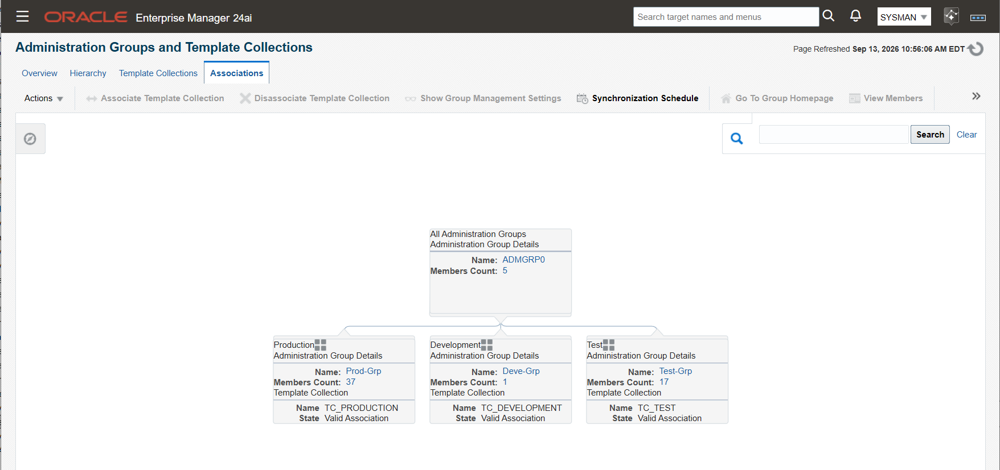

### 4.2 Metric Extensions

**Enterprise → Monitoring → Metric Extensions**

Expected, from [Phase 7b Part 4](phase-7b-part4-metric-extensions.md): the four
published extensions for APEX, ORDS, the NestWise Node proxy and MongoDB, each
still deployed to `oradbserv04`.

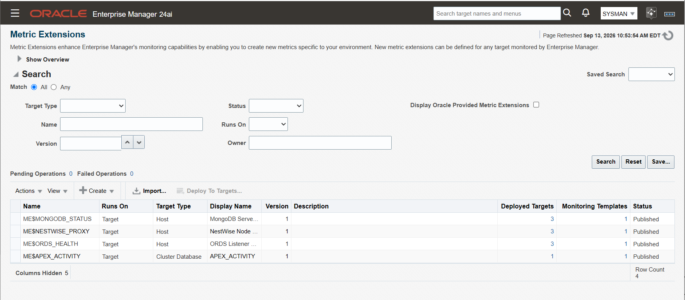

Open the **All Metrics** page for `oradbserv04` and confirm values with
timestamps after the upgrade. A surviving definition is not the same as a
collecting extension.

---

## 5. Upgrade the remaining agents

🟩 **Confirmed 2026-09-13.** Five standalone agents at 24.1.0.0.0. One image
association outstanding, §5.7.6.

`ConfigureGC.sh` upgraded the central agent on `oemserver01`. Standalone agents are
not upgraded with the OMS, and Oracle asks for them immediately afterwards.

Oracle's recommended route is the Agent Gold Image, not the Agent Upgrade Console:
*"Oracle recommends that you use Agent Gold Images to upgrade all your Management
Agents, although you can use other upgrade approaches."* A gold image version must be
built from a 24ai **standalone** agent, and a central agent cannot be a source, so the
console is used once to produce the first 24ai agent:

> *"if you are upgrading your Enterprise Manager system from 13c, then after
> upgrading Oracle Management Service (OMS) to 24ai Release 1, use the Agent Upgrade
> Console or EM CLI to upgrade one of your standalone Management Agents to 24ai
> Release 1. Then, create a gold image using the standalone Management Agent that is
> upgraded to 24ai Release 1, and finally update all other standalone Management
> Agents using that gold image."*

[Phase 7b Part 3](phase-7b-part3-golden-image.md) built `GI_AGENT_LINUX_X64` at
version `V1_13.5.0.0.0_BASE` and subscribed `oradbserv04`, `06`, `09` and `10` to it.
Those subscriptions carry forward.

| Agent | Route | Reason |
|---|---|---|
| `oemserver01` | Done | Central agent, upgraded by `ConfigureGC.sh` in [Part 2b §4](phase-7c-part2b-deployment.md). Central agents cannot subscribe to a gold image |
| `oradbserv05` | Agent Upgrade Console | Source of the V1 image, so it cannot subscribe to that image. Becomes the V2 source |
| `oradbserv04`, `06`, `09`, `10` | Gold image | Already subscribed. A new Current version updates them in one operation |

`V1_13.5.0.0.0_BASE` survives the OMS upgrade but cannot perform it: it is a 13.5
software baseline and installs or updates agents to 13.5 only. A gold image is scoped
to a platform rather than to a release, so the same image takes a second version at
24.1 and the existing subscriptions are unaffected.

### 5.1 Confirm the 24ai agent software is in the Software Library

**Setup → Extensibility → Self Update → Agent Software**

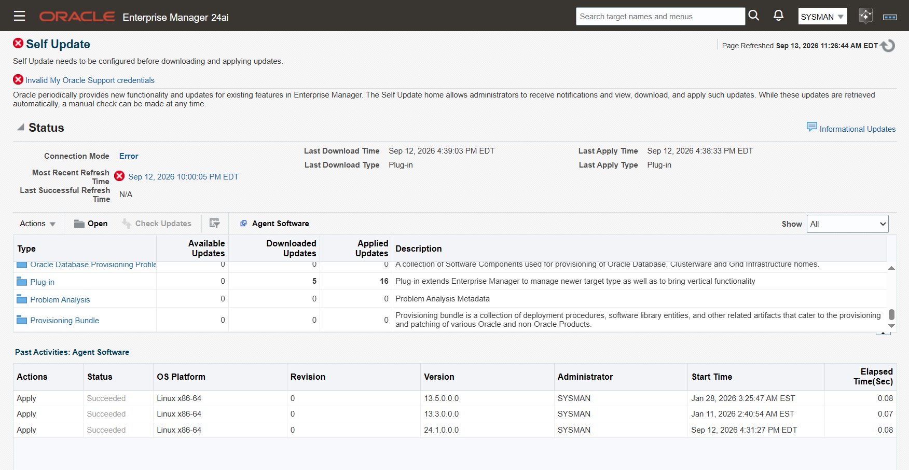

Confirm `Linux x86-64` at 24.1.0.0.0 shows **Applied**. Oracle requires a Self Update
download only where the agent platform differs from the OMS host platform. Every
agent here is Linux x86-64, the same platform as `oemserver01`, so the software
arrived with the OMS.

### 5.2 Compare plug-ins before cutting anything

Two rules apply, both of them after discovery has run.

Oracle, on the console route: *"In some cases, the deployed version of a plug-in may
not be supported on the upgraded version of a Management Agent."* Undeploy those, or
deploy a supported version, before upgrading.

On the image route, from
[Part 3 Appendix B.2](phase-7b-part3-golden-image.md#b2-updating-an-agent-that-carries-more-plug-ins-than-the-image),
Enterprise Manager refuses to update an agent from an image carrying fewer plug-ins
than that agent already has.

V1 was cut before discovery ran and carries the 13.5 agent defaults only. V2 is cut
after
[Part 2 §12](phase-7b-part2-admin-groups.md#12-discover-and-promote-targets--all-five-hosts)
placed targets on all five hosts, so its source carries the plug-ins those targets
required.

```bash
. ~/.env/oms_env
emcli login -username=sysman
emcli sync
emcli list_plugins_on_agent -all
```

`oradbserv05` must carry a superset of what `oradbserv04`, `06`, `09` and `10` carry.
`oradbserv04` runs no Oracle database and carries fewer, so the hosts to check are
`06`, `09` and `10`, which are RAC nodes like `oradbserv05`.

The image page records the change. Part 3 §17.1 read four subscribers on V1 Current
with zero drifters. The same page before §5.6:

| Reading | Part 3 §17.1 | Before §5.6 |
|---|---|---|
| V1 Current | 4 | 1 |
| Drifters | 0 | 3 |
| Agents on Gold Image | 4 | 1 |

Three agents no longer match the V1 baseline. Identify which three before §5.6: the
plug-ins they gained are the ones V2 must carry.

### 5.3 Blackout, for one of the two routes

Both routes restart the agent, so its targets go unreachable and raise incidents.

**The Agent Upgrade Console creates its own blackout.** No manual step is needed for
§5.4. Confirmed on this run:

```
Blackout AGT_UPG_BLK_OUT added successfully
EMD reload completed successfully

Exit Code :0
Blackout start executed successfully
```

**The gold image update does not.** Create a blackout before §5.7, with **Enable Full
blackout on all hosts** selected so the agent itself is covered. See
[Creating a Blackout in Enterprise Manager](oem-create-blackout.md) and
[Part 3 Appendix B.1](phase-7b-part3-golden-image.md#b1-updating-an-agent-that-is-already-monitoring-live-targets).

Cutting the image version in §5.6 needs no blackout either. That job starts and stops
its own, named `CREATE_GOLD_IMAGE`.

### 5.4 Upgrade `oradbserv05` with the Agent Upgrade Console

**Setup → Manage Cloud Control → Upgrade Agents**

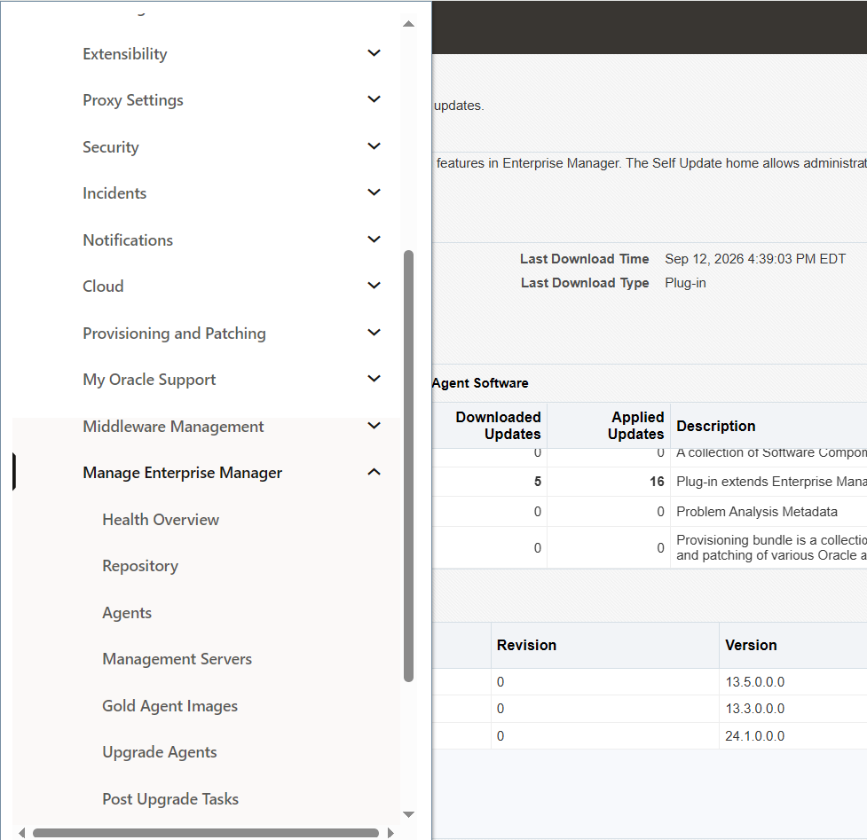

1. **Agent Upgrade Tasks** tab, **Agents for Upgrade**, click **Add**.
2. Select `oradbserv05`. The panel shows current version, target version and agent
   home.

> **Cluster members are selected together.** `oradbserv05` and `oradbserv06` are nodes
> of the same cluster, and the console will not let one be selected without the other.
> Both were upgraded in this task. The consequence for `oradbserv06` is §5.7.6.

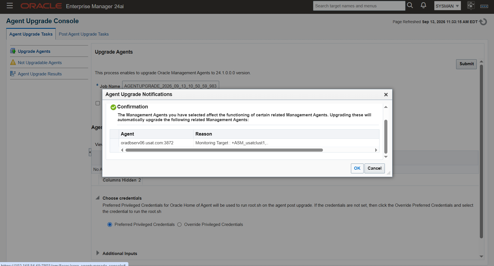

3. Under **Choose Credentials**, leave **Preferred Privileged Credentials** selected
   even where none are set. That privilege is used to run the agent's `root.sh`, which
   can be run by hand instead. The console states this when Submit is clicked.

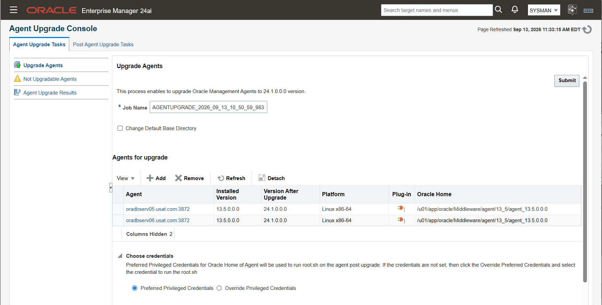

4. Track the job under **Agent Upgrade Results**.

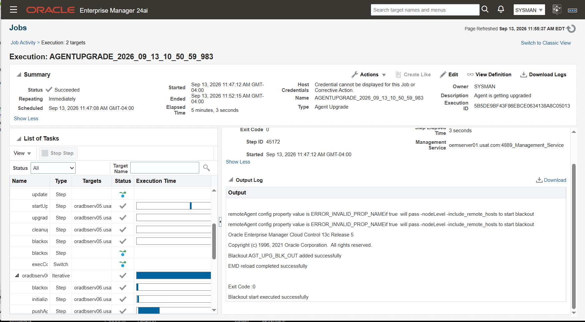

The upgrade is out of place. The base directory keeps `agent_inst` and gains
`agent_24.1.0.0.0` alongside a `backup_agtup` directory. The 13.5 home is left in
place for rollback.

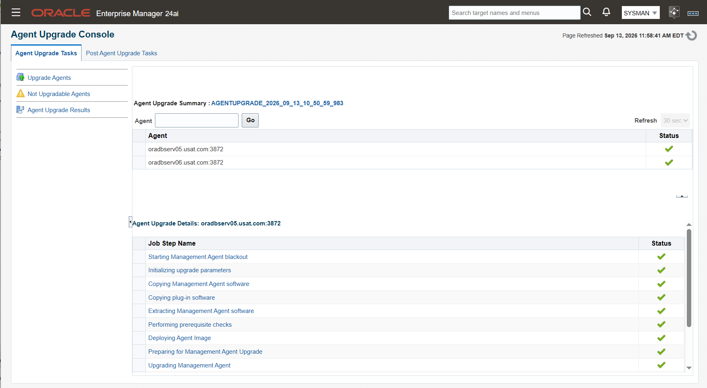

The base directory is `/u01/app/oracle/Middleware/agent/13_5` from
[Part 3 §15.2](phase-7b-part3-golden-image.md#152-run-the-add-host-targets-wizard).
Oracle does not rename it on upgrade, so a `13_5` directory now holds a 24.1 home.
Renaming it breaks the agent.

### 5.5 `root.sh`, and when you do not have to run it

The upgrade job runs `root.sh` itself when preferred privileged named credentials are
set for the host. On this estate they are, and every `root.sh` on both routes was
executed by the job. No manual step was needed.

The manual step exists for the case Oracle describes: *"If you upgrade a Management
Agent as a user who does not have root privileges, or you upgrade a Management Agent
without having preferred privileged credentials, a warning appears. You can ignore
this warning during the upgrade. Later, you can log in to the Management Agent host
as the root user, and run the `$<AGENT_BASE_DIR>/agent_24.1.0.0.0/root.sh` script."*

If that applies, as `root`:

```bash
/u01/app/oracle/Middleware/agent/13_5/agent_24.1.0.0.0/root.sh
```

### 5.6 Cut version 2 from the upgraded agent

**Not before §5.4.** A gold image version is built from an agent that already exists,
so V2 cannot be created until `oradbserv05` is running 24.1. The Versions and Drafts
tab will show only `V1_13.5.0.0.0_BASE` until then, and creating a version from any
13.5 agent produces another 13.5 baseline.

Confirm `oradbserv05` is `Running and Ready` at 24.1.0.0.0 and uploading before using
it as a source:

```bash
export AGENT_HOME=/u01/app/oracle/Middleware/agent/13_5/agent_24.1.0.0.0
$AGENT_HOME/bin/emctl status agent
```

```
oradbserv05-oracle-apexdb1$ pwd
/u01/app/oracle/Middleware/agent/13_5/agent_24.1.0.0.0/bin
oradbserv05-oracle-apexdb1$ ./emctl status agent
Oracle Enterprise Manager 24ai Release 1
Copyright (c) 1996, 2024 Oracle Corporation.  All rights reserved.
---------------------------------------------------------------
Agent Version          : 24.1.0.0.0
OMS Version            : 24.1.0.0.0
Protocol Version       : 12.1.0.1.0
Agent Home             : /u01/app/oracle/Middleware/agent/13_5/agent_inst
Agent Log Directory    : /u01/app/oracle/Middleware/agent/13_5/agent_inst/sysman/log
Agent Binaries         : /u01/app/oracle/Middleware/agent/13_5/agent_24.1.0.0.0
Core JAR Location      : /u01/app/oracle/Middleware/agent/13_5/agent_24.1.0.0.0/jlib
Agent Process ID       : 24726
Parent Process ID      : 24688
Agent URL              : https://oradbserv05.usat.com:3872/emd/main/
Local Agent URL in NAT : https://oradbserv05.usat.com:3872/emd/main/
Repository URL         : https://oemserver01.usat.com:4903/empbs/upload
Started at             : 2026-09-13 11:51:37
Started by user        : oracle
Operating System       : Linux version 5.4.17-2136.338.4.2.el7uek.x86_64 (amd64)
Number of Targets      : 18
Last Reload            : 2026-09-13 11:52:08
Last successful upload                       : 2026-09-13 12:00:18
Last attempted upload                        : 2026-09-13 12:00:18
Total Megabytes of XML files uploaded so far : 0.34
Number of XML files pending upload           : 0
Size of XML files pending upload(MB)         : 0
Available disk space on upload filesystem    : 59.26%
Collection Status                            : Collections enabled
Heartbeat Status                             : Ok
Last attempted heartbeat to OMS              : 2026-09-13 11:59:48
Last successful heartbeat to OMS             : 2026-09-13 11:59:48
Next scheduled heartbeat to OMS              : 2026-09-13 12:00:48

---------------------------------------------------------------
Agent is Running and Ready
oradbserv05-oracle-apexdb1$
```

The **Source Agent Details** panel on the image version page records what was used.
V1 reads `oradbserv05.usat.com:3872`, Oracle Home
`/u01/app/oracle/Middleware/agent/13_5/agent_13.5.0.0.0`, Agent Version `13.5.0.0.0`.
V2's panel should read the same agent with `agent_24.1.0.0.0` and `24.1.0.0.0`. That
is the check that the version was cut from the upgraded home rather than the old one.

**Gold Agent Images → `GI_AGENT_LINUX_X64` → Manage Image Versions and Subscriptions
→ Versions and Drafts → Actions → Create**

| Field | Value |
|---|---|
| Version Name | `V2_24.1.0.0.0_BASE` |
| Create image by | Selecting a source agent |
| Source agent | `oradbserv05.usat.com:3872` |

Then **Set Current Version**. A Draft version cannot update anything.

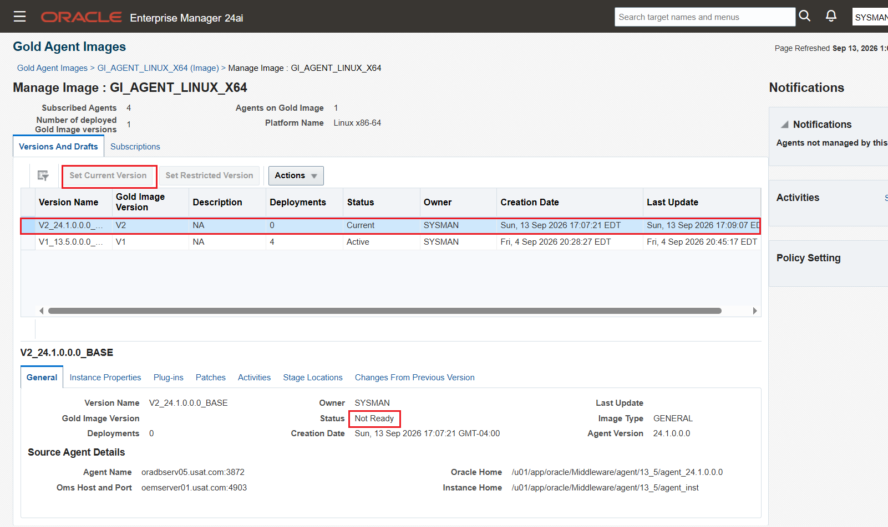

`emcli` equivalent:

```bash
emcli create_gold_agent_image \
  -image_name="GI_AGENT_LINUX_X64" \
  -version_name="V2_24.1.0.0.0_BASE" \
  -source_agent="oradbserv05.usat.com:3872"

emcli promote_gold_agent_image \
  -version_name="V2_24.1.0.0.0_BASE" \
  -maturity="Current"
```

The version name limit is 20 characters. `V2_24.1.0.0.0_BASE` is 18.

### 5.7 Update the four subscribers

**Subscription is to the image, not to a version.** `GI_AGENT_LINUX_X64` is what the
four agents subscribed to in
[Part 3 §16.1](phase-7b-part3-golden-image.md#161-the-four-provisioned-agents-are-already-subscribed);
V1 and V2 are versions inside it. There is nothing to re-subscribe when a new version
appears, and re-subscribing is refused anyway: Oracle lists *"Already subscribed
Management Agents"* among those that cannot be subscribed.

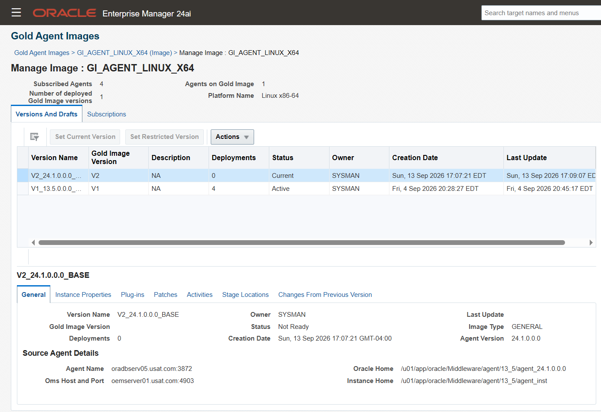

**A subscription never triggers an upgrade.** It declares which image an agent is
measured against, which is what produces the drift reading. The agents move to V2
when an update is run against them, and at no other time.

#### 5.7.1 Read the Subscriptions tab before touching anything

**Gold Agent Images → `GI_AGENT_LINUX_X64` → Manage Image Versions and Subscriptions
→ Subscriptions**

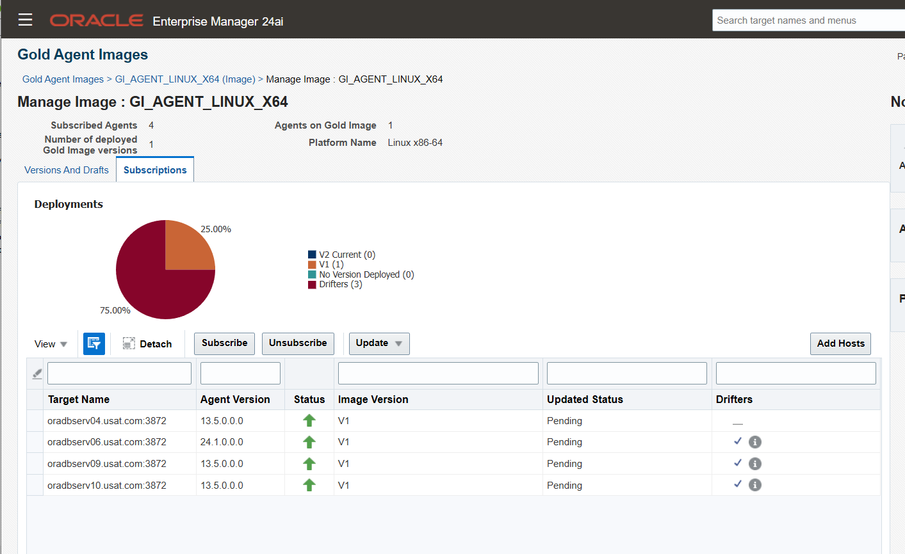

Recorded on this estate immediately after V2 was created:

| Agent | Agent Version | Image Version | Updated Status | Drifter |
|---|---|---|---|---|
| `oradbserv04` | 13.5.0.0.0 | V1 | Pending | no |
| `oradbserv06` | 24.1.0.0.0 | V1 | Pending | yes |
| `oradbserv09` | 13.5.0.0.0 | V1 | Pending | yes |
| `oradbserv10` | 13.5.0.0.0 | V1 | Pending | yes |

Deployments chart: V2 Current (0), V1 (1), No Version Deployed (0), Drifters (3).

| Column | What it means here |
|---|---|
| **Image Version** | The version currently deployed on that agent, not the one it is subscribed to. All four read V1 because V2 has not been pushed to anything yet |
| **Drifter** | The agent no longer matches the version it is on. `oradbserv06` drifted by being upgraded to 24.1 outside the image; `09` and `10` drifted on plug-ins acquired at discovery. `oradbserv04` still matches V1 exactly |
| **Updated Status: Pending** | No update operation has run against that agent for the current version |

#### 5.7.2 "Not Ready" is a stage, not a fault

The V2 General tab read **Status: Not Ready** while the Versions and Drafts row above
it read **Current**. `Not Ready` is a maturity value and the first one every version
holds; the detail panel had rendered from the creation moment.

The progression, from `GoldAgentImageLogger*.log` on the OMS:

| Time | `maturity` | Contents |
|---|---|---|
| `13-07-21` | `Not Ready` | `archives: [] plugins: [] patches: [] properties: []` |
| `13-08-25` | `Draft` | `archives: [24.1.0.0.0_AgentCore_226.zip ... fileSize: 560145745]`, plug-ins populated |

Sixty-four seconds, spent querying the source agent's deployed plug-ins and patches,
capturing `_agentRUVersion:24.1.0.0`, then packaging the agent core archive. The
version reaches `Draft` once that content exists and `Current` when promoted. The full
sequence is `Not Ready` to `Draft` to `Current`. V1 sits at `Current` with
`revision: 1` throughout.

The same log entry confirms the §5.6 source check:

```
GoldImageSource: agentName: oradbserv05.usat.com:3872
  oracleHome: /u01/app/oracle/Middleware/agent/13_5/agent_24.1.0.0.0
  instanceHome: /u01/app/oracle/Middleware/agent/13_5/agent_inst
  imageType: PHYSICAL
```

`agent_24.1.0.0.0`, not `agent_13.5.0.0.0`: the version was cut from the upgraded
home.

The job works in `<gc_inst>/em/EMGC_OMS1/sysman/goldagentimage/<gaiId>` and deletes
that directory on completion. The log is the record afterwards.

**When it is a fault.** A version that stays at `Not Ready` means creation did not
complete. Check **Gold Agent Images → Image Activities** for the `CREATE_GOLD_IMAGE`
result, and see My Oracle Support 2166275.1 for the job failing with *"Suspended:
Agent is not Ready"*. This run's log carries no `SEVERE`, `ERROR` or `WARN` line.

#### 5.7.3 Validate before committing

`-validate_only` submits no job. It answers the plug-in superset question from §5.2
in advance, rather than at submit time.

```bash
emcli update_agents \
  -image_name="GI_AGENT_LINUX_X64" \
  -agents="<agent_list>" \
  -validate_only
```

Substitute the agent list in the form this build accepts; see
[Appendix A.2](#11-appendix-a-reference-notes).

#### 5.7.4 Update

Staging is optional. Oracle: *"If the Management Agent gold image has not already
been staged, by default, the gold image is pushed to the Management Agents that you
have selected for update."* This run let it push. Stage separately to move the copy
outside the change window or to spare a slow link, then pass `-is_staged="true"`.

**Console route.** The **Update** button on the Subscriptions tab, with the agents
selected. This is the route used here.

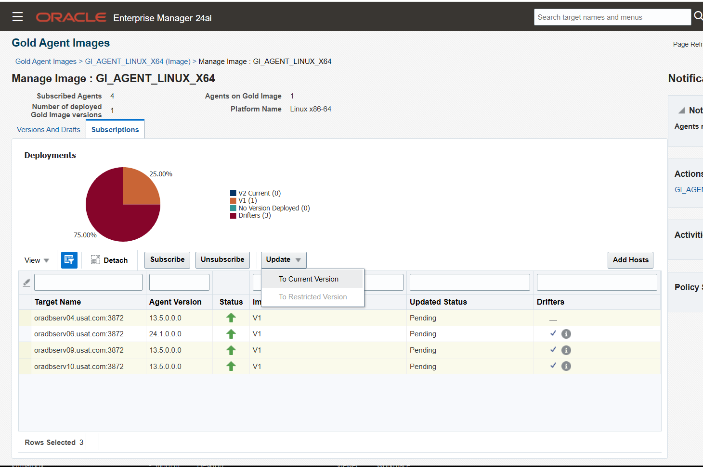

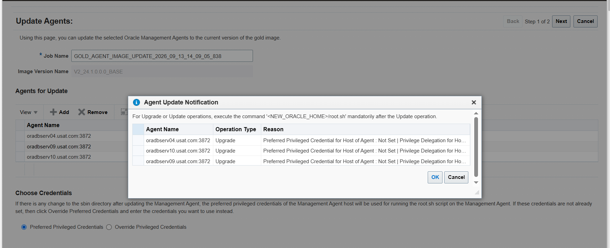

Click **Next**.

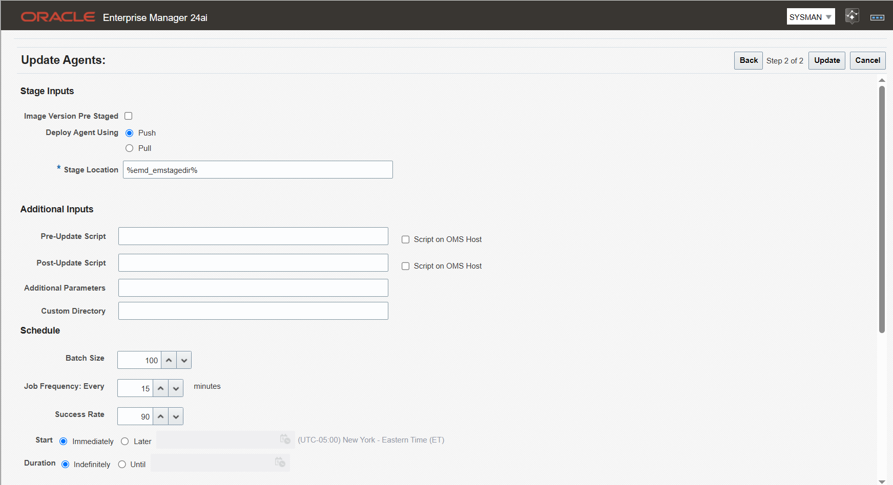

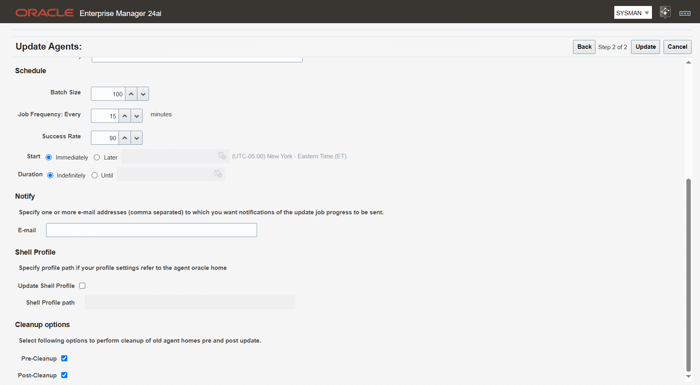

Click **Update**.

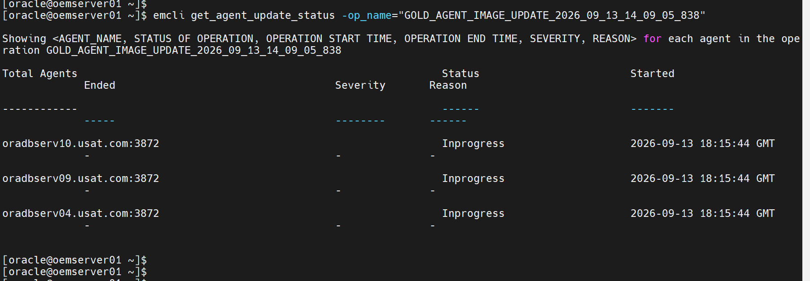

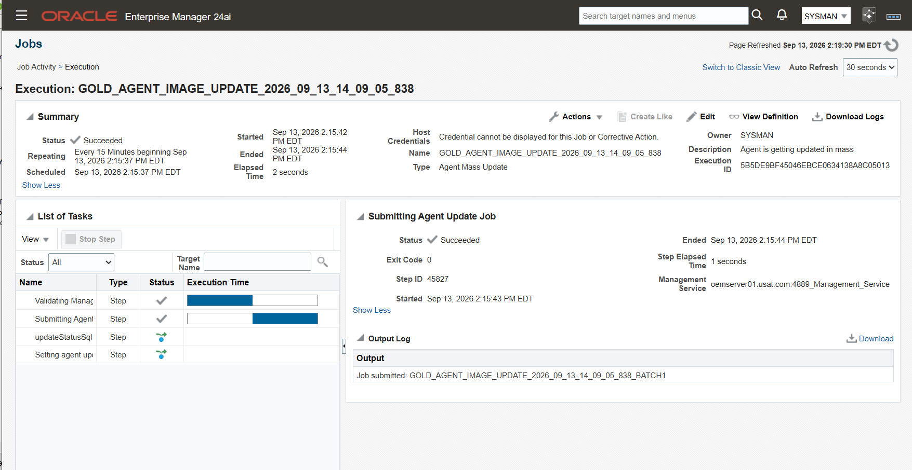

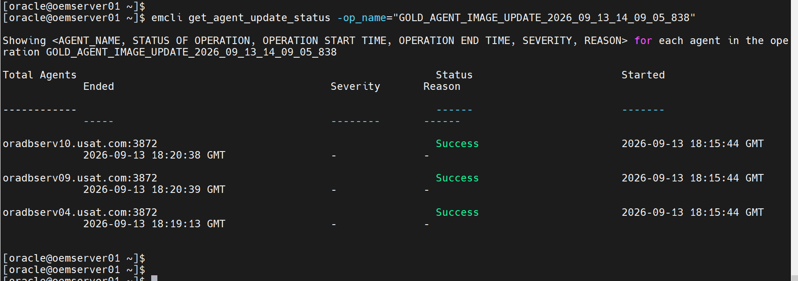

**`emcli` route.**

```bash
emcli update_agents \
  -image_name="GI_AGENT_LINUX_X64" \
  -agents="<agent_list>" \
  -op_name="UPDATE_GI_V2"

emcli get_agent_update_status -op_name="UPDATE_GI_V2"
emcli get_agent_update_status -op_name="UPDATE_GI_V2" -severity=ERROR
```

The console names its own operation. On this run it was
`GOLD_AGENT_IMAGE_UPDATE_2026_09_13_14_09_05_838`, which `get_agent_update_status`
accepts in place of a custom `-op_name`.

`-image_name` and one of `-agents` or `-input_file` are mandatory. `-image_series`
updates to the latest version in a series instead of a named image. The accepted
argument names on this build are in [Appendix A.2](#11-appendix-a-reference-notes).

#### 5.7.5 The result on this run

Run from the console: Subscriptions tab, four agents selected, **Update**.

| Agent | Agent Version | Image Version | Updated Status | Drifter |
|---|---|---|---|---|
| `oradbserv04` | 24.1.0.0.0 | V2 | Success | no |
| `oradbserv09` | 24.1.0.0.0 | V2 | Success | no |
| `oradbserv10` | 24.1.0.0.0 | V2 | Success | no |
| `oradbserv06` | 24.1.0.0.0 | **V1** | **Pending** | yes |

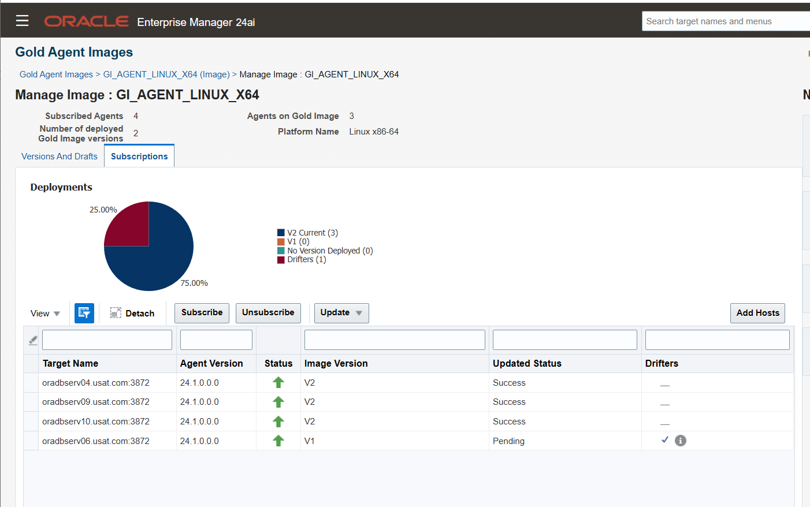

Deployments chart: V2 Current (3), V1 (0), No Version Deployed (0), Drifters (1).
Agents on Gold Image 3, deployed Gold Image versions 2.

Three of four moved to V2. Every `root.sh` was run by the job. `oradbserv06` is
§5.7.6.

Per host:

```bash
$AGENT_HOME/bin/emctl status agent
```
```
oradbserv09-oracle-apexdb1$ pwd
/u01/app/oracle/Middleware/agent/13_5/GoldImage_V2_24.1.0.0.0_BASE/agent_24.1.0.0.0/bin
oradbserv09-oracle-apexdb1$ ./emctl status agent
Oracle Enterprise Manager 24ai Release 1
Copyright (c) 1996, 2024 Oracle Corporation.  All rights reserved.
---------------------------------------------------------------
Agent Version          : 24.1.0.0.0
OMS Version            : 24.1.0.0.0
Protocol Version       : 12.1.0.1.0
Agent Home             : /u01/app/oracle/Middleware/agent/13_5/agent_inst
Agent Log Directory    : /u01/app/oracle/Middleware/agent/13_5/agent_inst/sysman/log
Agent Binaries         : /u01/app/oracle/Middleware/agent/13_5/GoldImage_V2_24.1.0.0.0_BASE/agent_24.1.0.0.0
Core JAR Location      : /u01/app/oracle/Middleware/agent/13_5/GoldImage_V2_24.1.0.0.0_BASE/agent_24.1.0.0.0/jlib
Agent Process ID       : 10870
Parent Process ID      : 10829
Agent URL              : https://oradbserv09.usat.com:3872/emd/main/
Local Agent URL in NAT : https://oradbserv09.usat.com:3872/emd/main/
Repository URL         : https://oemserver01.usat.com:4903/empbs/upload
Started at             : 2026-09-13 14:18:56
Started by user        : oracle
Operating System       : Linux version 5.4.17-2136.338.4.2.el7uek.x86_64 (amd64)
Number of Targets      : 16
Last Reload            : 2026-09-13 14:20:43
Last successful upload                       : 2026-09-13 15:05:05
Last attempted upload                        : 2026-09-13 15:05:05
Total Megabytes of XML files uploaded so far : 0.32
Number of XML files pending upload           : 0
Size of XML files pending upload(MB)         : 0
Available disk space on upload filesystem    : 24.76%
Collection Status                            : Collections enabled
Heartbeat Status                             : Ok
Last attempted heartbeat to OMS              : 2026-09-13 15:07:13
Last successful heartbeat to OMS             : 2026-09-13 15:07:13
Next scheduled heartbeat to OMS              : 2026-09-13 15:08:13

---------------------------------------------------------------
Agent is Running and Ready
oradbserv09-oracle-apexdb1$
```

`Agent Binaries` above is the image update's out of place home,
`GoldImage_V2_24.1.0.0.0_BASE/agent_24.1.0.0.0`; `Agent Home` stays at the original
`agent_inst`. Both routes and their home layouts are in
[Appendix A.1](#11-appendix-a-reference-notes).

#### 5.7.6 `oradbserv06` did not take the update

⬜ **Open. Deferred to a later date.**

`oradbserv06` runs agent version 24.1.0.0.0, its Image Version reads V1 and its
Updated Status reads Pending. It is counted as the single drifter in §5.7.5.

The eligibility check and its criteria are in
[Part 3 §16.4](phase-7b-part3-golden-image.md#164-checking-eligibility). The starting
point when this is picked up:

```bash
emcli get_not_updatable_agents -image_name="GI_AGENT_LINUX_X64"
emcli get_updatable_agents     -image_name="GI_AGENT_LINUX_X64"
```

`get_not_updatable_agents` returns the agent name and the reason it is excluded. The
console shows the same behind the information icon in the Drifters column.

#### 5.7.7 Rollback

Available while the previous home is still present, which is until §8 cleans it up.
Confirm the syntax against the `update_agents` verb reference for the release in use
before relying on it.
[Part 3 Appendix B.1](phase-7b-part3-golden-image.md#b1-updating-an-agent-that-is-already-monitoring-live-targets)
records an unverified form.

### 5.8 Verify

| # | Check | Expected | This run |
|---|---|---|---|
| 1 | `emctl status agent` on each host | `Running and Ready`, `Heartbeat Status : Ok`, zero pending uploads | 🟩 |
| 2 | Agent version | 24.1.0.0.0 on all six | 🟩 |
| 3 | **Setup → Manage Cloud Control → Agents** | Six Up, Secure Upload Yes, recent Last Successful Load | 🟩 |
| 4 | Gold image Subscriptions tab | Subscribers on V2 Current | 🟨 Three of four. `oradbserv06` is §5.7.6 |
| 5 | `root.sh` run | Once per upgraded host | 🟩 Run by the job, per §5.5 |

**No blackout was created for this run.** The Agent Upgrade Console created and
cleared `AGT_UPG_BLK_OUT` for §5.4 on its own, per §5.3, and the §5.7 update was run
without one. Where a blackout has been created by hand, clear it here. See
[the blackout page §6](oem-create-blackout.md#6-clearing-it-afterwards).

Leave the old agent homes in place until verification is complete. Section 8 removes
them, and with them the rollback.

---

## 6. Re-apply the OMS memory settings

The upgrade reset these. The values were recorded in
[Part 2a §2.7](phase-7c-part2a-pre-deployment.md#27-record-the-tuned-memory-settings).

```bash
emctl set property -name OMS_HEAP_MIN -value <value>G
emctl set property -name OMS_HEAP_MAX -value <value>G
emctl set property -name OMS_PERMGEN_MIN -value <value>G
emctl set property -name OMS_PERMGEN_MAX -value <value>G

emctl stop oms -all
emctl start oms
```

Set all four before restarting.

§3.3 also requires an OMS bounce. Set these properties before running
`emctl secure lock` to use one restart rather than two.

🟩 Confirmed 2026-09-13.

---

## 8. Clean up the old 13.5 agent homes

🟩 Confirmed 2026-09-13.

The two routes in §5 leave their old homes in different places, listed in
[Appendix A.1](#11-appendix-a-reference-notes). Confirm which cleanup applies to which
host before submitting, against the Oracle documentation for the release in use.

**Setup → Manage Cloud Control → Upgrade Agents → Cleanup Agents**

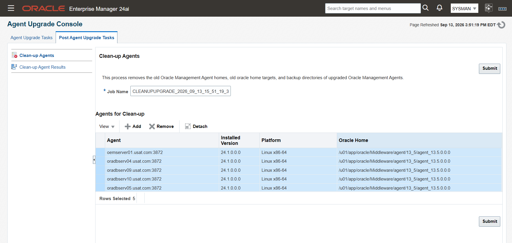

Add the old 13.5 agent and submit. Track it under job activity, then read
**Cleanup Agent Results**.

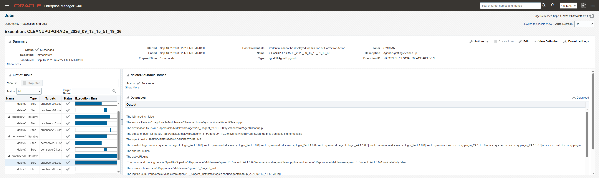

Cleanup removes the rollback option described in
[§5.7](#57-update-the-four-subscribers). Run it only once every agent is verified at
24.1.0.0.0 and uploading.

**The Cleanup Agents page can misreport the version.** It has been reported
showing the old agent's **Installed Version** as 24.1 while listing the correct
13.5 Oracle home. Check the home path rather than the version.

---

## 9. Restore what was changed for the upgrade

🟩 **Confirmed 2026-09-12.**

Each of these was weakened or disabled in Part 2a or Part 2b. None should stay
that way.

| What | Where it was changed | Restore |
|---|---|---|
| **Logoff trigger `gsmadmin_internal.gsmlogoff`** | [Part 2a §2.3](phase-7c-part2a-pre-deployment.md#23-repository-snapshots-and-triggers) | §9.1 |
| Password verification function | [Part 2a §2.10](phase-7c-part2a-pre-deployment.md#210-repository-grants-and-profile) | `ALTER PROFILE DEFAULT LIMIT PASSWORD_VERIFY_FUNCTION <original>;` |
| `job_queue_processes` | [Part 2b §2.3](phase-7c-part2b-deployment.md#23-set-job_queue_processes-to-zero) | `ALTER SYSTEM SET job_queue_processes = <original> SCOPE = MEMORY;` |
| Maximum memory usage events | [Part 2a §2.11](phase-7c-part2a-pre-deployment.md#211-firewall-and-memory-events) | Reset 10261 and 10262 if they were cleared |
| SQL ALG in the firewall | [Part 2a §2.11](phase-7c-part2a-pre-deployment.md#211-firewall-and-memory-events) | Re-enable inspection |

`job_queue_processes` used `SCOPE = MEMORY`, so a database restart restores it on
its own. Set it explicitly rather than waiting for one.

### 9.1 Re-enable the logoff trigger

One trigger was disabled for the upgrade, `gsmadmin_internal.gsmlogoff`.

```sql
ALTER TRIGGER gsmadmin_internal.gsmlogoff ENABLE;
```

Confirm it is back:

```sql
SELECT owner, trigger_name, status
FROM   dba_triggers
WHERE  owner = 'GSMADMIN_INTERNAL'
AND    trigger_name = 'GSMLOGOFF';
```

Expected `STATUS`: `ENABLED`.

Enterprise Manager does not report a disabled Oracle-supplied trigger, so this
one has to be tracked here rather than found later.

---

## 10. Close out

| # | Step | Status |
|---|---|---|
| 10.1 | Drop the restore point `PRE_EM_24AI` | 🟩 Confirmed 2026-09-13 |
| 10.2 | Deinstall the 13.5 OMS home | 🟩 Confirmed 2026-09-13 |

The AHF compliance check is outstanding and is recorded in
[Appendix A.3](#11-appendix-a-reference-notes).

### 10.1 Drop the restore point

🟩 Confirmed 2026-09-13.

```sql
SELECT name, guarantee_flashback_database, time FROM v$restore_point;
DROP RESTORE POINT PRE_EM_24AI;
```

Run this only once §1 to §9 are done and the estate has run long enough to trust. A
guaranteed restore point holds flashback logs and fills the recovery area if it is
left indefinitely.

### 10.2 Deinstall the 13.5 OMS home

🟩 Confirmed 2026-09-13.

**Last.** The 13.5 home is the rollback in
[Part 2b §7](phase-7c-part2b-deployment.md#7-rollback). Deinstalling it ends the
ability to go back.

Run §2 first.

---

## 11. Appendix A: Reference notes

### A.1 Where each upgrade route leaves the agent home

Both routes are out of place and both keep the old home for rollback. They place the
new one differently.

| Route | New binaries | Old home |
|---|---|---|
| Agent Upgrade Console, §5.4 | `<base>/agent_24.1.0.0.0` | `<base>/agent_13.5.0.0.0`, plus a `backup_agtup` directory |
| Gold image update, §5.7 | `<base>/GoldImage_<version>/agent_24.1.0.0.0` | `<base>/agent_13.5.0.0.0` untouched |

`agent_inst` is shared and does not move, which is why `emctl status agent` reports
`Agent Home` at `agent_inst` and `Agent Binaries` at the new location.

`<base>` here is `/u01/app/oracle/Middleware/agent/13_5`. Oracle does not rename the
base directory on upgrade, so a `13_5` directory holds 24.1 binaries. Renaming it
breaks the agent.

To find `root.sh` on either route without assuming the path:

```bash
find /u01/app/oracle/Middleware/agent/13_5 -name root.sh 2>/dev/null
```

Section 8 removes the old homes and with them the rollback.

### A.2 The `update_agents` verb takes `-image_name`, not `-gold_image_name`

The 24ai EM CLI verb reference documents `-gold_image_name`. On this build that
argument is rejected:

```
Syntax Error: Unrecognized argument -gold_image_name
```

`-image_name` is accepted. The separator for `-agents` is unresolved here: `;`
produced *"Following targets are not valid"* with the whole string treated as a single
target name, and the run was completed from the console instead. Read the accepted
arguments from the OMS rather than the manual:

```bash
emcli help update_agents
```

### A.3 AHF compliance check

⬜ **Open.** Not run for this upgrade.

**Who:** `oracle`
**Where:** `oradbserv05`

```bash
orachk -a
```

`-a` runs all checks, including the best practice checks and the recommended patch
check. `ahfctl compliance -a` wraps the same framework and takes the same options.

Archive the generated HTML report as evidence, the same pattern Phase 7a used either
side of its patch window. The pre-upgrade baseline is
[Phase 7a Part 1 §5.6](phase-7a-part1-before-the-window.md#56-ahf-compliance-baseline).

`orachk` is the tool for non-engineered systems,
`exachk` is the Exadata equivalent, and `ahfctl compliance` wraps both with the same
options. This estate is non-engineered, so `orachk`.

Locate the binary if it is not on `PATH`:

```bash
/opt/oracle.ahf/bin/orachk -a
/opt/oracle.ahf/bin/ahfctl orachk -profile db
```

## 12. Screenshot checklist

Twenty images, all embedded above and all in [`screenshots/`](screenshots/).

| File | Section | Shows |
|---|---|---|
| `3.Lock_console_agent_upload.png` | 3.3 | `emctl secure lock` and the OMS restart |
| `4.1_Administration_groups.png` | 4.1 | Administration groups present after the upgrade |
| `4.2_Metric_Extensions.png` | 4.2 | The four published Metric Extensions |
| `5.1_Confirm_24ai_agent_Software_Library.png` | 5.1 | Linux x86-64 at 24.1.0.0.0 marked Applied |
| `5.4_Upgrade_Agent_Upgrade_Console.png` | 5.4 | Agent Upgrade Tasks tab |
| `5.4_Upgrade_Agent_Upgrade_Console1.png` | 5.4 | Both cluster nodes selected |
| `5.4_Upgrade_Agent_Upgrade_Console2.png` | 5.4 | Choose Credentials |
| `5.4_Upgrade_Agent_Upgrade_Console3.png` | 5.4 | Job submitted |
| `5.4_Upgrade_Agent_Upgrade_Console4.png` | 5.4 | Upgrade complete |
| `5.6_Cut_version_upgraded_agent.png` | 5.6 | Create Image Version for `V2_24.1.0.0.0_BASE` |
| `5.7_Update_4_subscribers.png` | 5.7 | Four subscribed agents |
| `5.7.1_Read_Subscriptions_tab.png` | 5.7.1 | Subscriptions tab before the update |
| `5.7.4_Update.png` | 5.7.4 | Agents selected, Update button |
| `5.7.4_Update1.png` | 5.7.4 | Update wizard, agent selection |
| `5.7.4_Update2.png` | 5.7.4 | Update wizard, options |
| `5.7.4_Update2-1.png` | 5.7.4 | Update wizard, options continued |
| `5.7.4_Update3.png` | 5.7.4 | Job submitted |
| `5.7.4_Update4.png` | 5.7.4 | Job in progress |
| `5.7.4_Update5.png` | 5.7.4 | Job complete |
| `5.7.5_The_result_on_this_run.png` | 5.7.5 | Three agents on V2, one drifter |
| `8.Cleanup_old_13.5_agent_homes.png` | 8 | Cleanup Agents page |
| `8.Cleanup_old_13.5_agent_homes1.png` | 8 | Cleanup Agent Results |

Still to capture:

| File | Section | Shows | Status |
|---|---|---|---|
| `7c2c-ahf-compliance.png` | A.3 | The post-upgrade AHF report summary | ⬜ |

---

## What this feeds into

- **Phase 7d.** Convert `oemcdb` from non-CDB to a CDB and create `oempdb` plus
  `ggpdb` for GoldenGate. Not a prerequisite for 24ai, which supports a non-CDB
  repository, but required to take the repository past 19c.
- **Fleet Maintenance**, new in 24ai. Patches databases and Grid Infrastructure
  out of place, driven through the `emcli` verb with no console equivalent for
  that step.

---

Sources for all three parts are on the
[index](phase-7c-part2-24ai-upgrade.md#sources).
