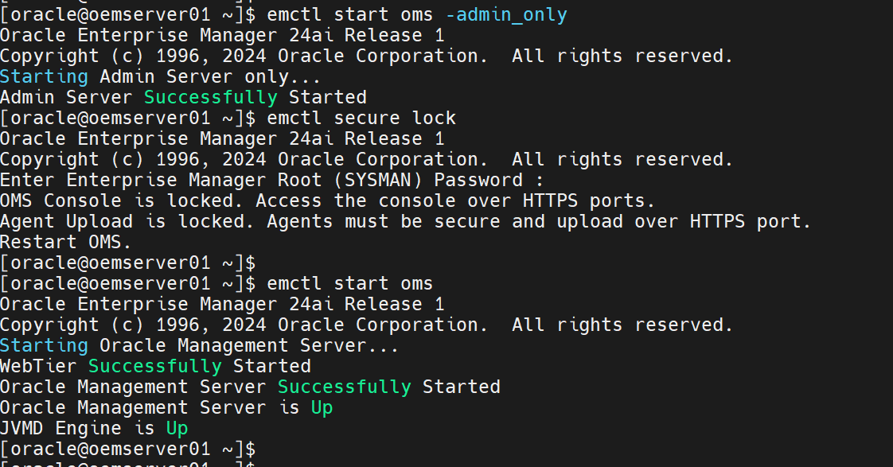

# Phase 7c Part 2c: Post-deployment

**The upgrade is done. Now put back everything the upgrade needed you to weaken**

Part 2c of three. [Part 2a](phase-7c-part2a-pre-deployment.md) staged and
patched the binaries. [Part 2b](phase-7c-part2b-deployment.md) ran the window.
The index is
[`phase-7c-part2-24ai-upgrade.md`](phase-7c-part2-24ai-upgrade.md).

Status: 🟨 In progress. Sections 1, 2, 3 and 9 are confirmed. Sections 4 to 8 and
10 to 12 are outstanding.

[Part 2b](phase-7c-part2b-deployment.md) ends with the console reporting a
successful upgrade. Everything here follows that.

Four of these are security items rather than housekeeping. The emkey is in the
repository, the console and agent upload are unlocked, the password verification
function is off, and SQL ALG may still be disabled in the firewall. The upgrade
required all four and none should outlive it.

| # | Task | Status |
|---|---|---|
| 1 | Clear the blackout | 🟩 Confirmed 2026-09-12 |
| 2 | **Re-secure the emkey** | 🟩 Confirmed 2026-09-12 |
| 3 | **Lock the console and agent upload** | 🟩 Confirmed 2026-09-12 |
| 4 | Verify the Phase 7b configuration survived | ⬜ |
| 5 | Upgrade the remaining agents to 24ai | ⬜ |
| 6 | Re-apply the OMS memory settings | ⬜ |
| 7 | Patch the new agent homes | ⬜ |
| 8 | Clean up the old 13.5 agent homes | ⬜ |
| 9 | Restore what was changed for the upgrade, including `gsmadmin_internal.gsmlogoff` | 🟩 Confirmed 2026-09-12 |
| 10 | AHF compliance check | ⬜ |
| 11 | Drop the restore point `PRE_EM_24AI` | ⬜ |
| 12 | Deinstall the 13.5 OMS home | ⬜ |

Run sections 1 to 3 first. The blackout suppresses every alert on the estate
while it is active, and the two security settings stay open until they are
closed.

```bash
source ~/.env/oms_env
```

Everything on this page addresses the **24ai** home.

---

## Contents

1. [Clear the blackout](#1-clear-the-blackout)
2. [Re-secure the emkey](#2-re-secure-the-emkey)
3. [Lock the console and agent upload](#3-lock-the-console-and-agent-upload)
4. [Verify the Phase 7b configuration survived](#4-verify-the-phase-7b-configuration-survived)
5. [Upgrade the remaining agents](#5-upgrade-the-remaining-agents)
6. [Re-apply the OMS memory settings](#6-re-apply-the-oms-memory-settings)
7. [Patch the new agent homes](#7-patch-the-new-agent-homes)
8. [Clean up the old 13.5 agent homes](#8-clean-up-the-old-135-agent-homes)
9. [Restore what was changed for the upgrade](#9-restore-what-was-changed-for-the-upgrade)
10. [Close out](#10-close-out)
11. [Appendix A: Two documented behaviours](#11-appendix-a-two-documented-behaviours)
12. [Screenshot checklist](#12-screenshot-checklist)

---

## 1. Clear the blackout

The blackout created in
[Part 2b §1.1](phase-7c-part2b-deployment.md#11-create-the-blackout) suppresses
every alert on the estate while it is active. Part 2b §6 has already confirmed
the OMS, the central agent, the console and the target count.

Through the console, following
**[Creating a Blackout in Enterprise Manager 13.5](oem-create-blackout.md)**.

Check Incident Manager afterwards for availability events raised during the
window and clear any that are artefacts of the upgrade rather than real.

---

## 2. Re-secure the emkey

The emkey is still sitting in the repository because
[Part 2a §2.5](phase-7c-part2a-pre-deployment.md#25-copy-the-emkey-to-the-repository)
put it there for the upgrade. `emctl` tells you to undo it, inside the very
message Part 2a treats as success:

> *"The EMKey is configured properly, but is not secure. Secure the EMKey by
> running emctl config emkey -remove_from_repos."*

### 2.1 Confirm the current state

```bash
emctl status emkey
```

Observed on `oemserver01` while still on 13.5, after
[Part 2a §2.5](phase-7c-part2a-pre-deployment.md#25-copy-the-emkey-to-the-repository)
had run:

```
[oracle@oemserver01 oem]$ emctl status emkey
Oracle Enterprise Manager Cloud Control 13c Release 5
Copyright (c) 1996, 2021 Oracle Corporation.  All rights reserved.
Enter Enterprise Manager Root (SYSMAN) Password :
The EMKey  is configured properly, but is not secure. Secure the EMKey by running "emctl config emkey -remove_from_repos".
```

The key is in the repository, which the upgrade required and normal operation
does not.

Both commands prompt for the SYSMAN password interactively, so it appears in no
file and on no command line.

### 2.2 Remove it

```bash
emctl config emkey -remove_from_repos
emctl status emkey
```

Expected afterwards, with no *"but is not secure"* qualifier and no remediation
sentence:

```
[oracle@oemserver01 ~]$ emctl status emkey
Oracle Enterprise Manager 24ai Release 1
Copyright (c) 1996, 2024 Oracle Corporation.  All rights reserved.
Enter Enterprise Manager Root (SYSMAN) Password :
The EMKey is configured properly.
[oracle@oemserver01 ~]$

```

| State | `emctl status emkey` says | Correct when |
|---|---|---|
| In the repository | *"configured properly, but is not secure"* | During the upgrade only |
| Not in the repository | *"configured properly."* | Every other time |

**Run this from the 24ai home.** The banner above reads `13c Release 5` because
it was taken before the upgrade. After
[Part 2b](phase-7c-part2b-deployment.md) the same command reports 24ai.

**Before §12.** Deinstalling the 13.5 home while the key still lives in the
repository removes the easy path back.

---

## 3. Lock the console and agent upload

🟩 **Confirmed 2026-09-12.**

`emctl status oms -details` in
[Part 2b §6.1](phase-7c-part2b-deployment.md#61-the-oms-is-up-and-reporting-24ai)
reported:

```
Agent Upload is unlocked.
OMS Console is unlocked.
```

**Unlocked means the HTTP ports accept traffic.** Enterprise Manager listens on
four ports, two of them plain HTTP:

| Port | Protocol | Serves |
|---|---|---|
| 7788 | HTTP | Console |
| 7803 | HTTPS | Console |
| 4889 | HTTP | Agent upload |
| 4903 | HTTPS | Agent upload |

Locking closes the HTTP path and requires TLS:

| Setting | Locked | Unlocked |
|---|---|---|
| OMS Console | Console reachable on 7803 only. Requests to 7788 are refused or redirected | Console also reachable on 7788, so credentials can cross the network in clear text |
| Agent Upload | Agents must upload on 4903 over TLS with a valid certificate | Agents may also upload on 4889, so monitoring data crosses in clear text |

### 3.1 Check the 13.5 value first

Locked is not the universal default. Compare against what this estate ran before
the upgrade, recorded in
[Part 1 §3.1](phase-7c-part1-oms-ru33.md#31-set-the-environment) and its
screenshot.

### 3.2 Confirm the agents are already on HTTPS

Locking upload rejects any agent still uploading over HTTP, and that agent stops
reporting silently until it is re-secured with `emctl secure agent`.

```bash
source ~/.env/agent_env
emctl status agent | grep -i 'Repository URL'
```

The central agent returned
`https://oemserver01.usat.com:4903/empbs/upload` in Part 2b §6.2, which is the
HTTPS upload port. Run the same check on the five remaining agents before
locking.

### 3.3 Lock it

**`emctl secure lock` needs the OMS stopped and the Administration Server
running.** Start the Administration Server on its own with `-admin_only` between
the stop and the lock.

```bash
source ~/.env/oms_env

emctl stop oms
emctl start oms -admin_only
emctl secure lock
emctl start oms
emctl status oms -details
```

Confirmed output:

```
[oracle@oemserver01 ~]$ emctl start oms -admin_only
Oracle Enterprise Manager 24ai Release 1
Copyright (c) 1996, 2024 Oracle Corporation.  All rights reserved.
Starting Admin Server only...
Admin Server Successfully Started
[oracle@oemserver01 ~]$ emctl secure lock
Oracle Enterprise Manager 24ai Release 1
Copyright (c) 1996, 2024 Oracle Corporation.  All rights reserved.
Enter Enterprise Manager Root (SYSMAN) Password :
OMS Console is locked. Access the console over HTTPS ports.
Agent Upload is locked. Agents must be secure and upload over HTTPS port.
Restart OMS.
[oracle@oemserver01 ~]$ emctl start oms
Oracle Enterprise Manager 24ai Release 1
Copyright (c) 1996, 2024 Oracle Corporation.  All rights reserved.
Starting Oracle Management Server...
WebTier Successfully Started
Oracle Management Server Successfully Started
Oracle Management Server is Up
JVMD Engine is Up
```



`Restart OMS.` in that output is the instruction the `emctl start oms` on the
next line satisfies.

`emctl secure lock` with no argument locks both. To act on one:

| Command | Effect |
|---|---|
| `emctl secure lock -console` | Console only |
| `emctl secure lock -upload` | Agent upload only |
| `emctl secure unlock -console` | Reverses the console lock |
| `emctl secure unlock -upload` | Reverses the upload lock |

### 3.4 Confirm

```
[oracle@oemserver01 ~]$ emctl status oms -details
Oracle Enterprise Manager 24ai Release 1
Copyright (c) 1996, 2024 Oracle Corporation.  All rights reserved.
Console Server Host        : oemserver01.usat.com
HTTP Console Port          : 7788
HTTPS Console Port         : 7803
HTTP Upload Port           : 4889
HTTPS Upload Port          : 4903
EM Instance Home           : /u01/app/oracle/Middleware/24ai/gc_inst/em/EMGC_OMS1
OMS Log Directory Location : /u01/app/oracle/Middleware/24ai/gc_inst/em/EMGC_OMS1/sysman/log
OMS is not configured with SLB or virtual hostname
Agent Upload is locked.
OMS Console is locked.
Active CA ID: 1
Console URL: https://oemserver01.usat.com:7803/em
Upload URL: https://oemserver01.usat.com:4903/empbs/upload

WLS Domain Information
Domain Name            : GCDomain
Admin Server Host      : oemserver01.usat.com
Admin Server HTTPS Port: 7102
Admin Server is RUNNING

Extended Domain Name            : EMExtDomain1
Extended Admin Server Host      : oemserver01.usat.com
Extended Admin Server HTTPS Port: 7016
Extended Admin Server is RUNNING

Oracle Management Server Information
Managed Server Instance Name: EMGC_OMS1
Oracle Management Server Instance Host: oemserver01.usat.com
WebTier is Up
Oracle Management Server is Up
JVMD Engine is Up
[oracle@oemserver01 ~]$

```

---

## 4. Verify the Phase 7b configuration survived

The administration groups and Metric Extensions were built in Phase 7b and are
carried through the repository schema upgrade rather than rebuilt.

### 4.1 Administration groups

```bash
emcli sync
emcli login -username=sysman
emcli get_targets -targets=composite
```

Expected, from [Phase 7b Part 2](phase-7b-part2-admin-groups.md): `Prod-Grp`,
`Test-Grp`, `Deve-Grp`, `Stag-Grp`, `MC-Grp`, `ADMGRP0`.

### 4.2 Metric Extensions

**Enterprise → Monitoring → Metric Extensions**

Expected, from [Phase 7b Part 4](phase-7b-part4-metric-extensions.md): the four
published extensions for APEX, ORDS, the NestWise Node proxy and MongoDB, each
still deployed to `oradbserv04`.

Open the **All Metrics** page for `oradbserv04` and confirm values with
timestamps after the upgrade. A surviving definition is not the same as a
collecting extension.

---

## 5. Upgrade the remaining agents

`ConfigureGC.sh` upgraded the central agent. The other five are separate.

**Setup → Manage Cloud Control → Upgrade Agents**

1. **Agent Upgrade Tasks** tab, **Agents for Upgrade**, click **Add**.
2. Select the 13.5 agents. The panel shows current version, target version and
   agent home.
3. Under **Choose Credentials**, leave **Preferred Privileged Credentials**
   selected even where none are set. That privilege is only needed to run the
   agent's `root.sh`, which can be run by hand instead. The console says so when
   Submit is clicked.
4. Track the job under **Agent Upgrade Results**.

The five agents from Phase 7b Part 3: `oradbserv04`, `05`, `06`, `09`, `10`.

---

## 6. Re-apply the OMS memory settings

The upgrade reset these. The values were recorded in
[Part 2a §2.7](phase-7c-part2a-pre-deployment.md#27-record-the-tuned-memory-settings).

```bash
emctl set property -name OMS_HEAP_MIN -value <value>G
emctl set property -name OMS_HEAP_MAX -value <value>G
emctl set property -name OMS_PERMGEN_MIN -value <value>G
emctl set property -name OMS_PERMGEN_MAX -value <value>G

emctl stop oms -all
emctl start oms
```

Set all four before restarting.

§3.3 also requires an OMS bounce. Setting these properties before running
`emctl secure lock` costs one restart rather than two.

---

## 7. Patch the new agent homes

Each upgraded agent lands in a **new home** under its agent base directory, at
base 24.1. The Release Update applied to the OMS in Part 2a does not reach it.

Patch each new agent home with the agent Release Update matching the OMS, so the
OMS and its agents sit at the same level.

| Agent | New home | RU applied |
|---|---|---|
| `oemserver01` | | |
| `oradbserv04` | | |
| `oradbserv05` | | |
| `oradbserv06` | | |
| `oradbserv09` | | |
| `oradbserv10` | | |

---

## 8. Clean up the old 13.5 agent homes

**Setup → Manage Cloud Control → Upgrade Agents → Cleanup Agents**

Add the old 13.5 agent and submit. Track it under job activity, then read
**Cleanup Agent Results**.

**The Cleanup Agents page can misreport the version.** It has been reported
showing the old agent's **Installed Version** as 24.1 while listing the correct
13.5 Oracle home. Check the home path rather than the version.

---

## 9. Restore what was changed for the upgrade

Each of these was weakened or disabled in Part 2a or Part 2b. None should stay
that way.

| What | Where it was changed | Restore |
|---|---|---|
| **Logoff trigger `gsmadmin_internal.gsmlogoff`** | [Part 2a §2.3](phase-7c-part2a-pre-deployment.md#23-repository-snapshots-and-triggers) | §9.1 |
| Password verification function | [Part 2a §2.10](phase-7c-part2a-pre-deployment.md#210-repository-grants-and-profile) | `ALTER PROFILE DEFAULT LIMIT PASSWORD_VERIFY_FUNCTION <original>;` |
| `job_queue_processes` | [Part 2b §2.3](phase-7c-part2b-deployment.md#23-set-job_queue_processes-to-zero) | `ALTER SYSTEM SET job_queue_processes = <original> SCOPE = MEMORY;` |
| Maximum memory usage events | [Part 2a §2.11](phase-7c-part2a-pre-deployment.md#211-firewall-and-memory-events) | Reset 10261 and 10262 if they were cleared |
| SQL ALG in the firewall | [Part 2a §2.11](phase-7c-part2a-pre-deployment.md#211-firewall-and-memory-events) | Re-enable inspection |

`job_queue_processes` used `SCOPE = MEMORY`, so a database restart restores it on
its own. Set it explicitly rather than waiting for one.

### 9.1 Re-enable the logoff trigger

One trigger was disabled for the upgrade, `gsmadmin_internal.gsmlogoff`.

```sql
ALTER TRIGGER gsmadmin_internal.gsmlogoff ENABLE;
```

Confirm it is back:

```sql
SELECT owner, trigger_name, status
FROM   dba_triggers
WHERE  owner = 'GSMADMIN_INTERNAL'
AND    trigger_name = 'GSMLOGOFF';
```

Expected `STATUS`: `ENABLED`.

Enterprise Manager does not report a disabled Oracle-supplied trigger, so this
one has to be tracked here rather than found later.

---

## 10. Close out

### 10.1 AHF compliance check

Run it and archive the report here as evidence, the same pattern Phase 7a used
either side of its patch window. The pre-upgrade baseline is
[Phase 7a Part 1 §5.6](phase-7a-part1-before-the-window.md#56-ahf-compliance-baseline).

### 10.2 Drop the restore point

```sql
SELECT name, guarantee_flashback_database, time FROM v$restore_point;
DROP RESTORE POINT PRE_EM_24AI;
```

**Only once §1 to §9 are done and the estate has run long enough to trust.** A
guaranteed restore point holds flashback logs and will fill the recovery area if
it is left indefinitely.

### 10.3 Deinstall the 13.5 OMS home

**Last.** The 13.5 home is the rollback in
[Part 2b §7](phase-7c-part2b-deployment.md#7-rollback). Deinstalling it ends the
ability to go back.

Run §2 first.

---

## 11. Appendix A: Two documented behaviours

**The OMS and central agent do not start automatically after a host reboot.**
This applies where the repository database and the OMS share a host, as they do
here. Both have to be started by hand, or placed under a systemd unit with a
documented startup order.

**Agents may fail to communicate with `handshake has no peer`.**

```
WARN - Ping communication error
o.s.emSDK.agent.comm.exception.VerifyConnectionException [unable to connect to
http server at https://<host>:<port>/empbs/upload. [handshake has no peer]
javax.net.ssl.SSLHandshakeException [handshake has no peer]
javax.net.ssl.SSLPeerUnverifiedException [peer not authenticated]
```

Caused by pre 13.4 SSL cipher suites, so it affects estates whose history runs
13.4 to 13.5 to 24ai. KB639677 has the fix. The six agents here were installed at
13.5 from a gold image. Check agent uploads in
[Part 2b §6.2](phase-7c-part2b-deployment.md#62-the-central-agent-is-up-and-uploading).

---

## 12. Screenshot checklist

Embedded above:

| File | Section | Shows |
|---|---|---|
| `3.Lock_console_agent_upload.png` | 3.3 | `emctl secure lock` and the OMS restart |

Still to capture:

| File | Section | Shows | Status |
|---|---|---|---|
| `7c2c-01-blackout-cleared.png` | 1 | The blackout cleared | ⬜ |
| `7c2c-02-emkey-secured.png` | 2.2 | `emctl status emkey` with no "but is not secure" | ⬜ |
| `7c2c-04-admin-groups.png` | 4.1 | `emcli get_targets -targets=composite` | ⬜ |
| `7c2c-04-metric-extensions.png` | 4.2 | The four Metric Extensions returning values | ⬜ |
| `7c2c-05-agent-upgrade-results.png` | 5 | The Agent Upgrade Results page | ⬜ |
| `7c2c-08-cleanup-agent-results.png` | 8 | The old 13.5 homes removed | ⬜ |
| `7c2c-10-ahf-compliance.png` | 10.1 | The post-upgrade AHF report summary | ⬜ |

---

## What this feeds into

- **Phase 7d.** Convert `oemcdb` from non-CDB to a CDB and create `oempdb` plus
  `ggpdb` for GoldenGate. Not a prerequisite for 24ai, which supports a non-CDB
  repository, but required to take the repository past 19c.
- **Fleet Maintenance**, new in 24ai. Patches databases and Grid Infrastructure
  out of place, driven through the `emcli` verb with no console equivalent for
  that step.

---

Sources for all three parts are on the
[index](phase-7c-part2-24ai-upgrade.md#sources).
