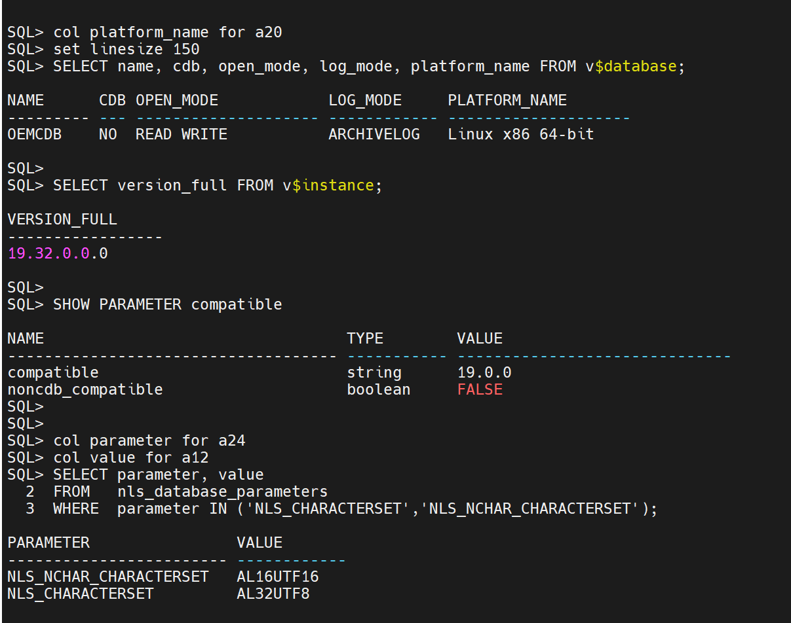
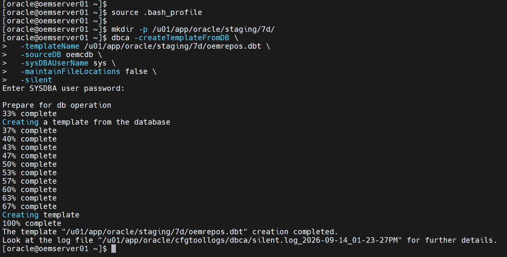
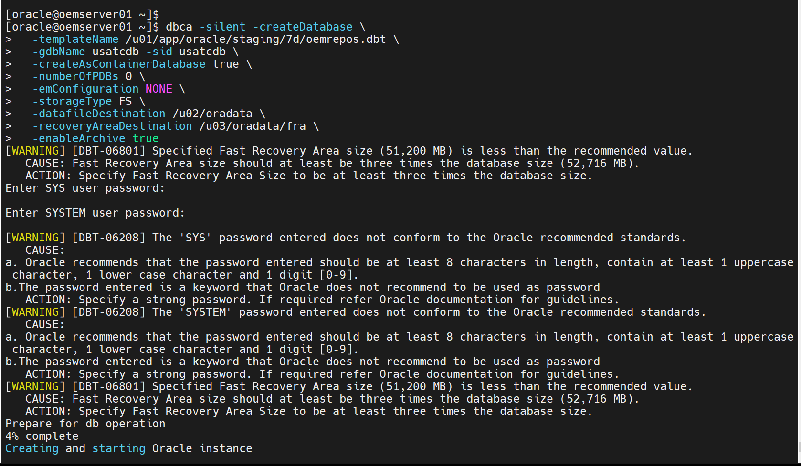
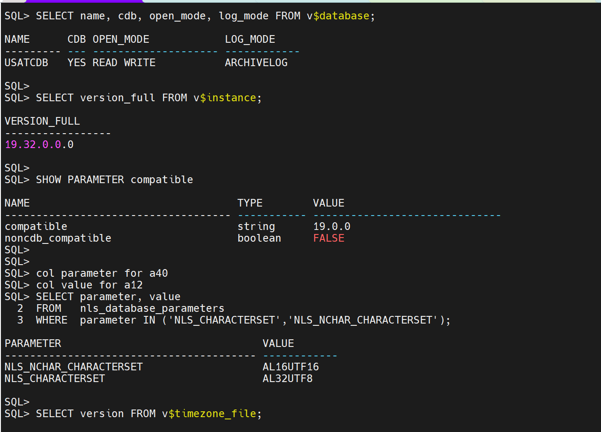
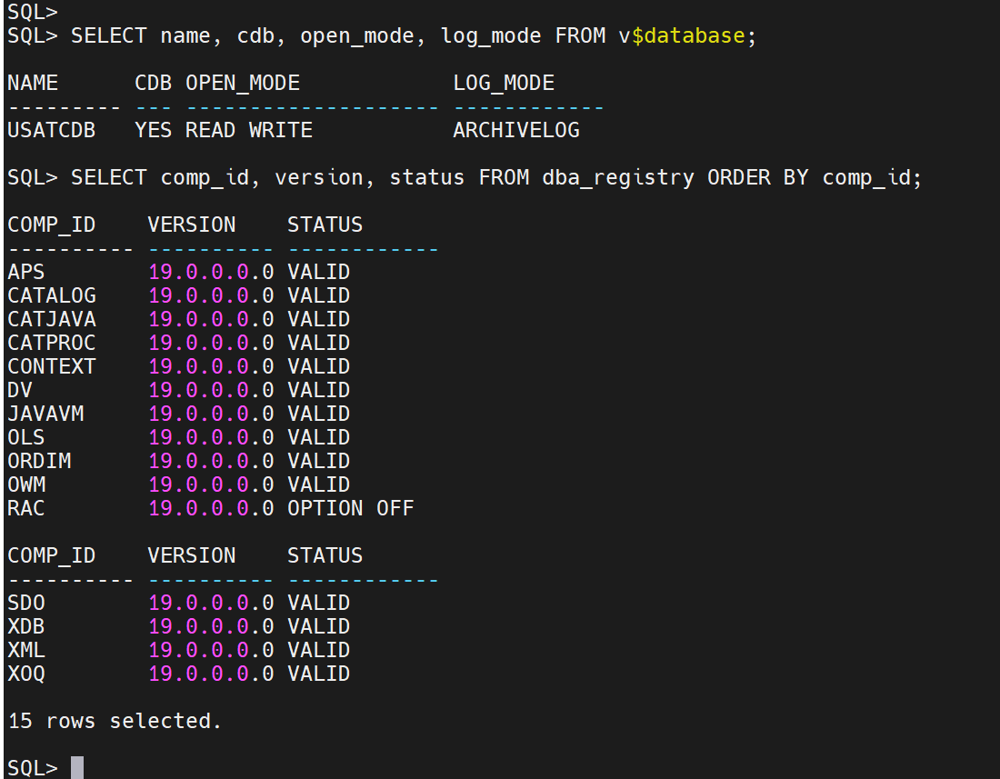
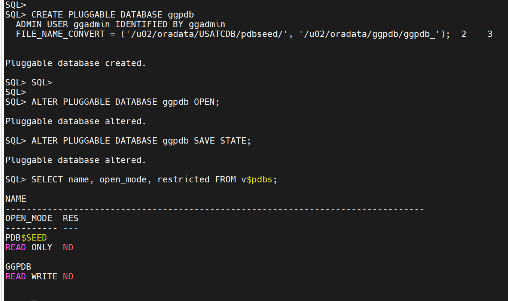

# Phase 7d Part 1: Pre-deployment

**Build the container beside the running repository, and prove it will accept it**

Part 1 of three. The index is
[`phase-7d-noncdb-to-pdb.md`](phase-7d-noncdb-to-pdb.md).
[Part 2](phase-7d-part2-deployment.md) runs the window.
[Part 3](phase-7d-part3-post-deployment.md) follows it.
Also indexed by skill area under
[Multitenant](../multitenant/README.md).

Status: 🟩 **Confirmed 2026-09-15.** All seven sections run. `usatcdb` and `ggpdb`
exist and match the source. The container was rebuilt once, for the reason in
[Appendix A](#8-appendix-a-the-template-does-not-carry-automatic-shared-memory-management).

[Part 2](phase-7d-part2-deployment.md) is the window and has not opened.

> ### Scope
>
> **No downtime.** Enterprise Manager stays up for the whole of this part. `usatcdb`
> is built alongside the running non-CDB and sits idle until
> [Part 2](phase-7d-part2-deployment.md).
>
> **No database backup.** `COPY` leaves `oemcdb` intact, so the fallback is to start
> the old database, fix the cause and rerun the window. See §6.

| # | Task | Status |
|---|---|---|
| 1 | Record the source state | 🟩 Confirmed |
| 2 | Clear the eight compatibility gates | 🟩 Confirmed |
| 3 | Size the target | 🟩 Confirmed |
| 4 | Create `usatcdb` | 🟩 Confirmed |
| 5 | Create `ggpdb` | 🟩 Confirmed |
| 6 | Capture the OMS configuration | 🟩 Confirmed |
| 7 | Prove a service name descriptor reaches the repository | 🟩 Confirmed |
| 8 | Appendix A: the template and Automatic Shared Memory Management | 🟩 Recorded 2026-09-14 |
| 9 | Appendix B: `COPY`, `NOCOPY` and `MOVE` | 🟩 Recorded |
| 10 | Screenshot checklist | 🟩 Six embedded |

```bash
export ORACLE_HOME=/u01/app/oracle/product/19.3.0/db_1
export ORACLE_SID=oemcdb
export PATH=$ORACLE_HOME/bin:$PATH
```

---

## Contents

1. [Record the source state](#1-record-the-source-state)
2. [Clear the compatibility gates](#2-clear-the-compatibility-gates)
3. [Size the target](#3-size-the-target)
4. [Create `usatcdb`](#4-create-usatcdb)
5. [Create `ggpdb`](#5-create-ggpdb)
6. [Capture the OMS configuration](#6-capture-the-oms-configuration)
7. [Prove a service name descriptor reaches the repository](#7-prove-a-service-name-descriptor-reaches-the-repository)
8. [Appendix A: The template does not carry Automatic Shared Memory Management](#8-appendix-a-the-template-does-not-carry-automatic-shared-memory-management)
9. [Appendix B: `COPY`, `NOCOPY` and `MOVE`](#9-appendix-b-copy-nocopy-and-move)
10. [Screenshot checklist](#10-screenshot-checklist)

---

## 1. Record the source state

Everything in Part 2 is compared against what is captured here. Keep the output.

**Who:** `oracle`
**Where:** `oemserver01`

### 1.1 Identity and release

```sql
SELECT name, cdb, open_mode, log_mode, platform_name FROM v$database;
SELECT version_full FROM v$instance;
SHOW PARAMETER compatible
```

Expected: `OEMCDB`, `CDB` = `NO`, `19.32.0.0.0`.

### 1.2 Character sets

```sql
SELECT parameter, value
FROM   nls_database_parameters
WHERE  parameter IN ('NLS_CHARACTERSET','NLS_NCHAR_CHARACTERSET');
```



Record both values exactly. §4.2's template carries them; §4.5 confirms they arrived.

### 1.3 Time zone file version

```sql
SELECT version FROM v$timezone_file;
```

### 1.4 Components, and invalid objects

Find any invalid objects and recompile them before the window. The source should go
into [Part 2 §3.1](phase-7d-part2-deployment.md#31-describe-the-non-cdb) clean.

```sql
SELECT owner, object_name, object_type
FROM   dba_invalid_objects
ORDER  BY owner, object_type, object_name;
```

```sql
SELECT comp_id, comp_name, version, status FROM dba_registry ORDER BY comp_id;
```

```
SQL> col comp_name for a40
SQL> col status for a12
SQL> col comp_id for a10
SQL> col version for a10

SQL> SELECT comp_id, comp_name, version, status FROM dba_registry ORDER BY comp_id;

COMP_ID    COMP_NAME                                VERSION    STATUS
---------- ---------------------------------------- ---------- ------------
APS        OLAP Analytic Workspace                  19.0.0.0.0 VALID
CATALOG    Oracle Database Catalog Views            19.0.0.0.0 VALID
CATJAVA    Oracle Database Java Packages            19.0.0.0.0 VALID
CATPROC    Oracle Database Packages and Types       19.0.0.0.0 VALID
CONTEXT    Oracle Text                              19.0.0.0.0 VALID
DV         Oracle Database Vault                    19.0.0.0.0 VALID
JAVAVM     JServer JAVA Virtual Machine             19.0.0.0.0 VALID
OLS        Oracle Label Security                    19.0.0.0.0 VALID
ORDIM      Oracle Multimedia                        19.0.0.0.0 VALID
OWM        Oracle Workspace Manager                 19.0.0.0.0 VALID
RAC        Oracle Real Application Clusters         19.0.0.0.0 OPTION OFF

COMP_ID    COMP_NAME                                VERSION    STATUS
---------- ---------------------------------------- ---------- ------------
SDO        Spatial                                  19.0.0.0.0 VALID
XDB        Oracle XML Database                      19.0.0.0.0 VALID
XML        Oracle XDK                               19.0.0.0.0 VALID
XOQ        Oracle OLAP API                          19.0.0.0.0 VALID

15 rows selected.

SQL>
```

Every component here must exist in `usatcdb`. §4.5 compares the two lists;
[Part 2 §4](phase-7d-part2-deployment.md#4-check-plug-compatibility) is the
authoritative check.

### 1.5 Datafiles, tempfiles and sizes

```sql
SELECT file_name, bytes/1024/1024 mb FROM dba_data_files ORDER BY file_name;
SELECT file_name, bytes/1024/1024 mb FROM dba_temp_files ORDER BY file_name;
SELECT SUM(bytes)/1024/1024/1024 total_gb FROM dba_data_files;
```

```
SQL>
SQL> col file_name for a60
SQL> SELECT file_name, bytes/1024/1024 mb FROM dba_data_files ORDER BY file_name;

FILE_NAME                                                            MB
------------------------------------------------------------ ----------
/u02/oradata/oemcdb/mgmt.dbf                                      10300
/u02/oradata/oemcdb/mgmt_deepdive.dbf                               200
/u02/oradata/oemcdb/mgmt_ecm_depot1.dbf                             260
/u02/oradata/oemcdb/oemcdb_sysaux01.dbf                            3020
/u02/oradata/oemcdb/oemcdb_system01.dbf                            2050
/u02/oradata/oemcdb/oemcdb_undotbs01.dbf                           3480
/u02/oradata/oemcdb/oemcdb_users01.dbf                                5

7 rows selected.

SQL>
SQL> SELECT file_name, bytes/1024/1024 mb FROM dba_temp_files ORDER BY file_name;

FILE_NAME                                                            MB
------------------------------------------------------------ ----------
/u02/oradata/oemcdb/oemcdb_temp01.dbf                             10346

SQL>
SQL> SELECT SUM(bytes)/1024/1024/1024 total_gb FROM dba_data_files;

  TOTAL_GB
----------
18.8623047

SQL>
```

Section 3 sizes the target from `total_gb`.


### 1.6 Encrypted tablespaces

```sql
SELECT tablespace_name, encrypted FROM dba_tablespaces WHERE encrypted = 'YES';
```

No rows is the expected result and is gate 7. TDE is Phase 5. If it arrives before
this phase runs, the keystore has to move with the PDB and this SOP needs a section
it does not currently have.

### 1.7 The current repository connect descriptor

**Who:** `oracle`
**Where:** `oemserver01`, from the 24ai home

```bash
source ~/.env/oms_env
emctl config oms -list_repos_details
```

```
[oracle@oemserver01 ~]$ source ~/.env/oms_env
[oracle@oemserver01 ~]$ emctl config oms -list_repos_details
Oracle Enterprise Manager 24ai Release 1
Copyright (c) 1996, 2024 Oracle Corporation.  All rights reserved.
Repository Connect Descriptor : (DESCRIPTION=(ADDRESS_LIST=(ADDRESS=(PROTOCOL=TCP)(HOST=oemserver01.usat.com)(PORT=1521)))(CONNECT_DATA=(SID=oemcdb)))
Repository User : SYSMAN
[oracle@oemserver01 ~]$
```
Record it verbatim. Part 2 §7 replaces it, and Part 2 §8's rollback restores it.

### 1.8 The emkey is not in the repository

```bash
emctl status emkey
```

Expected: *"The EMKey is configured properly."* with no *"but is not secure"*
qualifier, which is the state
[Phase 7c Part 2c §2](phase-7c-part2c-post-deployment.md#2-re-secure-the-emkey) left
it in.

The key lives in the OMS home, not in the repository, so it does not travel with the
data and needs no action here. Confirm rather than assume, because a key sitting in
the repository would move with the schema and change what Part 2 has to do.

### 1.9 Tables dependent on Oracle-maintained types

`noncdb_to_pdb.sql` refuses to run while the database holds unconverted data in
columns of evolved Oracle-maintained types. Advanced Queuing payload columns are the
usual case.

```sql
SELECT u.name AS owner, o.name AS table_name, c.name AS column_name
FROM   sys.obj$ o, sys.col$ c, sys.coltype$ t, sys.user$ u
WHERE  BITAND(t.flags, 256) = 256
AND    o.obj#  = t.obj#
AND    c.obj#  = t.obj#
AND    c.col#  = t.col#
AND    t.intcol# = c.intcol#
AND    o.owner# = u.user#
AND    o.owner# NOT IN
       (SELECT user# FROM sys.user$
        WHERE  type# = 1 AND BITAND(spare1, 256) = 256)
AND    t.obj# IN
       (SELECT DISTINCT d_obj#
        FROM   sys.dependency$
        START WITH p_obj# IN
               (SELECT obj# FROM sys.obj$
                WHERE  type# = 13 AND BITAND(flags, 4194304) = 4194304)
        CONNECT BY PRIOR d_obj# = p_obj#)
ORDER  BY 1, 2, 3;
```

No rows is the expected result. Rows mean the conversion has to run before §6 of
Part 2 will proceed:

```sql
@?/rdbms/admin/utluptabdata.sql
```

Running it here, on `oemcdb`, keeps the work out of the window, and issues
`ALTER TABLE ... UPGRADE` against live tables with the OMS up. Running it inside the
PDB instead, after Part 2 §5, is uncontended but extends the window. Size the tables
before choosing:

```sql
SELECT owner, segment_name, bytes/1024/1024 mb
FROM   dba_segments
WHERE  (owner, segment_name) IN (<the rows returned above>);
```

The query is held as [`sql/uptab_check.sql`](sql/uptab_check.sql), which also runs under
`catcon.pl` across every container of a CDB. See
[Part 2 Appendix A](phase-7d-part2-deployment.md#appendix-a-checking-every-container).

Measured on this estate: two rows, both Advanced Queuing payload columns. Recorded in
[Part 2 §6.1](phase-7d-part2-deployment.md#61-before-executing-noncdb_to_pdbsql-need-to-check-the-ora-01722-means-unconverted-type-data).

`BITAND(t.flags, 256) = 256` is `UPGRADED = NO`; `type# = 13` with
`BITAND(flags, 4194304)` selects Oracle-maintained types. Both come from the check
inside `noncdb_to_pdb.sql`.

---

## 2. Clear the compatibility gates

Eight gates, listed on the [index](phase-7d-noncdb-to-pdb.md#gates).

| # | Gate | Answered by | Enforced by |
|---|---|---|---|
| 1 | Release and patch level identical | §1.1, and by building `usatcdb` from the same Oracle home | `CHECK_PLUG_COMPATIBILITY` |
| 2 | Character set and national character set match | §1.2 and §4.2 | `CHECK_PLUG_COMPATIBILITY` |
| 3 | `COMPATIBLE` matches | §1.1 and §4.2 | `CHECK_PLUG_COMPATIBILITY` |
| 4 | Time zone file version matches | §1.3 | `CHECK_PLUG_COMPATIBILITY` |
| 5 | Components present | §1.4, then [Part 2 §4](phase-7d-part2-deployment.md#4-check-plug-compatibility) | `CHECK_PLUG_COMPATIBILITY` |
| 6 | Disk for a second copy of the datafiles | §3 | Nothing. `CREATE PLUGGABLE DATABASE` fails on a full filesystem |
| 7 | No encrypted tablespaces | §1.6 | `CHECK_PLUG_COMPATIBILITY` |
| 8 | No unconverted Oracle-maintained type data | §1.9 | **`noncdb_to_pdb.sql`**, in [Part 2 §6](phase-7d-part2-deployment.md#6-run-noncdb_to_pdbsql) |

**Gate 8 is enforced later than the rest.** `CHECK_PLUG_COMPATIBILITY` returns `YES`
with it outstanding, so §5 creates the PDB and §6 is where the run stops. Clearing it
here means the window does not discover it.

Gate 5 cannot be fully answered until the XML manifest exists, which happens inside
the window. §1.4 gives the component list to compare beforehand; the authoritative
check runs in Part 2 before anything is created.

---

## 3. Size the target

Datafiles land on `/u02`, the fast recovery area on `/u03`.

| Consumer | Mount | Size |
|---|---|---|
| `usatcdb` container: `CDB$ROOT` and `PDB$SEED` | `/u02` | Roughly 6 GB |
| `oempdb` datafiles | `/u02` | A second copy of §1.5's `total_gb`, 18.9 GB here, because Part 2 uses `COPY` |
| `ggpdb` | `/u02` | Roughly 1 GB, seeded from `PDB$SEED` |
| Fast recovery area | `/u03` | `dbca` warns below three times the database size |

```bash
df -h /u02 /u03
```

```
[oracle@oemserver01 ~]$ df -h /u02 /u03
Filesystem      Size  Used Avail Use% Mounted on
/dev/sdd1       100G   31G   70G  31% /u02
/dev/sde1       100G   47G   54G  47% /u03
[oracle@oemserver01 ~]$
```

70 GB free on `/u02` against 18.9 GB required for the copy. Gate 6 clears.

**This phase uses `COPY`.** `CREATE PLUGGABLE DATABASE ... USING` reads the source
datafiles and writes new ones, leaving `oemcdb`'s files untouched. That is why the
table budgets for a second copy, and why the fallback in
[Part 2 §8](phase-7d-part2-deployment.md#8-rollback) is a `STARTUP`.

`NOCOPY` and `MOVE` are not used here. If `/u02` cannot hold the second copy, add
space rather than changing clause.
[Appendix B](#9-appendix-b-copy-nocopy-and-move) records what each does.

---

## 4. Create `usatcdb`

**Who:** `oracle`
**Where:** `oemserver01`

### 4.1 Before you start

The new container runs on the same host, the same Oracle home and the same listener
as `oemcdb`. Both databases are up at the same time from here until
[Part 2 §3](phase-7d-part2-deployment.md#3-shut-the-source-down), so the host carries
two instances for the duration.

### 4.2 Capture a template from the existing repository

**Do not build the container from `General_Purpose.dbc`.** An Enterprise Manager
repository carries specific memory parameters, redo log sizing and hidden parameters,
and a stock template reproduces none of them. Build the template from the database
that already satisfies those requirements.

```bash
mkdir -p /u01/app/oracle/staging/7d/
dbca -createTemplateFromDB \
  -templateName /u01/app/oracle/staging/7d/oemrepos.dbt \
  -sourceDB oemcdb \
  -sysDBAUserName sys \
  -maintainFileLocations false \
  -silent
```



The template carries the character set and national character set, which closes gate 2
by construction. It does not carry the memory model; see §4.3.

### 4.3 Create the container from that template

**Pass the memory model explicitly with `-initParams`.** The template does not carry
Automatic Shared Memory Management. Without it the container is created with a fixed
4 MB java pool, `initjvm` aborts below its own minimum, and `JAVAVM`, `CATJAVA` and
`ORDIM` never complete in either `CDB$ROOT` or `PDB$SEED`. That breaks gate 5 and is
not repairable in place at reasonable cost. Recorded in
[Appendix A](#8-appendix-a-the-template-does-not-carry-automatic-shared-memory-management).

```bash
dbca -silent -createDatabase \
  -templateName /u01/app/oracle/staging/7d/oemrepos.dbt \
  -gdbName usatcdb -sid usatcdb \
  -createAsContainerDatabase true \
  -numberOfPDBs 0 \
  -emConfiguration NONE \
  -storageType FS \
  -datafileDestination /u02/oradata \
  -recoveryAreaDestination /u03/oradata/fra \
  -enableArchive true \
  -initParams sga_target=10G,java_pool_size=256M
```


`-initParams` overrides the template. `sga_target` enables Automatic Shared Memory
Management, which is what `oemcdb` runs and what the template drops.

`java_pool_size` under ASMM is a **minimum, not a maximum**. Oracle grows the pool
above it on demand and will not go below it. 256M clears `initjvm`'s 12,000,000 byte
pre-check.

Both databases are up from here until
[Part 2 §3](phase-7d-part2-deployment.md#3-shut-the-source-down), so confirm the host
has room for a second SGA of that size before running this:

```bash
free -g
```

`-numberOfPDBs 0` is intentional. `oempdb` arrives by plug-in and `ggpdb` is created
in §5; neither should be created by `dbca`.

`-emConfiguration NONE` keeps `dbca` from configuring Database Express against a
database that Enterprise Manager will monitor through its own agent.

`-storageType FS` reflects that this host has no Grid Infrastructure and therefore no
ASM.

Passwords are prompted for rather than passed on the command line, where they would
land in the process table.

**The run below predates `-initParams`** and is the one
[Appendix A](#8-appendix-a-the-template-does-not-carry-automatic-shared-memory-management)
examines. It reports `100% complete` and `Database creation complete`, which is why
the component failure has to be caught by §4.5 rather than by watching this output.


```
[oracle@oemserver01 ~]$ dbca -silent -createDatabase \
>   -templateName /u01/app/oracle/staging/7d/oemrepos.dbt \
>   -gdbName usatcdb -sid usatcdb \
>   -createAsContainerDatabase true \
>   -numberOfPDBs 0 \
>   -emConfiguration NONE \
>   -storageType FS \
>   -datafileDestination /u02/oradata \
>   -recoveryAreaDestination /u03/oradata/fra \
>   -enableArchive true
[WARNING] [DBT-06801] Specified Fast Recovery Area size (51,200 MB) is less than the recommended value.
   CAUSE: Fast Recovery Area size should at least be three times the database size (52,716 MB).
   ACTION: Specify Fast Recovery Area Size to be at least three times the database size.
Enter SYS user password:

Enter SYSTEM user password:

[WARNING] [DBT-06208] The 'SYS' password entered does not conform to the Oracle recommended standards.
   CAUSE:
a. Oracle recommends that the password entered should be at least 8 characters in length, contain at least 1 uppercase character, 1 lower case character and 1 digit [0-9].
b.The password entered is a keyword that Oracle does not recommend to be used as password
   ACTION: Specify a strong password. If required refer Oracle documentation for guidelines.
[WARNING] [DBT-06208] The 'SYSTEM' password entered does not conform to the Oracle recommended standards.
   CAUSE:
a. Oracle recommends that the password entered should be at least 8 characters in length, contain at least 1 uppercase character, 1 lower case character and 1 digit [0-9].
b.The password entered is a keyword that Oracle does not recommend to be used as password
   ACTION: Specify a strong password. If required refer Oracle documentation for guidelines.
[WARNING] [DBT-06801] Specified Fast Recovery Area size (51,200 MB) is less than the recommended value.
   CAUSE: Fast Recovery Area size should at least be three times the database size (52,716 MB).
   ACTION: Specify Fast Recovery Area Size to be at least three times the database size.
Prepare for db operation
4% complete
Creating and starting Oracle instance
--
--
--
--
Oracle Database Vault
79% complete
Creating cluster database views
86% complete
Completing Database Creation
88% complete
89% complete
Executing Post Configuration Actions
100% complete
Database creation complete. For details check the logfiles at:
 /u01/app/oracle/cfgtoollogs/dbca/usatcdb.
Database Information:
Global Database Name:usatcdb
System Identifier(SID):usatcdb
Look at the log file "/u01/app/oracle/cfgtoollogs/dbca/usatcdb/usatcdb.log" for further details.
You have new mail in /var/spool/mail/oracle
[oracle@oemserver01 ~]$

```



### 4.4 Drop the repository tablespaces from the container

A template taken from the repository recreates its tablespaces in `CDB$ROOT`:
`MGMT_TABLESPACE`, `MGMT_ECM_DEPOT_TS` and `MGMT_AD4J_TS`. The container has no use
for them, and the real ones arrive inside `oempdb` with the plug-in.

```bash
export ORACLE_HOME=/u01/app/oracle/product/19.3.0/db_1
export ORACLE_SID=usatcdb
export PATH=$ORACLE_HOME/bin:$PATH
```
```sql
-- connect to usatcdb as sysdba
SELECT tablespace_name FROM dba_tablespaces
WHERE  tablespace_name LIKE 'MGMT%';

DROP TABLESPACE MGMT_AD4J_TS INCLUDING CONTENTS AND DATAFILES;
DROP TABLESPACE MGMT_ECM_DEPOT_TS INCLUDING CONTENTS AND DATAFILES;
DROP TABLESPACE MGMT_TABLESPACE INCLUDING CONTENTS AND DATAFILES;
```

```
[oracle@oemserver01 ~]$ export ORACLE_SID=usatcdb
[oracle@oemserver01 ~]$ ss

SQL*Plus: Release 19.0.0.0.0 - Production on Mon Sep 14 16:52:40 2026
Version 19.32.0.0.0

Copyright (c) 1982, 2026, Oracle.  All rights reserved.


Connected to:
Oracle Database 19c Enterprise Edition Release 19.0.0.0.0 - Production
Version 19.32.0.0.0

SQL> SELECT tablespace_name FROM dba_tablespaces
  2  WHERE  tablespace_name LIKE 'MGMT%';

TABLESPACE_NAME
------------------------------
MGMT_AD4J_TS
MGMT_ECM_DEPOT_TS
MGMT_TABLESPACE

SQL>
SQL> DROP TABLESPACE MGMT_AD4J_TS INCLUDING CONTENTS AND DATAFILES;

Tablespace dropped.

SQL> DROP TABLESPACE MGMT_ECM_DEPOT_TS INCLUDING CONTENTS AND DATAFILES;

Tablespace dropped.

SQL> DROP TABLESPACE MGMT_TABLESPACE INCLUDING CONTENTS AND DATAFILES;

Tablespace dropped.

SQL>
```

Editing the three `DatafileAttributes` and `Tablespace` entries out of the template
before §4.3 avoids creating them at all.

### 4.5 Confirm it matches the source

```sql
-- connect to usatcdb
SELECT name, cdb, open_mode, log_mode FROM v$database;
SELECT version_full FROM v$instance;
SHOW PARAMETER compatible
SELECT parameter, value
FROM   nls_database_parameters
WHERE  parameter IN ('NLS_CHARACTERSET','NLS_NCHAR_CHARACTERSET');
```



```
SELECT version FROM v$timezone_file;
col comp_name for a40
col status for a12
col comp_id for a10
col version for a10
SELECT comp_id, version, status FROM dba_registry ORDER BY comp_id;
```



Compare every line against §1. `CDB` must read `YES` here and `NO` in §1.1, and
`dba_registry` must list the same 15 components, all `VALID` except `RAC`, which reads
`OPTION OFF` on a single instance.

### 4.6 Register it with the listener

```bash
lsnrctl status
```

Both `oemcdb` and `usatcdb` should be registered. Static entries are not required;
PMON registers both against the default listener on 1521.

---

## 5. Create `ggpdb`

An empty pluggable database for GoldenGate, seeded from `PDB$SEED`. It is created
now because the container is being built anyway. GoldenGate itself is Phase 4.

```sql
-- connect to usatcdb as sysdba
CREATE PLUGGABLE DATABASE ggpdb
  ADMIN USER ggadmin IDENTIFIED BY ggadmin
  FILE_NAME_CONVERT = ('/u02/oradata/USATCDB/pdbseed/', '/u02/oradata/USATCDB/ggpdb/ggpdb_');

ALTER PLUGGABLE DATABASE ggpdb OPEN;
ALTER PLUGGABLE DATABASE ggpdb SAVE STATE;
```

`SAVE STATE` is what reopens it after a container restart. Without it the PDB comes
back `MOUNTED` and stays there.

```sql
SELECT name, open_mode, restricted FROM v$pdbs;
```

Expected: `PDB$SEED` read only, `GGPDB` read write.



Confirm the files landed where the convert intended:

```sql
SELECT name FROM v$datafile WHERE con_id =
  (SELECT con_id FROM v$pdbs WHERE name = 'GGPDB');
```

Expected prefix: `/u02/oradata/USATCDB/ggpdb/ggpdb_`. The target pattern ends in
`ggpdb_` with no trailing slash, so the seed's base names are appended to it.

`ENABLE_GOLDENGATE_REPLICATION` and supplemental logging are set in Phase 4, against a
known GoldenGate configuration.

---

## 6. Capture the OMS configuration

**No database backup is taken for this phase.** `COPY` leaves `oemcdb` intact, so the
fallback is to start the old database, fix the cause and rerun the window. That is
[Part 2 §8](phase-7d-part2-deployment.md#8-rollback).

The OMS side is worth capturing, because
[Part 2 §7](phase-7d-part2-deployment.md#7-repoint-the-oms) replaces the connect
descriptor recorded in §1.7.

```bash
source ~/.env/oms_env
emctl exportconfig oms -dir /u01/app/oracle/staging/7d
```

---

## 7. Prove a service name descriptor reaches the repository

The descriptor in §1.7 names `oemcdb` as a **SID**. A PDB has no SID, so
[Part 2 §7](phase-7d-part2-deployment.md#7-repoint-the-oms) replaces it with a
`SERVICE_NAME` form. This section tests that form against the source.

**Nothing is stored here.** `emctl config oms -store_repos_details` requires an OMS
restart, and this part costs no downtime. The descriptor is written once, in the
window. A non-CDB registers a default service matching its name, which is what makes
the test possible in advance.

```bash
lsnrctl status | grep -i oemcdb
```

```bash
sqlplus sysman@'(DESCRIPTION=(ADDRESS=(PROTOCOL=TCP)(HOST=oemserver01.usat.com)(PORT=1521))(CONNECT_DATA=(SERVICE_NAME=oemcdb)))'
```

A successful login confirms the listener resolves a service name on this host and
port, that `SYSMAN` authenticates through it, and that the descriptor syntax is well
formed.

```bash
emctl config oms -list_repos_details
```

```
[oracle@oemserver01 7d]$ emctl config oms -list_repos_details
Oracle Enterprise Manager 24ai Release 1
Copyright (c) 1996, 2024 Oracle Corporation.  All rights reserved.
Repository Connect Descriptor : (DESCRIPTION=(ADDRESS_LIST=(ADDRESS=(PROTOCOL=TCP)(HOST=oemserver01.usat.com)(PORT=1521)))(CONNECT_DATA=(SID=oemcdb)))
Repository User : SYSMAN
[oracle@oemserver01 7d]$
```

`store_repos_details` itself is not exercised until Part 2 §7. Failures specific to
that command, in the credential store or the Administration Server, surface there.

---

## 8. Appendix A: The template does not carry Automatic Shared Memory Management

Measured on this estate, 2026-09-14. The first `usatcdb` was created from the §4.2
template without `-initParams` and reported success.

### A.1 What the registry showed

```sql
SELECT comp_id, version, status FROM dba_registry ORDER BY comp_id;
```

| Component | `oemcdb` | First `usatcdb` |
|---|---|---|
| `JAVAVM` | 19.0.0.0.0 VALID | no row |
| `CATJAVA` | 19.0.0.0.0 VALID | null version, `INVALID` |
| `ORDIM` | 19.0.0.0.0 VALID | null version, `LOADING` |

Fifteen components against fourteen.

**A null version is the signal.** A component that installed and later broke keeps its
version. Null means the row was created and the load never finished. `JAVAVM` has no
row at all, which places the failure there: `CATJAVA` and `ORDIM` both sit downstream
of it and neither can complete without it.

`cdb_registry` returned nothing for `CON_ID 2`, so `PDB$SEED` received none of the
three either.

### A.2 What failed

`$ORACLE_BASE/cfgtoollogs/dbca/usatcdb/initjvm0.log`:

```
### Aborting because available java pool, 4194304, is less than 12000000 .
BEGIN initjvmaux.check_sizes_for_cjs; END;
ORA-29554: unhandled Java out of memory condition
ORA-06512: at "SYS.INITJVMAUX", line 230
```

`initjvm` runs a size pre-check and needs at least 12,000,000 bytes of java pool. It
found 4,194,304 and stopped before registering the component.

`iminst0.log` then reports the consequence:

```
ORA-20000: JServer JAVA Virtual Machine component not found.
```

### A.3 Why the java pool was 4 MB

| Parameter | `oemcdb` | First `usatcdb` |
|---|---|---|
| `sga_target` | 6G | **0** |
| `java_pool_size` | 0 | **4M** |
| `shared_pool_size` | 768M | 768M |

The source runs Automatic Shared Memory Management: `sga_target` set and
`java_pool_size` at 0 means Oracle sizes the java pool and grows it on demand. Four
megabytes was never a ceiling there.

`dbca -createTemplateFromDB` captured the component pool **allocations** rather than
the automatic management that produced them. It set `sga_target` to 0, turning ASMM
off, and pinned `java_pool_size` at whatever was allocated at capture time.
`shared_pool_size` matches only because the source sets it explicitly.

The template itself is correct on options:

```
<option name="JSERVER" value="true" includeInPDBs="true"/>
<option name="IMEDIA"  value="true" includeInPDBs="true"/>
```

And the scripts ran. `initjvm0.log`, `xmlja0.log`, `catjava0.log`, `catxdbj0.log`,
`iminst0.log` and `JServer.log` all exist. This is a runtime failure, not a skipped
step.

### A.4 Why the container was recreated rather than repaired

Repairing in place requires `initjvm.sql`, `initxml.sql`, `xmlja.sql`, `catjava.sql`
and `catxdbj.sql` through `catcon.pl` into `CDB$ROOT` **and** `PDB$SEED`, with the
seed opened read write to receive them, followed by the Multimedia scripts. The
`initjvm_catcon_*.lst` file confirms `dbca` only targeted the root:

```
catcon::catconExec_int - will run all scripts/statements against the Root (Container CDB$ROOT) of a CDB
```

At this point in the phase the container is empty, nothing is plugged into it and
`ggpdb` does not exist, so `dbca` with `-initParams` is fewer steps and leaves no
half-loaded component behind.

### A.5 Two things this run also showed

**`dbca` reports success.** The output ends `100% complete` and
`Database creation complete`. The component failure surfaces only in `dba_registry`,
which is what §4.5 compares.

**`utlrp` ran for 24 minutes**, from `catfinal0.log` at 16:14 to `utlrp0.log` at
16:38, which is consistent with a large set of objects left invalid by the failed
Java install.

---

## 9. Appendix B: `COPY`, `NOCOPY` and `MOVE`

`CREATE PLUGGABLE DATABASE ... USING` takes one of three clauses. This phase uses
`COPY`. The other two are recorded here because the choice decides what rollback
means, and that is not obvious from the syntax.

| Clause | Source datafiles | Rollback for a failed plug-in | Disk needed |
|---|---|---|---|
| **`COPY`** | Read, not modified. Still there afterwards | `STARTUP` the source | A second full copy |
| `NOCOPY` | Adopted in place. They become the PDB's files | RMAN restore. The source no longer has datafiles | None |
| `MOVE` | Relocated to the target path | RMAN restore | None beyond the destination |

**`NOCOPY` is faster and costs the fallback.** The instant it succeeds, `oemcdb` has
no datafiles of its own, so `STARTUP` fails and the only way back is an RMAN restore.
On a large repository the time saved is real; on this estate the source is small
enough that the copy is cheaper than the risk.

**`MOVE` has the same consequence** and is aimed at relocating storage during the
plug-in rather than at conserving space.

Either choice invalidates this SOP as written, in three places:

- §3's sizing table no longer needs a second copy
- This SOP takes **no database backup**, because `COPY` makes the source its own
  fallback. `NOCOPY` and `MOVE` remove that, so a backup step has to be added before
  the window and it becomes the only route back
- [Part 2 §8](phase-7d-part2-deployment.md#8-rollback) is wrong throughout: it says to
  start the old database, which only holds under `COPY`

---

## 10. Screenshot checklist

All files go in [`screenshots/7d/`](screenshots/7d/), embedded as
`screenshots/7d/<file>`. See the
[index](phase-7d-noncdb-to-pdb.md#screenshots) for why this phase uses a
subdirectory.

Six images, all embedded above.

| File | Section | Shows |
|---|---|---|
| `7d1-01-source-state.png` | 1.2 | Source character sets, version and time zone file version |
| `7d1-04.2-Capture_template_repository.png` | 4.2 | `dbca -createTemplateFromDB` capturing `oemrepos.dbt` |
| `7d1-04.3_Create_container_template.png` | 4.3 | `dbca -createDatabase` completing |
| `7d1-04.5-Confirm_matches_source1.png` | 4.5 | `usatcdb` identity, `compatible` and character sets |
| `7d1-04.5-Confirm_matches_source2.png` | 4.5 | `usatcdb` time zone file version and `dba_registry` |
| `7d1-05-Create_ggpdb.png` | 5 | `ggpdb` created, opened and saved |

Sections 6 and 7 are covered by the command output quoted in place: `emctl
exportconfig oms` in §6, and `emctl config oms -list_repos_details` in §7.

Every file carries the `7d1-` prefix, so Part 1's images cannot collide with Part 2's
`7d2-` series. That is the collision the
[7c index](phase-7c-oms-upgrade.md#screenshots) records for Phase 7b.

---

Continue to **[Part 2: Deployment](phase-7d-part2-deployment.md)**.
Back to the **[index](phase-7d-noncdb-to-pdb.md)**.
