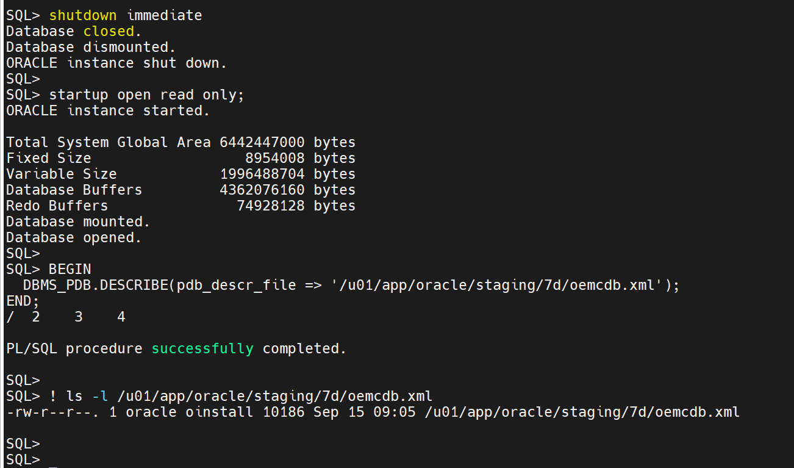
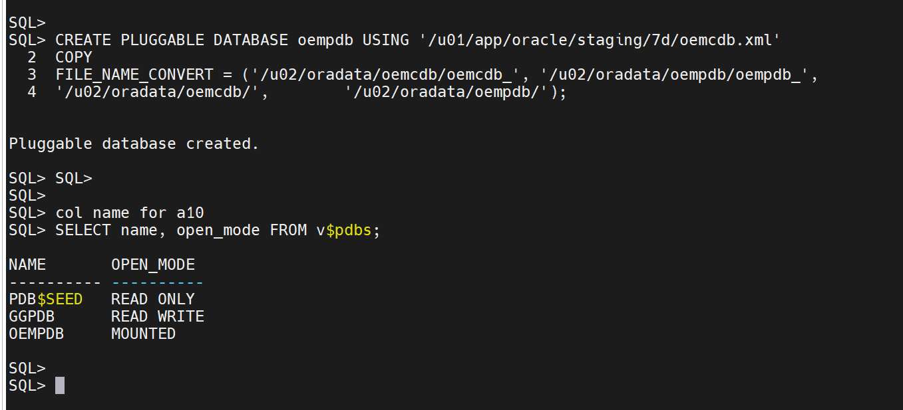
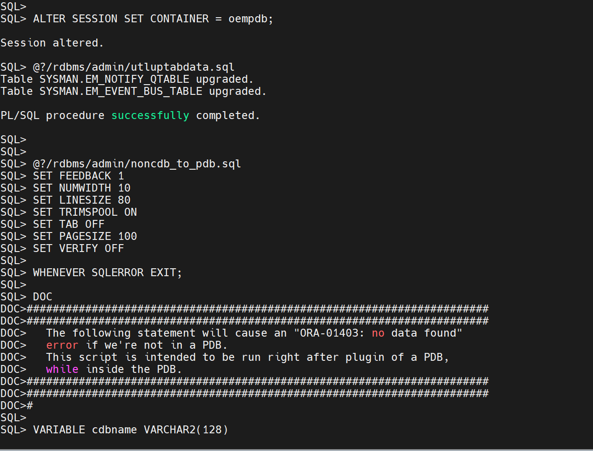
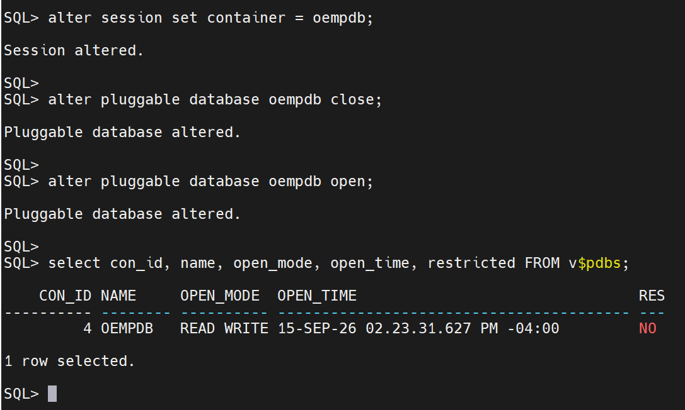
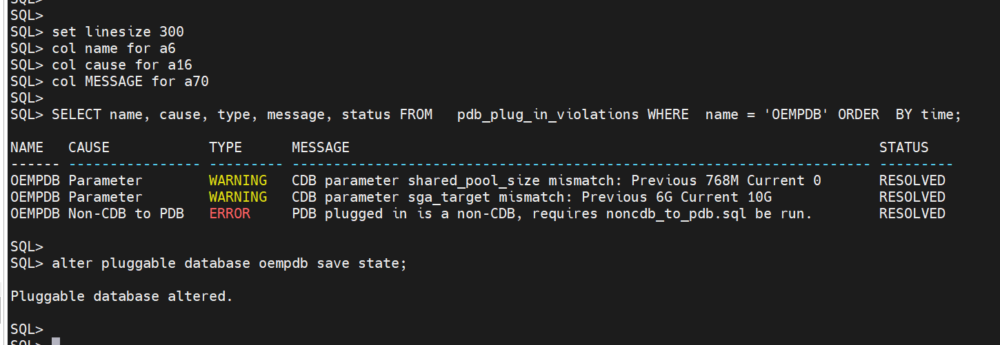
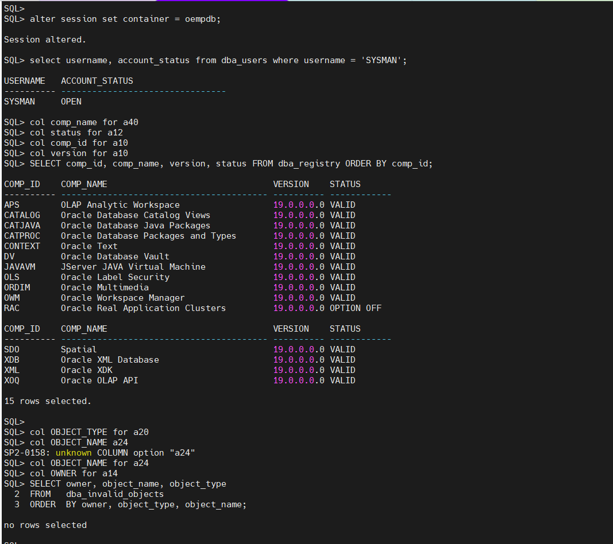
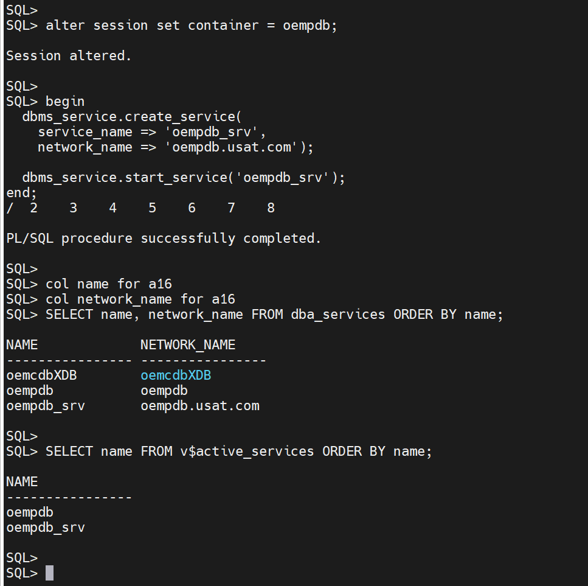
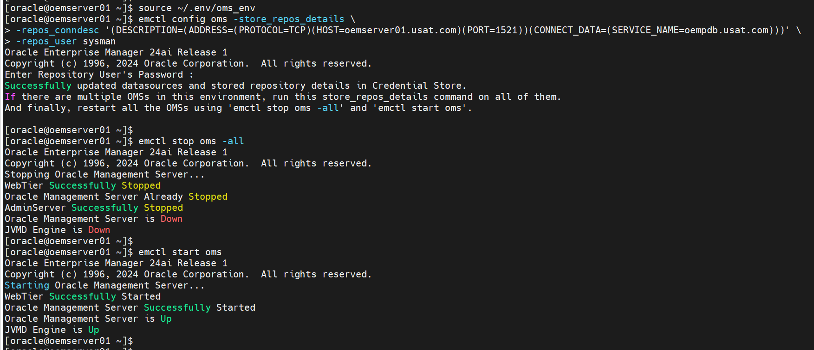
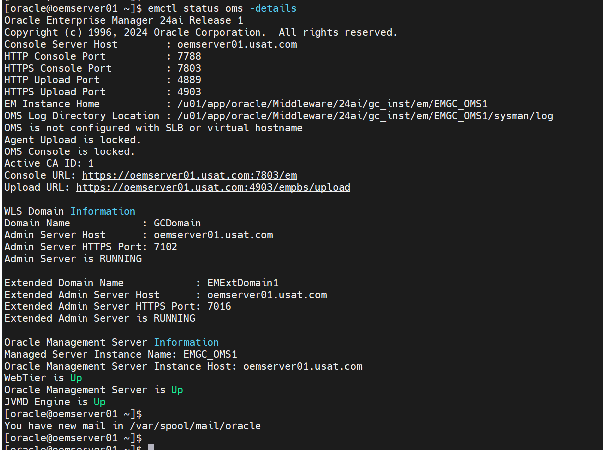
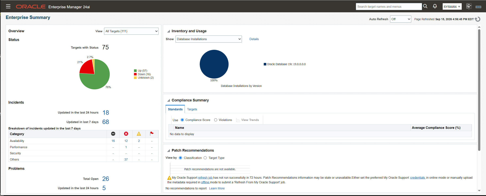

# Phase 7d Part 2: Deployment

**The window. Enterprise Manager is down from section 2 until section 7 completes**

Part 2 of three. [Part 1](phase-7d-part1-pre-deployment.md) built `usatcdb` and
`ggpdb` beside the running repository. The index is
[`phase-7d-noncdb-to-pdb.md`](phase-7d-noncdb-to-pdb.md).
[Part 3](phase-7d-part3-post-deployment.md) follows.
Also indexed by skill area under
[Multitenant](../multitenant/README.md).

Status: 🟩 **Confirmed 2026-09-15.** The repository runs as `oempdb` inside `usatcdb`
and the console is served from it. Part 3 follows.

> ### The window, in one line
>
> Stop the OMS → open `oemcdb` read only → `DBMS_PDB.DESCRIBE` → shut it down →
> `CREATE PLUGGABLE DATABASE ... COPY` → `noncdb_to_pdb.sql` → open and `SAVE STATE`
> → create the service → repoint the OMS.
>
> **The one that bites:** `noncdb_to_pdb.sql` stops with `ORA-01722` if any table
> holds unconverted Oracle-maintained type data. It did here.
> [§6.1](#61-before-executing-noncdb_to_pdbsql-need-to-check-the-ora-01722-means-unconverted-type-data)
> is the fix.

| # | Task | Status |
|---|---|---|
| 1 | Before you stop anything | 🟨 Blackout not created |
| 2 | Stop the stack | 🟩 Confirmed 2026-09-15 |
| 3 | Shut the source down | 🟩 Confirmed 2026-09-15 |
| 4 | Check plug compatibility | 🟩 Confirmed 2026-09-15 |
| 5 | Create `oempdb` with COPY option | 🟩 Confirmed 2026-09-15 |
| 6 | Run `noncdb_to_pdb.sql` | 🟩 Confirmed 2026-09-15 |
| 7 | Repoint the OMS | 🟩 Confirmed 2026-09-15 |
| 8 | Rollback | Not needed |
| 9 | Screenshot checklist | 🟨 10 of 12 |
| | Appendices A, B and C | 🟩 Recorded 2026-09-15 |

```bash
export ORACLE_HOME=/u01/app/oracle/product/19.3.0/db_1
export PATH=$ORACLE_HOME/bin:$PATH
```

---

## Contents

1. [Before you stop anything](#1-before-you-stop-anything)
2. [Stop the stack](#2-stop-the-stack)
3. [Shut the source down](#3-shut-the-source-down)
4. [Check plug compatibility](#4-check-plug-compatibility)
5. [Create `oempdb` with COPY option](#5-create-oempdb-with-copy-option)
6. [Run `noncdb_to_pdb.sql`](#6-run-noncdb_to_pdbsql)
7. [Repoint the OMS](#7-repoint-the-oms)
8. [Rollback](#8-rollback)
9. [Screenshot checklist](#9-screenshot-checklist)

[Appendix A: Checking every container](#appendix-a-checking-every-container) ·
[Appendix B: Service names and `tnsnames.ora`](#appendix-b-service-names-and-tnsnamesora) ·
[Appendix C: Notes](#appendix-c-notes)

---

## 1. Before you stop anything

### 1.1 Create the blackout

Every target in the estate is about to go unreachable, because the OMS that monitors
them is going down with its repository. Create the blackout **before** stopping the
OMS, so the suppression is already recorded when it comes back.

Through the console, following
**[Creating a Blackout in Enterprise Manager](oem-create-blackout.md)**, with
**Enable Full blackout on all hosts** selected.

### 1.2 Record the target count

```bash
source ~/.env/oms_env
emcli login -username=sysman
emcli get_targets | wc -l
```

[Part 3](phase-7d-part3-post-deployment.md) compares against this number. Phase 7c
recorded 203 before its window.

### 1.3 Confirm Part 1 is complete

| Check | Expected |
|---|---|
| `usatcdb` exists and is open | [Part 1 §4.5](phase-7d-part1-pre-deployment.md#45-confirm-it-matches-the-source) |
| Character set matches the source | [Part 1 §4.5](phase-7d-part1-pre-deployment.md#45-confirm-it-matches-the-source) |
| `ggpdb` open and `SAVE STATE` set | [Part 1 §5](phase-7d-part1-pre-deployment.md#5-create-ggpdb) |
| OMS configuration exported | [Part 1 §6](phase-7d-part1-pre-deployment.md#6-capture-the-oms-configuration) |
| Free space for the second copy | [Part 1 §3](phase-7d-part1-pre-deployment.md#3-size-the-target) |
| Service name descriptor proven against the source | [Part 1 §7](phase-7d-part1-pre-deployment.md#7-prove-a-service-name-descriptor-reaches-the-repository) |

---

## 2. Stop the stack

**Who:** `oracle`
**Where:** `oemserver01`

```bash
source ~/.env/oms_env
emctl stop oms
emctl status oms
```

> ### Use `emctl stop oms`, not `emctl stop oms -all`
>
> The Administration Server has to stay up for §7. `emctl config oms -help` documents
> the sequence:
>
> ```
> Note: Steps in changing repository details are:
>          1) Stop all the OMSs using 'emctl stop oms'
>          2) Run 'emctl config oms -store_repos_details' on each of the OMSs
>          3) Stop all the OMSs completely using 'emctl stop oms -all'
>          4) Start all of the OMSs using 'emctl start oms'
> ```
>
> If it has stopped by the time §7 runs, start it on its own:
> `emctl start oms -admin_only`.

Then the central agent, from the agent instance home rather than the Oracle home:

```bash
source ~/.env/agent_env
emctl stop agent
emctl status agent
```

---

## 3. Shut the source down

The manifest has to be written from a read only mount, and the datafiles have to be
closed before they can be adopted.

```sql
-- connect to oemcdb as sysdba
SHUTDOWN IMMEDIATE;
STARTUP OPEN READ ONLY;
SELECT name, open_mode FROM v$database;
```

Expected `OPEN_MODE`: `READ ONLY`.

### 3.1 Describe the non-CDB

```sql
BEGIN
  DBMS_PDB.DESCRIBE(pdb_descr_file => '/u01/app/oracle/staging/7d/oemcdb.xml');
END;
/
```

```bash
ls -l /u01/app/oracle/staging/7d/oemcdb.xml
```



The file lists every datafile by path. It is the input to §4 and §5 and it is only
valid for this exact set of files; regenerate it if anything changes.

### 3.2 Shut it down

```sql
SHUTDOWN IMMEDIATE;
```

The source stays down for the rest of the window. Section 8's rollback starts by
bringing it back up.

---

## 4. Check plug compatibility

This is gate 5 from the [index](phase-7d-noncdb-to-pdb.md#gates), and it is the one
that could not be answered before the manifest existed.

```
export ORACLE_HOME=/u01/app/oracle/product/19.3.0/db_1
export PATH=$ORACLE_HOME/bin:$PATH
export ORACLE_SID=usatcdb
```

```sql
-- connect to usatcdb as sysdba
SET SERVEROUTPUT ON
DECLARE
  compatible BOOLEAN;
BEGIN
  compatible := DBMS_PDB.CHECK_PLUG_COMPATIBILITY(
                  pdb_descr_file => '/u01/app/oracle/staging/7d/oemcdb.xml',
                  pdb_name       => 'OEMPDB');
  IF compatible THEN
    DBMS_OUTPUT.PUT_LINE('YES');
  ELSE
    DBMS_OUTPUT.PUT_LINE('NO');
  END IF;
END;
/
```
```
SQL> SELECT name, cdb, open_mode, log_mode FROM v$database;

NAME      CDB OPEN_MODE            LOG_MODE
--------- --- -------------------- ------------
USATCDB   YES READ WRITE           ARCHIVELOG

SQL>
SQL> SET SERVEROUTPUT ON
SQL> DECLARE
  2  compatible BOOLEAN;
  3  BEGIN
  4  compatible := DBMS_PDB.CHECK_PLUG_COMPATIBILITY(
  5  pdb_descr_file => '/u01/app/oracle/staging/7d/oemcdb.xml',
  6  pdb_name       => 'OEMPDB');
  7  IF compatible THEN
  8  DBMS_OUTPUT.PUT_LINE('YES');
  9  ELSE
 10  DBMS_OUTPUT.PUT_LINE('NO');
 11  END IF;
 12  END;
 13  /
YES
```

`NO` means stop. The reasons are in `PDB_PLUG_IN_VIOLATIONS`:

```sql
SELECT name, cause, type, message, status
FROM   pdb_plug_in_violations
WHERE  name = 'OEMPDB'
ORDER  BY time;
```

```
SQL> col name for a6
SQL> col cause for a16
SQL> col MESSAGE for a70
SQL> SELECT name, cause, type, message, status FROM pdb_plug_in_violations WHERE name = 'OEMPDB' ORDER  BY time;

NAME   CAUSE            TYPE      MESSAGE                                                                STATUS
------ ---------------- --------- ---------------------------------------------------------------------- ---------
OEMPDB Non-CDB to PDB   WARNING   PDB plugged in is a non-CDB, requires noncdb_to_pdb.sql be run.        PENDING
OEMPDB Parameter        WARNING   CDB parameter shared_pool_size mismatch: Previous 768M Current 0       PENDING
OEMPDB Parameter        WARNING   CDB parameter sga_target mismatch: Previous 6G Current 10G             PENDING

SQL>
SQL>
```

| `CAUSE` | `TYPE` | Action |
|---|---|---|
| `Non-CDB to PDB` | `WARNING` | None here. §6 is that step, and the row moves to `RESOLVED` when it completes |
| `Parameter`, `shared_pool_size` | `WARNING` | Set the floor to match the source, below |
| `Parameter`, `sga_target` | `WARNING` | None. 10G against the source's 6G |
| Anything | `ERROR` | Stop. An `ERROR` blocks the plug-in |

```sql
ALTER SYSTEM SET shared_pool_size = 768M SCOPE = BOTH;
```

[Appendix C.1](#c1-why-shared_pool_size-needs-a-floor) covers why that one warning is
acted on and the others are not.

---

## 5. Create `oempdb` with COPY option.

`COPY` leaves the source datafiles untouched, which is what makes §8's rollback a
`STARTUP` rather than a restore. `NOCOPY` and `MOVE` are in
[Part 1 Appendix B](phase-7d-part1-pre-deployment.md#9-appendix-b-copy-nocopy-and-move)
and are not used here.

### 5.1 Read the real paths before writing the clause

`FILE_NAME_CONVERT` is a string substitution over the full path of every file in the
manifest. A pattern that matches nothing is not ignored: the statement fails with
`ORA-65005`.

```sql
-- connect to usatcdb as sysdba
SELECT name FROM v$datafile WHERE con_id = 1
UNION ALL
SELECT name FROM v$tempfile WHERE con_id = 1;
```

```bash
ls -d /u02/oradata/*/
```

Take the source paths from
[Part 1 §1.5](phase-7d-part1-pre-deployment.md#15-datafiles-tempfiles-and-sizes) and
the container's directory name from the `ls`. Case matters: on this estate the source
is lowercase `oemcdb` while `dbca` created the container as uppercase `USATCDB`.

### 5.2 One pair per naming pattern

This source has two naming patterns, so the clause needs two pairs:

| Files | Pattern |
|---|---|
| `oemcdb_system01.dbf`, `oemcdb_sysaux01.dbf`, `oemcdb_undotbs01.dbf`, `oemcdb_users01.dbf`, `oemcdb_temp01.dbf` | Carry the `oemcdb_` prefix |
| `mgmt.dbf`, `mgmt_deepdive.dbf`, `mgmt_ecm_depot1.dbf` | Named for their contents, no prefix |

```sql
CREATE PLUGGABLE DATABASE oempdb USING '/u01/app/oracle/staging/7d/oemcdb.xml'
  COPY
  FILE_NAME_CONVERT = ('/u02/oradata/oemcdb/oemcdb_', '/u02/oradata/oempdb/oempdb_',
                       '/u02/oradata/oemcdb/',        '/u02/oradata/oempdb/');
```


```sql
SELECT name, open_mode FROM v$pdbs WHERE name = 'OEMPDB';
```

Expected: `MOUNTED`. The PDB stays that way until §6 has run.

Two rules govern the clause. The specific pattern must precede the general one, and a
target ending in a filename prefix rather than a slash renames as well as relocates.
[Appendix C.2](#c2-how-file_name_convert-substitutes) works both through.

If the statement fails on a missing directory rather than a pattern:

```bash
mkdir -p /u02/oradata/oempdb
```

### 5.3 Confirm the files landed where intended

```sql
SELECT name FROM v$datafile WHERE con_id =
  (SELECT con_id FROM v$pdbs WHERE name = 'OEMPDB')
UNION ALL
SELECT name FROM v$tempfile WHERE con_id =
  (SELECT con_id FROM v$pdbs WHERE name = 'OEMPDB');
```

```
SQL> SELECT name FROM v$datafile WHERE con_id =
  (SELECT con_id FROM v$pdbs WHERE name = 'OEMPDB')
UNION ALL
SELECT name FROM v$tempfile WHERE con_id =
  (SELECT con_id FROM v$pdbs WHERE name = 'OEMPDB'); 

NAME
--------------------------------------------------------------------------------
/u02/oradata/oempdb/oemcdb_system01.dbf
/u02/oradata/oempdb/oemcdb_sysaux01.dbf
/u02/oradata/oempdb/oemcdb_undotbs01.dbf
/u02/oradata/oempdb/oemcdb_users01.dbf
/u02/oradata/oempdb/mgmt_ecm_depot1.dbf
/u02/oradata/oempdb/mgmt.dbf
/u02/oradata/oempdb/mgmt_deepdive.dbf
/u02/oradata/oempdb/oemcdb_temp01.dbf

8 rows selected.

SQL>
```
> ### Stop if any path still reads `/u02/oradata/oemcdb/`
>
> Every path must start `/u02/oradata/oempdb/`. A file still sitting under the source
> directory means the PDB is sharing datafiles with `oemcdb`, and
> `DROP PLUGGABLE DATABASE ... INCLUDING DATAFILES` in [§8](#8-rollback) would then
> delete the database this phase falls back to.

---

## 6. Run `noncdb_to_pdb.sql`

A database plugged in from a non-CDB is not yet a working PDB. This script converts the
dictionary: it removes the objects a non-CDB carries that a PDB inherits from
`CDB$ROOT`, and it is what makes the PDB openable.

### 6.1 Before executing noncdb_to_pdb.sql need to check the `ORA-01722` means unconverted type data

noncdb_to_pdb.sql runs a pre-check before touching the dictionary and stops if the database
holds data in columns of evolved Oracle-maintained types that was never converted.
Measured on this estate, 2026-09-15:

```
User tables dependent on Oracle-Maintained types
need to be UPGRADED.
Non-CDB conversion aborting.
For instructions, look for ORA-01722 in this script.
Please resolve these and rerun noncdb_to_pdb.sql.
DECLARE
*
ERROR at line 1:
ORA-01722: invalid number
ORA-06512: at line 53
```

**Nothing will be converted when this fires.** The PDB is left `MIGRATE`, which is
the state the fix and the rerun both want.

Two messages are possible and they point at different work:

| Message | Scope | Fix |
|---|---|---|
| `Oracle-Maintained tables need to be UPGRADED` | Oracle-supplied schemas | `@?/rdbms/admin/catuptabdata.sql` |
| `User tables dependent on Oracle-Maintained types` | Everything else | `@?/rdbms/admin/utluptabdata.sql` |

Only the second printed here, so only `utluptabdata.sql` is needed.

Identify the tables with [`sql/uptab_check.sql`](sql/uptab_check.sql), which holds the
query listed in
[Part 1 §1.9](phase-7d-part1-pre-deployment.md#19-tables-dependent-on-oracle-maintained-types).
Run it inside the PDB:

```sql
ALTER SESSION SET CONTAINER = oempdb;
@/u01/app/oracle/staging/7d/uptab_check.sql
```

On this estate it returned two rows:

```
OWNER                          TABLE_NAME                     COLUMN_NAME
------------------------------ ------------------------------ ------------------------------
SYSMAN                         EM_EVENT_BUS_TABLE             USER_DATA
SYSMAN                         EM_NOTIFY_QTABLE               USER_DATA
```

Both are Advanced Queuing payload columns: the Enterprise Manager event bus and the
notification queue.

Convert them, then re-run the check and expect no rows:

```sql
@?/rdbms/admin/utluptabdata.sql
@/u01/app/oracle/staging/7d/uptab_check.sql
```

The check is per container, not per database. `CDB$ROOT`, `PDB$SEED` and `GGPDB`
returned no rows on this estate.
[Appendix A](#appendix-a-checking-every-container) has the `catcon.pl` form and the
rollback implication.

With the check clear, run the script:

```sql
ALTER SESSION SET CONTAINER = oempdb;
@?/rdbms/admin/noncdb_to_pdb.sql
```

It runs for several minutes and restarts the PDB itself. Do not interrupt it.



**noncdb_to_pdb.sql** will leave the pdb in migrate mode.
```
SQL> set linesize 150
SQL> col open_time for a40
SQL> col name for a8
SQL> select con_id, name, open_mode, open_time, restricted FROM v$pdbs;

    CON_ID NAME     OPEN_MODE  OPEN_TIME                                RES
---------- -------- ---------- ---------------------------------------- ---
         4 OEMPDB   MIGRATE    15-SEP-26 01.36.36.773 PM -04:00         YES

1 row selected.

SQL>
```

### 6.2 Open it and save the state

```sql
alter session set container = oempdb;
alter pluggable database oempdb close;
alter pluggable database oempdb open;
set linesize 150
col open_time for a40
col name for a8
select con_id, name, open_mode, open_time, restricted FROM v$pdbs;
```

```
SQL> alter session set container = oempdb;

Session altered.

SQL>
SQL> alter pluggable database oempdb close;

Pluggable database altered.

SQL>
SQL> alter pluggable database oempdb open;

Pluggable database altered.

SQL>
SQL> select con_id, name, open_mode, open_time, restricted FROM v$pdbs;

    CON_ID NAME     OPEN_MODE  OPEN_TIME                                RES
---------- -------- ---------- ---------------------------------------- ---
         4 OEMPDB   READ WRITE 15-SEP-26 02.23.31.627 PM -04:00         NO

1 row selected.

SQL>
```



Expected: `READ WRITE` with `RESTRICTED` = `NO`. `RESTRICTED` = `YES` means §6 did not
complete.

Re-read the violations. Every row from §4 should now read `RESOLVED`:

```sql
SELECT name, cause, type, message, status
FROM   pdb_plug_in_violations
WHERE  name = 'OEMPDB'
ORDER  BY time;
```

```
SQL> set linesize 300
SQL> col name for a6
SQL> col cause for a16
SQL> col MESSAGE for a70
SQL> SELECT name, cause, type, message, status FROM   pdb_plug_in_violations WHERE  name = 'OEMPDB' ORDER  BY time;

NAME   CAUSE            TYPE      MESSAGE                                                                STATUS
------ ---------------- --------- ---------------------------------------------------------------------- ---------
OEMPDB Parameter        WARNING   CDB parameter shared_pool_size mismatch: Previous 768M Current 0       RESOLVED
OEMPDB Parameter        WARNING   CDB parameter sga_target mismatch: Previous 6G Current 10G             RESOLVED
OEMPDB Non-CDB to PDB   ERROR     PDB plugged in is a non-CDB, requires noncdb_to_pdb.sql be run.        RESOLVED

SQL>
```

Anything still `PENDING` needs reading rather than setting to `IGNORE`.

```sql
alter pluggable database oempdb save state;
```



`SAVE STATE` is what reopens the PDB after a container restart. Without it the
repository comes back `MOUNTED` and the OMS cannot start.

### 6.3 Confirm the repository schema arrived

```sql
ALTER SESSION SET CONTAINER = oempdb;
SELECT username, account_status FROM dba_users WHERE username = 'SYSMAN';
SELECT comp_id, version, status FROM dba_registry ORDER BY comp_id;
```



`SYSMAN` present and the component list matching
[Part 1 §1.4](phase-7d-part1-pre-deployment.md#14-components-and-invalid-objects).

### 6.4 Add a service for the repository

§7 connects by service name, because a PDB has no SID of its own.

**Check the domain and what the container already registers.**

```sql
alter session set container = CDB$ROOT;
SHOW PARAMETER db_domain

alter session set container = oempdb;
SELECT name, network_name FROM dba_services ORDER BY name;
```

Measured on this estate, 2026-09-15:

```
NAME                                 TYPE        VALUE
------------------------------------ ----------- ------------------------------
db_domain                            string

NAME
----------------------------------------------------------------
NETWORK_NAME
--------------------------------------------------------------------------------
oemcdbXDB
oemcdbXDB

oempdb
oempdb
```

`db_domain` is empty, so the default service is the bare PDB name and
`oempdb.usat.com` is free. A `db_domain` of `usat.com` would make the default service
`oempdb.usat.com` already, `CREATE_SERVICE` would return
`ORA-44303: service name exists`, and a different network name would be needed here and
in §7.

`oemcdbXDB` arrived with the plug-in. A non-CDB's service definitions travel into the
PDB. It is left alone in this window; [Part 3 §5](phase-7d-part3-post-deployment.md#5-retire-the-old-non-cdb)
is where the old naming is cleared.

> ### Create the service in the PDB, not in `CDB$ROOT`
>
> `CREATE_SERVICE` attaches the service to whichever container is current. Created in
> the root, the listener still registers the name and the OMS still connects, but the
> session lands in `CDB$ROOT`, where `SYSMAN` does not exist.

**Create and start it.**

```sql
alter session set container = oempdb;

begin
  dbms_service.create_service(
    service_name => 'oempdb_srv',
    network_name => 'oempdb.usat.com');

  dbms_service.start_service('oempdb_srv');
end;
/
```

The two names are separate parameters and are deliberately different here:

| Parameter | Value | Used by |
|---|---|---|
| `service_name` | `oempdb_srv` | `dba_services.name`, `v$active_services.name`, and `START_SERVICE`, `STOP_SERVICE`, `MODIFY_SERVICE`, `DELETE_SERVICE` |
| `network_name` | `oempdb.usat.com` | `lsnrctl status`, and `SERVICE_NAME=` in the §7 descriptor |

**Confirm it is registered.**

```sql
SELECT name, network_name FROM dba_services ORDER BY name;
SELECT name FROM v$active_services ORDER BY name;
```



```bash
lsnrctl status | grep -i oempdb
```

Expected: `oempdb.usat.com` and `oempdb` both listed. A missing entry means PMON has
not registered yet: wait for the next registration, or force it with
`ALTER SYSTEM REGISTER;` from the root.

**`tnsnames.ora` needs no entry for §7.** That step stores a full connect descriptor,
so no naming method is consulted. An alias is optional and is for interactive use only.
[Appendix B](#appendix-b-service-names-and-tnsnamesora) has the form and the reasoning
behind the choices above.

---

## 7. Repoint the OMS

Enterprise Manager still holds the connect descriptor recorded in
[Part 1 §1.7](phase-7d-part1-pre-deployment.md#17-the-current-repository-connect-descriptor),
which names a SID that no longer starts.

**Who:** `oracle`
**Where:** `oemserver01`, from the 24ai home

**This is the only descriptor change in the phase.** The old value names `oemcdb` as a
SID; the new one names `oempdb.usat.com` as a service.
[Part 1 §7](phase-7d-part1-pre-deployment.md#7-prove-a-service-name-descriptor-reaches-the-repository)
already proved that a `SERVICE_NAME` descriptor resolves on this host and that
`SYSMAN` authenticates through it, so what is untested here is the new service name
and the `store_repos_details` command itself.

**The `-repos_conndesc` form is required here.** `emctl config oms -help` offers two
shapes:

```
emctl config oms -store_repos_details -repos_host <host> -repos_port <port> -repos_sid <sid> -repos_user <username> [-repos_pwd <pwd>]
emctl config oms -store_repos_details -repos_conndesc <connect descriptor> -repos_user <username> [-repos_pwd <pwd>]
```

The first cannot express this target. A PDB has no SID, which is
[Appendix A.3 in Part 3](phase-7d-part3-post-deployment.md#7-appendix-a-reference-notes).

```bash
source ~/.env/oms_env

emctl config oms -store_repos_details \
  -repos_conndesc '(DESCRIPTION=(ADDRESS=(PROTOCOL=TCP)(HOST=oemserver01.usat.com)(PORT=1521))(CONNECT_DATA=(SERVICE_NAME=oempdb.usat.com)))' \
  -repos_user sysman
```



Omit `-repos_pwd`. The command prompts for the SYSMAN password interactively, so it
appears in no file and on no command line.

Then steps 3 and 4 of the documented sequence:

```bash
emctl stop oms -all
emctl start oms
emctl status oms -details
```



Then the central agent:

```bash
source ~/.env/agent_env
emctl start agent
emctl status agent
```

Expected: the OMS up, the console reachable at
`https://oemserver01.usat.com:7803/em`, and the agent uploading.



`emctl config emrep -conn_desc` updates the monitoring side and belongs in
[Part 3 §1](phase-7d-part3-post-deployment.md#1-repoint-the-repository-target). It
needs a running OMS, which is why it is not here.

---

## 8. Rollback

Not used on 2026-09-15, and no longer available: the source datafiles were deleted in
[Part 3 §5.3](phase-7d-part3-post-deployment.md#5-retire-the-old-non-cdb) once the new
shape had been verified and backed up. Recovery from here is the RMAN level 0 of
`usatcdb`.

This section is kept as the record of what the window's fallback was, and because it is
the reason `COPY` was chosen over `NOCOPY` or `MOVE`.

The fallback is the original non-CDB: `COPY` leaves `oemcdb`'s datafiles intact, so the
way back at every point in this window is to start the old database and run the window
again. There is no restore and no flashback in this phase.

| Failed at | Route |
|---|---|
| §4, compatibility check | Nothing has been created. `STARTUP` the source and restart the OMS |
| §5, create pluggable database | `DROP PLUGGABLE DATABASE oempdb KEEP DATAFILES;` then §8.1 |
| §6, `noncdb_to_pdb.sql` | Same as §5. `ORA-01722` is not a rollback: fix it in place per §6.1 and rerun |
| §7, after the OMS was repointed | §8.2, then §8.1 |

> ### Use `KEEP DATAFILES`, never `INCLUDING DATAFILES`
>
> `INCLUDING DATAFILES` deletes whatever the PDB's file entries point at. A
> `FILE_NAME_CONVERT` that mapped a target back onto a source path would make that
> command delete the very datafiles this fallback depends on.

`KEEP DATAFILES` leaves the copies on disk. Confirm they are the copies before removing
them by hand:

```sql
SELECT name FROM v$datafile WHERE con_id =
  (SELECT con_id FROM v$pdbs WHERE name = 'OEMPDB');
```

Every path returned must sit under `/u02/oradata/oempdb/`.

### 8.1 Bring the source back

```sql
-- connect to oemcdb as sysdba
STARTUP;
SELECT name, cdb, open_mode FROM v$database;
```

A plain startup, because `COPY` left the source intact.

**Opening the source read write invalidates the manifest.** `/u01/app/oracle/staging/7d/oemcdb.xml`
describes `oemcdb` as it stood at §3.1. This `STARTUP` changes that, so a second
attempt at the plug-in re-runs §3 from the beginning rather than reusing the existing
file. Delete it to stop it being picked up by mistake:

```bash
rm -f /u01/app/oracle/staging/7d/oemcdb.xml
```

### 8.2 Restore the connect descriptor

```bash
source ~/.env/oms_env

emctl config oms -store_repos_details \
  -repos_conndesc '<the descriptor recorded in Part 1 §1.7>' \
  -repos_user sysman

emctl stop oms -all
emctl start oms
```

### 8.3 Clear the blackout

Per [the blackout page §6](oem-create-blackout.md#6-clearing-it-afterwards).

---

## 9. Screenshot checklist

All files go in [`screenshots/7d/`](screenshots/7d/), embedded as
`screenshots/7d/<file>`. See the
[index](phase-7d-noncdb-to-pdb.md#screenshots) for why this phase uses a
subdirectory.

| File | Section | Shows | Status |
|---|---|---|---|
| `7d2-02-describe.png` | 3.1 | `DBMS_PDB.DESCRIBE` and the manifest on disk | 🟩 |
| `7d2-04-create-pdb.png` | 5.2 | `CREATE PLUGGABLE DATABASE` completing | 🟩 |
| `7d2-6.1-Run_noncdb_to_pdb.sql.png` | 6.1 | `noncdb_to_pdb.sql` running against `oempdb` | 🟩 |
| `d2-06-pdbs-open.png` | 6.2 | `v$pdbs` with `OEMPDB` read write, `RESTRICTED` = `NO` | 🟩 |
| `d2-07-pdbs-pdb_violations.png` | 6.2 | Every violation `RESOLVED`, then `SAVE STATE` | 🟩 |
| `d2-07-Confirm_repository_schema.png` | 6.3 | `SYSMAN` present and `dba_registry` in `oempdb` | 🟩 |
| `7d2-08_Add_service_repository.png` | 6.4 | `oempdb_srv` registered as `oempdb.usat.com` | 🟩 |
| `7d2-09_Repoint_the_OMS.png` | 7 | `store_repos_details` accepting the new descriptor | 🟩 |
| `7d2-010_Repoint_the_OMS.png` | 7 | `emctl status oms -details` after the restart | 🟩 |
| `7d2-11-console-reachable.png` | 7 | The console served from the repository in its new home | 🟩 |
| `7d2-01-blackout-set.png` | 1.1 | The blackout active | ⬜ |
| `7d2-03-plug-compatibility.png` | 4 | `CHECK_PLUG_COMPATIBILITY` returning `YES` | ⬜ |

Three files carry a `d2-` prefix rather than `7d2-`. The pages reference them as they
are on disk. Renaming them means editing the embeds in the same commit.

---

## Appendix A: Checking every container

Each PDB has its own dictionary and its own user tables, so the §6.1 check is per
container rather than per database. There is no `CDB_` view over `coltype$`, so it
cannot be answered from the root in one statement.

For two or three containers, set the container and run
[`sql/uptab_check.sql`](sql/uptab_check.sql) in each. Beyond that, drive the same file
with `catcon.pl`. Stage it where `-d` points:

```bash
cp uptab_check.sql /u01/app/oracle/staging/7d/

$ORACLE_HOME/perl/bin/perl $ORACLE_HOME/rdbms/admin/catcon.pl \
  -u sys \
  -d /u01/app/oracle/staging/7d \
  -l /u01/app/oracle/staging/7d \
  -b uptab_check \
  uptab_check.sql
```

`-d` is where the script lives, `-l` where logs go, `-b` the log base name. Omitting
`-l` writes them to the current directory. `-u sys` prompts for the password rather
than taking it on the command line, where it would appear in the process table.

**Read every log, not just the first.** `catcon.pl` forks a process per container and
writes `uptab_check0.log`, `uptab_check1.log` and so on. On this estate the driver
process covered `CDB$ROOT` and `PDB$SEED`, and the two PDBs landed in separate files.
`catcon.pl: completed successfully` means the script ran without error, not that it
found nothing.

The file selects `SYS_CONTEXT('USERENV', 'CON_NAME')` ahead of the query for that
reason: the log name gives no indication of which container it covers, so each log
states it.

Measured 2026-09-15:

| Container | Result |
|---|---|
| `CDB$ROOT` | No rows |
| `PDB$SEED` | No rows |
| `GGPDB` | No rows |
| `OEMPDB` | Two rows, both Advanced Queuing payload columns |

This becomes the routine form after any future upgrade of `usatcdb`, where
`datapatch`, `utlrp` and this check each run across the root and every PDB rather than
once against a single database.

**Converting in the PDB does not convert the source.** `oempdb` is a copy of `oemcdb`.
If [§8](#8-rollback) sends you back to the old database, run `utluptabdata.sql` there
before a second attempt or the window stops at the same point.

---

## Appendix B: Service names and `tnsnames.ora`

Background for the choices in [§6.4](#64-add-a-service-for-the-repository). Nothing
here is a step.

### B.1 Why a service is created at all

Opening the PDB already created one. Oracle's guidance is not to use it:
*"The default service has the same name as the PDB. You cannot manage this service,
which you should only use for administrative tasks."* and *"Always use user-defined
services for applications."* The OMS is the application here.

### B.2 Why `DBMS_SERVICE` rather than `srvctl`

Oracle recommends `srvctl`, which requires Oracle Restart or Oracle Clusterware.
`oemserver01` runs neither, so `DBMS_SERVICE` is the tool: *"If your database is not
being managed by Oracle Restart or Oracle Clusterware, then use the `DBMS_SERVICE`
package to create or remove a database service."*

### B.3 Why the two names differ

`CREATE_SERVICE` takes a dictionary name and a network name as separate mandatory
parameters. Oracle's definitions:

| Parameter | Definition |
|---|---|
| `service_name` | *"Name of the service, limited to 64 characters in the Data Dictionary"* |
| `network_name` | *"Network name of the service as used in SQLNet connect descriptors for client connections"* |

`oempdb_srv` reads as a service rather than as a database, which keeps it distinct from
the default `oempdb` service in `dba_services` output. `oempdb.usat.com` is the name
the estate connects by. Neither parameter has a default: a null `network_name` raises
`ORA-44302`.

The practical consequence is that `STOP_SERVICE`, `MODIFY_SERVICE` and `DELETE_SERVICE`
take `oempdb_srv`, while §7's descriptor and `lsnrctl status` show `oempdb.usat.com`.
Passing the network name to `STOP_SERVICE` fails.

### B.4 Lifetime

`CREATE_SERVICE` defines the service; `START_SERVICE` starts it in the running
instance. The definition is stored in the PDB rather than in the root, so it travels
with an unplug or a relocate. Confirm it comes back after the first PDB restart rather
than assuming it does.

### B.5 `tnsnames.ora`

No entry is required by this phase. §7 stores a full connect descriptor, so no naming
method is consulted, and the listener registers the service dynamically, so
`listener.ora` needs nothing either. That is also what
[Part 1 §7](phase-7d-part1-pre-deployment.md#7-prove-a-service-name-descriptor-reaches-the-repository)
tested: a literal descriptor, not an alias.

An alias is worth adding for interactive use, in the database home's
`$ORACLE_HOME/network/admin/tnsnames.ora`:

```
OEMPDB =
  (DESCRIPTION =
    (ADDRESS = (PROTOCOL = TCP)(HOST = oemserver01.usat.com)(PORT = 1521))
    (CONNECT_DATA = (SERVICE_NAME = oempdb.usat.com))
  )
```

That covers `sqlplus sysman@OEMPDB`, `tnsping OEMPDB`, SQL Developer, Data Pump and
RMAN. It changes nothing about the OMS.

Leave `NAMES.DEFAULT_DOMAIN` out of `sqlnet.ora`. With `db_domain` empty, setting it
appends a domain to unqualified aliases and breaks the ones that already resolve.

### B.6 `oemcdbXDB`

`dba_services` inside `oempdb` lists `oemcdbXDB`, the XML DB service that came across
with the plug-in, because a non-CDB's service definitions travel into the PDB. It is
named for a database that will not exist after
[Part 3 §5](phase-7d-part3-post-deployment.md#5-retire-the-old-non-cdb). It is left in
place during the window. Removing it is a Part 3 decision and needs XML DB usage
confirmed first.

---

## Appendix C: Notes

### C.1 Why `shared_pool_size` needs a floor

`oemcdb` sets `shared_pool_size` to 768M explicitly. The container reports 0, which
under Automatic Shared Memory Management means no floor rather than no shared pool.

The `sga_target` warning is the opposite case and needs nothing: 10G in the container
against 6G in the source is more memory, not less.

This is the same exposure as the java pool in
[Part 1 Appendix A](phase-7d-part1-pre-deployment.md#8-appendix-a-the-template-does-not-carry-automatic-shared-memory-management),
where a pool the source sized on demand became a hard limit in the container and
`initjvm` failed.

### C.2 How `FILE_NAME_CONVERT` substitutes

The clause is literal string substitution over the full path of every file in the
manifest, applied pair by pair in the order written.

**Order.** The specific pattern must precede the general one. Reversed,
`'/u02/oradata/oemcdb/'` matches every path first and the files arrive still named
`oemcdb_`.

**Renaming.** Ending a target in a filename prefix rather than a slash renames as well
as relocates: `/u02/oradata/oemcdb/oemcdb_system01.dbf` becomes
`/u02/oradata/oempdb/oempdb_system01.dbf` in one substitution.

The three `mgmt` files keep their names, because they are named for what they hold
rather than for the database. End the second target in `oempdb_` instead to bring them
into the same scheme.

A pair that matches nothing fails the statement with `ORA-65005` rather than being
ignored, which is why
[§5.1](#51-read-the-real-paths-before-writing-the-clause) reads the real paths first.

---

Continue to **[Part 3: Post-deployment](phase-7d-part3-post-deployment.md)**.
Back to **[Part 1](phase-7d-part1-pre-deployment.md)** or the
**[index](phase-7d-noncdb-to-pdb.md)**.
