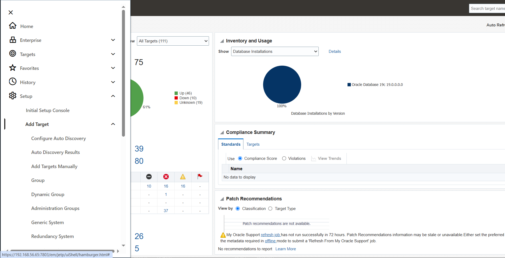
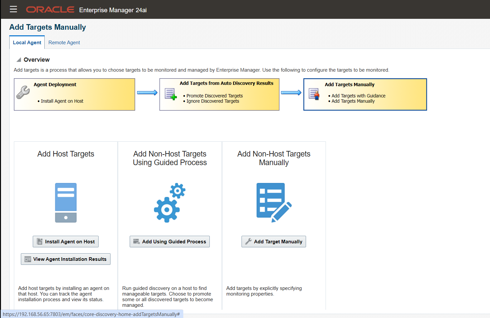
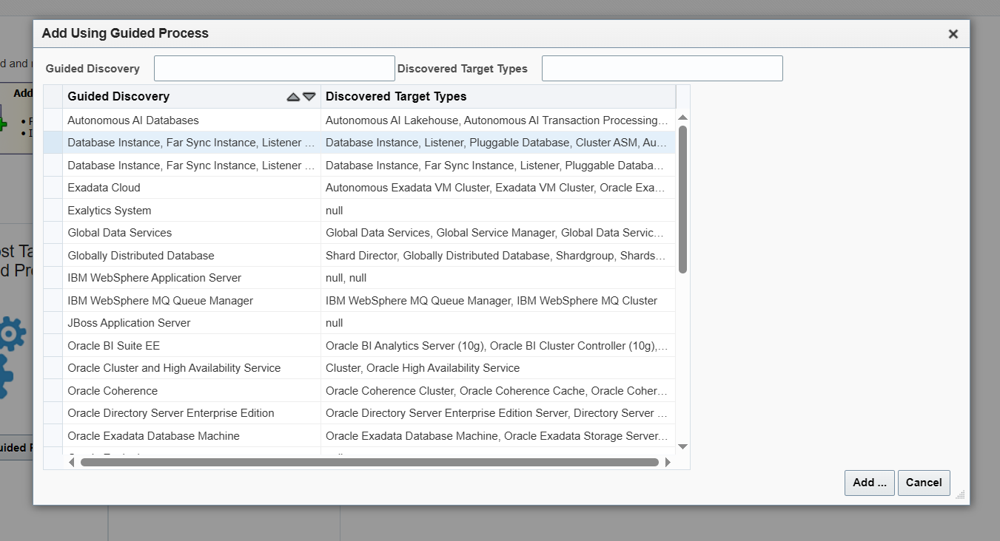
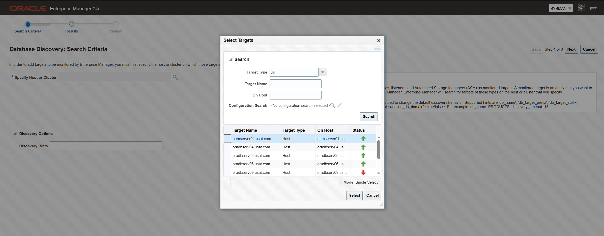
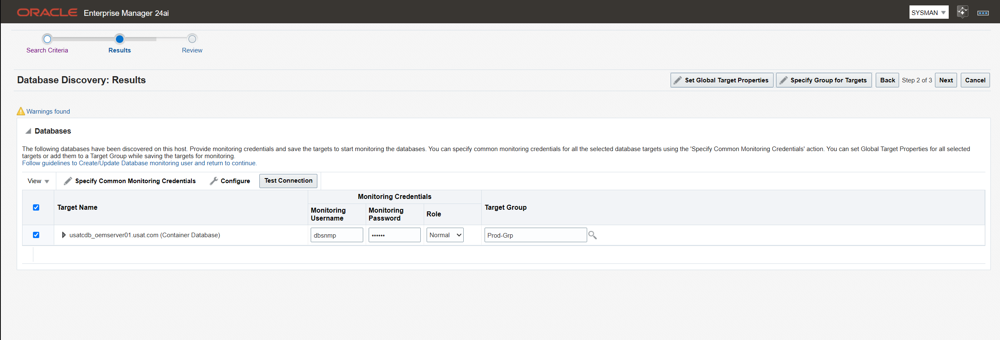
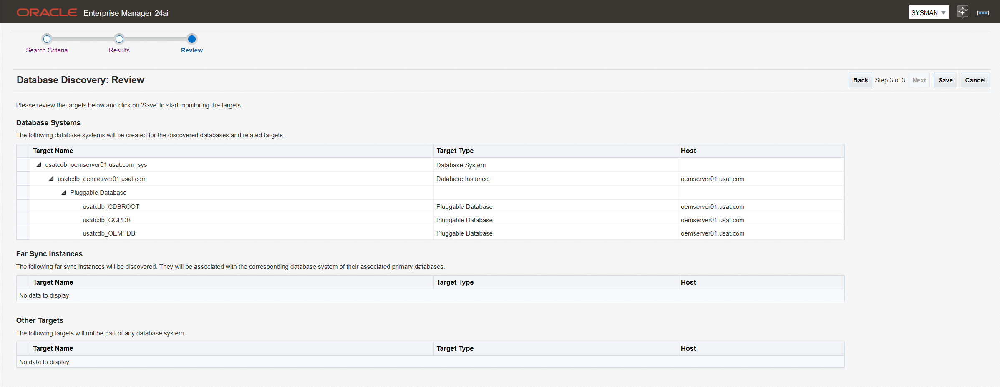
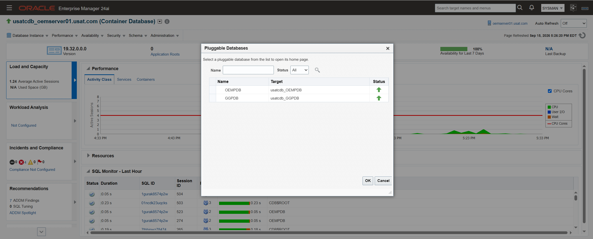

# Phase 7d Part 3: Post-deployment

**The repository runs from a PDB. Now make everything that points at it agree**

Part 3 of three. [Part 1](phase-7d-part1-pre-deployment.md) built the container.
[Part 2](phase-7d-part2-deployment.md) ran the window. The index is
[`phase-7d-noncdb-to-pdb.md`](phase-7d-noncdb-to-pdb.md).
Also indexed by skill area under
[Multitenant](../multitenant/README.md).

Status: 🟨 **Nearly complete.** The old non-CDB is fully retired: target removed,
instance down, datafiles deleted. The container is backed up, the compliance check has
run. Outstanding: §1.4, §4, and six screenshots.

**The rollback to `oemcdb` no longer exists.** Recovery is the RMAN level 0 of
`usatcdb` from §6.1.

[Part 2](phase-7d-part2-deployment.md) ends with the console served from `oempdb`.
Everything here follows that.

| # | Task | Status |
|---|---|---|
| 1 | Repoint the repository target | 🟨 1.1 and 1.2 done; 1.3 and 1.4 open |
| 2 | Clear the blackout | Not needed, none was created |
| 3 | Remove old targets `oemcdb` | 🟩 Confirmed 2026-09-15 |
| 4 | Update the estate's connection details | ⬜ |
| 5 | Retire the old non-CDB | 🟩 Confirmed 2026-09-15. Rollback ended |
| 6 | Close out | 🟩 Confirmed 2026-09-15 |
| 7 | Appendix A: Reference notes | 🟩 |
| 8 | Screenshot checklist | 🟨 6 of 11 |

```bash
source ~/.env/oms_env
```

---

## Contents

1. [Repoint the repository target](#1-repoint-the-repository-target)
2. [Clear the blackout](#2-clear-the-blackout)
3. [Remove old targets `oemcdb`](#3-remove-old-targets-oemcdb)
4. [Update the estate's connection details](#4-update-the-estates-connection-details)
5. [Retire the old non-CDB](#5-retire-the-old-non-cdb)
6. [Close out](#6-close-out)
7. [Appendix A: Reference notes](#7-appendix-a-reference-notes)
8. [Screenshot checklist](#8-screenshot-checklist)

---

## 1. Repoint the repository target

Status: 🟩 the OMS connection itself was repointed in
[Part 2 §7](phase-7d-part2-deployment.md#7-repoint-the-oms). What remains here is the
two monitored targets that describe the same database and did not move with it.

`usatcdb`, `oempdb` and `ggpdb` were confirmed open at the end of Part 2. That check is
not repeated here.

### 1.1 Unlock `dbsnmp` in the container

A container created by `dbca` has `dbsnmp` as a **common user in `LOCKED` status**.
Monitoring credentials fail against the new targets until it is unlocked.

```sql
-- connect to usatcdb as sysdba
select username, account_status, common from cdb_users where username = 'DBSNMP';

alter user dbsnmp identified by <password> account unlock;
```

```
SQL> col username for a12
SQL> select con_id, username, account_status, common from cdb_users where username = 'DBSNMP';

    CON_ID USERNAME     ACCOUNT_STATUS                   COM
---------- ------------ -------------------------------- ---
         1 DBSNMP       LOCKED                           YES
         4 DBSNMP       OPEN                             YES
         3 DBSNMP       LOCKED                           YES

SQL>
SQL> alter user dbsnmp identified by <password> account unlock;

User altered.

SQL>
SQL> select con_id, username, account_status, common from cdb_users where username = 'DBSNMP';

    CON_ID USERNAME     ACCOUNT_STATUS                   COM
---------- ------------ -------------------------------- ---
         1 DBSNMP       OPEN                             YES
         3 DBSNMP       OPEN                             YES
         4 DBSNMP       OPEN                             YES

SQL>
```

Then set the monitoring credentials on the new targets in the console and test them.

### 1.2 The monitored database target changed shape

Enterprise Manager monitored `oemcdb` as a single non-CDB `oracle_database` target. It
is now a PDB inside a container: a different target type with a different parent. The
container, `oempdb` and `ggpdb` are promoted together in one pass.

**Setup → Add Target → Add Targets Manually**



**Add Using Guided Process**



**Oracle Database, Listener and Automatic Storage Management**, then **Add**



Select `oemserver01.usat.com`, then **Next**



Run **Test Connection**, then set **Global Target Properties** and **Specify Group for
Target**, then **Next**



**Save**, then **Close**



The old `oemcdb` target stops reporting, because the SID no longer starts. It is
removed in [§3](#3-remove-old-targets-oemcdb).


### 1.3 Verify Console Shows container Database and two Pluggable databases

**Targets → Databases**

Expected: `usatcdb` listed as a container database, with `oempdb` and `ggpdb` beneath
it.



### 1.4 Check the targets that keep the old SID anyway

`emctl config oms -list_repos_details` reporting a service name does not guarantee
every target agrees. Two monitoring configurations have been observed still holding the
SID after the change:

| Target | Where |
|---|---|
| Management Service | Its monitoring configuration page |
| Management Services and Repository | Its monitoring configuration page |

Open each target's **Monitoring Configuration** and read the connect descriptor. Where
it still names a SID, edit it to the service name form and save. Change only the
connect descriptor; leave the username and password fields alone.

---

## 2. Clear the blackout

The blackout created in
[Part 2 §1.1](phase-7d-part2-deployment.md#11-create-the-blackout) suppresses every
alert on the estate while it is active.

Through the console, following
**[Creating a Blackout in Enterprise Manager](oem-create-blackout.md)**.

Check Incident Manager afterwards for availability events raised during the window
and clear the ones that are artefacts of it rather than real.

---

## 3. Remove old targets oemcdb.

### 3.1 Remove the target

**Setup → Add Target → Auto Discovery Results**, or remove the `oemcdb` target
directly.

The database itself stays on disk until [§5](#5-retire-the-old-non-cdb). Removing the
target ends the availability alerts; it does not end the rollback.

### 3.2 Agents are uploading

**Setup → Manage Cloud Control → Agents**

All agents Up, Secure Upload Yes, recent Last Successful Load.

### 3.3 Checklist

| # | Check | Expected |
|---|---|---|
| 1 | `v$pdbs` | `OEMPDB` read write, `RESTRICTED` = `NO` |
| 2 | `dba_registry` in `oempdb` | Every component `VALID` |
| 3 | `pdb_plug_in_violations` | Nothing `PENDING` |
| 4 | `emctl status oms -details` | Up, console and agent upload still locked |
| 5 | `emctl config oms -list_repos_details` | Names `oempdb.usat.com` |
| 6 | Repository target in the console | Up, monitored through the new descriptor |
| 7 | Management Service and Management Services and Repository | Monitoring configuration naming a service name, not a SID. §1.4 |
| 8 | `dbsnmp` in `usatcdb` | `OPEN`, with monitoring credentials tested. §1.1 |
| 9 | Agents | All Up and uploading. §3.2 |
| 10 | Rollback still available | The old non-CDB is intact until §5 |

---

## 4. Update the estate's connection details

Anything that names the repository by SID now points at a database that does not
start.

| Location | Change |
|---|---|
| `group_vars/all.yml` | The repository connection entries move from a SID to `SERVICE_NAME=oempdb.usat.com` |
| `tnsnames.ora` on `oemserver01` | Add or repoint the repository alias. The OMS does not use it: [Part 2 Appendix B.5](phase-7d-part2-deployment.md#b5-tnsnamesora) has the form and why |
| `~/.env/*` | Any `ORACLE_SID=oemcdb` export becomes a container or PDB connection |
| Backup scripts | RMAN connects to the container, not to the PDB, for a whole-database backup |
| Monitoring scripts | Scripts querying the repository directly need the service name |

Search before assuming the list is complete:

```bash
grep -rn 'oemcdb' --include='*.yml' --include='*.ora' --include='*.sh' .
```

---

## 5. Retire the old non-CDB

🟩 Complete 2026-09-15. Target removed, instance down, datafiles deleted.

**Not until §3 passes and the estate has run long enough to trust.** The old non-CDB
is the rollback in
[Part 2 §8](phase-7d-part2-deployment.md#8-rollback). Removing it ends that.

### 5.1 Confirm it is down and stays down

```bash
ps -ef | grep [o]ra_pmon_oemcdb
```

No output. Remove any `/etc/oratab` entry that would restart it.

### 5.2 Confirm the target is gone

🟩 Removed 2026-09-15, per [§3.1](#3-remove-old-targets-oemcdb). Confirmed before
deleting datafiles, so that a target still polling a dead SID cannot raise incidents
against a database that no longer exists.

### 5.3 Reclaim the datafiles

🟩 Removed 2026-09-15. **This is the step that ended the rollback.**

[Part 2 §5](phase-7d-part2-deployment.md#5-create-oempdb-with-copy-option) used `COPY`,
so the original datafiles stayed on disk through the window and through §3, holding the
space [Part 1 §3](phase-7d-part1-pre-deployment.md#3-size-the-target) reserved. They
were deleted once §3 had passed and §5.1 and §5.2 were confirmed.

```bash
df -h /u01
```

> ### The fallback to the non-CDB no longer exists
>
> From this point the only recovery path is the RMAN level 0 of `usatcdb` taken in
> [§6.1](#6-close-out). [Part 2 §8](phase-7d-part2-deployment.md#8-rollback) describes
> a route that is no longer available and is kept as a record of the window.

### 5.4 Decide on `oemcdbXDB`

`dba_services` inside `oempdb` lists `oemcdbXDB`, the XML DB service that came across
with the plug-in, because a non-CDB's service definitions travel into the PDB. It is
named for a database that no longer exists.

```sql
alter session set container = oempdb;
select name, network_name from dba_services order by name;
select name from v$active_services order by name;
```

Confirm nothing connects through it before removing it. Checked over a period that
covers a full monitoring cycle, not a single sample:

```sql
select service_name, count(*) from v$session group by service_name;
```

Leaving it costs nothing. It is listed here so that the name is a recorded decision
rather than an unexplained leftover.

---

## 6. Close out

### 6.1 Back up the new shape

🟩 Taken 2026-09-15.

An RMAN level 0 of `usatcdb`, which now covers `CDB$ROOT`, `oempdb` and `ggpdb` in
one backup. The previous backup strategy targeted a single non-CDB and no longer
describes this database.

### 6.2 AHF compliance check

🟩 Run 2026-09-15.

```bash
orachk -a
```

Diffable against the baseline in
[Phase 7a Part 1 §5.6](phase-7a-part1-before-the-window.md#56-ahf-compliance-baseline).
This also closes the post-patch compliance run that has been outstanding since
Phase 7a.

---

## 7. Appendix A: Reference notes

### A.1 Why `emcli migrate_noncdb_to_pdb` is not used

The verb takes `-migrationMethod=PLUG_AS_PDB` and looks like the tool for this job.
It drives a migration job through the OMS against a **monitored** target. The
repository is the database the OMS runs on, so the OMS stops the moment the source is
shut down and the job has nothing left to run in.

It remains the right tool for migrating any **other** non-CDB in this estate into
`usatcdb`, which is worth remembering when Phase 5 or Phase 9 need it.

### A.2 Why the three descriptor commands are not interchangeable

The three in §1's table change three different settings. Running only
`store_repos_details` leaves Enterprise Manager working while two of its own targets
report down. Running either of the others alone does nothing useful, because the OMS
cannot start until the first has run.

The ordering for `store_repos_details` is in
[Part 2 §2](phase-7d-part2-deployment.md#2-stop-the-stack). Step 1 is `emctl stop oms`,
not `emctl stop oms -all`, because the Administration Server has to be up while the
command runs. That is the same requirement `emctl secure lock` has in
[Phase 7c Part 2c §3.3](phase-7c-part2c-post-deployment.md#33-lock-it).

### A.3 A PDB has no SID

The old connect descriptor named `oemcdb` as a SID, which worked because a non-CDB has
one. A PDB does not, so every connection to `oempdb` goes through a service name.
[Part 2 Appendix B](phase-7d-part2-deployment.md#appendix-b-service-names-and-tnsnamesora)
covers the service itself.

That decides the form of the `store_repos_details` command. `emctl config oms -help`
offers `-repos_host`, `-repos_port` and `-repos_sid` as one shape and `-repos_conndesc`
as another. The first cannot name a PDB, so the second is the only option here. The
help text recommends `-repos_conndesc` for repositories in TCPS mode; that
recommendation is about TLS and does not restrict the parameter to TCPS, and the
Administrator's Guide uses the same parameter over TCP for a RAC failover descriptor.

### A.4 The Ansible role followed the rename on its own

The `oem_repo_patch` role discovers `oem_repo_sid` from `ora_pmon_*` rather than
reading a hardcoded value, so it picked up `usatcdb` with no variable change anywhere.
Its CDB detection, dormant since it was written because `SELECT cdb FROM v$database`
returned `NO`, now resolves to the CDB path:

```
usatcdb is a CDB — datapatch will be preceded by ALTER PLUGGABLE DATABASE ALL OPEN
```

Confirmed 2026-09-15 by a read-only preflight run. The branch itself executes on the
next repository Release Update; nothing in this phase needed it.

That run also read `dba_registry_sqlpatch` from inside `usatcdb` and found both Phase
7a patches already `APPLY / SUCCESS`, timestamped 14-SEP. The dictionary changes
travelled across with the datafiles, which is why no `datapatch` step appears anywhere
in this part.

One defect surfaced. The role's check for the RU zip is tagged
`oem_repo_patch_preflight`, so a preflight-only run fails at the last task demanding
patch media it will never use:

```
COMBO_OJVM_DBRU_19RU32_p39618649_190000_Linux-x86-64.zip not found on
oemserver01 or on oradbserv05
```

The zip was deleted after Phase 7a, correctly. Moving that check to
`oem_repo_patch_stage` would make preflight a true read-only probe. Not done.

### A.5 `SAVE STATE` is not optional

Without `ALTER PLUGGABLE DATABASE ... SAVE STATE`, a PDB returns to `MOUNTED` after
every container restart. For `oempdb` that means the OMS fails to start after any
reboot of `oemserver01`, which pairs badly with the documented behaviour that the OMS
and central agent do not start automatically after a host reboot on this estate.

---

## 8. Screenshot checklist

All files go in [`screenshots/7d/`](screenshots/7d/), embedded as
`screenshots/7d/<file>`. See the
[index](phase-7d-noncdb-to-pdb.md#screenshots) for why this phase uses a
subdirectory.

| File | Section | Shows | Status |
|---|---|---|---|
| `7d3-02-targets-promote_launch.png` | 1.2 | Setup, Add Target, Add Targets Manually | 🟩 |
| `7d3-03-targets-promote_launch_guided.png` | 1.2 | Add Using Guided Process | 🟩 |
| `7d3-04-targets_launch_guided_proc.png` | 1.2 | The database target type chosen | 🟩 |
| `7d3-05-target_discovery.png` | 1.2 | Discovery against `oemserver01` | 🟩 |
| `7d3-06-target_discovery_results.png` | 1.2 | `usatcdb`, `oempdb` and `ggpdb` found | 🟩 |
| `7d3-07-target_discovery_review.png` | 1.2 | The review page before saving | 🟩 |
| `7d3-07-target_discovery_show_con.png` | 1.3 | The console listing the container and both PDBs | 🟩 |
| `7d3-08-monitoring-config-service-name.png` | 1.4 | A monitoring configuration page after the SID was replaced | ⬜ |
| `7d3-09-oemcdb-target-removed.png` | 3.1 | The old `oemcdb` target gone | ⬜ |
| `7d3-10-df-reclaimed.png` | 5.3 | `/u01` after the old datafiles are removed | ⬜ |
| `7d3-11-services-after-cleanup.png` | 5.4 | `dba_services` in `oempdb` after the `oemcdbXDB` decision | ⬜ |

Two files share the `7d3-07-` prefix. Both are referenced as they are on disk.

---

## What this feeds into

- **Any repository release past 19c.** Non-CDB is desupported from Oracle Database
  21c onward, and that gate is now cleared.
- **Phase 4, GoldenGate Classic.** `ggpdb` exists and is empty.

---

Back to **[Part 2](phase-7d-part2-deployment.md)**,
**[Part 1](phase-7d-part1-pre-deployment.md)**, or the
**[index](phase-7d-noncdb-to-pdb.md)**.
