# Phase 7e: Patching the 24ai agents to Release 1 Update 12

**SOP: `agentpatcher` against the central agent and the image source, then a new gold image version for the rest, six agents, no My Oracle Support access**

The phase index for Enterprise Manager is [`README.md`](README.md).
[Phase 7c](phase-7c-oms-upgrade.md) took the OMS to 24ai Release 1 Update 12 and the
agents to 24ai Release 1. [Phase 7d](phase-7d-noncdb-to-pdb.md) moved the repository
into a container. This phase closes the gap between the OMS's patch level and the
agents'.

Status: 🟩 **Confirmed 2026-09-17.** `oemserver01` and `oradbserv05` patched by hand,
`V3_24.1_RU12_BASE` cut and set current, `oradbserv04`, `oradbserv09` and `oradbserv10`
updated from it.

`oradbserv06` is carried out of this phase. It failed the update for a condition that
predates this work and is written up separately: see
[§5.1](#51-oradbserv06-is-carried-out-of-this-phase).

> ### The window, in one line
>
> Install AgentPatcher → analyze → blackout → stop → tar the home → apply → verify →
> start → Refresh Configuration → cut V3 → roll out.
>
> **Four that bite:**
>
> | | |
> |---|---|
> | `ORACLE_HOME` is the agent **core** home, and it differs per host | [§1.6](#16-set-the-environment) |
> | A clustered agent must be patched on **every node** | [§4](#4-apply-the-release-update) |
> | The console does not know about the new patches until you **Refresh Configuration** | [§4.6](#46-refresh-the-oracle-home-configuration) |
> | `Agent Version` still reads `24.1.0.0.0` afterwards. Check `agentpatcher lspatches`, not the banner | [§4.5](#45-start-the-agent) |

| # | Task | Status |
|---|---|---|
| 1 | Confirm the prerequisites and route each agent | 🟩 Confirmed 2026-09-17 |
| 2 | Install AgentPatcher | 🟩 `oemserver01`, `oradbserv05` |
| 3 | Analyze the RU | 🟩 `oemserver01`, `oradbserv05` |
| 4 | Apply the Release Update | 🟩 `oemserver01`, `oradbserv05` |
| 5 | Roll it out as a gold image version | 🟩 Confirmed 2026-09-17 |
| 6 | Rollback | Not used |
| 7 | Verify | 🟩 Confirmed 2026-09-17 |
| | Appendix A: Notes | 🟩 |
| 8 | Screenshot checklist | 🟩 12 of 12 |

**Who:** `oracle`
**Patches:** `p33355570_241000_Generic.zip` (AgentPatcher 13.9.25.3.0),
`p39675970_241000_Generic.zip` (Agent RU 24.1.0.12, released 2026-08-18)

---

## Contents

1. [Confirm the prerequisites and route each agent](#1-confirm-the-prerequisites-and-route-each-agent)
2. [Install AgentPatcher](#2-install-agentpatcher)
3. [Analyze the RU](#3-analyze-the-ru)
4. [Apply the Release Update](#4-apply-the-release-update)
5. [Roll it out as a gold image version](#5-roll-it-out-as-a-gold-image-version)
6. [Rollback](#6-rollback)
7. [Verify](#7-verify)
8. [Screenshot checklist](#8-screenshot-checklist)

[Appendix A: Notes](#appendix-a-notes)

---

## 1. Confirm the prerequisites and route each agent

### 1.1 The OMS carries the matching RU

The agent RU's prerequisite: *"Apply Enterprise Manager 24ai Release 1 Update 12 Patch
39675954 or it's later Release Update version patch on the OMS before applying this
RU."*

```bash
source ~/.env/oms_env
emctl status oms -details
```

Expected: 24ai Release 1 Update 12, from
[Phase 7c Part 2b](phase-7c-part2b-deployment.md). Already satisfied on this estate.

### 1.2 Stage the patch files

On `oemserver01`:

```bash
mkdir -p /u01/app/oracle/staging/patches/agent
```

Place both zips there:

```
p33355570_241000_Generic.zip
p39675970_241000_Generic.zip
```

On every other host, pull them from `oemserver01` rather than downloading twice:

```bash
mkdir -p /u01/app/oracle/staging/patches/agent
cd /u01/app/oracle/staging/patches/agent
scp oracle@oemserver01:/u01/app/oracle/staging/patches/agent/p3* .
```

### 1.3 Every agent is 24ai Release 1

```bash
emcli login -username=sysman
emcli get_targets -targets="oracle_emd" -format="name:csv"
```

The RU applies to Oracle Management Agent 24.1.0.0.0, or to any RU previously released
for 24ai Release 1. This is the first, which decides the rollback identifier list in
[§6](#6-rollback).

### 1.4 Route each agent

| Agent | Route | Why |
|---|---|---|
| `oemserver01` | Manual | Central agent. *"You cannot update a central agent with an Agent Gold Image."* [Phase 7b Part 3 §16.2](phase-7b-part3-golden-image.md#162-two-agents-cannot-be-subscribed) |
| `oradbserv05` | Manual | Image source. An agent cannot subscribe to the image cut from it |
| `oradbserv06` | Deferred | Clustered with `oradbserv05`, and a drifter that fails the update. Carried out of this phase, [§5.1](#51-oradbserv06-is-carried-out-of-this-phase) |
| `oradbserv04` | Gold image | Subscribed, on V2, no drift |
| `oradbserv09` | Gold image | Subscribed, on V2, no drift |
| `oradbserv10` | Gold image | Subscribed, on V2, no drift |

`oradbserv05` and `oradbserv06` are one cluster and both are patched by hand.
`oradbserv09` and `oradbserv10` are the other cluster and both take the image in the
same operation.

### 1.5 Confirm the image source carries enough plug-ins

Enterprise Manager refuses to update an agent from an image holding fewer plug-ins than
the agent already has. Recorded at
[Phase 7b Part 3 Appendix B.2](phase-7b-part3-golden-image.md#b2-updating-an-agent-that-carries-more-plug-ins-than-the-image).

```bash
emcli login -username=sysman

emcli list_plugins_on_agent -agent_names="oradbserv05.usat.com:3872"
emcli list_plugins_on_agent -agent_names="oradbserv06.usat.com:3872"
emcli list_plugins_on_agent -agent_names="oradbserv04.usat.com:3872"
emcli list_plugins_on_agent -agent_names="oradbserv09.usat.com:3872"
emcli list_plugins_on_agent -agent_names="oradbserv10.usat.com:3872"
```

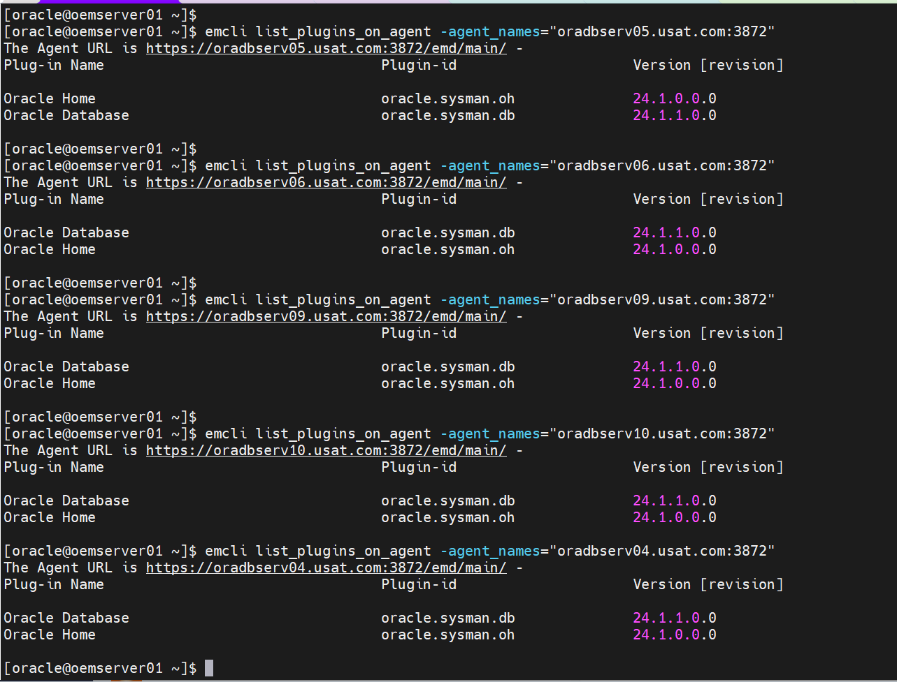

`oradbserv05`'s set must be a superset of the others, by plug-in and by version. Where
it is not, the image is cut from an agent that is, and §1.4's routing changes.

### 1.6 Set the environment

**`ORACLE_HOME` is the agent core home, and the path differs per host.**

```bash
source ~/.env/agent_env
emctl status agent | grep -E 'Agent Home|Agent Binaries'
```

`Agent Binaries` is the core home. Measured on this estate:

| Host | Agent core home |
|---|---|
| `oemserver01` | `/u01/app/oracle/Middleware/agent24/agent_24.1.0.0.0` |
| `oradbserv05` | `/u01/app/oracle/Middleware/agent/13_5/agent_24.1.0.0.0` |

```bash
export ORACLE_HOME=<the Agent Binaries path>
export PATH=$ORACLE_HOME/bin:$ORACLE_HOME/AgentPatcher:$ORACLE_HOME/OPatch:$PATH
which unzip
```

---

## 2. Install AgentPatcher

Version 13.9.25.3.0 is the minimum the RU accepts for 24.1.0.0.

```bash
agentpatcher version
```

`oradbserv05` was at 13.9.24.0.0 before this step, which is below the minimum.

```bash
cp -r $ORACLE_HOME/AgentPatcher /u01/app/oracle/staging/patches/agent/AgentPatcher.bak.$(date +%Y%m%d)
rm -rf $ORACLE_HOME/AgentPatcher
unzip -q -d $ORACLE_HOME /u01/app/oracle/staging/patches/agent/p33355570_241000_Generic.zip
```

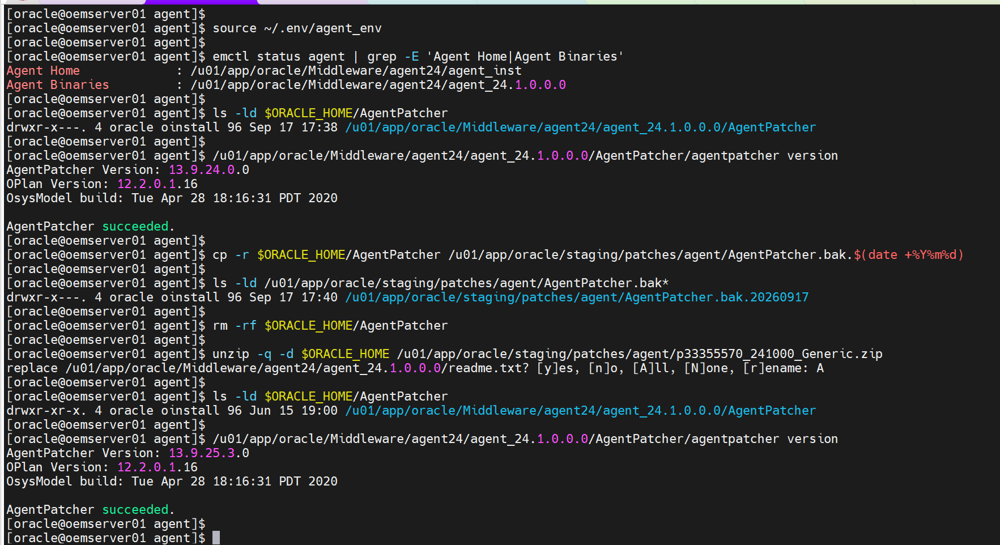

> ### The old directory must be gone, not overwritten
>
> The README requires that no `ORACLE_HOME/AgentPatcher` exists before the unzip.
> Extracting over the top leaves files from the previous version behind.

```bash
agentpatcher version
```

```
AgentPatcher Version: 13.9.25.3.0
OPlan Version: 12.2.0.1.16
OsysModel build: Tue Apr 28 18:16:31 PDT 2020

AgentPatcher succeeded.
```

---

## 3. Analyze the RU

```bash
cd /u01/app/oracle/staging/patches/agent
unzip -q p39675970_241000_Generic.zip
cd 39675970

agentpatcher apply -analyze
```

Analyze runs the configuration and binary prerequisite checks. **It installs nothing.**

Expected on this estate, `oradbserv05`, 2026-09-17:

```
Prerequisites analysis summary:
-------------------------------

The following sub-patch(es) are applicable:

               Featureset                                    Sub-patches
               ----------                                    -----------
  oracle.sysman.top.agent   39676023,39676003,39676047,39675985,39676060,39675995


The following sub-patches are not needed by any component installed in the Agent system:
39676089,39676038,39676016,39676009,39676067,38967445,39676055,39676096

AgentPatcher succeeded.
```

> ### Eight of the fourteen sub-patches are skipped, and that is correct
>
> The RU is a system patch covering every plug-in Enterprise Manager ships.
> AgentPatcher applies only the sub-patches whose plug-in is actually deployed on that
> agent, and reports the rest under *"could not be applied"* with the reason *"The
> Plugin or Core Component ... is not deployed in your Enterprise Manager system."*
>
> The applicable list is a property of the agent, not of the patch, so it differs per
> host. An agent carrying more plug-ins takes more sub-patches. The `rollback -id` list
> in [§6](#6-rollback) names all fourteen regardless, per the README.

Any genuine error stops the phase. The README's instruction on a failed analyze is to
contact Oracle Support rather than to proceed.

---

## 4. Apply the Release Update

> ### A clustered agent is patched on every node
>
> The README repeats it three times: *"If the Management Agent is installed on a
> cluster, then repeat step 1 to 4 on all nodes of the cluster."*
>
> `oradbserv05` with `oradbserv06`, and `oradbserv09` with `oradbserv10`. Patching one
> node of a pair leaves the cluster split across two agent patch levels.

### 4.1 Blackout, on any agent monitoring live targets

Applying the RU restarts the agent, so its targets become unreachable and raise
incidents. Create the blackout first, per
[Phase 7b Part 3 Appendix B.1](phase-7b-part3-golden-image.md#b1-updating-an-agent-that-is-already-monitoring-live-targets)
and [Creating a Blackout in Enterprise Manager](oem-create-blackout.md).

Not required on `oemserver01`, whose targets go down with the OMS anyway.

### 4.2 Stop the agent and back up the home

```bash
source ~/.env/agent_env
emctl stop agent

cd /u01/app/oracle/staging/patches/agent
tar -czf agent_24.tar.gz /u01/app/oracle/Middleware/agent/13_5
```

The tar covers the whole agent installation, binaries and instance home together. It is
the backout that does not depend on `agentpatcher rollback` succeeding.

### 4.3 Apply

```bash
cd /u01/app/oracle/staging/patches/agent/39675970
agentpatcher apply
```

**The command prompts.** It lists what it will do, then waits:

```
To continue, AgentPatcher will do the following:
[Patch and deploy artifacts]   :

Do you want to proceed? [y|n]
```

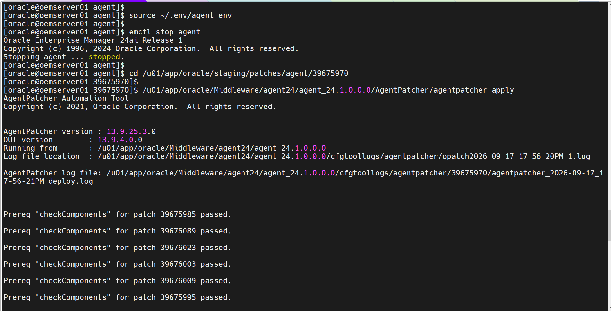

Expected close:

```
Binaries of the following sub-patch(es) have been applied successfully:

                          Featureset                                    Sub-patches
                          ----------                                    -----------
  oracle.sysman.top.agent_24.1.0.0.0   39675985,39675995,39676003,39676023,39676047,39676060

AgentPatcher succeeded.
```

### 4.4 Verify the patch inventory

```bash
agentpatcher lspatches
$ORACLE_HOME/OPatch/opatch lsinventory -details
```

`agentpatcher lspatches` is the command that shows the RU. Expected on `oradbserv05`:

| Component | System Patch | Sub-patch |
|---|---|---|
| `oracle.sysman.top.agent/24.1.0.0.0` | 39675970 | 39675985 |
| `oracle.sysman.db.agent.plugin/24.1.1.0.0` | 39675970 | 39675995 |
| `oracle.sysman.db.discovery.plugin/24.1.1.0.0` | 39675970 | 39676003 |
| `oracle.sysman.xa.discovery.plugin/24.1.1.0.0` | 39675970 | 39676023 |
| `oracle.sysman.emas.discovery.plugin/24.1.1.0.0` | 39675970 | 39676047 |
| `oracle.sysman.vi.discovery.plugin/24.1.1.0.0` | 39675970 | 39676060 |

### 4.5 Start the agent

```bash
source ~/.env/agent_env
emctl start agent
emctl status agent
```

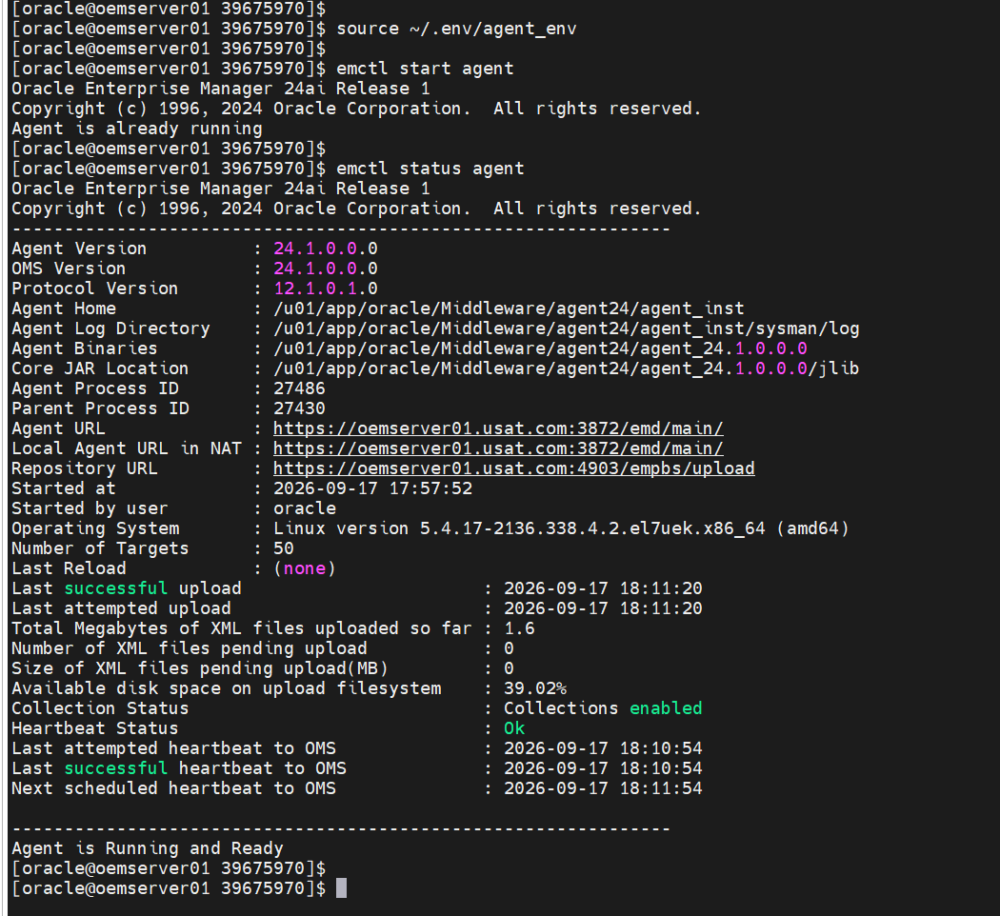

`Agent is already running` is the expected reply: `agentpatcher apply` restarts the
agent itself.

Expected from `emctl status agent`: running and ready, heartbeat `Ok`, zero pending
uploads, and the target count unchanged.

> ### `Agent Version` does not change
>
> It still reads `24.1.0.0.0` after the RU. The Release Update is recorded in
> `agentpatcher lspatches`, not in the version banner. Do not use the banner as the
> check that the patch landed.

### 4.6 Refresh the Oracle Home configuration

**Enterprise Manager does not know about the new patches until this runs.** A gold
image cut before it captures stale patch metadata.

**Targets → All Targets**, open the patched agent, for example
`oradbserv05.usat.com:3872`

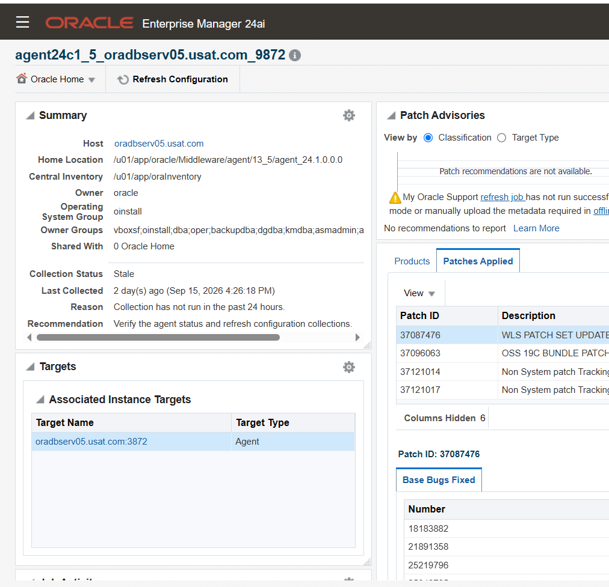

**Summary → Oracle Home and Patch Details**, then **Refresh Configuration**

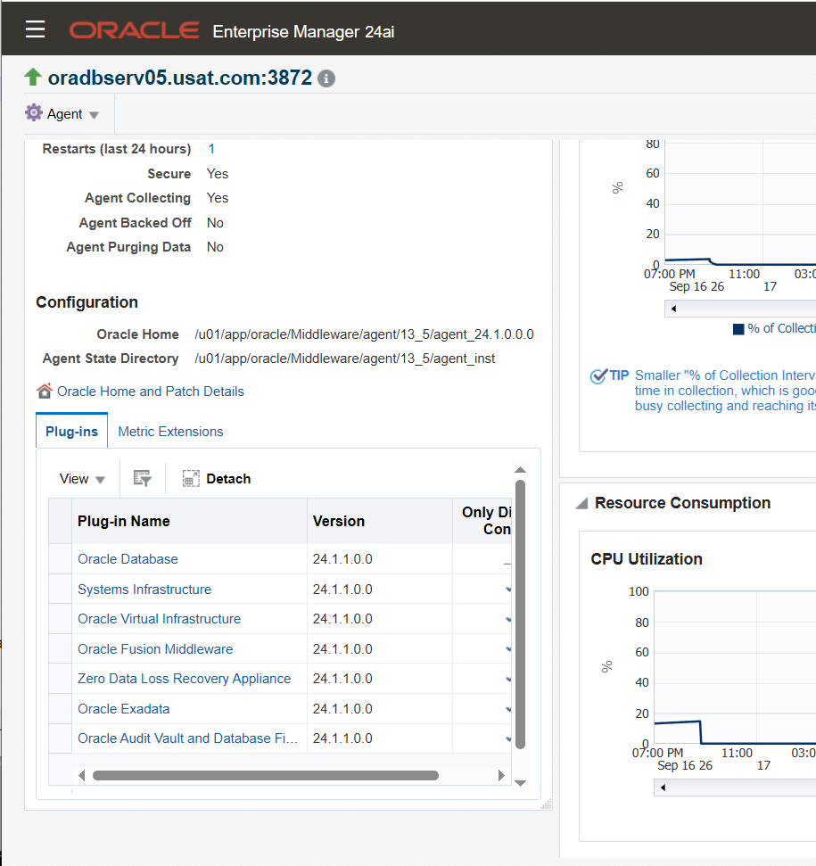

Wait for the collection to complete.

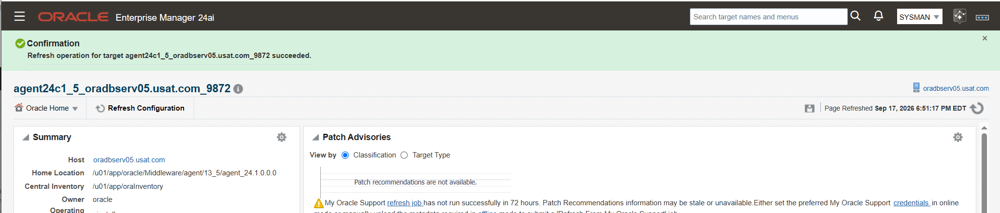

### 4.7 End the blackout

Per [the blackout page §6](oem-create-blackout.md#6-clearing-it-afterwards).

---

## 5. Roll it out as a gold image version

`oradbserv05` is patched and its configuration refreshed. It becomes the source of V3.

Blackout first: updating an agent that already monitors live targets restarts it.
Version readiness and the eligibility checks are in
[Phase 7b Part 3 §16.4](phase-7b-part3-golden-image.md#164-checking-eligibility).

1. **Setup → Manage Cloud Control → Gold Agent Images**, open `GI_AGENT_LINUX_X64`

2. **Manage Image Versions and Subscriptions → Actions → Create**, source
   `oradbserv05`

3. Name it for what it contains. V2 reads `V2_24.1.0.0.0_BASE`; this one is
   `V3_24.1_RU12_BASE`

   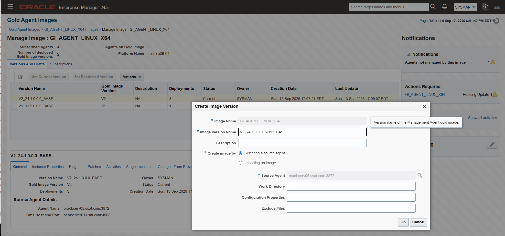

   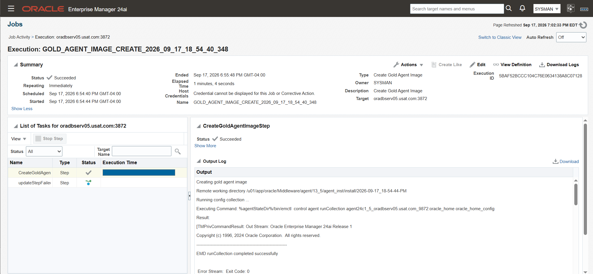

4. **Set Current Version** once the version reports Ready

   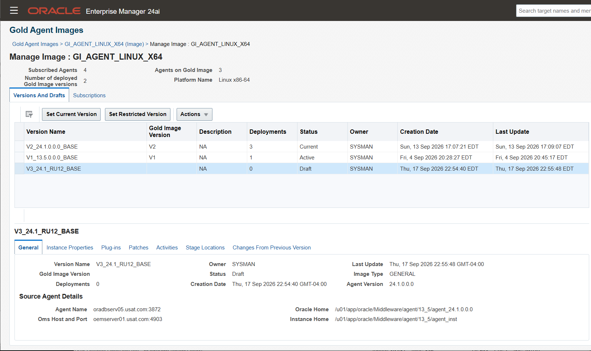

5. Update `oradbserv04`, `oradbserv09` and `oradbserv10` from it

   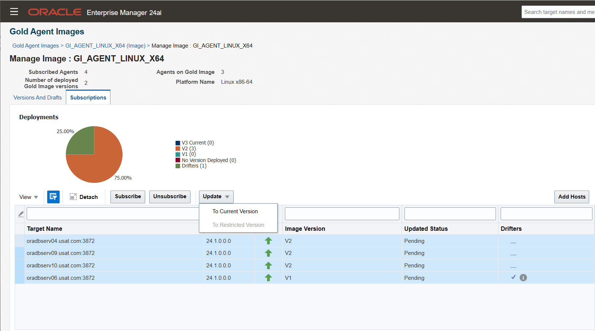

6. Follow the prompts and monitor the job

   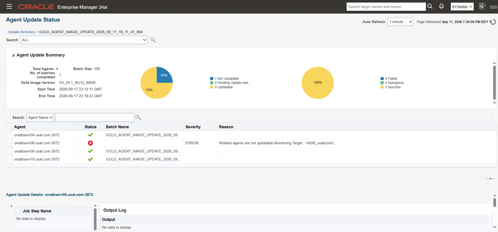

7. after the job completes `oradbserv04, oradbserv09, and oradbserv10` will be on the new `V3_24.1_RU12_BASE` while `oradbserv06` will fail because of a prior existing issue later addressed in <place_holder_for_article>


### 5.1 `oradbserv06` is carried out of this phase

It failed the V3 update for a condition that predates this work: it is recorded on
**V1** and reported as a drifter since
[Phase 7c Part 2c §5.7.6](phase-7c-part2c-post-deployment.md#576-oradbserv06-did-not-take-the-update).
[Appendix A.5](#a5-why-oradbserv06-is-a-drifter) summarises the measured reasons.

Resolving it is its own piece of work and is written up separately in
`<place_holder_for_article>`.

> ### Until then, `usatclust1` is split across two agent patch levels
>
> `oradbserv05` carries RU12 and `oradbserv06` does not. That is exactly the state the
> RU README's cluster instruction exists to prevent, so it is a known open condition
> rather than a completed one.
>
> `usatclust2` is not affected. `oradbserv09` and `oradbserv10` both took V3.

---

## 6. Rollback

**This route has one.** `agentpatcher rollback`, which the patch plan route does not
offer at this release. See [Appendix A.1](#a1-why-not-patch-plans).

```bash
emctl stop agent

cd /u01/app/oracle/staging/patches/agent/39675970
agentpatcher rollback -analyze -id 39675985,39676089,39676038,39676016,39676023,39676003,39676009,39675995,39676067,38967445,39676055,39676060,39676096,39676047

agentpatcher rollback -id 39675985,39676089,39676038,39676016,39676023,39676003,39676009,39675995,39676067,38967445,39676055,39676060,39676096,39676047

emctl start agent
```

**These identifiers are correct only because this is the first RU on 24ai Release 1.**
Applied on top of a previously released 24ai RU, the list comes from My Oracle Support
note KB319660 instead.

The tar from §4.2 is the backout that does not depend on the rollback succeeding.

Ordering constraint from the README: deinstall this agent RU **before** deinstalling
OMS patch 39675954.

For agents moved by gold image in §5, the rollback is the previous image version while
the old home is still present, not `agentpatcher`.

---

## 7. Verify

Per agent, from the host:

```bash
source ~/.env/agent_env
emctl status agent
$ORACLE_HOME/AgentPatcher/agentpatcher lspatches
```

From the console:

**Targets → All Targets**, Filter by **Internal → Agent** , then pick an agent
**Summary** Scroll down **Oracle Home and Patch Details → Patch Advisories → Patches Applied**

| # | Check | Expected |
|---|---|---|
| 1 | `emctl status agent` | Running and ready, heartbeat `Ok`, 0 pending uploads |
| 2 | `agentpatcher lspatches` | System Patch `39675970` against the deployed components |
| 3 | `Agent Version` | Still `24.1.0.0.0`. The RU does not change it |
| 4 | Target count | Unchanged. `oradbserv05` carried 16 before and after |
| 5 | Patches Applied, console | `39675970` listed, after the §4.6 refresh |
| 6 | Gold image | `oradbserv04`, `oradbserv09` and `oradbserv10` on `V3_24.1_RU12_BASE` |
| 7 | `usatclust2` | `oradbserv09` and `oradbserv10` at the same patch level |
| 8 | `usatclust1` | Split until `oradbserv06` is resolved. [§5.1](#51-oradbserv06-is-carried-out-of-this-phase) |

---

## 8. Screenshot checklist

All files go in [`screenshots/7e/`](screenshots/7e/), embedded as
`screenshots/7e/<file>`.

| File | Section | Shows | Status |
|---|---|---|---|
| `7e-00-plugin-inventory.png` | 1.5 | `list_plugins_on_agent` across the estate | 🟩 |
| `7e-01-Install-AgentPatcher.png` | 2 | AgentPatcher 13.9.25.3.0 in place | 🟩 |
| `7e-03-apply.png` | 4.3 | `agentpatcher apply` completing | 🟩 |
| `7e-04-agent-status.png` | 4.5 | The agent up after the patch | 🟩 |
| `7e-05-refresh_source_agent_page.png` | 4.6 | The source agent's home page | 🟩 |
| `7e-06-refresh_source_agent_OH.png` | 4.6 | Refresh Configuration on the Oracle Home page | 🟩 |
| `7e-07-refresh_source_agent_OH_success.png` | 4.6 | The refresh completing | 🟩 |
| `7e-08-gold-image-version.png` | 5 | Creating `V3_24.1_RU12_BASE` | 🟩 |
| `7e-09-gold-image-version_status.png` | 5 | The version reporting Ready | 🟩 |
| `7e-10-set-current-version.png` | 5 | V3 set current | 🟩 |
| `7e-11-subscribed-agents-update.png` | 5 | Subscribed agents being updated | 🟩 |
| `7e-12-subscribed-agents-update_job.png` | 5 | The update job | 🟩 |

---

## Appendix A: Notes

### A.1 Why not patch plans

Oracle's Administrator's Guide titles its patch plan procedure *"Automated Management
Agent Patching Using Patch Plans (Recommended)"*, and the RU's own README gives that
route as its primary instructions. It is not used here for one reason: **patch plans
require My Oracle Support.**

| Mode | Requirement |
|---|---|
| Online | The OMS connects to MOS to search and download |
| Offline | Patches **and their ARU metadata** already in the Software Library, both obtained from MOS |

Neither is available on this estate. The manual route in the README's Section 4 is the
supported alternative, and the gold image carries it to the remaining agents.

Two things the manual route gains:

| | Patch plan | This route |
|---|---|---|
| Rollback | **None.** *"For Enterprise Manager 13c Release 5 and later, the Rollback patches in the plan option is no longer supported"* | `agentpatcher rollback -id`, plus a tar of the home |
| Gold image drift | Every subscribed agent drifts from its image | The image is rebuilt from the patched agent, so it keeps describing reality |

### A.2 The prerequisite chain runs both ways

| Direction | Rule |
|---|---|
| Installing | OMS patch 39675954 first, then agent patch 39675970 |
| Deinstalling | Agent patch 39675970 first, then OMS patch 39675954 |

Reversing the deinstall order leaves agents carrying an RU whose OMS-side counterpart
has been removed.

### A.3 Known issue that does not apply here

The README requires Patch 39664754 after this RU for anyone monitoring Exadata or
Recovery Appliance with the Engineered Systems licence pack, without which metrics are
not collected and charts show wrong data.

This estate monitors no Exadata and no Recovery Appliance. Recorded so the decision is
visible rather than missed.

### A.4 What the RU contains

Agent-side fixes relevant to this estate, from the README's bug list:

| Bug | Fix |
|---|---|
| 39714825 | `emctl` agent command failing with *"Failed to configure log4j. No type attribute provided for component log4j"* |
| 38299767 | `JAVA_HOME` missing from `.globalenv.properties` after agent migration |
| 39694585 | Agent deadlock during metric collection |
| 39698370 | Auto Discovery result empty when a common `listener.ora` is used |
| 39409970 | Cluster resource generating OFFLINE alerts with an incorrect instance count |

The last two apply directly: this estate runs two clusters, and
[Phase 7d Part 3 §1.2](phase-7d-part3-post-deployment.md#1-repoint-the-repository-target)
used auto discovery against a host with a shared `listener.ora`.

### A.5 Why `oradbserv06` is a drifter

Its own article: `<place_holder_for_article>`.

Measured on 2026-09-17, it carries more than the image rather than less, and its drift
is reported against **V1** rather than V2. Enterprise Manager refuses an update that
would remove plug-ins from a working host, which is the refusal recorded at
[Phase 7b Part 3 Appendix B.2](phase-7b-part3-golden-image.md#b2-updating-an-agent-that-carries-more-plug-ins-than-the-image).


---

**Sources:**
`README.html` shipped with `p39675970_241000_Generic.zip`, *Oracle Enterprise Manager
24ai Release 1 Update 12 (24.1.0.12) for Oracle Management Agent*, Patch for Bug
39675970, released 2026-08-18: the OMS prerequisite, the AgentPatcher minimum version,
the manual apply and rollback procedure in its Section 4, the rollback identifier list,
the cluster instruction and the known issue ·
`readme.txt` shipped with `p33355570_241000_Generic.zip`, the AgentPatcher install
procedure ·
[Automated Management Agent Patching Using Patch Plans (Recommended), Administrator's Guide 24ai](https://docs.oracle.com/en/enterprise-manager/cloud-control/enterprise-manager-cloud-control/24.1/emadm/automated-management-agent-patching-using-patch-plans-recommended.html),
the route this phase does not use, and the statement that plan rollback is unsupported ·
[Managing the Lifecycle of Agent Gold Images, Administrator's Guide 24ai](https://docs.oracle.com/en/enterprise-manager/cloud-control/enterprise-manager-cloud-control/24.1/emadv/managing-lifecycle-agent-gold-images.html),
the definition of a gold image as desired version, plug-ins and patches

---

Back to the **[Enterprise Manager index](README.md)**.
