# Swingbench — Install and Use

[Swingbench](https://www.dominicgiles.com/swingbench/#about-swingbench) (Dominic
Giles) is this project's standing load-generation tool — the way HA/DR claims get
proven with an actual throughput chart instead of just a log line saying "failover
completed." First real use in this project: the Swingbench-driven switchover test in
[`high-availability/part3-post-checks.md` Section 16](../../high-availability/part3-post-checks.md#16-confirmed--post-standby-validation),
which this README documents the general setup for.

Version used in this project: **2.8.0.1630**, run from a Windows client PC — no
Oracle Client Home required, just Java and network line-of-sight to the target
database's listener(s).

---

## Prerequisites

- **Java 17 or later.** Swingbench 2.7+ requires it; earlier versions were more
  lenient. Confirmed working in this lab on Java 26 — check with `java -version`,
  and open a **new** terminal after installing/switching a JDK, since an
  already-open shell won't pick up an environment variable change.
- **Network reachability + DNS resolution** to the target database's SCAN
  listener(s), port 1521 by default. Confirm with a real connection test
  (`sqlplus <user>/<password>@<service>`) before assuming Swingbench will connect —
  it uses the same underlying JDBC thin driver, so if SQL*Plus can't reach it,
  neither can Swingbench.
- **For Data Guard / cross-cluster testing specifically:** a connect string that
  lists *every* relevant cluster's SCAN listener, not just one. See
  [`high-availability/tnsnames-application.ora`](../../high-availability/tnsnames-application.ora)
  for why — a connect string pointed at a single cluster works fine right up until
  a real switchover relocates the target service onto a different cluster, at which
  point it fails permanently, not gracefully.

---

## 1. Download and unzip

Get the current version from
[dominicgiles.com/swingbench](https://www.dominicgiles.com/swingbench/#about-swingbench),
unzip it, then `cd` into `winbin` (Windows) or `bin` (Linux/Unix/Mac) inside the
unzipped `swingbench` directory. No further install step — Swingbench is
configuration-free as long as Java is on the path.

---

## 2. Load a benchmark schema (Order Entry / SOE)

Run `oewizard.bat` (Windows) / `oewizard` (Linux/Unix) — the Order Entry install
wizard. Screens shown below are the real sequence from this project's first run.

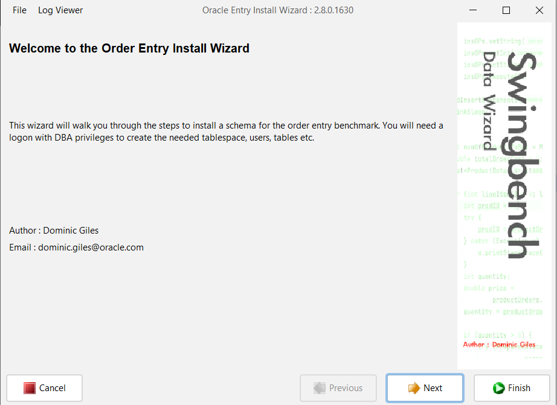

Pick **Version 2.0 (Recommended)** — Version 1.0 is only included for
completeness.

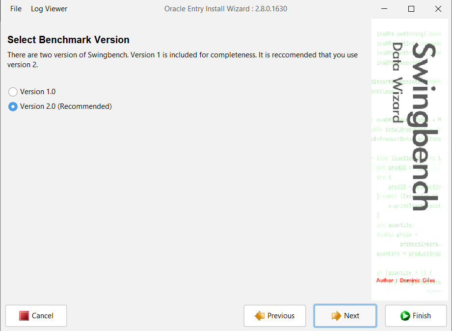

Select **Create the Order Entry Schema** (not Drop, obviously, unless you're
tearing one down).

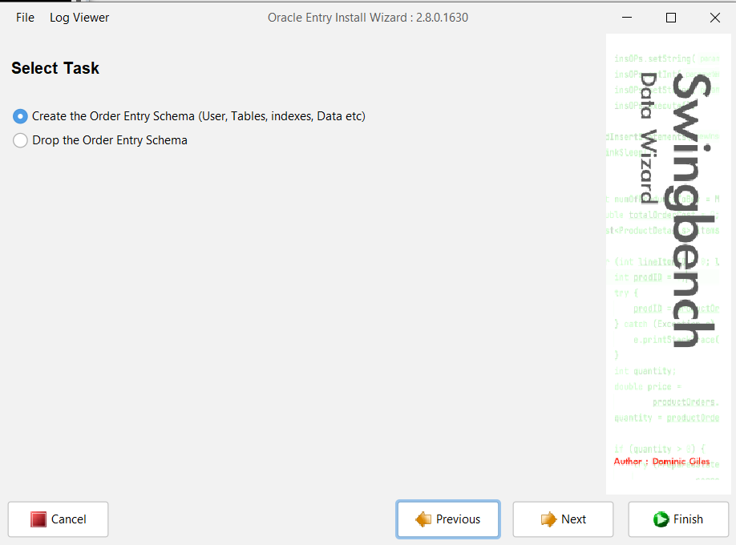

**Database Details** — connect string, connection type, and the account used to
*create* the schema:

- **Connect String:** point this at the primary, using a role-based service if one
  exists (e.g. `apexdb_rw`, not a bare SID) — this step needs a writable
  connection.
- **Connection Type:** `Type IV jdbc driver (Thin)` — no Oracle Client Home
  dependency.
- **Administrator Username:** `sys as sysdba` — sidesteps the wizard's own warning
  that using `system` requires manually granting `execute` on `DBMS_LOCK`/
  `DBMS_RANDOM` afterward.

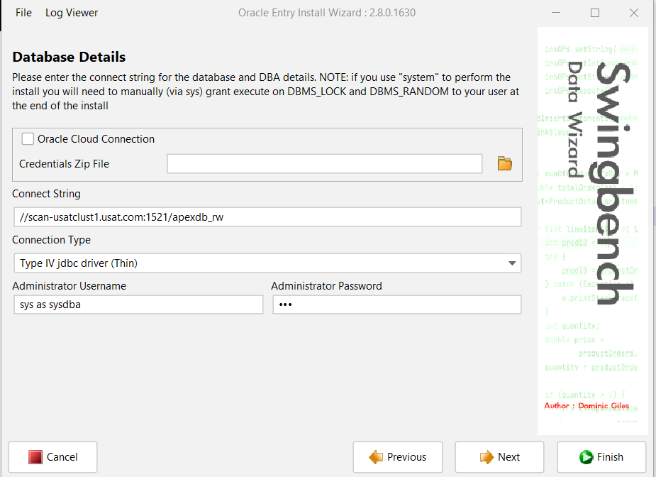

**Schema Details** — the actual benchmark schema being created. `soe`/`soe` is
Swingbench's own documented default (not a real secret to protect) — change it if
you want, but every Swingbench tutorial assumes this pair.

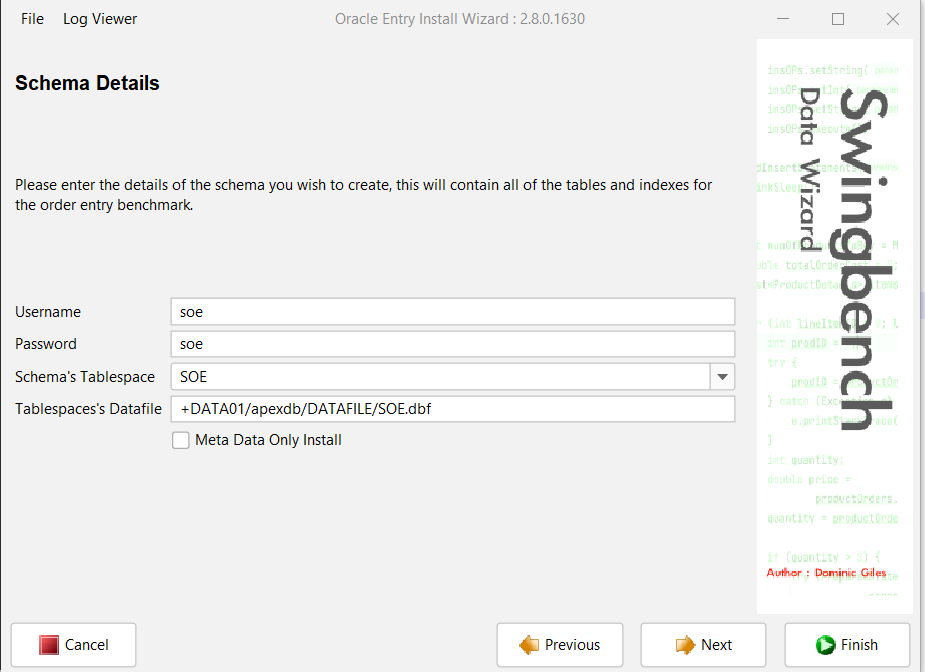

**Database Options** — partitioning, compression, tablespace type, indexing. The
wizard's recommended defaults are fine for a home lab; only deviate if you have a
specific reason to.

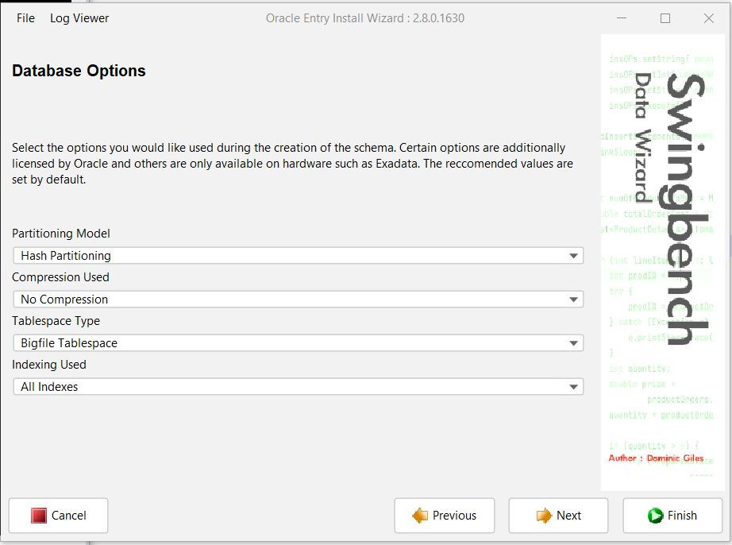

**Sizing Details** — this is the field most worth overriding. The wizard's presets
jump straight to 1GB/10GB/100GB/1TB; for a home lab, use **User Defined Scale**
with a small value instead (a scale of `5` produced a 16GB schema in this project —
still plenty of data to drive a real, visible load test without eating your lab's
storage).

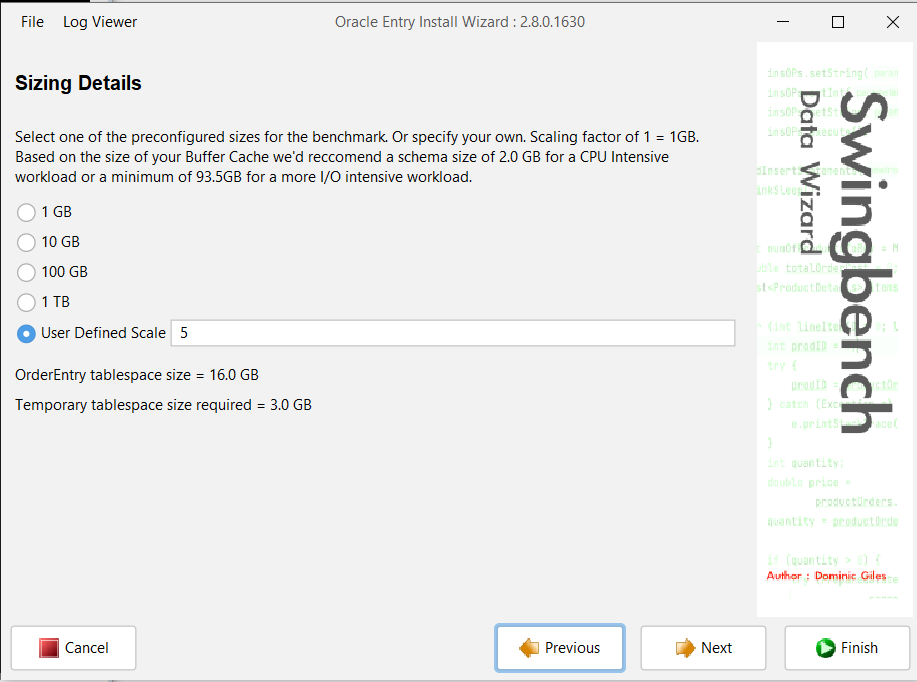

**All Details Entered** — review the parallelism level (defaults to `2 × CPU
count`; adjust down if your host is shared with other lab VMs), then **Finish**.

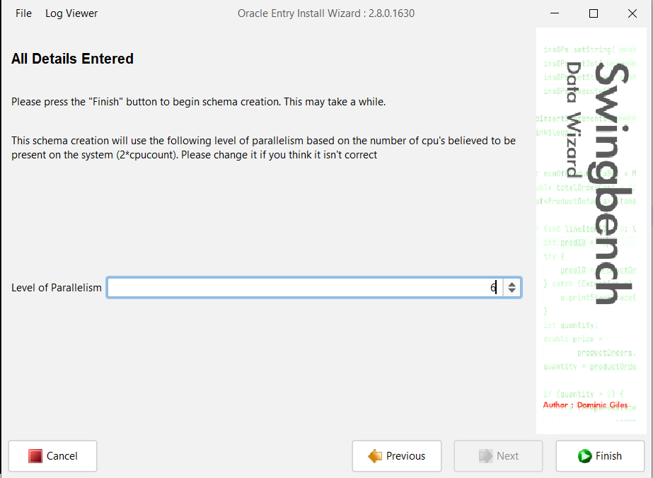

The wizard log shows the real DDL/data-generation scripts running and the actual
JDBC connect string used — confirm `Connected` and `Completed Data Generation`
before moving on.

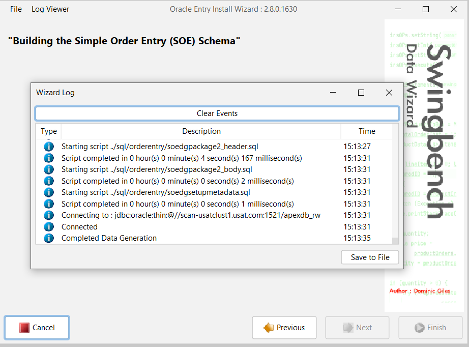

---

## 3. Run a benchmark

Launch `swingbench.bat` (Windows swingbench\winbin) / `swingbench` (Linux/Unix) — this is the actual
load-generation GUI with the live throughput chart, a separate tool from the schema
wizard above.

**Which benchmark config to pick, on the "Benchmark Configuration File" dialog:**
Swingbench ships several Order Entry variants. For plain throughput testing,
any `SOE_*` config works. **For Data Guard/HA testing specifically, use
`SOE_Client_Side_AC`** — the config built to exercise Application Continuity's
replay/reconnect behavior through a real outage, rather than a plain JDBC
connection pool with no recovery logic of its own. Picking a non-AC-aware config
against a Data Guard target was a real mistake made and corrected in this
project's own first attempt — see Section 16's write-up for what that looked like.

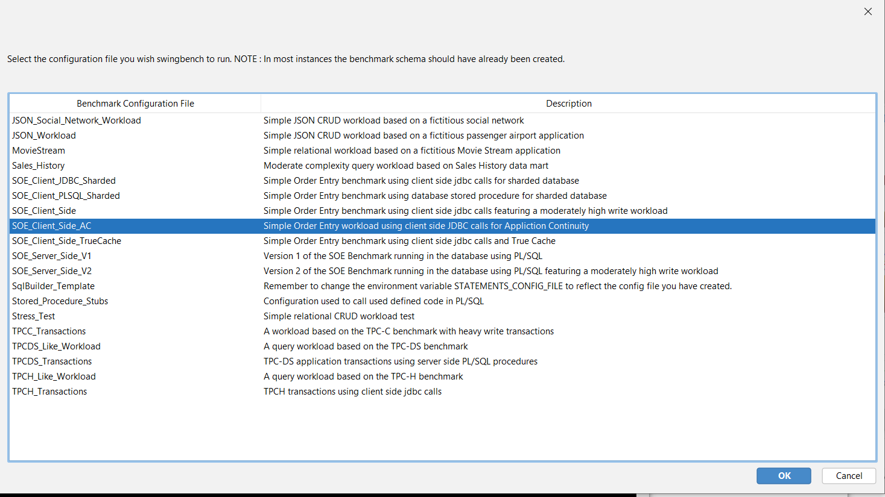

**Configuration tab, User Details:**
- **Username/Password:** the schema account from step 2 (`soe`/`soe` if left
  default) — not the `sys` account used to create it.
- **Connect String:** for a straightforward single-instance/single-cluster target,
  a plain `//host:port/service` string works. **For Data Guard/switchover
  testing, use the two-address descriptor** from
  [`tnsnames-application.ora`](../../high-availability/tnsnames-application.ora)
  instead — a single-cluster string will not survive a real switchover.

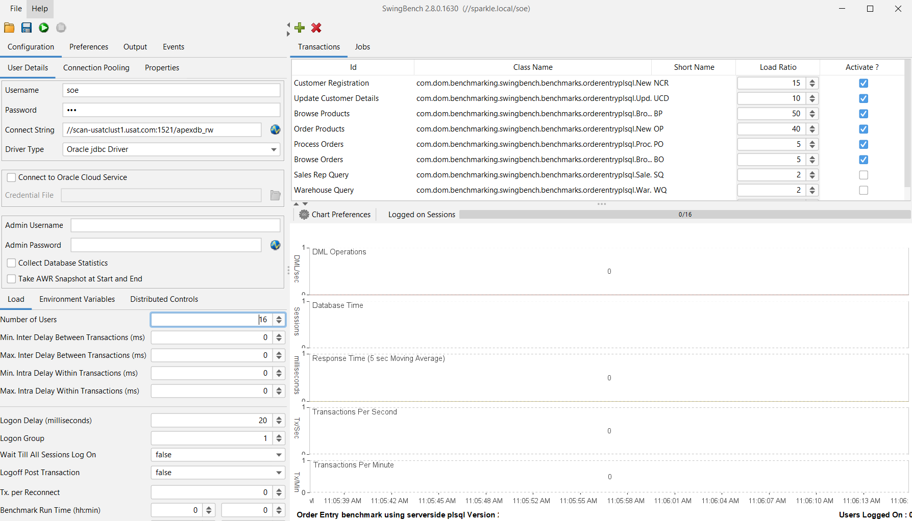

**Load tab:**
- **Number of Users:** 16 was enough to produce a clean, readable chart in this
  lab without overloading a small VM.
- **Benchmark Run Time (hh:mm):** leave at `0:00` to run indefinitely until
  manually stopped — useful when you need to trigger something else (like a
  switchover) mid-run and don't want a timer cutting the test short.

Click the green run icon in the toolbar to start. Give it 30-60 seconds for all
users to log on and the TPS/DML/response-time charts to settle into a steady
baseline before doing anything else (like triggering a switchover) — that
stabilized baseline is what makes a before/after comparison meaningful.

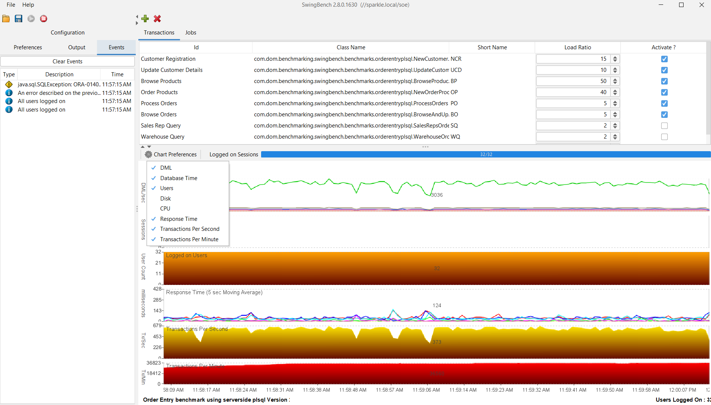

---

## Where this was actually used

[`high-availability/part3-post-checks.md` Section 16](../../high-availability/part3-post-checks.md#16-confirmed--post-standby-validation)
— a real Swingbench `SOE_Client_Side_AC` run, driven through a live Data Guard
switchover, with the resulting dip-and-recovery chart as evidence. That write-up
also documents the connect-string mistake referenced above and how it was
diagnosed and fixed — worth reading before your first real HA test with this tool.
